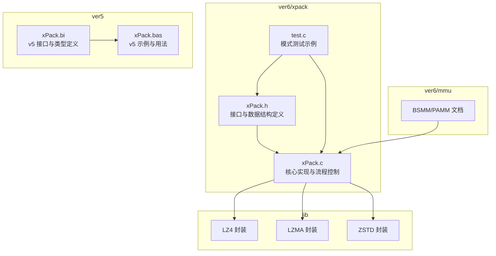
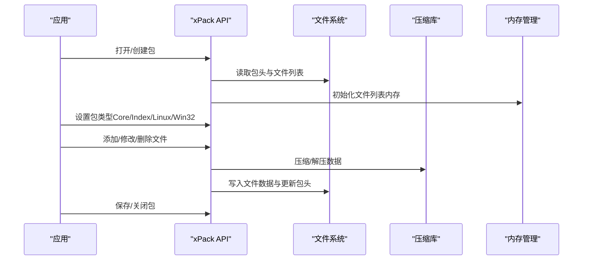
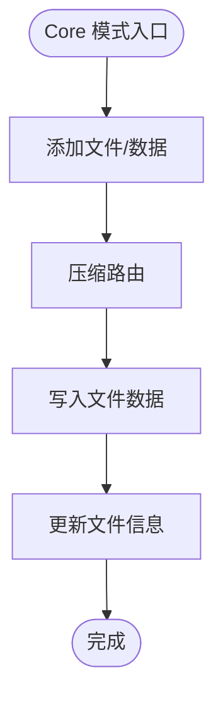
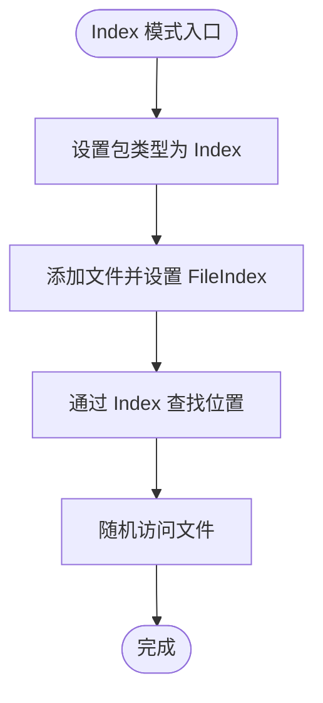
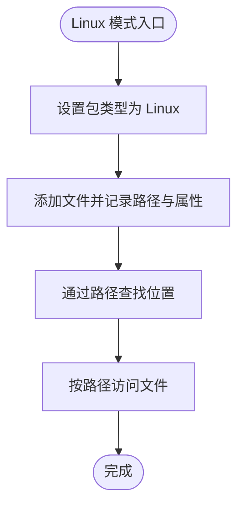
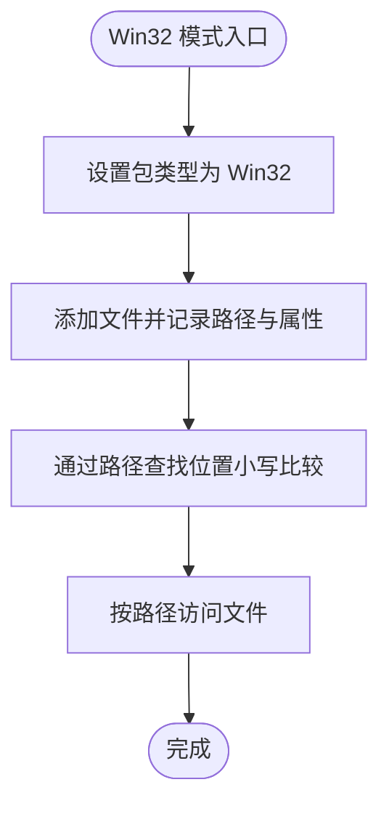
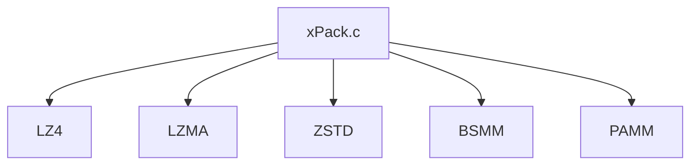
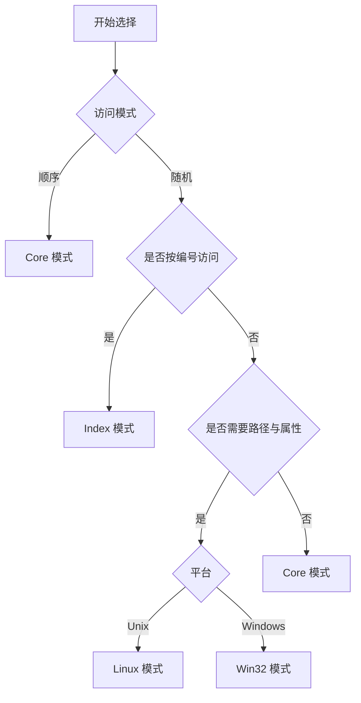

# 模式对比与选择指南

<cite>
**本文引用的文件**
- [xPack.h](file://ver6/xpack/xPack.h)
- [xPack.c](file://ver6/xpack/xPack.c)
- [test.c](file://ver6/xpack/test.c)
- [xPack.bi](file://ver5/开发目录/xPack Core/Inc/xPack.bi)
- [xPack.bas](file://ver5/开发目录/xPack Core/xPack.bas)
- [0103_bsmm.md](file://ver6/mmu/docs/cn/0103_bsmm.md)
- [0100_pamm.md](file://ver6/mmu/docs/cn/0100_pamm.md)
- [压缩级别参数.txt](file://压缩级别参数.txt)
</cite>

## 目录
1. [简介](#简介)
2. [项目结构](#项目结构)
3. [核心组件](#核心组件)
4. [架构总览](#架构总览)
5. [详细组件分析](#详细组件分析)
6. [依赖关系分析](#依赖关系分析)
7. [性能考量](#性能考量)
8. [故障排查指南](#故障排查指南)
9. [结论](#结论)
10. [附录](#附录)

## 简介
本指南围绕 xPack 的四种文件包模式（Core 模式、Index 模式、Linux 模式、Win32 模式）进行全面对比与选择指导，覆盖功能特性、性能表现、内存使用、实现复杂度、数据迁移与兼容性、基准测试与实际案例、决策树与最佳实践等内容，帮助开发者根据具体需求做出合理选择。

## 项目结构
- ver6/xpack：当前版本（v6）的核心实现，包含接口定义、实现逻辑与示例测试。
- ver5：早期版本（v5）的实现与接口定义，便于对比演进差异。
- lib：第三方压缩库封装（LZ4、LZMA、ZSTD）。
- ver6/mmu：内存管理模块文档，xPack 使用 BSMM 等模块管理文件列表内存。

**图表来源**
- [xPack.h](file://ver6/xpack/xPack.h#L1-L262)
- [xPack.c](file://ver6/xpack/xPack.c#L1-L970)
- [xPack.bi](file://ver5/开发目录/xPack Core/Inc/xPack.bi#L1-L685)
- [xPack.bas](file://ver5/开发目录/xPack Core/xPack.bas#L1-L68)
- [0103_bsmm.md](file://ver6/mmu/docs/cn/0103_bsmm.md#L1-L61)

**章节来源**
- [xPack.h](file://ver6/xpack/xPack.h#L1-L262)
- [xPack.c](file://ver6/xpack/xPack.c#L1-L970)
- [xPack.bi](file://ver5/开发目录/xPack Core/Inc/xPack.bi#L1-L685)
- [xPack.bas](file://ver5/开发目录/xPack Core/xPack.bas#L1-L68)
- [0103_bsmm.md](file://ver6/mmu/docs/cn/0103_bsmm.md#L1-L61)

## 核心组件
- 包头与文件信息结构：统一的包头与文件信息结构，支持扩展字段，满足不同模式下的差异化元数据存储。
- 压缩路由：统一的压缩/解压入口，支持快速压缩（LZ4）、高压缩比（LZMA）与自定义压缩回调。
- 文件列表内存管理：使用 BSMM 等内存管理器管理文件列表，支持动态扩容与高效访问。
- 模式切换：通过设置包类型在 Core/Index/Linux/Win32 模式之间切换，且仅在未添加文件前允许修改。

**章节来源**
- [xPack.h](file://ver6/xpack/xPack.h#L22-L119)
- [xPack.c](file://ver6/xpack/xPack.c#L54-L159)
- [0103_bsmm.md](file://ver6/mmu/docs/cn/0103_bsmm.md#L1-L61)

## 架构总览
xPack 的整体架构围绕“统一接口 + 多模式实现”的设计展开。核心流程包括：打开/创建包、设置包类型、添加/修改/删除文件、保存/关闭包。不同模式在文件信息结构与访问方式上有所差异，但共享相同的压缩与校验机制。

**图表来源**
- [xPack.c](file://ver6/xpack/xPack.c#L218-L302)
- [xPack.c](file://ver6/xpack/xPack.c#L163-L203)
- [xPack.c](file://ver6/xpack/xPack.c#L54-L159)

## 详细组件分析

### Core 模式
- 定位：基础模式，仅支持顺序访问，适用于通用场景与最小实现成本。
- 数据结构：标准文件信息头，无额外路径/属性字段。
- 访问方式：通过文件序号（iPos）访问，适合批量处理与简单打包。
- 压缩策略：支持快速压缩（LZ4）、高压缩比（LZMA）与自定义压缩。
- 适用场景：资源包、配置文件集合、无需路径索引的静态资源打包。

**图表来源**
- [xPack.c](file://ver6/xpack/xPack.c#L451-L515)
- [xPack.c](file://ver6/xpack/xPack.c#L517-L580)

**章节来源**
- [xPack.h](file://ver6/xpack/xPack.h#L46-L54)
- [xPack.c](file://ver6/xpack/xPack.c#L451-L580)

### Index 模式
- 定位：支持无序索引访问，通过 FileIndex 快速定位文件，适合需要随机访问的场景。
- 数据结构：在标准文件信息基础上增加 FileIndex 与 FileTag 字段。
- 访问方式：通过索引（iIndex）查找文件位置，内部仍以顺序存储为基础。
- 适用场景：需要按业务编号随机访问的资源包、模块化资源管理。

**图表来源**
- [xPack.c](file://ver6/xpack/xPack.c#L313-L336)
- [xPack.c](file://ver6/xpack/xPack.c#L668-L681)
- [xPack.c](file://ver6/xpack/xPack.c#L683-L713)

**章节来源**
- [xPack.h](file://ver6/xpack/xPack.h#L55-L64)
- [xPack.c](file://ver6/xpack/xPack.c#L313-L336)
- [xPack.c](file://ver6/xpack/xPack.c#L668-L713)

### Linux 模式
- 定位：面向类 Unix 文件系统的兼容模式，记录文件路径与属性（大小写敏感）。
- 数据结构：在标准文件信息基础上增加 FilePath、PathHash、FileAttr、ModifyTime 等字段。
- 访问方式：通过文件路径查找，内部使用路径哈希与字符串比较加速定位。
- 适用场景：跨平台资源包、需要保留路径与属性的部署场景。

**图表来源**
- [xPack.c](file://ver6/xpack/xPack.c#L313-L336)
- [xPack.c](file://ver6/xpack/xPack.c#L771-L787)
- [xPack.c](file://ver6/xpack/xPack.c#L789-L810)

**章节来源**
- [xPack.h](file://ver6/xpack/xPack.h#L66-L84)
- [xPack.c](file://ver6/xpack/xPack.c#L313-L336)
- [xPack.c](file://ver6/xpack/xPack.c#L771-L810)

### Win32 模式
- 定位：面向 Windows 文件系统的兼容模式，记录文件路径与属性（大小写不敏感）。
- 数据结构：在标准文件信息基础上增加 FilePath、PathHash、FileAttr、CreateTime、ModifyTime 等字段。
- 访问方式：通过文件路径查找，内部将路径转小写后进行哈希与比较。
- 适用场景：Windows 平台资源包、需要兼容 Windows 文件属性的场景。

**图表来源**
- [xPack.c](file://ver6/xpack/xPack.c#L313-L336)
- [xPack.c](file://ver6/xpack/xPack.c#L857-L876)
- [xPack.c](file://ver6/xpack/xPack.c#L878-L901)

**章节来源**
- [xPack.h](file://ver6/xpack/xPack.h#L81-L94)
- [xPack.c](file://ver6/xpack/xPack.c#L313-L336)
- [xPack.c](file://ver6/xpack/xPack.c#L857-L901)

### 模式对比矩阵
- 功能特性
  - Core：顺序访问、最小实现、通用打包。
  - Index：索引访问、随机定位、适合编号驱动。
  - Linux：路径访问、大小写敏感、类 Unix 兼容。
  - Win32：路径访问、大小写不敏感、Windows 兼容。
- 性能表现
  - Core：顺序写入与访问，I/O 流畅，适合批量处理。
  - Index：索引查找带来 O(n) 遍历，适合小规模随机访问。
  - Linux/Win32：路径哈希 + 字符串比较，查找效率取决于路径长度与哈希冲突。
- 内存使用
  - 文件列表使用 BSMM 等内存管理器，按需扩容，Core 模式内存占用最低。
  - Index/Linux/Win32 模式因扩展字段增加内存占用，但收益明显。
- 实现复杂度
  - Core 最低，Index 次之，Linux/Win32 因路径处理与属性管理复杂度更高。
- 兼容性
  - 仅在未添加文件前可切换包类型，切换后 InfoSize 与 LDB 结构随之改变。

**章节来源**
- [xPack.h](file://ver6/xpack/xPack.h#L19-L33)
- [xPack.c](file://ver6/xpack/xPack.c#L313-L336)
- [0103_bsmm.md](file://ver6/mmu/docs/cn/0103_bsmm.md#L1-L61)

## 依赖关系分析
- 压缩库依赖：LZ4（快速压缩）、LZMA（高压缩比）、ZSTD（v7 设计，见压缩级别参数）。
- 内存管理：BSMM（块结构内存管理）、PAMM（指针数组管理）等模块支撑文件列表管理。
- 文件系统：xFile 封装提供统一的文件读写与寻址接口。

**图表来源**
- [xPack.c](file://ver6/xpack/xPack.c#L16-L27)
- [0103_bsmm.md](file://ver6/mmu/docs/cn/0103_bsmm.md#L1-L61)
- [0100_pamm.md](file://ver6/mmu/docs/cn/0100_pamm.md#L1-L120)

**章节来源**
- [xPack.c](file://ver6/xpack/xPack.c#L16-L27)
- [0103_bsmm.md](file://ver6/mmu/docs/cn/0103_bsmm.md#L1-L61)
- [0100_pamm.md](file://ver6/mmu/docs/cn/0100_pamm.md#L1-L120)

## 性能考量
- 压缩级别与速度
  - 快速压缩（LZ4）：适合实时加载与高频访问场景。
  - 高压缩比（LZMA）：适合存储空间敏感场景。
  - 自定义压缩：通过回调灵活适配业务需求。
- 基准测试与实际案例
  - v7 压缩级别参数（4bit 存储，取值 0-15）提供参考：严格单调性、纯 ZSTD 方案、保留 LZ4 系列。
  - 实际案例：Win32 模式添加大量二进制与文本文件，验证路径索引与属性记录的稳定性。
- 内存与 I/O
  - 文件列表内存管理采用 BSMM，写入多、扩容快；顺序读取访问性能高。
  - 路径模式（Linux/Win32）引入哈希与字符串比较，路径越长、冲突越多，性能下降越明显。

**章节来源**
- [xPack.c](file://ver6/xpack/xPack.c#L54-L159)
- [压缩级别参数.txt](file://压缩级别参数.txt#L1-L20)
- [test.c](file://ver6/xpack/test.c#L149-L270)

## 故障排查指南
- 常见错误码与处理
  - 文件无法访问、格式不正确、内存申请失败、文件列表读取/写入失败、包类型不匹配、文件名超长等。
  - 提供统一的错误回调机制，便于定位问题。
- 校验与一致性
  - 文件列表与数据均进行哈希校验，确保完整性。
- 修复建议
  - 检查包类型设置时机（未添加文件前）。
  - 确认路径长度与大小写敏感性（Linux vs Win32）。
  - 验证压缩级别与数据大小，避免自定义压缩回调异常。

**章节来源**
- [xPack.c](file://ver6/xpack/xPack.c#L36-L53)
- [xPack.c](file://ver6/xpack/xPack.c#L269-L298)

## 结论
- Core 模式适合通用与最小实现需求；Index 模式适合需要随机访问的编号驱动场景；Linux/Win32 模式分别面向类 Unix 与 Windows 的路径与属性兼容。
- 选择建议：优先评估访问模式（顺序/随机）、平台兼容性（Unix/Windows）、路径复杂度与内存预算，再决定包类型。
- 数据迁移：仅在未添加文件前可切换包类型；若需跨模式迁移，建议导出后再导入目标模式，确保路径与属性正确。

## 附录

### 模式选择决策树

### 实际使用案例
- Core 模式：批量添加文本与配置文件，顺序解包输出。
- Index 模式：按业务编号随机访问资源，支持快速定位。
- Win32 模式：Windows 平台大量二进制与文本文件打包，保留路径与属性。

**章节来源**
- [test.c](file://ver6/xpack/test.c#L31-L66)
- [test.c](file://ver6/xpack/test.c#L70-L105)
- [test.c](file://ver6/xpack/test.c#L109-L145)
- [test.c](file://ver6/xpack/test.c#L149-L270)