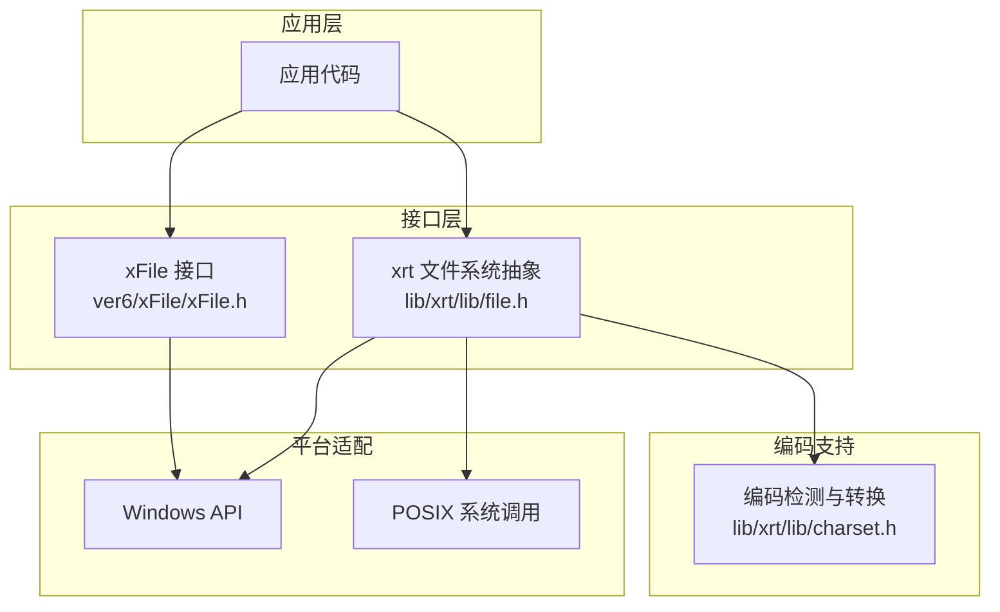
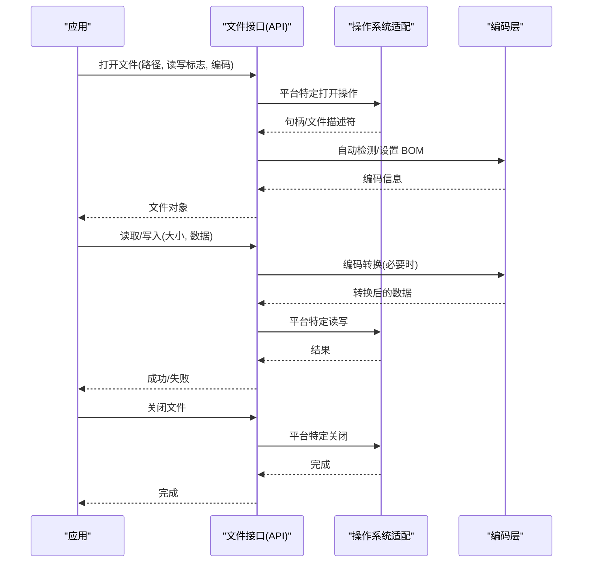
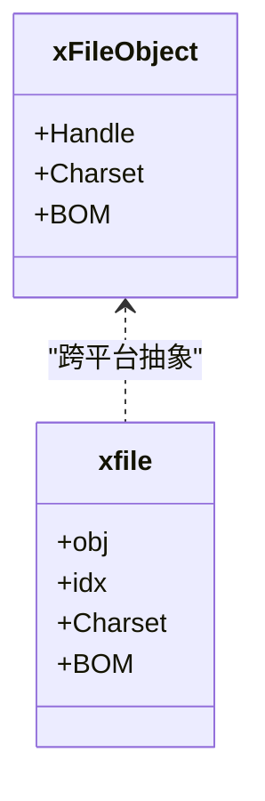
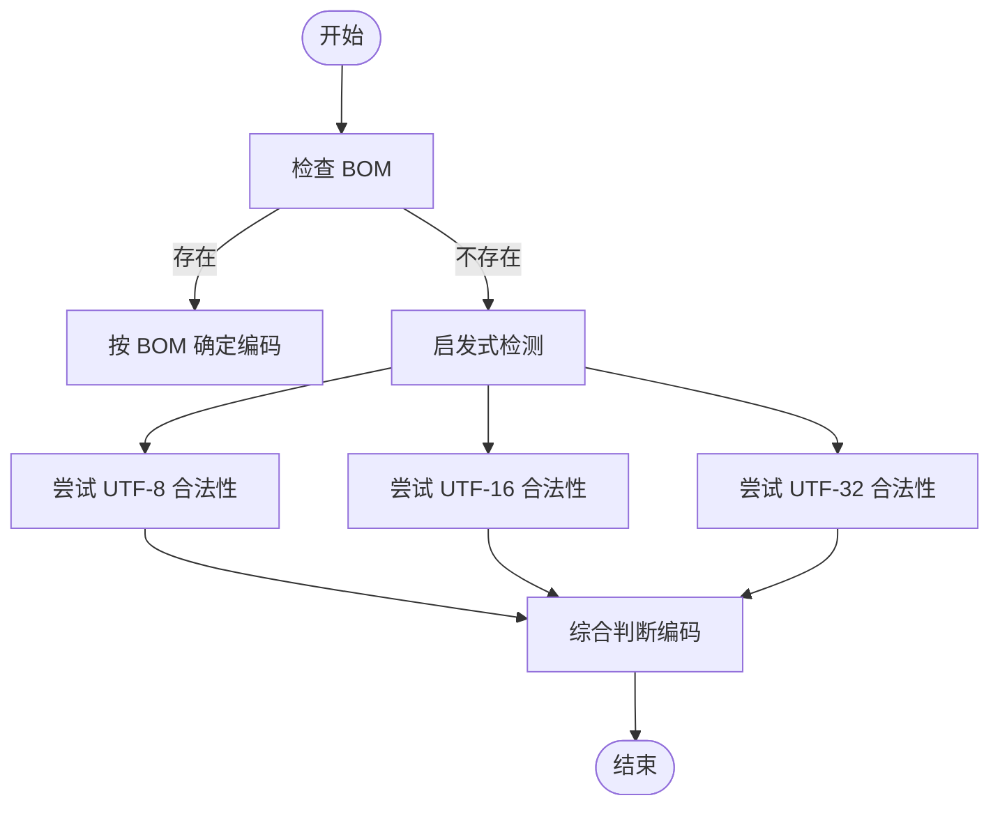
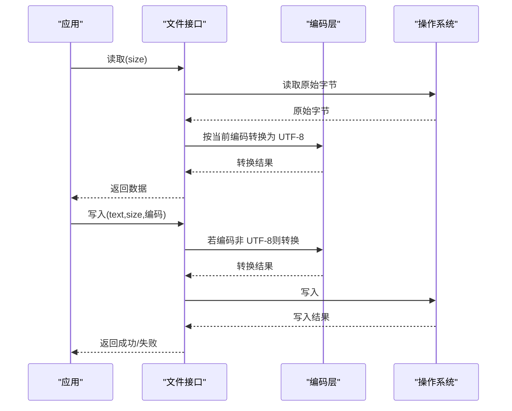
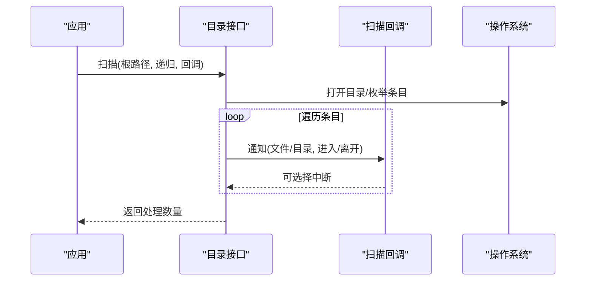
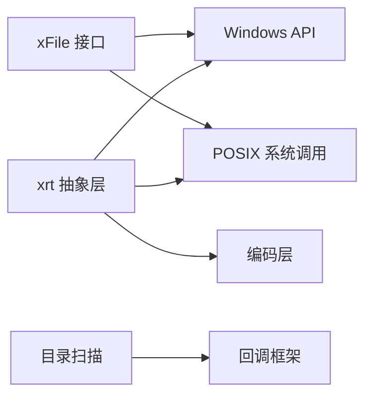

# 文件系统接口

<cite>
**本文引用的文件**
- [xFile.h](file://ver6/xFile/xFile.h)
- [xFile_old_v2.h](file://ver6/xFile/xFile_old_v2.h)
- [file2_old.h](file://ver6/xFile/file2_old.h)
- [file.h](file://lib/xrt/lib/file.h)
- [charset.h](file://lib/xrt/lib/charset.h)
- [xFile.c](file://ver6/xFile/xFile_old_v2.c)
- [test.c](file://ver6/xFile/test.c)
</cite>

## 目录
1. [简介](#简介)
2. [项目结构](#项目结构)
3. [核心组件](#核心组件)
4. [架构总览](#架构总览)
5. [详细组件分析](#详细组件分析)
6. [依赖关系分析](#依赖关系分析)
7. [性能考量](#性能考量)
8. [故障排查指南](#故障排查指南)
9. [结论](#结论)
10. [附录](#附录)

## 简介
本文件系统接口旨在提供跨平台的统一文件操作能力，涵盖文件读写、目录管理、路径处理、编码支持与自动识别、文件扫描与批量操作、文件属性管理以及权限控制等。接口同时兼容 Windows 与类 Unix 平台，通过抽象层屏蔽底层差异，使开发者能够在不关心平台差异的情况下高效完成文件操作任务。

## 项目结构
仓库中与文件系统接口相关的主要模块如下：
- ver6/xFile：面向薄封装的文件接口，提供基于 Windows API 的文件操作与编码辅助函数。
- lib/xrt：通用运行时库中的文件系统抽象层，提供跨平台文件读写、编码转换、目录扫描与批量操作、属性管理等。
- 测试用例：验证路径存在性、文件存在性、目录存在性等基础能力。

图表来源
- [xFile.h](file://ver6/xFile/xFile.h#L1-L202)
- [file.h](file://lib/xrt/lib/file.h#L1-L260)
- [charset.h](file://lib/xrt/lib/charset.h#L743-L890)

章节来源
- [xFile.h](file://ver6/xFile/xFile.h#L1-L202)
- [file.h](file://lib/xrt/lib/file.h#L1-L260)

## 核心组件
- 文件对象与句柄：统一抽象文件句柄与编码状态，支持 BOM 处理与编码切换。
- 编码支持：内置多种编码常量与自动识别机制，支持 UTF-8、UTF-16、UTF-32、GB18030、ASCII 等。
- 文件读写：提供按字节与按字符两种读写接口，自动进行编码转换。
- 目录管理：创建、复制、移动、删除目录，支持递归扫描与批量操作。
- 路径与属性：路径存在性判断、文件/目录存在性判断、文件长度、属性与时间戳查询与设置。
- 扫描与批量：目录扫描回调框架，支持文件与目录事件通知，便于实现批量处理。

章节来源
- [xFile.h](file://ver6/xFile/xFile.h#L25-L30)
- [file.h](file://lib/xrt/lib/file.h#L17-L260)
- [charset.h](file://lib/xrt/lib/charset.h#L743-L890)

## 架构总览
文件系统接口采用“高层统一 API + 底层平台适配”的分层设计：
- 高层 API：面向应用的统一接口，屏蔽平台差异。
- 平台适配：Windows 使用 CreateFile/ReadFile/WriteFile 等 API；类 Unix 使用 open/read/write/lseek/stat 等系统调用。
- 编码层：提供编码检测、字符大小计算、编码转换与 BOM 处理。

图表来源
- [file.h](file://lib/xrt/lib/file.h#L17-L260)
- [charset.h](file://lib/xrt/lib/charset.h#L743-L890)

## 详细组件分析

### 文件对象与句柄
- 统一结构体包含句柄、编码与 BOM 信息，便于在读写过程中自动处理编码与 BOM。
- Windows 平台使用 HANDLE，类 Unix 平台使用文件描述符；接口层统一封装。

图表来源
- [xFile.h](file://ver6/xFile/xFile.h#L25-L30)
- [file.h](file://lib/xrt/lib/file.h#L25-L40)

章节来源
- [xFile.h](file://ver6/xFile/xFile.h#L25-L30)
- [file.h](file://lib/xrt/lib/file.h#L25-L40)

### 编码支持与自动识别
- 编码常量：UTF-8、UTF-16、UTF-32、GB18030、ASCII、Unicode、UTF-7、UTF-32 BE 等。
- 自动识别：优先检查 BOM，其次通过字符合法性与零字节分布等启发式策略判断编码。
- BOM 处理：自动跳过 BOM，写入时可按需写入相应 BOM。
- 字符大小：根据编码类型返回字符宽度（1/2/4 字节），用于正确计算缓冲区大小。

图表来源
- [charset.h](file://lib/xrt/lib/charset.h#L743-L890)

章节来源
- [xFile.h](file://ver6/xFile/xFile.h#L4-L18)
- [charset.h](file://lib/xrt/lib/charset.h#L743-L890)

### 文件读写流程
- 读取：按请求大小分配缓冲区，读取后根据目标编码进行转换（如非 UTF-8），并自动处理 BOM。
- 写入：若目标编码非 UTF-8，则先将 UTF-8 文本转换为目标编码，再写入底层设备。
- 二进制读写：直接按字节读写，不进行编码转换。

图表来源
- [file.h](file://lib/xrt/lib/file.h#L452-L609)
- [charset.h](file://lib/xrt/lib/charset.h#L33-L103)

章节来源
- [file.h](file://lib/xrt/lib/file.h#L452-L609)

### 目录管理与批量操作
- 创建目录：支持单级与多级创建。
- 复制/移动/删除目录：通过扫描回调遍历目录树，逐个处理文件与目录。
- 扫描目录：回调框架支持进入/离开目录事件，便于实现复杂批量逻辑。

图表来源
- [file.h](file://lib/xrt/lib/file.h#L1295-L1428)

章节来源
- [file.h](file://lib/xrt/lib/file.h#L1295-L1428)

### 路径与属性管理
- 路径存在性：统一判断路径是否存在。
- 文件/目录存在性：区分文件与目录，避免误判。
- 属性与时间戳：获取/设置文件属性（Windows 属性或 POSIX 权限），获取最后访问与修改时间。

章节来源
- [file.h](file://lib/xrt/lib/file.h#L900-L1150)

### 权限与安全考虑
- 权限控制：Windows 使用文件属性，类 Unix 使用 chmod 权限位。
- 安全建议：尽量使用只读模式打开只读文件；在写入前检查目标路径权限；避免在高权限账户下运行不受信任的文件操作；对用户输入的路径进行白名单校验与规范化处理。

章节来源
- [file.h](file://lib/xrt/lib/file.h#L1053-L1098)

### 实际使用示例与最佳实践
- 基础读写
  - 使用统一接口读取/写入文本，无需手动处理编码转换。
  - 对大文件建议分块读取，避免一次性分配过多内存。
- 编码处理
  - 优先使用 UTF-8；如需兼容旧系统，允许自动识别并转换。
  - 写入时可选择写入 BOM，以提升兼容性。
- 目录操作
  - 复制/移动/删除目录时，建议先统计文件数量，再执行批量操作，便于进度反馈与错误恢复。
  - 使用回调框架实现细粒度控制，如跳过特定类型文件、中断扫描等。
- 路径与属性
  - 在跨平台环境下，统一使用 UTF-8 路径；内部自动转换为平台特定路径。
  - 对时间戳与属性的读取应考虑平台差异，避免硬编码。

章节来源
- [file.h](file://lib/xrt/lib/file.h#L711-L767)
- [test.c](file://ver6/xFile/test.c#L9-L26)

## 依赖关系分析
- 文件接口依赖编码层进行编码检测与转换。
- 跨平台适配通过条件编译区分 Windows 与类 Unix 平台。
- 目录扫描依赖回调框架，回调函数可自定义批量处理逻辑。

图表来源
- [xFile.h](file://ver6/xFile/xFile.h#L1-L202)
- [file.h](file://lib/xrt/lib/file.h#L1295-L1428)
- [charset.h](file://lib/xrt/lib/charset.h#L743-L890)

章节来源
- [xFile.h](file://ver6/xFile/xFile.h#L1-L202)
- [file.h](file://lib/xrt/lib/file.h#L1295-L1428)

## 性能考量
- 编码检测：对大文件进行编码检测时，建议限制读取大小（如最多读取 64KB），以平衡准确性和性能。
- 分块读写：大文件读写建议分块进行，减少内存占用与 GC 压力。
- 批量操作：目录扫描回调中尽量避免重复 IO，合并同类操作，减少系统调用次数。
- BOM 处理：写入时按需写入 BOM，避免不必要的额外写入。

## 故障排查指南
- 打开文件失败：检查路径是否存在、权限是否足够、是否被其他进程占用。
- 读写失败：确认文件对象有效、句柄有效、编码设置正确。
- 编码异常：确认 BOM 是否正确、编码检测结果是否符合预期。
- 目录扫描失败：检查目录权限、回调函数是否提前中断、路径是否规范。

章节来源
- [file.h](file://lib/xrt/lib/file.h#L5-L12)
- [file.h](file://lib/xrt/lib/file.h#L265-L286)

## 结论
xPack 的文件系统接口通过统一抽象层与跨平台适配，提供了稳定、易用且高性能的文件操作能力。结合完善的编码支持与批量操作框架，开发者可以高效地完成各类文件处理任务。建议在实际项目中遵循最佳实践，关注性能与安全，充分利用回调框架实现灵活的批量处理逻辑。

## 附录
- 编码常量与默认值：见编码头文件与文件接口头文件中的常量定义。
- 测试参考：见测试用例对路径与文件存在性的验证。

章节来源
- [xFile.h](file://ver6/xFile/xFile.h#L4-L18)
- [test.c](file://ver6/xFile/test.c#L9-L26)