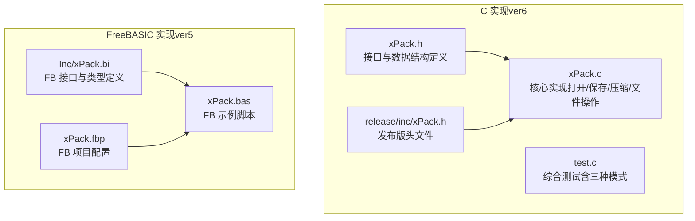
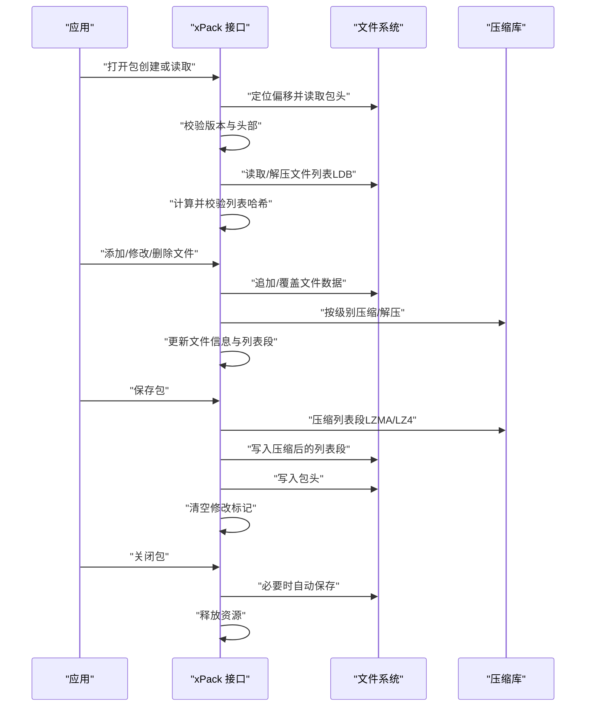
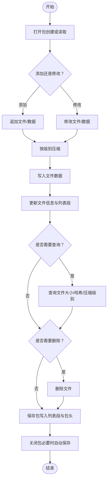
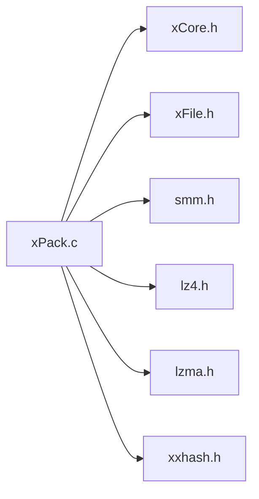

# 基础使用示例

<cite>
**本文引用的文件**
- [xPack.h](file://ver6/xpack/xPack.h)
- [xPack.c](file://ver6/xpack/xPack.c)
- [test.c](file://ver6/xpack/test.c)
- [xPack.bi](file://ver5/开发目录/xPack Core/Inc/xPack.bi)
- [xPack.bas](file://ver5/开发目录/xPack Core/xPack.bas)
- [xPack.fbp](file://ver5/开发目录/xPack Core/xPack.fbp)
- [xPack.h（发布版头文件）](file://ver6/xpack/release/inc/xPack.h)
- [1.txt](file://ver6/xpack/release/x64/core_in/1.txt)
- [2.txt](file://ver6/xpack/release/x64/core_in/2.txt)
- [3.txt](file://ver6/xpack/release/x64/core_in/3.txt)
- [4.txt](file://ver6/xpack/release/x64/core_in/4.txt)
- [5.txt](file://ver6/xpack/release/x64/core_in/5.txt)
</cite>

## 目录
1. [简介](#简介)
2. [项目结构](#项目结构)
3. [核心组件](#核心组件)
4. [架构总览](#架构总览)
5. [详细组件分析](#详细组件分析)
6. [依赖关系分析](#依赖关系分析)
7. [性能考虑](#性能考虑)
8. [故障排查指南](#故障排查指南)
9. [结论](#结论)
10. [附录](#附录)

## 简介
本文件面向初学者，提供 xPack 的基础使用示例与最佳实践。内容涵盖：
- 文件包的创建、打开、关闭全流程
- Core 模式、Index 模式、Win32 模式的典型用法
- 文件添加、删除、修改、查询等基本操作
- 错误处理与调试方法
- 完整的代码注释与执行结果说明

## 项目结构
仓库包含多版本实现与测试样例，其中 ver6/xpack 提供 C 语言实现与完整测试程序；ver5 提供 FreeBASIC 版本的接口与示例。

**图表来源**
- [xPack.h](file://ver6/xpack/xPack.h#L1-L262)
- [xPack.c](file://ver6/xpack/xPack.c#L1-L970)
- [test.c](file://ver6/xpack/test.c#L1-L278)
- [xPack.bi](file://ver5/开发目录/xPack Core/Inc/xPack.bi#L1-L685)
- [xPack.bas](file://ver5/开发目录/xPack Core/xPack.bas#L1-L68)
- [xPack.fbp](file://ver5/开发目录/xPack Core/xPack.fbp#L1-L41)

**章节来源**
- [xPack.h](file://ver6/xpack/xPack.h#L1-L262)
- [xPack.c](file://ver6/xpack/xPack.c#L1-L970)
- [test.c](file://ver6/xpack/test.c#L1-L278)
- [xPack.bi](file://ver5/开发目录/xPack Core/Inc/xPack.bi#L1-L685)
- [xPack.bas](file://ver5/开发目录/xPack Core/xPack.bas#L1-L68)
- [xPack.fbp](file://ver5/开发目录/xPack Core/xPack.fbp#L1-L41)

## 核心组件
- 包对象与文件头
  - 包对象包含文件句柄、偏移、只读标记、修改标记、包头、列表段管理器以及回调函数指针。
  - 包头记录版本、标志、文件数量、列表段偏移与大小、哈希、扩展长度、识别码等。
- 文件信息结构
  - Core 模式：固定 20 字节 + 可选扩展字段
  - Index 模式：在 Core 基础上增加文件索引与附加数据
  - Linux/Win32 模式：在 Core 基础上增加路径、哈希、属性、时间戳等字段
- 压缩与解压路由
  - 支持不压缩、快速压缩（LZ4）、高压缩（LZMA）、自定义压缩
  - 失败时自动回退为不压缩

**章节来源**
- [xPack.h](file://ver6/xpack/xPack.h#L22-L119)
- [xPack.c](file://ver6/xpack/xPack.c#L54-L159)

## 架构总览
下图展示了 xPack 的核心流程：打开包 → 读取/写入文件列表 → 追加/修改/删除文件数据 → 保存包头与列表段。

**图表来源**
- [xPack.c](file://ver6/xpack/xPack.c#L218-L302)
- [xPack.c](file://ver6/xpack/xPack.c#L163-L203)
- [xPack.c](file://ver6/xpack/xPack.c#L54-L159)

**章节来源**
- [xPack.c](file://ver6/xpack/xPack.c#L218-L302)
- [xPack.c](file://ver6/xpack/xPack.c#L163-L203)
- [xPack.c](file://ver6/xpack/xPack.c#L54-L159)

## 详细组件分析

### Core 模式（顺序访问）
Core 模式是最基础的模式，通过顺序位置访问文件。适合简单场景与快速原型。

- 基本流程
  - 打开包（不存在则创建）
  - 设置压缩级别（可选）
  - 追加文件或数据
  - 查询文件信息
  - 解包文件或数据
  - 删除文件
  - 保存并关闭包

- 典型 API
  - 打开/保存/关闭：xPack_Open、xPack_Save、xPack_Close
  - 文件计数与查询：xPack_FileCount、xPack_GetFileInfo、xPack_GetFileSize、xPack_GetFileHash
  - 添加/修改/删除：xPack_Core_AppendFile、xPack_Core_ChangeFile、xPack_Core_DeleteFile
  - 解包：xPack_Core_UnpackFile、xPack_Core_UnpackData

- 示例参考
  - 测试程序中的 Core 模式用法见 test.c 中的“Core 模式测试”片段
  - 示例路径：[test.c](file://ver6/xpack/test.c#L31-L66)

- 执行结果说明
  - 成功：返回非零位置或指针，错误号为 0
  - 失败：触发 OnError 回调，打印错误码与描述

**章节来源**
- [xPack.h](file://ver6/xpack/xPack.h#L125-L127)
- [xPack.h](file://ver6/xpack/xPack.h#L129-L147)
- [xPack.h](file://ver6/xpack/xPack.h#L170-L190)
- [xPack.h](file://ver6/xpack/xPack.h#L182-L186)
- [xPack.h](file://ver6/xpack/xPack.h#L188-L189)
- [xPack.h](file://ver6/xpack/xPack.h#L155-L168)
- [test.c](file://ver6/xpack/test.c#L31-L66)

### Index 模式（无序索引访问）
Index 模式允许通过自定义索引访问文件，适合需要灵活检索的场景。

- 基本流程
  - 打开包
  - 设置包类型为 Index（仅在未添加文件前有效）
  - 通过索引添加/修改/删除文件
  - 通过索引解包
  - 保存并关闭

- 典型 API
  - 设置包类型：xPack_SetPackType
  - 索引到位置：xPack_IndexToPos
  - 添加/修改/删除：xPack_Index_AppendFile、xPack_Index_ChangeFile、xPack_Index_DeleteFile
  - 解包：xPack_Index_UnpackFile、xPack_Index_UnpackData

- 示例参考
  - 测试程序中的 Index 模式用法见 test.c 中的“Index 模式测试”片段
  - 示例路径：[test.c](file://ver6/xpack/test.c#L70-L105)

- 执行结果说明
  - 成功：返回文件信息指针或非零位置
  - 失败：若包类型不匹配或索引不存在，触发错误回调

**章节来源**
- [xPack.h](file://ver6/xpack/xPack.h#L131-L132)
- [xPack.h](file://ver6/xpack/xPack.h#L141-L142)
- [xPack.h](file://ver6/xpack/xPack.h#L191-L193)
- [xPack.h](file://ver6/xpack/xPack.h#L194-L213)
- [xPack.h](file://ver6/xpack/xPack.h#L206-L210)
- [xPack.h](file://ver6/xpack/xPack.h#L212-L213)
- [xPack.h](file://ver6/xpack/xPack.h#L207-L211)
- [xPack.h](file://ver6/xpack/xPack.h#L213-L214)
- [test.c](file://ver6/xpack/test.c#L70-L105)

### Win32 模式（Windows 路径兼容）
Win32 模式在 Core 基础上增加 Windows 文件系统兼容字段，支持路径与属性管理。

- 基本流程
  - 打开包
  - 设置包类型为 Win32（仅在未添加文件前有效）
  - 通过路径添加/修改/删除文件
  - 通过路径解包
  - 保存并关闭

- 典型 API
  - 设置包类型：xPack_SetPackType
  - 路径到位置：xPack_Win32ToPos
  - 添加/修改/删除：xPack_Win32_AppendFile、xPack_Win32_ChangeFile、xPack_Win32_DeleteFile
  - 解包：xPack_Win32_UnpackFile、xPack_Win32_UnpackData

- 示例参考
  - 测试程序中的 Win32 模式用法见 test.c 中的“Win32 模式测试”片段
  - 示例路径：[test.c](file://ver6/xpack/test.c#L109-L145)

- 执行结果说明
  - 成功：返回文件信息指针或非零位置
  - 失败：若包类型不匹配或路径不存在，触发错误回调

**章节来源**
- [xPack.h](file://ver6/xpack/xPack.h#L131-L132)
- [xPack.h](file://ver6/xpack/xPack.h#L141-L142)
- [xPack.h](file://ver6/xpack/xPack.h#L233-L235)
- [xPack.h](file://ver6/xpack/xPack.h#L236-L249)
- [xPack.h](file://ver6/xpack/xPack.h#L242-L244)
- [xPack.h](file://ver6/xpack/xPack.h#L245-L247)
- [xPack.h](file://ver6/xpack/xPack.h#L248-L249)
- [test.c](file://ver6/xpack/test.c#L109-L145)

### 文件操作流程（添加/删除/修改/查询）
以下流程图总结了文件操作的关键步骤与错误处理点。

**图表来源**
- [xPack.c](file://ver6/xpack/xPack.c#L451-L515)
- [xPack.c](file://ver6/xpack/xPack.c#L517-L580)
- [xPack.c](file://ver6/xpack/xPack.c#L163-L203)
- [xPack.c](file://ver6/xpack/xPack.c#L205-L216)

**章节来源**
- [xPack.c](file://ver6/xpack/xPack.c#L451-L515)
- [xPack.c](file://ver6/xpack/xPack.c#L517-L580)
- [xPack.c](file://ver6/xpack/xPack.c#L163-L203)
- [xPack.c](file://ver6/xpack/xPack.c#L205-L216)

### FreeBASIC 版本参考
ver5 提供 FreeBASIC 版本的接口与示例，便于在 FB 环境中快速上手。

- 接口与类型定义：参见 [xPack.bi](file://ver5/开发目录/xPack Core/Inc/xPack.bi#L82-L126)
- 示例脚本：参见 [xPack.bas](file://ver5/开发目录/xPack Core/xPack.bas#L26-L45)
- 项目配置：参见 [xPack.fbp](file://ver5/开发目录/xPack Core/xPack.fbp#L1-L41)

**章节来源**
- [xPack.bi](file://ver5/开发目录/xPack Core/Inc/xPack.bi#L82-L126)
- [xPack.bas](file://ver5/开发目录/xPack Core/xPack.bas#L26-L45)
- [xPack.fbp](file://ver5/开发目录/xPack Core/xPack.fbp#L1-L41)

## 依赖关系分析
- 组件耦合
  - xPack.c 依赖 xCore（内存管理）、xFile（文件 IO）、SMMU（动态数组）、压缩库（LZ4/LZMA）、哈希库（XXHash）
  - 头文件定义与实现保持一致，API 明确且内聚性高
- 外部依赖
  - LZ4：快速压缩
  - LZMA：高压缩比
  - XXHash：高效哈希校验
- 潜在循环依赖
  - 未发现循环依赖，模块边界清晰

**图表来源**
- [xPack.c](file://ver6/xpack/xPack.c#L9-L27)

**章节来源**
- [xPack.c](file://ver6/xpack/xPack.c#L9-L27)

## 性能考虑
- 压缩策略
  - 快速压缩（LZ4）：适合频繁写入与实时场景
  - 高压缩（LZMA）：适合空间敏感场景
  - 自定义压缩：可结合业务特征优化
- 列表段压缩
  - 默认对 LDB 段进行 LZMA 压缩，减少包体积
- 哈希校验
  - 对文件数据与列表段进行哈希校验，保证完整性
- 内存管理
  - 使用 SMMU 动态数组管理文件信息，避免碎片化
  - 压缩/解压输出采用一次性分配，减少多次分配开销

[本节为通用指导，无需列出具体文件来源]

## 故障排查指南
- 常见错误码与含义
  - 文件无法访问、文件格式不正确、内存申请失败、文件列表读取失败、文件列表数据添加失败、无效的文件位置、文件哈希校验失败、文件读取失败、文件写入失败、文件读写位置移动失败、包类型不匹配、找不到文件、文件名超长
- 错误回调
  - 通过 OnError 回调函数接收错误码与描述，便于定位问题
- 调试建议
  - 在关键 API 调用前后检查 LastErrorID 与 LastError
  - 对于解包操作，确认压缩级别与数据大小一致性
  - 对于路径模式，注意大小写与路径分隔符差异

**章节来源**
- [xPack.c](file://ver6/xpack/xPack.c#L36-L51)
- [test.c](file://ver6/xpack/test.c#L19-L22)

## 结论
通过本示例文档，初学者可以快速掌握 xPack 的基础使用方法，包括三种模式的典型用法、文件操作流程、错误处理与调试技巧。建议在实际项目中根据性能与存储需求选择合适的压缩级别，并在关键节点加入日志与校验，确保数据完整性与可维护性。

[本节为总结性内容，无需列出具体文件来源]

## 附录

### A. 基础操作清单
- 创建/打开包
  - Core：xPack_Open → 设置压缩级别（可选）→ 添加文件/数据
  - Index：xPack_Open → xPack_SetPackType → 通过索引添加/修改/删除
  - Win32：xPack_Open → xPack_SetPackType → 通过路径添加/修改/删除
- 查询与解包
  - 查询：xPack_FileCount、xPack_GetFileInfo、xPack_GetFileSize、xPack_GetFileHash
  - 解包：xPack_Core_UnpackFile、xPack_Index_UnpackFile、xPack_Win32_UnpackFile
- 保存与关闭
  - xPack_Save → xPack_Close

**章节来源**
- [xPack.h](file://ver6/xpack/xPack.h#L125-L127)
- [xPack.h](file://ver6/xpack/xPack.h#L129-L147)
- [xPack.h](file://ver6/xpack/xPack.h#L155-L168)
- [xPack.h](file://ver6/xpack/xPack.h#L182-L186)
- [xPack.h](file://ver6/xpack/xPack.h#L206-L211)
- [xPack.h](file://ver6/xpack/xPack.h#L213-L214)
- [xPack.h](file://ver6/xpack/xPack.h#L242-L244)
- [xPack.h](file://ver6/xpack/xPack.h#L245-L247)
- [xPack.h](file://ver6/xpack/xPack.h#L248-L249)
- [xPack.h](file://ver6/xpack/xPack.h#L163-L168)

### B. 示例文件
- 测试输入文件位于 release/x64/core_in 下，包含 1.txt 至 5.txt
- 示例路径：
  - [1.txt](file://ver6/xpack/release/x64/core_in/1.txt#L1-L1)
  - [2.txt](file://ver6/xpack/release/x64/core_in/2.txt#L1-L1)
  - [3.txt](file://ver6/xpack/release/x64/core_in/3.txt#L1-L1)
  - [4.txt](file://ver6/xpack/release/x64/core_in/4.txt#L1-L1)
  - [5.txt](file://ver6/xpack/release/x64/core_in/5.txt#L1-L1)

**章节来源**
- [test.c](file://ver6/xpack/test.c#L34-L49)
- [test.c](file://ver6/xpack/test.c#L73-L89)
- [test.c](file://ver6/xpack/test.c#L112-L128)