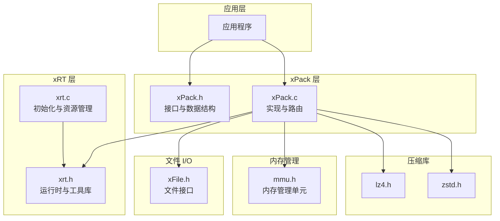
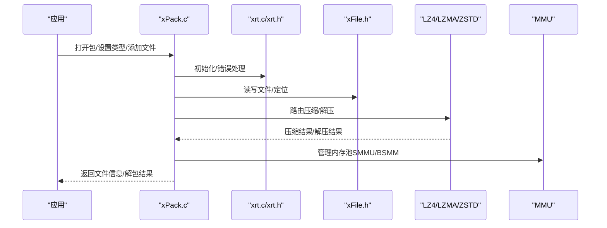
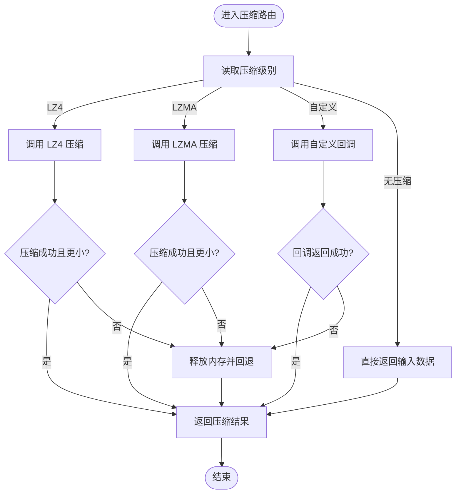
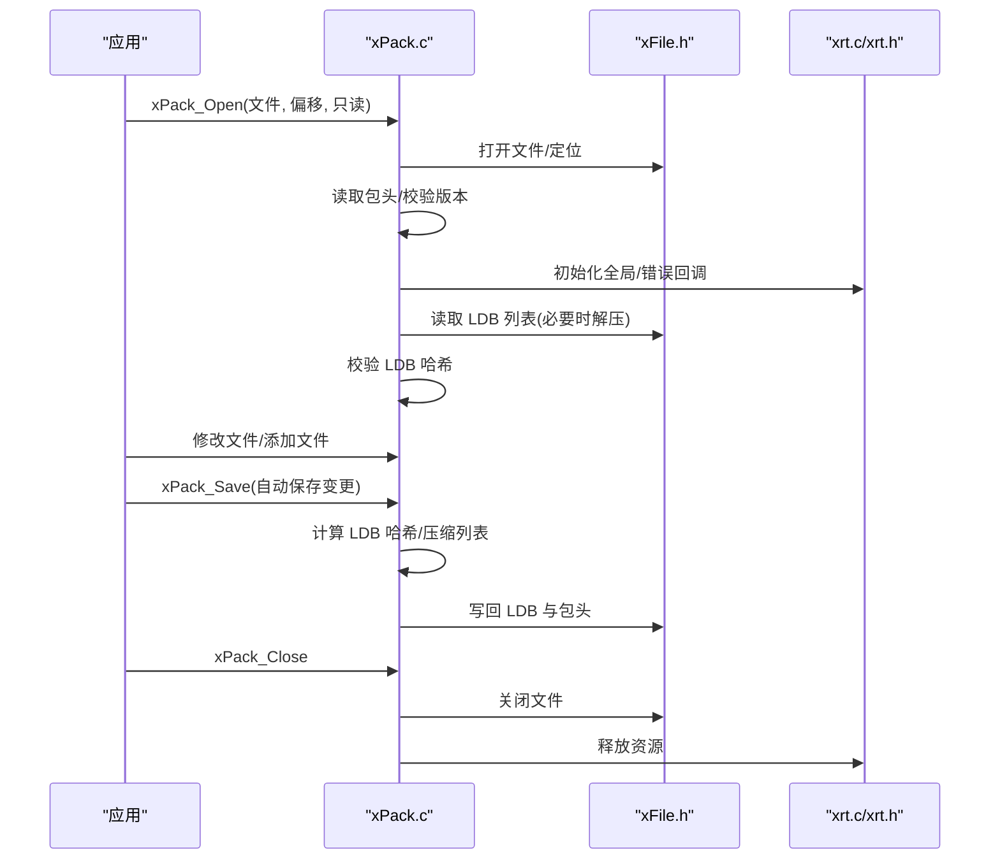
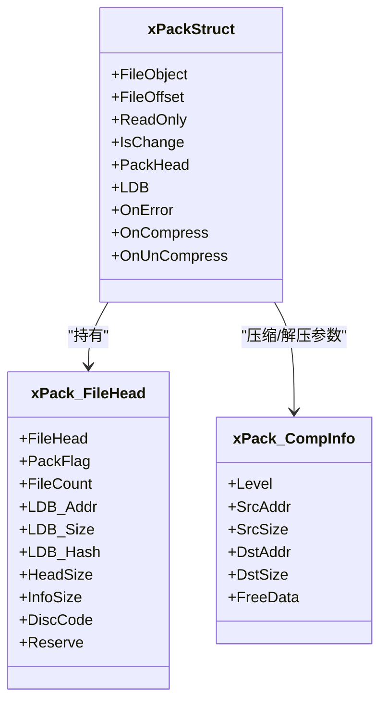
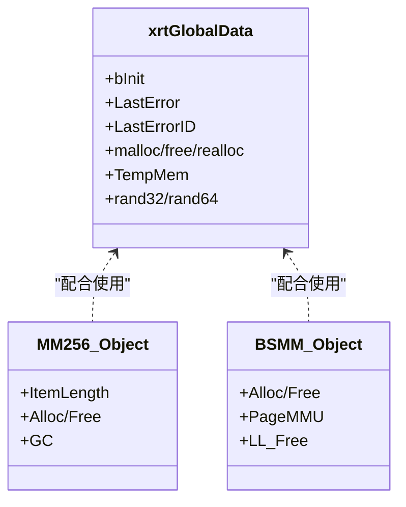
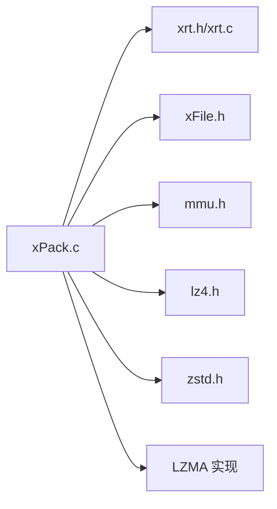

# 最佳实践指南

<cite>
**本文档引用的文件**
- [xPack.h](file://ver6/xpack/xPack.h)
- [xPack.c](file://ver6/xpack/xPack.c)
- [xrt.h](file://lib/xrt/xrt.h)
- [xrt.c](file://lib/xrt/xrt.c)
- [mmu.h](file://ver6/mmu/mmu.h)
- [xFile.h](file://ver6/xFile/xFile.h)
- [test.c](file://ver6/xpack/test.c)
- [zstd.h](file://lib/zstd/zstd.h)
- [lz4.h](file://lib/lz4/lz4.h)
</cite>

## 目录
1. [简介](#简介)
2. [项目结构](#项目结构)
3. [核心组件](#核心组件)
4. [架构总览](#架构总览)
5. [详细组件分析](#详细组件分析)
6. [依赖关系分析](#依赖关系分析)
7. [性能考虑](#性能考虑)
8. [故障排除指南](#故障排除指南)
9. [结论](#结论)
10. [附录](#附录)

## 简介
本指南面向使用 xPack 的开发者，系统总结常见使用模式、性能优化策略、错误预防与处理、代码组织与项目结构建议、安全使用注意事项、不同场景下的选择指南（压缩算法、内存管理），以及代码质量保障与测试策略。目标是帮助团队建立一致的工程实践，提升开发效率与代码质量。

## 项目结构
仓库采用模块化设计，核心模块包括：
- xPack：压缩包容器与文件管理接口
- xRT：通用运行时库（内存、字符串、文件、时间等）
- MMU：内存管理单元（内存池、结构体数组、缓冲区等）
- 压缩库：LZ4、LZMA、ZSTD（集成于 lib 子目录）
- xFile：跨平台文件 I/O 接口
- 示例与测试：ver6/xpack/test.c 展示典型使用流程

**图表来源**
- [xPack.h](file://ver6/xpack/xPack.h#L1-L252)
- [xPack.c](file://ver6/xpack/xPack.c#L1-L300)
- [xrt.h](file://lib/xrt/xrt.h#L1-L200)
- [xrt.c](file://lib/xrt/xrt.c#L1-L244)
- [mmu.h](file://ver6/mmu/mmu.h#L1-L200)
- [xFile.h](file://ver6/xFile/xFile.h#L1-L202)
- [lz4.h](file://lib/lz4/lz4.h#L1-L200)
- [zstd.h](file://lib/zstd/zstd.h#L1-L200)

**章节来源**
- [xPack.h](file://ver6/xpack/xPack.h#L1-L252)
- [xPack.c](file://ver6/xpack/xPack.c#L1-L300)
- [xrt.h](file://lib/xrt/xrt.h#L1-L200)
- [xrt.c](file://lib/xrt/xrt.c#L1-L244)
- [mmu.h](file://ver6/mmu/mmu.h#L1-L200)
- [xFile.h](file://ver6/xFile/xFile.h#L1-L202)
- [lz4.h](file://lib/lz4/lz4.h#L1-L200)
- [zstd.h](file://lib/zstd/zstd.h#L1-L200)

## 核心组件
- xPack 对象与文件头：封装包元数据、文件列表（LDB）、压缩回调与错误处理回调
- 压缩路由：统一调度 LZ4、LZMA、ZSTD 与自定义压缩
- 文件管理：Core/Index/Linux/Win32 多模式文件增删改查与解包
- 运行时与内存：xRT 提供全局内存分配、字符串与文件 I/O；MMU 提供高效内存池
- 压缩库：LZ4（极致速度）、LZMA（高压缩比）、ZSTD（平衡性能）

**章节来源**
- [xPack.h](file://ver6/xpack/xPack.h#L22-L127)
- [xPack.c](file://ver6/xpack/xPack.c#L54-L159)
- [xrt.h](file://lib/xrt/xrt.h#L180-L244)
- [mmu.h](file://ver6/mmu/mmu.h#L420-L533)

## 架构总览
xPack 通过统一接口抽象不同压缩算法与文件系统模式，内部以 LDB（列表数据块）记录文件元信息，支持 LZMA/LZ4/ZSTD 压缩与自定义压缩回调。运行时库提供内存、字符串、文件与时间等基础设施。

**图表来源**
- [xPack.c](file://ver6/xpack/xPack.c#L163-L203)
- [xrt.c](file://lib/xrt/xrt.c#L86-L182)
- [xFile.h](file://ver6/xFile/xFile.h#L59-L101)
- [lz4.h](file://lib/lz4/lz4.h#L177-L208)
- [zstd.h](file://lib/zstd/zstd.h#L154-L174)

## 详细组件分析

### 组件A：压缩路由与文件管理
- 压缩路由：根据压缩级别选择 LZ4/LZMA/ZSTD 或自定义回调；失败时回退为无压缩
- 文件管理：Core 模式顺序访问；Index 模式按索引访问；Linux/Win32 模式支持路径与属性
- LDB 列表：支持 LZMA/LZ4 压缩列表，写入时自动计算哈希校验

**图表来源**
- [xPack.c](file://ver6/xpack/xPack.c#L54-L101)

**章节来源**
- [xPack.c](file://ver6/xpack/xPack.c#L54-L159)
- [xPack.h](file://ver6/xpack/xPack.h#L113-L127)

### 组件B：包生命周期与保存流程
- 打开/创建：校验版本、读取/写入包头、初始化 LDB 内存与哈希
- 保存：计算 LDB 哈希、压缩列表、写回文件头与 LDB 段
- 关闭：自动保存变更、清理文件句柄与内存

**图表来源**
- [xPack.c](file://ver6/xpack/xPack.c#L218-L302)
- [xPack.c](file://ver6/xpack/xPack.c#L163-L203)

**章节来源**
- [xPack.c](file://ver6/xpack/xPack.c#L218-L302)
- [xPack.c](file://ver6/xpack/xPack.c#L163-L203)

### 组件C：多模式文件访问
- Core：顺序访问，适合简单打包
- Index：按索引访问，适合动态管理
- Linux/Win32：按路径访问，支持属性与大小写敏感差异

**图表来源**
- [xPack.h](file://ver6/xpack/xPack.h#L98-L127)
- [xPack.h](file://ver6/xpack/xPack.h#L22-L54)

**章节来源**
- [xPack.h](file://ver6/xpack/xPack.h#L98-L127)
- [xPack.h](file://ver6/xpack/xPack.h#L22-L54)

### 组件D：内存管理与运行时
- xRT：全局内存分配器、字符串与文件 I/O、时间与随机数
- MMU：结构体数组、内存缓冲区、内存池（MM256/64K）等，降低频繁分配成本

**图表来源**
- [xrt.h](file://lib/xrt/xrt.h#L130-L184)
- [mmu.h](file://ver6/mmu/mmu.h#L620-L665)
- [mmu.h](file://ver6/mmu/mmu.h#L420-L458)

**章节来源**
- [xrt.h](file://lib/xrt/xrt.h#L130-L184)
- [xrt.c](file://lib/xrt/xrt.c#L86-L182)
- [mmu.h](file://ver6/mmu/mmu.h#L620-L665)

## 依赖关系分析
- xPack 依赖 xRT（内存/字符串/文件）、xFile（文件 I/O）、MMU（内存池）、压缩库（LZ4/LZMA/ZSTD）
- 压缩路由在编译期通过宏选择只读/读写版本，减少不必要的依赖
- LDB 列表支持 LZMA/LZ4 压缩，提升大包列表的存储效率

**图表来源**
- [xPack.c](file://ver6/xpack/xPack.c#L9-L27)
- [lz4.h](file://lib/lz4/lz4.h#L1-L100)
- [zstd.h](file://lib/zstd/zstd.h#L1-L120)

**章节来源**
- [xPack.c](file://ver6/xpack/xPack.c#L9-L27)

## 性能考虑
- 压缩算法选择
  - LZ4：极致速度，适合热数据、实时流；默认快速压缩
  - LZMA：高压缩比，适合离线打包、长期归档
  - ZSTD：平衡速度与压缩比，适合通用场景
- 内存管理
  - 使用 MMU 内存池减少碎片与分配次数
  - LDB 列表启用压缩，降低磁盘占用
- I/O 优化
  - 顺序写入与定位，避免频繁 seek
  - 批量写入与一次性保存，减少磁盘往返
- 并发与线程
  - xRT 提供线程相关工具，注意线程安全与错误回调

[本节为通用指导，不直接分析具体文件]

## 故障排除指南
- 常见错误码与处理
  - 文件无法访问/格式不正确/内存申请失败/列表读取失败/写入失败/位置移动失败/包类型不匹配/文件不存在/文件名超长等
  - 建议：注册 OnError 回调，捕获错误码与描述，结合 LastErrorID/LastError 定位问题
- 哈希与校验
  - LDB 哈希校验失败：检查列表压缩/解压流程与数据完整性
- 压缩失败回退
  - 路由层在压缩失败时自动回退为无压缩，确保可用性

**章节来源**
- [xPack.c](file://ver6/xpack/xPack.c#L36-L51)
- [xPack.c](file://ver6/xpack/xPack.c#L295-L298)

## 结论
xPack 通过统一接口与灵活的压缩路由，为多场景打包提供了稳定高效的解决方案。结合 xRT 与 MMU 的基础设施，可在性能与易用性之间取得良好平衡。遵循本文最佳实践，可显著提升开发效率与系统稳定性。

[本节为总结性内容，不直接分析具体文件]

## 附录

### A. 常见使用模式与推荐实现
- 快速打包：Core 模式 + LZ4 压缩，适合热数据与实时场景
- 归档打包：Core 模式 + LZMA 压缩，适合离线与长期存储
- 动态管理：Index 模式，按索引增删改查
- 跨平台路径：Linux/Win32 模式，注意大小写与属性差异

**章节来源**
- [xPack.h](file://ver6/xpack/xPack.h#L15-L25)
- [xPack.h](file://ver6/xpack/xPack.h#L320-L332)

### B. 代码组织与项目结构建议
- 接口与实现分离：xPack.h 定义接口，xPack.c 实现逻辑
- 依赖最小化：仅包含必要头文件，避免循环依赖
- 模块化：xRT、MMU、xFile 独立封装，便于替换与测试

**章节来源**
- [xPack.h](file://ver6/xpack/xPack.h#L1-L20)
- [xPack.c](file://ver6/xpack/xPack.c#L9-L27)

### C. 安全使用注意事项
- 输入校验：严格检查文件路径长度与编码
- 错误处理：始终注册 OnError 回调，避免静默失败
- 内存安全：使用 xRT 内存分配与释放，避免越界与泄漏
- 压缩安全：对不受信任的数据进行大小限制与超时保护

**章节来源**
- [xPack.c](file://ver6/xpack/xPack.c#L36-L51)
- [xFile.h](file://ver6/xFile/xFile.h#L34-L56)

### D. 不同场景下的选择指南
- 压缩算法选择：LZ4（速度优先）、LZMA（空间优先）、ZSTD（平衡）
- 内存管理策略：小对象优先使用 MMU 内存池；大对象使用 BSMM/MP256
- 文件系统模式：Linux/Win32 模式需考虑大小写与属性差异

**章节来源**
- [lz4.h](file://lib/lz4/lz4.h#L177-L208)
- [zstd.h](file://lib/zstd/zstd.h#L154-L174)
- [mmu.h](file://ver6/mmu/mmu.h#L420-L458)

### E. 代码质量保证与测试策略
- 单元测试：针对压缩/解压、文件增删改查、LDB 哈希校验
- 集成测试：完整打包/解包流程，覆盖多模式与异常路径
- 性能测试：对比不同压缩算法与内存池配置的吞吐与延迟
- 示例参考：ver6/xpack/test.c 展示 Core/Index/Win32 模式的使用流程

**章节来源**
- [test.c](file://ver6/xpack/test.c#L24-L275)

### F. 可复用模板与模式
- 打包模板：打开包 → 设置类型 → 添加文件 → 保存/关闭
- 解包模板：打开包 → 遍历文件 → 解包到目标路径
- 自定义压缩回调：实现 OnCompress/OnUnCompress，满足特定业务需求

**章节来源**
- [xPack.h](file://ver6/xpack/xPack.h#L113-L127)
- [xPack.c](file://ver6/xpack/xPack.c#L54-L159)