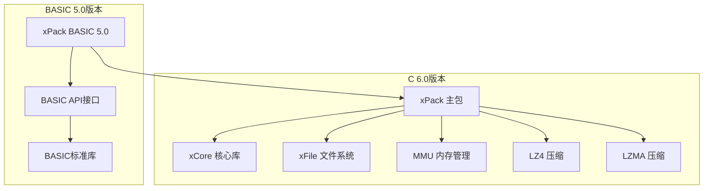
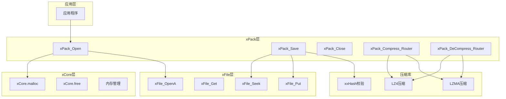
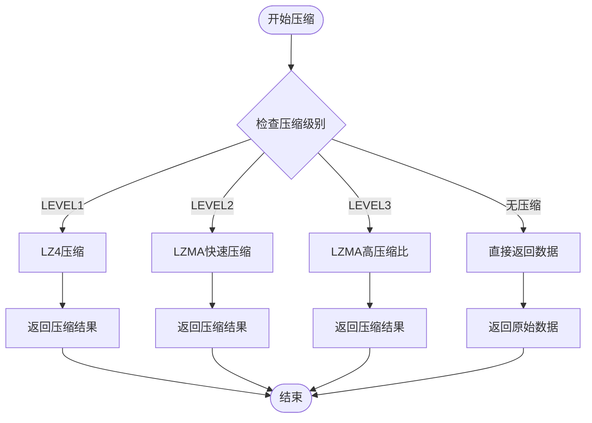
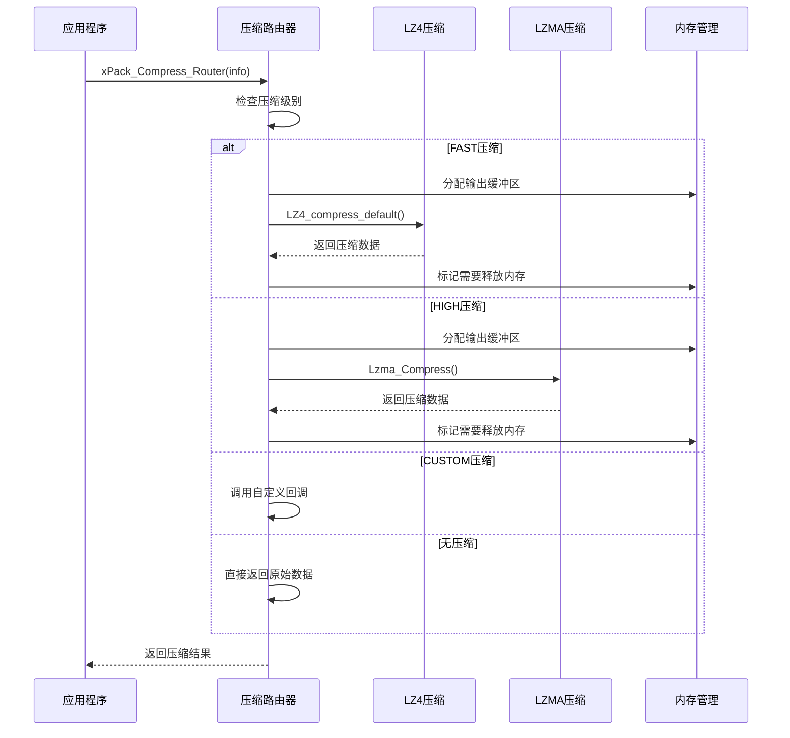
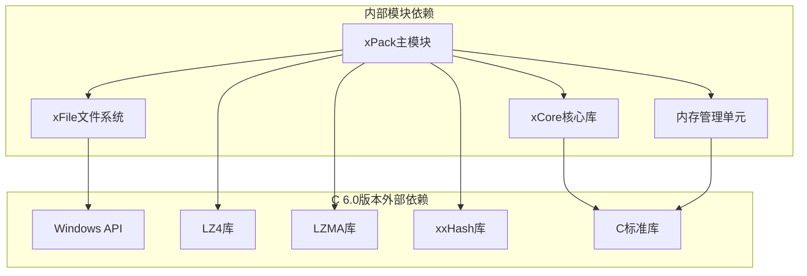

# 版本迁移指南

<cite>
**本文档引用的文件**
- [xPack.h](file://ver6/xpack/xPack.h)
- [xPack.c](file://ver6/xpack/xPack.c)
- [xPack.bi](file://ver5/开发目录/xPack Core/Inc/xPack.bi)
- [Core.bi](file://ver5/开发目录/xPack Core/Inc/Core.bi)
- [test.c](file://ver6/xpack/test.c)
- [lz4.h](file://ver5/lz4/lz4.h)
- [mmu.h](file://ver6/mmu/mmu.h)
- [xCore.h](file://ver6/xCore/xCore.h)
- [xFile.h](file://ver6/xFile/xFile.h)
- [README.md](file://ver5/README.md)
</cite>

## 目录
1. [简介](#简介)
2. [项目结构](#项目结构)
3. [核心组件](#核心组件)
4. [架构概览](#架构概览)
5. [详细组件分析](#详细组件分析)
6. [依赖关系分析](#依赖关系分析)
7. [性能考虑](#性能考虑)
8. [故障排除指南](#故障排除指南)
9. [结论](#结论)
10. [附录](#附录)

## 简介

本文档提供了从BASIC版本到C版本的完整迁移指南。xPack是一个跨平台的文件压缩包系统，支持多种压缩算法和文件访问模式。从BASIC 5.0版本迁移到C 6.0版本涉及重大的API变更、数据结构重组和编程范式转变。

## 项目结构

项目采用模块化设计，主要包含以下核心模块：



**图表来源**
- [xPack.h](file://ver6/xpack/xPack.h#L1-L252)
- [xPack.bi](file://ver5/开发目录/xPack Core/Inc/xPack.bi#L1-L685)

**章节来源**
- [README.md](file://ver5/README.md#L1-L2)
- [xPack.h](file://ver6/xpack/xPack.h#L1-L252)
- [xPack.bi](file://ver5/开发目录/xPack Core/Inc/xPack.bi#L1-L685)

## 核心组件

### 数据结构对比

#### 包头结构对比

| 组件 | BASIC 5.0 | C 6.0 |
|------|-----------|-------|
| 包标识 | `ZString * 4` | `uint` |
| 版本号 | `UByte` | `uint` |
| 标记位 | `UByte` | `uint` |
| 文件计数 | `UInteger` | `uint` |
| 列表地址 | `UInteger` | `uint` |
| 列表大小 | `UInteger` | `uint` |
| 列表哈希 | `UInteger` | `uint` |

#### 文件信息结构对比

| 字段 | BASIC 5.0 | C 6.0 |
|------|-----------|-------|
| 数据地址 | `UInteger` | `uint` |
| 数据大小 | `UInteger` | `uint` |
| 文件大小 | `UInteger` | `uint` |
| 文件哈希 | `UInteger` | `uint` |
| 压缩级别 | `UByte` | `uint` |
| 文件类型 | `UByte` | `int` |
| 保留字段 | `UShort` | `int` |

**章节来源**
- [xPack.h](file://ver6/xpack/xPack.h#L22-L84)
- [xPack.bi](file://ver5/开发目录/xPack Core/Inc/xPack.bi#L53-L76)

### API差异对比

#### 基本操作API对比

| 操作 | BASIC 5.0 | C 6.0 |
|------|-----------|-------|
| 打开包 | `xPack.Open()` | `xPack_Open()` |
| 保存包 | `xPack.Save()` | `xPack_Save()` |
| 关闭包 | `xPack.Close()` | `xPack_Close()` |
| 获取文件数 | `xPack.FileCount()` | `xPack_FileCount()` |
| 添加文件 | `xPack.AppendFile()` | `xPack_Core_AppendFile()` |

#### 压缩相关API对比

| 压缩类型 | BASIC 5.0 | C 6.0 |
|----------|-----------|-------|
| 无压缩 | `XPACK_COMP_NOUSED` | `XPK_COMP_NO` |
| 极速压缩 | `XPACK_COMP_LEVEL1` | `XPK_COMP_FAST` |
| 标准压缩 | `XPACK_COMP_LEVEL2` | `XPK_COMP_HIGH` |
| 极限压缩 | `XPACK_COMP_LEVEL3` | `XPK_COMP_CUSTOM` |

**章节来源**
- [xPack.h](file://ver6/xpack/xPack.h#L15-L19)
- [xPack.bi](file://ver5/开发目录/xPack Core/Inc/xPack.bi#L22-L26)

## 架构概览

C 6.0版本采用了更加模块化的架构设计：



**图表来源**
- [xPack.c](file://ver6/xpack/xPack.c#L219-L302)
- [xPack.c](file://ver6/xpack/xPack.c#L164-L203)
- [xPack.c](file://ver6/xpack/xPack.c#L55-L101)

## 详细组件分析

### 压缩流程对比

#### BASIC 5.0压缩流程



#### C 6.0压缩流程



**图表来源**
- [xPack.c](file://ver6/xpack/xPack.c#L55-L101)
- [xPack.c](file://ver6/xpack/xPack.c#L104-L159)

**章节来源**
- [xPack.c](file://ver6/xpack/xPack.c#L55-L159)
- [xPack.bi](file://ver5/开发目录/xPack Core/Inc/xPack.bi#L133-L188)

### 文件操作API迁移

#### 添加文件操作对比

| 操作 | BASIC 5.0 | C 6.0 |
|------|-----------|-------|
| 函数签名 | `xPack.AppendFile(sFile, iCompLevel, iFileType)` | `xPack_Core_AppendFile(xpk, sFile, iCompLevel)` |
| 文件读取 | `Open_File()` + `Get_File()` | `xFile_OpenA()` + `xFile_Get()` |
| 哈希计算 | `CityHash32()` | `XXH32()` |
| 数据写入 | `Put_File()` | `xFile_Put()` |
| 错误处理 | `OnErr()` | `OnError回调` |

#### 解包文件操作对比

| 操作 | BASIC 5.0 | C 6.0 |
|------|-----------|-------|
| 函数签名 | `xPack.UnpackFile(iPos, sFile)` | `xPack_Core_UnpackFile(xpk, iPos, sFile)` |
| 数据读取 | `Get_File()` | `xFile_Get()` |
| 解压处理 | `xPack_DeCompress()` | `xPack_DeCompress_Router()` |
| 哈希校验 | `CityHash32()` | `XXH32()` |
| 文件写出 | `PutFile()` | `xFile_PutAllA()` |

**章节来源**
- [xPack.c](file://ver6/xpack/xPack.c#L497-L515)
- [xPack.c](file://ver6/xpack/xPack.c#L630-L654)
- [xPack.bi](file://ver5/开发目录/xPack Core/Inc/xPack.bi#L510-L548)
- [xPack.bi](file://ver5/开发目录/xPack Core/Inc/xPack.bi#L614-L628)

### 数据类型映射

#### 基本数据类型映射

| BASIC 5.0 | C 6.0 | 大小(字节) |
|-----------|-------|------------|
| `Integer` | `int` | 4 |
| `UInteger` | `uint` | 4 |
| `Long` | `long long` | 8 |
| `ULong` | `unsigned long long` | 8 |
| `Single` | `float` | 4 |
| `Double` | `double` | 8 |
| `Byte` | `unsigned char` | 1 |
| `ZString` | `char*` | 指针大小 |

#### 结构体类型映射

| BASIC 5.0 | C 6.0 | 描述 |
|-----------|-------|------|
| `HANDLE` | `void*` | 文件句柄 |
| `Any Ptr` | `void*` | 通用指针 |
| `ZString Ptr` | `char**` | 字符串指针 |
| `UByte` | `unsigned char` | 无符号字节 |
| `UShort` | `unsigned short` | 无符号短整型 |

**章节来源**
- [xCore.h](file://ver6/xCore/xCore.h#L63-L77)
- [xPack.bi](file://ver5/开发目录/xPack Core/Inc/xPack.bi#L82-L126)

## 依赖关系分析

### 外部依赖关系



**图表来源**
- [xPack.c](file://ver6/xpack/xPack.c#L4-L27)
- [xPack.h](file://ver6/xpack/xPack.h#L1-L252)

### 内部模块耦合度分析

| 模块 | 耦合度 | 说明 |
|------|--------|------|
| xPack | 高 | 依赖所有子模块 |
| xCore | 中等 | 提供基础工具函数 |
| xFile | 中等 | 文件系统抽象层 |
| MMU | 低 | 内存管理工具 |
| 压缩库 | 低 | 第三方库独立 |

**章节来源**
- [xPack.c](file://ver6/xpack/xPack.c#L9-L27)
- [mmu.h](file://ver6/mmu/mmu.h#L30-L50)

## 性能考虑

### 压缩性能对比

| 压缩级别 | BASIC 5.0 | C 6.0 | 性能优势 |
|----------|-----------|-------|----------|
| 极速压缩 | LZ4 | LZ4 | 相同 |
| 标准压缩 | LZMA快速 | LZMA快速 | 相同 |
| 高压缩比 | LZMA常规 | LZMA常规 | 相同 |
| 自定义压缩 | 用户回调 | 用户回调 | 更灵活 |

### 内存管理优化

C 6.0版本在内存管理方面进行了重大改进：

1. **统一内存接口**：所有内存分配通过xCore统一管理
2. **错误处理**：集成统一的错误处理机制
3. **内存池**：支持多种内存池管理策略
4. **垃圾回收**：内置基础的垃圾回收机制

**章节来源**
- [xPack.c](file://ver6/xpack/xPack.c#L35-L53)
- [mmu.h](file://ver6/mmu/mmu.h#L123-L146)

## 故障排除指南

### 常见迁移问题及解决方案

#### 1. API名称变更

**问题**：BASIC的`xPack.AppendFile()`在C版本中变为`xPack_Core_AppendFile()`

**解决方案**：
```c
// BASIC 5.0
xpk.AppendFile("file.txt", 2)

// C 6.0
xPack_Core_AppendFile(xpk, "file.txt", XPK_COMP_HIGH)
```

#### 2. 错误处理机制变更

**问题**：BASIC使用`OnErr()`宏，C版本使用回调函数

**解决方案**：
```c
// C 6.0
void OnError(int iErrCode, str sErrText) {
    printf("错误 %d: %s\n", iErrCode, sErrText);
}

xpk->OnError = OnError;
```

#### 3. 数据类型不兼容

**问题**：BASIC的`ZString`在C版本中为`char*`

**解决方案**：
```c
// 使用xCore提供的字符串处理函数
astr fileName = xCore_FormatA("file_%d.txt", index);
// 使用完成后释放内存
xCore_free(fileName);
```

#### 4. 文件操作API变更

**问题**：BASIC的文件操作函数在C版本中需要显式管理句柄

**解决方案**：
```c
// C 6.0
xFileObject fileObj = xFile_OpenA("file.txt", FALSE, CHARSET_BINARY);
if (fileObj) {
    // 文件操作
    xFile_Close(fileObj);
}
```

**章节来源**
- [xPack.c](file://ver6/xpack/xPack.c#L35-L53)
- [xPack.bi](file://ver5/开发目录/xPack Core/Inc/xPack.bi#L35-L36)

### 调试和测试建议

#### 单元测试框架

```c
// 测试用例模板
void test_xPack_Open() {
    xPackObject xpk = xPack_Open("test.xpk", 0, FALSE);
    assert(xpk != NULL);
    
    uint count = xPack_FileCount(xpk);
    assert(count == 0);
    
    xPack_Close(xpk);
}
```

#### 内存泄漏检测

```c
// 使用xCore的内存跟踪功能
xCoreInit();
// 应用程序代码
xCoreUnit(); // 检测内存泄漏
```

## 结论

从BASIC 5.0到C 6.0的迁移虽然涉及重大的API变更和编程范式转变，但新版本在以下方面提供了显著优势：

1. **性能提升**：更高效的内存管理和压缩算法
2. **稳定性增强**：完善的错误处理和内存安全机制
3. **功能扩展**：支持多种文件访问模式和自定义压缩
4. **跨平台兼容**：更好的平台抽象和移植性

迁移过程中需要重点关注API名称变更、数据类型映射、错误处理机制和内存管理策略的调整。建议按照本文档的迁移步骤逐步进行，确保每个功能模块都经过充分测试。

## 附录

### 迁移检查清单

- [ ] API名称对照表核对
- [ ] 数据类型映射验证
- [ ] 错误处理机制重构
- [ ] 内存管理策略调整
- [ ] 压缩算法配置验证
- [ ] 文件操作流程测试
- [ ] 性能基准测试
- [ ] 兼容性回归测试

### 推荐学习资源

1. **C语言基础**：掌握指针、内存管理和标准库使用
2. **Windows API**：熟悉文件系统和进程管理
3. **第三方库使用**：LZ4、LZMA和xxHash库的API文档
4. **内存管理最佳实践**：学习现代C语言内存管理技巧