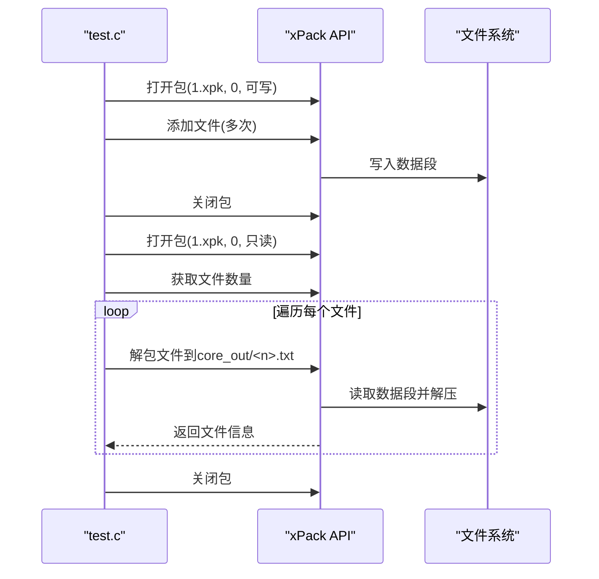
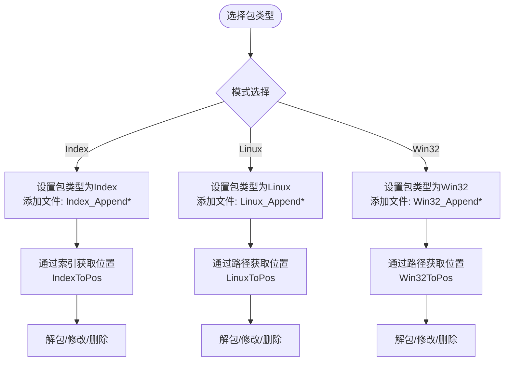
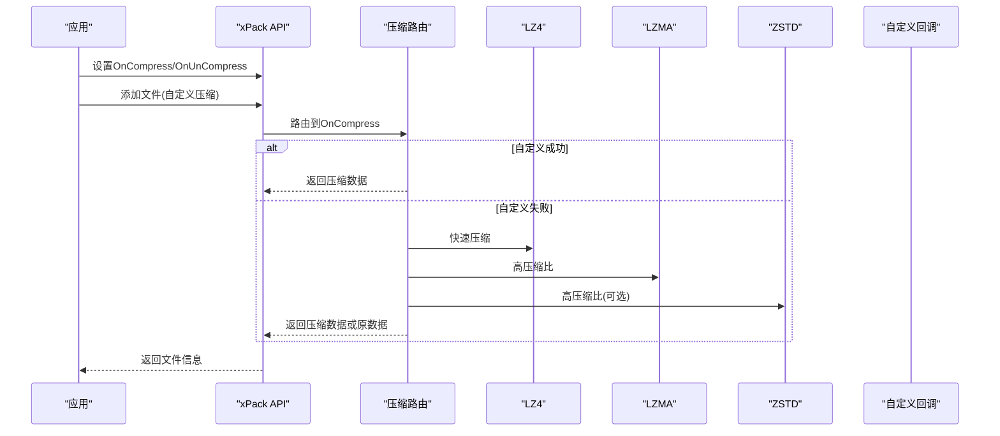
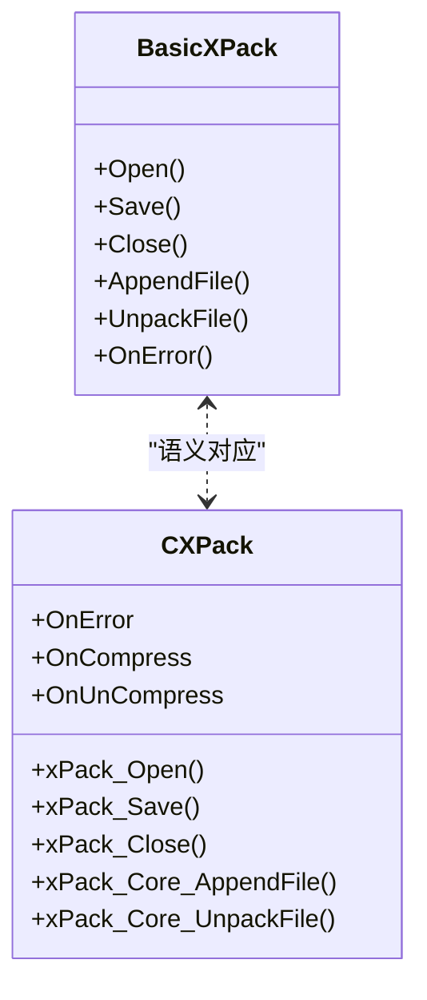
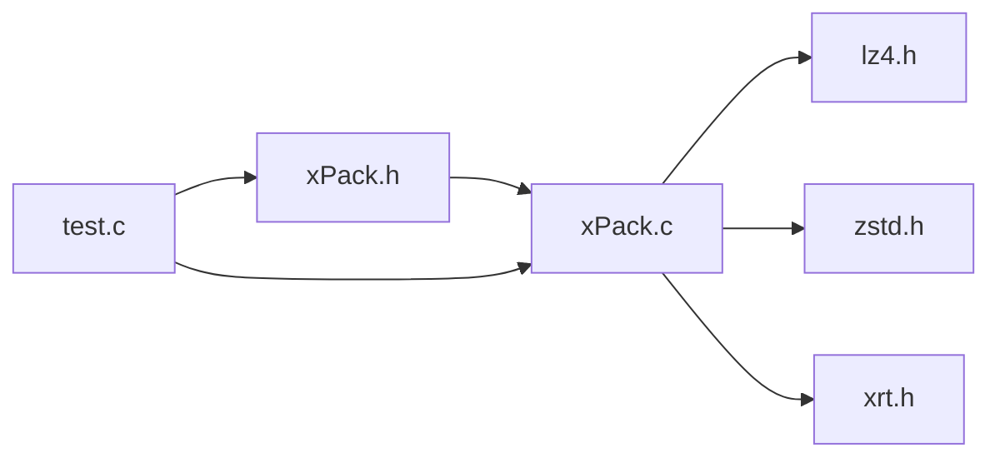

# 示例和教程

<cite>
**本文引用的文件**
- [xPack.h](file://ver6/xpack/xPack.h)
- [xPack.c](file://ver6/xpack/xPack.c)
- [test.c](file://ver6/xpack/test.c)
- [xPack.bi](file://ver5/开发目录/xPack Core/Inc/xPack.bi)
- [Core.bi](file://ver5/开发目录/xPack Core/Inc/Core.bi)
- [lz4.h](file://ver5/lz4/lz4.h)
- [zstd.h](file://lib/zstd/zstd.h)
- [xrt.h](file://lib/xrt/xrt.h)
</cite>

## 目录
1. [简介](#简介)
2. [项目结构](#项目结构)
3. [核心组件](#核心组件)
4. [架构总览](#架构总览)
5. [详细组件分析](#详细组件分析)
6. [依赖关系分析](#依赖关系分析)
7. [性能考量](#性能考量)
8. [故障排除指南](#故障排除指南)
9. [结论](#结论)
10. [附录](#附录)

## 简介
本教程面向不同层次的开发者，提供 xPack 文件压缩包系统的完整示例与实践指南。内容涵盖：
- 基础使用：创建包、添加文件、解包提取
- 高级场景：批量处理、自定义压缩算法接入、内存优化
- 迁移指南：从 BASIC 版本到 C 版本的差异与对照
- 性能优化：实际案例与基准测试思路
- 故障排除：常见错误与调试技巧

## 项目结构
仓库包含两套主要实现：
- ver5（BASIC 版本）：提供 xPack 的早期接口与示例，适合理解基础概念与迁移对照
- ver6（C 版本）：提供完整的 C 接口、实现与测试样例，支持多种包类型与压缩策略

```mermaid
graph TB
subgraph "ver6C 实现"
V6_HDR["xPack.h<br/>接口与数据结构"]
V6_SRC["xPack.c<br/>核心实现"]
V6_TEST["test.c<br/>示例与测试"]
end
subgraph "ver5BASIC 实现"
V5_HDR["xPack.bi<br/>BASIC 接口与类型"]
V5_CORE["Core.bi<br/>辅助函数"]
end
subgraph "第三方库"
LZ4["lz4.h<br/>快速压缩"]
ZSTD["zstd.h<br/>高压缩比"]
XRT["xrt.h<br/>运行时与工具"]
end
V6_HDR --> V6_SRC
V6_SRC --> LZ4
V6_SRC --> ZSTD
V6_SRC --> XRT
V6_TEST --> V6_HDR
V6_TEST --> V6_SRC
V5_HDR --> V5_CORE
```

**图表来源**
- [xPack.h](file://ver6/xpack/xPack.h#L1-L252)
- [xPack.c](file://ver6/xpack/xPack.c#L1-L120)
- [test.c](file://ver6/xpack/test.c#L1-L120)
- [xPack.bi](file://ver5/开发目录/xPack Core/Inc/xPack.bi#L1-L120)
- [Core.bi](file://ver5/开发目录/xPack Core/Inc/Core.bi#L1-L27)
- [lz4.h](file://ver5/lz4/lz4.h#L1-L120)
- [zstd.h](file://lib/zstd/zstd.h#L1-L120)
- [xrt.h](file://lib/xrt/xrt.h#L1-L120)

**章节来源**
- [xPack.h](file://ver6/xpack/xPack.h#L1-L252)
- [xPack.c](file://ver6/xpack/xPack.c#L1-L120)
- [test.c](file://ver6/xpack/test.c#L1-L120)
- [xPack.bi](file://ver5/开发目录/xPack Core/Inc/xPack.bi#L1-L120)
- [Core.bi](file://ver5/开发目录/xPack Core/Inc/Core.bi#L1-L27)

## 核心组件
- 包对象与文件头：封装文件句柄、偏移、只读标记、包头、列表段管理器以及错误回调
- 压缩/解压路由：统一调度 LZ4、LZMA、ZSTD 与自定义压缩
- 文件操作族：Core/Index/Linux/Win32 多模式文件增删改查与解包
- 辅助工具：内存分配、文件 IO、哈希校验、错误码映射

关键接口与数据结构概览（C 版本）：
- 包对象与文件头：见 [xPack.h](file://ver6/xpack/xPack.h#L22-L109)
- 压缩/解压入口：见 [xPack.c](file://ver6/xpack/xPack.c#L54-L159)
- 文件操作族（Core/Index/Linux/Win32）：见 [xPack.h](file://ver6/xpack/xPack.h#L170-L250)
- 打开/保存/关闭：见 [xPack.c](file://ver6/xpack/xPack.c#L218-L216)

**章节来源**
- [xPack.h](file://ver6/xpack/xPack.h#L22-L109)
- [xPack.c](file://ver6/xpack/xPack.c#L54-L159)
- [xPack.h](file://ver6/xpack/xPack.h#L170-L250)
- [xPack.c](file://ver6/xpack/xPack.c#L218-L216)

## 架构总览
xPack 的整体流程分为“包生命周期”和“文件生命周期”两条主线：
- 包生命周期：打开 → 修改（增删改查）→ 保存/重建 → 关闭
- 文件生命周期：读取元信息 → 读取数据 → 解压/校验 → 写出或返回

```mermaid
sequenceDiagram
participant App as "应用"
participant API as "xPack API"
participant Router as "压缩/解压路由"
participant LZ4 as "LZ4"
participant LZMA as "LZMA"
participant ZSTD as "ZSTD"
participant FS as "文件系统"
App->>API : 打开包(文件, 偏移, 只读)
API->>FS : 读取文件头与LDB
API->>Router : 解压LDB(若压缩)
Router-->>API : LDB内存
App->>API : 添加/修改/删除文件
API->>FS : 追加数据至包尾
API->>Router : 压缩数据(可选)
Router-->>API : 压缩结果或原数据
API-->>App : 返回文件位置/信息
App->>API : 保存包(可重建)
API->>Router : 压缩LDB(默认LZMA)
Router-->>API : LDB压缩结果
API->>FS : 写回LDB与文件头
API-->>App : 保存完成
App->>API : 关闭包
API->>FS : 关闭文件句柄
API-->>App : 释放资源
```

**图表来源**
- [xPack.c](file://ver6/xpack/xPack.c#L218-L216)
- [xPack.c](file://ver6/xpack/xPack.c#L163-L203)
- [xPack.c](file://ver6/xpack/xPack.c#L54-L159)

**章节来源**
- [xPack.c](file://ver6/xpack/xPack.c#L218-L216)
- [xPack.c](file://ver6/xpack/xPack.c#L163-L203)
- [xPack.c](file://ver6/xpack/xPack.c#L54-L159)

## 详细组件分析

### 组件A：基础使用示例（C 版本）
- 创建包并添加文件（Core 模式）
- 解包文件到磁盘
- 验证错误回调与文件计数

参考路径：
- 打开/添加/解包/关闭流程：见 [test.c](file://ver6/xpack/test.c#L31-L66)
- Core 模式接口：见 [xPack.h](file://ver6/xpack/xPack.h#L170-L186)



**图表来源**
- [test.c](file://ver6/xpack/test.c#L31-L66)
- [xPack.h](file://ver6/xpack/xPack.h#L170-L186)

**章节来源**
- [test.c](file://ver6/xpack/test.c#L31-L66)
- [xPack.h](file://ver6/xpack/xPack.h#L170-L186)

### 组件B：多模式文件操作（Index/Linux/Win32）
- Index 模式：通过索引号定位文件
- Linux/Win32 模式：通过路径定位文件（大小写敏感/不敏感）

参考路径：
- Index 模式添加/解包：见 [test.c](file://ver6/xpack/test.c#L70-L105)
- Linux/Win32 模式添加/解包：见 [test.c](file://ver6/xpack/test.c#L109-L145)
- 对应接口声明：见 [xPack.h](file://ver6/xpack/xPack.h#L194-L250)



**图表来源**
- [test.c](file://ver6/xpack/test.c#L70-L145)
- [xPack.h](file://ver6/xpack/xPack.h#L194-L250)

**章节来源**
- [test.c](file://ver6/xpack/test.c#L70-L145)
- [xPack.h](file://ver6/xpack/xPack.h#L194-L250)

### 组件C：自定义压缩算法集成
- 注册压缩/解压回调
- 在压缩失败时回退为无压缩
- 结合第三方压缩库（如 ZSTD）

参考路径：
- 回调注册与路由：见 [xPack.h](file://ver6/xpack/xPack.h#L106-L109)、[xPack.c](file://ver6/xpack/xPack.c#L54-L101)
- 第三方压缩接口：见 [zstd.h](file://lib/zstd/zstd.h#L154-L175)



**图表来源**
- [xPack.h](file://ver6/xpack/xPack.h#L106-L109)
- [xPack.c](file://ver6/xpack/xPack.c#L54-L101)
- [zstd.h](file://lib/zstd/zstd.h#L154-L175)

**章节来源**
- [xPack.h](file://ver6/xpack/xPack.h#L106-L109)
- [xPack.c](file://ver6/xpack/xPack.c#L54-L101)
- [zstd.h](file://lib/zstd/zstd.h#L154-L175)

### 组件D：内存优化策略
- LDB 压缩：默认使用 LZMA 压缩文件列表，降低头部与索引占用
- 数据段压缩：按文件粒度选择压缩级别（无压缩/快速/LZMA/自定义）
- 动态内存：使用内存池与一次性分配，减少碎片与拷贝

参考路径：
- LDB 压缩与写回：见 [xPack.c](file://ver6/xpack/xPack.c#L163-L203)
- 数据段压缩与写入：见 [xPack.c](file://ver6/xpack/xPack.c#L451-L494)

**章节来源**
- [xPack.c](file://ver6/xpack/xPack.c#L163-L203)
- [xPack.c](file://ver6/xpack/xPack.c#L451-L494)

### 组件E：从 BASIC 到 C 的迁移对照
- 接口命名与语义：BASIC 的 AppendFile/UnpackFile 对应 C 的 Core 模式接口
- 数据结构差异：BASIC 使用类型定义，C 使用结构体与宏
- 错误处理：BASIC 通过回调 OnError，C 通过回调 OnError 与全局 LastError

参考路径：
- BASIC 接口与实现：见 [xPack.bi](file://ver5/开发目录/xPack Core/Inc/xPack.bi#L82-L126)
- C 接口声明：见 [xPack.h](file://ver6/xpack/xPack.h#L170-L250)
- BASIC 辅助函数：见 [Core.bi](file://ver5/开发目录/xPack Core/Inc/Core.bi#L6-L26)



**图表来源**
- [xPack.bi](file://ver5/开发目录/xPack Core/Inc/xPack.bi#L82-L126)
- [xPack.h](file://ver6/xpack/xPack.h#L170-L250)

**章节来源**
- [xPack.bi](file://ver5/开发目录/xPack Core/Inc/xPack.bi#L82-L126)
- [xPack.h](file://ver6/xpack/xPack.h#L170-L250)
- [Core.bi](file://ver5/开发目录/xPack Core/Inc/Core.bi#L6-L26)

## 依赖关系分析
- xPack.c 依赖第三方压缩库（LZ4/LZMA/ZSTD）与运行时库（xrt）
- 接口定义集中在 xPack.h，实现集中在 xPack.c
- 测试样例 test.c 展示了典型工作流



**图表来源**
- [xPack.h](file://ver6/xpack/xPack.h#L1-L252)
- [xPack.c](file://ver6/xpack/xPack.c#L1-L120)
- [lz4.h](file://ver5/lz4/lz4.h#L1-L120)
- [zstd.h](file://lib/zstd/zstd.h#L1-L120)
- [xrt.h](file://lib/xrt/xrt.h#L1-L120)
- [test.c](file://ver6/xpack/test.c#L1-L120)

**章节来源**
- [xPack.h](file://ver6/xpack/xPack.h#L1-L252)
- [xPack.c](file://ver6/xpack/xPack.c#L1-L120)
- [lz4.h](file://ver5/lz4/lz4.h#L1-L120)
- [zstd.h](file://lib/zstd/zstd.h#L1-L120)
- [xrt.h](file://lib/xrt/xrt.h#L1-L120)
- [test.c](file://ver6/xpack/test.c#L1-L120)

## 性能考量
- 压缩策略选择
  - 快速压缩：LZ4，适合实时性要求高的场景
  - 高压缩比：LZMA/ZSTD，适合空间敏感场景
  - 自定义压缩：结合业务特征定制算法
- 批量处理
  - 使用索引模式（Index）进行批量定位与处理
  - 合理设置压缩级别，平衡 CPU 与存储
- 内存优化
  - LDB 压缩降低索引开销
  - 避免重复拷贝，尽量复用缓冲区
- 基准测试建议
  - 以文件大小、压缩比、CPU 时间、内存峰值为指标
  - 针对不同文件类型（文本、图片、二进制）分别测试
  - 使用多线程与流水线策略评估吞吐

[本节为通用指导，不直接分析具体文件]

## 故障排除指南
- 常见错误与定位
  - 文件无法访问/格式不正确/内存不足：检查文件权限、版本兼容性与内存分配
  - 文件列表读取/写入失败：确认偏移与文件头一致性
  - 文件哈希校验失败：确认数据完整性与解压路径
  - 无效文件位置/找不到文件：核对索引/路径与包内记录
- 调试技巧
  - 启用 OnError 回调输出详细错误
  - 使用最小复现样例（单文件/单次操作）
  - 分阶段验证：先验证打开/保存，再验证增删改查
  - 对比 BASIC 与 C 的行为差异，定位迁移问题

参考路径：
- 错误码与回调：见 [xPack.c](file://ver6/xpack/xPack.c#L36-L53)
- 错误码映射：见 [xPack.h](file://ver6/xpack/xPack.h#L36-L50)

**章节来源**
- [xPack.c](file://ver6/xpack/xPack.c#L36-L53)
- [xPack.h](file://ver6/xpack/xPack.h#L36-L50)

## 结论
通过本教程，您可以在不同平台上快速上手 xPack，并掌握从基础使用到高级优化的完整技能链。建议优先从 C 版本的 test.c 示例入手，逐步扩展到多模式与自定义压缩策略；同时参考 BASIC 版本理解演进脉络与接口设计。

[本节为总结性内容，不直接分析具体文件]

## 附录

### A. 基础示例清单（C 版本）
- 创建包并添加文件：见 [test.c](file://ver6/xpack/test.c#L31-L49)
- 解包文件到磁盘：见 [test.c](file://ver6/xpack/test.c#L52-L65)
- Index 模式批量处理：见 [test.c](file://ver6/xpack/test.c#L70-L105)
- Win32 模式批量处理：见 [test.c](file://ver6/xpack/test.c#L109-L270)

**章节来源**
- [test.c](file://ver6/xpack/test.c#L31-L49)
- [test.c](file://ver6/xpack/test.c#L52-L65)
- [test.c](file://ver6/xpack/test.c#L70-L105)
- [test.c](file://ver6/xpack/test.c#L109-L270)

### B. 高级示例清单（C 版本）
- 自定义压缩算法集成：见 [xPack.h](file://ver6/xpack/xPack.h#L106-L109)、[xPack.c](file://ver6/xpack/xPack.c#L54-L101)
- 批量文件处理（索引模式）：见 [test.c](file://ver6/xpack/test.c#L70-L105)
- 路径模式（Linux/Win32）：见 [test.c](file://ver6/xpack/test.c#L109-L270)

**章节来源**
- [xPack.h](file://ver6/xpack/xPack.h#L106-L109)
- [xPack.c](file://ver6/xpack/xPack.c#L54-L101)
- [test.c](file://ver6/xpack/test.c#L70-L105)
- [test.c](file://ver6/xpack/test.c#L109-L270)

### C. 迁移对照清单（BASIC → C）
- 接口命名与语义：见 [xPack.bi](file://ver5/开发目录/xPack Core/Inc/xPack.bi#L82-L126)、[xPack.h](file://ver6/xpack/xPack.h#L170-L250)
- 数据结构差异：见 [xPack.bi](file://ver5/开发目录/xPack Core/Inc/xPack.bi#L53-L77)、[xPack.h](file://ver6/xpack/xPack.h#L22-L84)
- 错误处理：见 [xPack.bi](file://ver5/开发目录/xPack Core/Inc/xPack.bi#L84-L85)、[xPack.c](file://ver6/xpack/xPack.c#L36-L53)

**章节来源**
- [xPack.bi](file://ver5/开发目录/xPack Core/Inc/xPack.bi#L82-L126)
- [xPack.h](file://ver6/xpack/xPack.h#L170-L250)
- [xPack.bi](file://ver5/开发目录/xPack Core/Inc/xPack.bi#L53-L77)
- [xPack.h](file://ver6/xpack/xPack.h#L22-L84)
- [xPack.bi](file://ver5/开发目录/xPack Core/Inc/xPack.bi#L84-L85)
- [xPack.c](file://ver6/xpack/xPack.c#L36-L53)