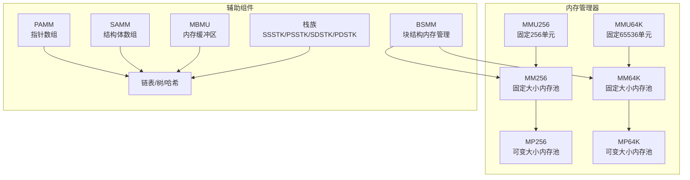
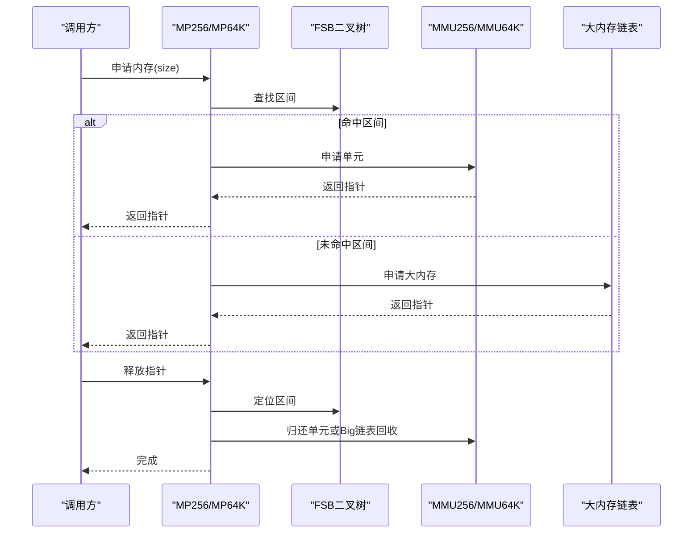
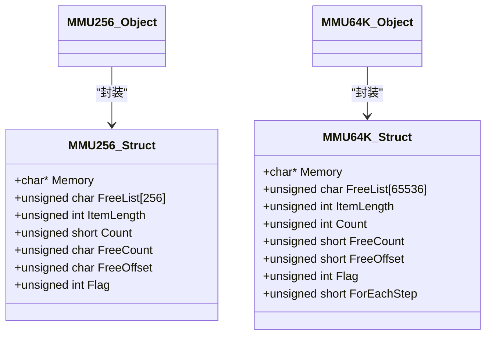
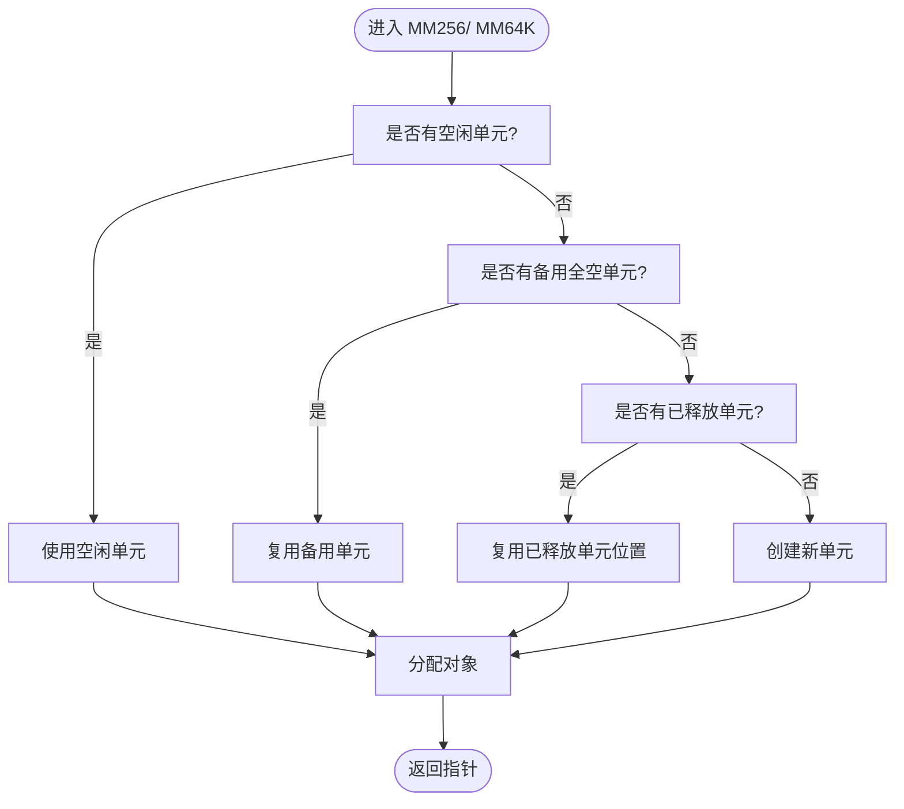
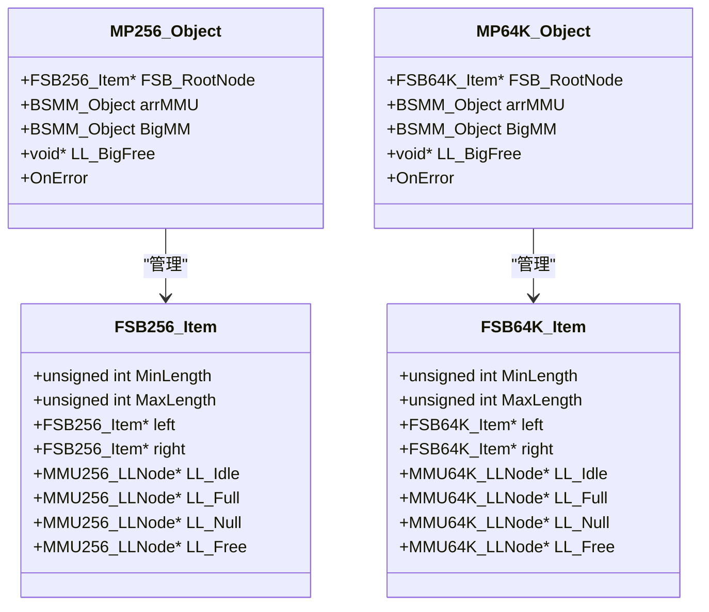
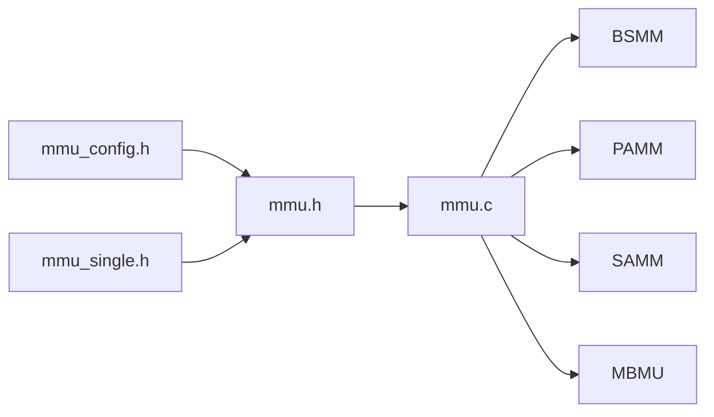

# 内存优化策略

<cite>
**本文档引用的文件**
- [mmu.h](file://ver6/mmu/mmu.h)
- [mmu.c](file://ver6/mmu/mmu.c)
- [readme_cn.md](file://ver6/mmu/readme_cn.md)
- [mmu_config.h](file://ver6/mmu/mmu_config.h)
- [05_mmu256_test.h](file://ver6/mmu/test/05_mmu256_test.h)
- [06_mmu64k_test.h](file://ver6/mmu/test/06_mmu64k_test.h)
- [09_mp256_test.h](file://ver6/mmu/test/09_mp256_test.h)
- [10_mp64k_test.h](file://ver6/mmu/test/10_mp64k_test.h)
- [mmu_single.h](file://ver6/mmu/mmu_single.h)
- [xFile.h](file://ver6/xFile/xFile.h)
- [xPack.h](file://ver6/xpack/xPack.h)
- [zstdmt_compress.c](file://lib/zstd/compress/zstdmt_compress.c)
</cite>

## 目录
1. [简介](#简介)
2. [项目结构](#项目结构)
3. [核心组件](#核心组件)
4. [架构概览](#架构概览)
5. [详细组件分析](#详细组件分析)
6. [依赖关系分析](#依赖关系分析)
7. [性能考量](#性能考量)
8. [故障排查指南](#故障排查指南)
9. [结论](#结论)
10. [附录](#附录)

## 简介
本文件面向需要在大量文件处理场景中实现高性能内存管理的工程师，系统阐述内存池（MMU256、MMU64K、MP256、MP64K）的选择与使用策略，涵盖初始化、配置、监控、泄漏检测与性能分析方法，并提供基于文件大小与数量的动态选择指南及内存使用效率优化技巧。

## 项目结构
MMU（内存管理单元）库提供多种内存管理器，包括基础单元（MMU256、MMU64K）、固定大小内存池（MM256、MM64K）、可变大小内存池（MP256、MP64K）以及配套的缓冲区、栈、树、哈希等容器。其设计目标是在保证易用性的前提下，最大化内存分配/释放性能，减少碎片与系统调用开销。

**图表来源**
- [mmu.h](file://ver6/mmu/mmu.h#L472-L721)
- [mmu.c](file://ver6/mmu/mmu.c#L3391-L3799)

**章节来源**
- [readme_cn.md](file://ver6/mmu/readme_cn.md#L1-L120)
- [mmu_config.h](file://ver6/mmu/mmu_config.h#L1-L40)

## 核心组件
- 基础单元
  - MMU256：每个管理单元固定256个槽位，适合中小规模、高并发的小对象分配。
  - MMU64K：每个管理单元固定65536个槽位，适合大规模、低频分配场景。
- 固定大小内存池
  - MM256/ MM64K：以MMU256/MMU64K为基础，提供统一的内存池接口，支持标记与GC。
- 可变大小内存池
  - MP256/ MP64K：按请求大小自动选择合适区间，内部通过二叉搜索树（FSB）组织区间，支持大内存链表记录与回收。

**章节来源**
- [mmu.h](file://ver6/mmu/mmu.h#L472-L721)
- [mmu.c](file://ver6/mmu/mmu.c#L3000-L3799)

## 架构概览
MP256/MP64K的核心流程：根据请求大小在FSB（固定大小块）中定位区间，选择或创建对应MMU单元，分配内存；释放时根据标志位判断来源并回收至相应链表或大内存链表。

**图表来源**
- [mmu.c](file://ver6/mmu/mmu.c#L3057-L3174)
- [mmu.c](file://ver6/mmu/mmu.c#L3538-L3655)

## 详细组件分析

### MMU256 与 MMU64K 基础单元
- 特点
  - MMU256：每个单元256个槽位，适合小对象高频分配。
  - MMU64K：每个单元65536个槽位，适合大对象或超大对象池化。
- 内存布局
  - 单元头部包含空闲槽位列表、计数、Flag等字段，便于快速分配与回收。
- 标记与GC
  - 通过Flag位进行使用标记与GC标记，支持按标记回收。

**图表来源**
- [mmu.h](file://ver6/mmu/mmu.h#L472-L610)

**章节来源**
- [mmu.h](file://ver6/mmu/mmu.h#L472-L610)
- [mmu.c](file://ver6/mmu/mmu.c#L706-L800)

### MM256 与 MM64K 内存池
- 设计思路
  - 以BSMM管理MMU单元数组，配合空闲/满载/全空/已释放链表，实现单元复用与备用。
- 性能权衡
  - MM256：单元小，内存占用低，但分配/释放更频繁。
  - MM64K：单元大，分配/释放次数少，但内存浪费可能更高。

**图表来源**
- [mmu.c](file://ver6/mmu/mmu.c#L3074-L3146)
- [mmu.c](file://ver6/mmu/mmu.c#L3554-L3627)

**章节来源**
- [mmu.c](file://ver6/mmu/mmu.c#L3000-L3380)

### MP256 与 MP64K 可变大小内存池
- FSB（固定大小块）二叉搜索树
  - 通过二叉树组织区间，按请求大小快速定位。
- 大内存处理
  - 超出区间范围的对象走“大内存链表”管理，释放时优先复用链表节点。
- 错误处理
  - 提供OnError回调，捕获创建单元失败、添加单元失败、空单元引用、FSB定位失败等错误。

**图表来源**
- [mmu.h](file://ver6/mmu/mmu.h#L610-L721)
- [mmu.c](file://ver6/mmu/mmu.c#L3391-L3799)

**章节来源**
- [mmu.c](file://ver6/mmu/mmu.c#L3391-L3799)

### 测试与验证
- MMU256/ MMU64K 基础功能测试
  - 验证创建、分配、释放、回收、边界条件等。
- MP256/ MP64K 内存池测试
  - 验证区间选择、单元复用、大内存链表回收、错误回调等。

**章节来源**
- [05_mmu256_test.h](file://ver6/mmu/test/05_mmu256_test.h#L1-L222)
- [06_mmu64k_test.h](file://ver6/mmu/test/06_mmu64k_test.h#L1-L214)
- [09_mp256_test.h](file://ver6/mmu/test/09_mp256_test.h#L1-L155)
- [10_mp64k_test.h](file://ver6/mmu/test/10_mp64k_test.h#L1-L155)

## 依赖关系分析
- 模块依赖
  - MP256/ MP64K 依赖 BSMM（块结构内存管理）管理MMU单元数组与大内存链表。
  - MM256/ MM64K 依赖 PAMM（指针数组）管理单元链表。
- 头文件与实现分离
  - mmu_single.h 提供单文件版本，便于集成；mmu.c 提供完整实现。

**图表来源**
- [mmu.h](file://ver6/mmu/mmu.h#L1-L120)
- [mmu.c](file://ver6/mmu/mmu.c#L1-L60)
- [mmu_config.h](file://ver6/mmu/mmu_config.h#L1-L40)

**章节来源**
- [mmu.h](file://ver6/mmu/mmu.h#L1-L120)
- [mmu.c](file://ver6/mmu/mmu.c#L1-L60)
- [mmu_single.h](file://ver6/mmu/mmu_single.h#L4805-L5454)

## 性能考量
- 分配/释放频率
  - MM256：单元小，分配/释放更频繁，适合小对象高频场景。
  - MM64K：单元大，分配/释放次数少，适合大对象或超大对象。
- 内存浪费
  - MM64K 单元容量大，可能导致更多未使用空间；MM256 更节省内存。
- 并发与缓存
  - 单元内空闲槽位列表与计数器设计，减少跨单元扫描成本。
- 大内存处理
  - 大内存链表优先复用节点，减少系统调用与碎片。

**章节来源**
- [readme_cn.md](file://ver6/mmu/readme_cn.md#L47-L52)
- [mmu.c](file://ver6/mmu/mmu.c#L3057-L3174)
- [mmu.c](file://ver6/mmu/mmu.c#L3538-L3655)

## 故障排查指南
- 常见错误与定位
  - 创建单元失败：检查内存池初始化与区间配置。
  - 添加单元失败：检查arrMMU容量与链表状态。
  - 空单元引用：确认Flag位与链表迁移逻辑。
  - FSB定位失败：检查请求大小与区间树构建。
- 监控与诊断
  - 使用OnError回调输出错误码与上下文。
  - 通过单元链表状态（空闲/满载/全空/已释放）观察复用效果。
  - 大内存链表统计与复用率评估。

**章节来源**
- [mmu.c](file://ver6/mmu/mmu.c#L3031-L3054)
- [mmu.c](file://ver6/mmu/mmu.c#L3176-L3298)
- [mmu.c](file://ver6/mmu/mmu.c#L3512-L3535)
- [mmu.c](file://ver6/mmu/mmu.c#L3657-L3779)

## 结论
- 选择建议
  - 小对象高频分配：优先MP256或MM256。
  - 大对象/超大对象：优先MP64K或MM64K。
  - 文件处理场景：结合文件大小分布与数量，动态选择区间树配置与池类型。
- 最佳实践
  - 明确内存池生命周期，及时Unit/Destroy。
  - 合理配置区间树，减少大内存链表压力。
  - 使用OnError回调与单元链表状态进行监控与优化。

## 附录

### 大文件处理场景的内存优化策略
- 读取策略
  - 使用xFile系列接口按需读取，避免一次性加载整个文件。
  - 对文本文件，结合编码识别与BOM处理，减少重复转换。
- 压缩与解压
  - xPack提供多级压缩路由，按文件特征选择压缩级别。
  - 大文件建议采用流式压缩/解压，减少峰值内存占用。
- 内存池选择
  - 小文件：MP256/ MM256，提高分配效率。
  - 大文件：MP64K/ MM64K，降低分配次数。
  - 混合场景：根据文件大小分布动态切换池类型。

**章节来源**
- [xFile.h](file://ver6/xFile/xFile.h#L1-L202)
- [xPack.h](file://ver6/xpack/xPack.h#L1-L252)

### 内存使用效率测量与优化技巧
- 测量方法
  - 统计分配/释放次数、单元复用率、大内存链表占用。
  - 对比不同池类型在相同工作负载下的内存峰值与平均占用。
- 优化技巧
  - 合理设置区间树层级与范围，减少大内存链表触发。
  - 使用单元备用机制，避免临界状态频繁创建/销毁。
  - 在多线程环境中为容器添加互斥保护（当前库未内置线程安全）。

**章节来源**
- [readme_cn.md](file://ver6/mmu/readme_cn.md#L226-L230)
- [mmu.c](file://ver6/mmu/mmu.c#L3177-L3247)
- [mmu.c](file://ver6/mmu/mmu.c#L3658-L3707)

### 参考实现与外部库
- zstd多线程压缩缓冲池
  - 展示了缓冲池复用与容量控制的典型做法，可借鉴到内存池设计中。

**章节来源**
- [zstdmt_compress.c](file://lib/zstd/compress/zstdmt_compress.c#L254-L284)