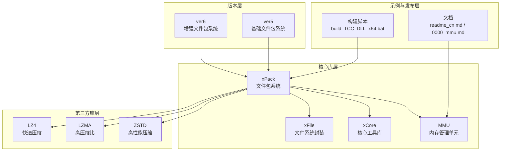
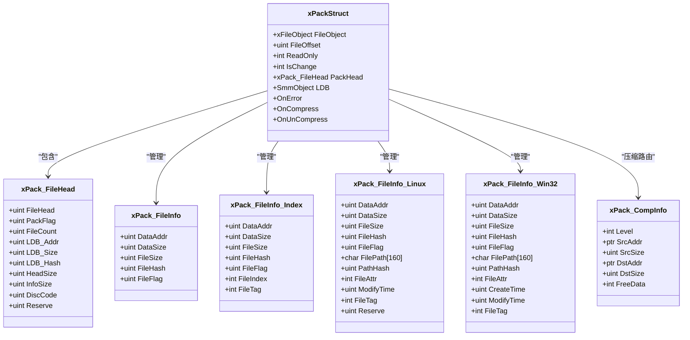
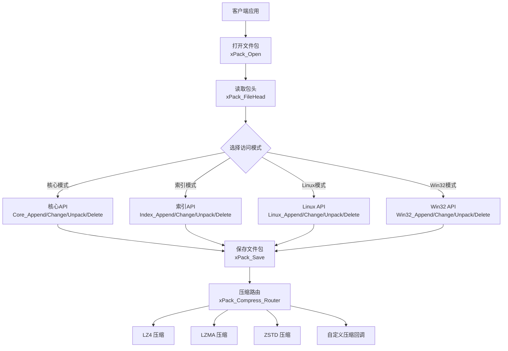
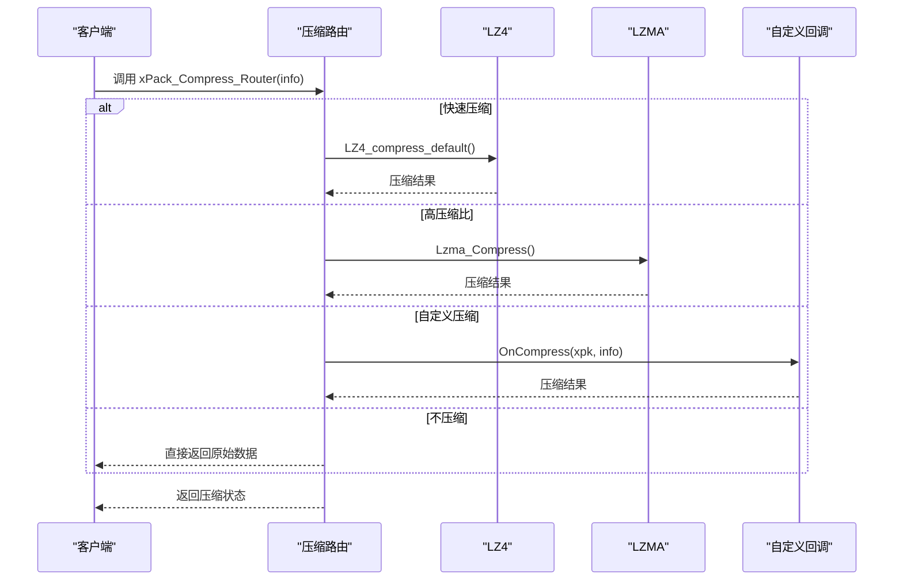
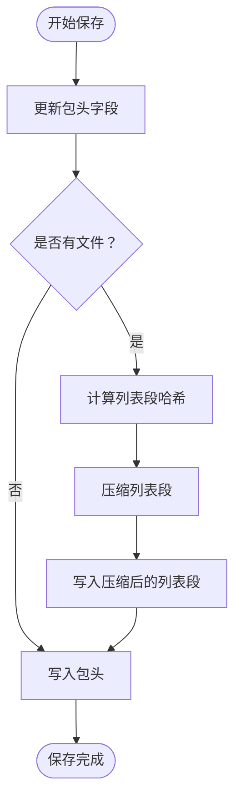
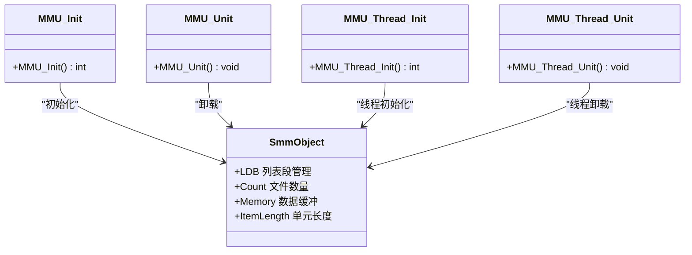
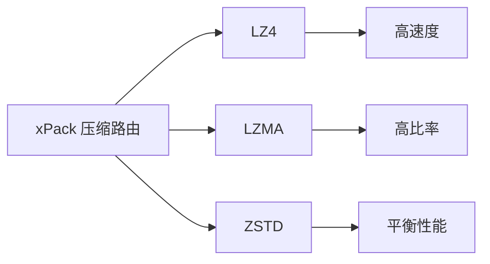
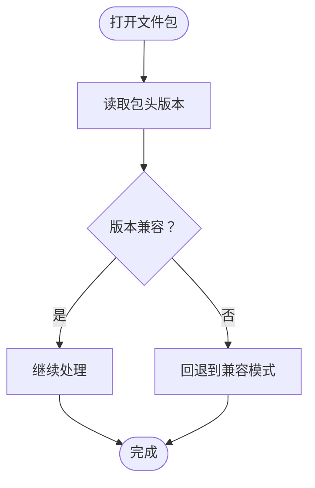
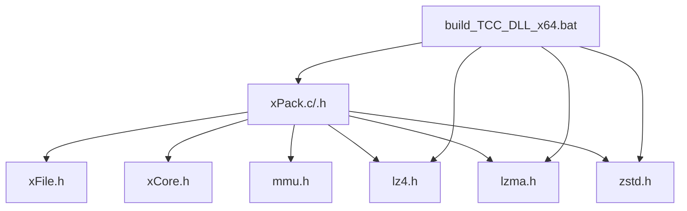

# 复杂文件包结构设计

<cite>
**本文档引用的文件**
- [lib/xrt/xrt.h](file://lib/xrt/xrt.h)
- [lib/zstd/zstd.h](file://lib/zstd/zstd.h)
- [lib/lz4/lz4.h](file://lib/lz4/lz4.h)
- [ver6/xpack/xPack.h](file://ver6/xpack/xPack.h)
- [ver6/xpack/xPack.c](file://ver6/xpack/xPack.c)
- [ver6/xpack/release/inc/xPack.h](file://ver6/xpack/release/inc/xPack.h)
- [ver6/mmu/mmu.h](file://ver6/mmu/mmu.h)
- [ver6/mmu/mmu_config.h](file://ver6/mmu/mmu_config.h)
- [ver6/mmu/readme_cn.md](file://ver6/mmu/readme_cn.md)
- [ver6/mmu/docs/cn/0000_mmu.md](file://ver6/mmu/docs/cn/0000_mmu.md)
- [ver6/xpack/build_TCC_DLL_x64.bat](file://ver6/xpack/build_TCC_DLL_x64.bat)
- [ver5/README.md](file://ver5/README.md)
</cite>

## 目录
1. [简介](#简介)
2. [项目结构](#项目结构)
3. [核心组件](#核心组件)
4. [架构总览](#架构总览)
5. [详细组件分析](#详细组件分析)
6. [依赖关系分析](#依赖关系分析)
7. [性能考量](#性能考量)
8. [故障排除指南](#故障排除指南)
9. [结论](#结论)
10. [附录](#附录)

## 简介
本指南围绕复杂文件包结构设计展开，结合仓库中的多版本实现与第三方库，系统阐述如何设计和实现具有多层嵌套、文件依赖关系与版本管理能力的文件包系统。文档重点涵盖：
- 多文件包模式的组合使用策略与适用场景
- 大型项目文件包的组织策略与命名规范
- 版本控制与向后兼容性处理
- 性能影响分析与优化建议
- 实际项目中的复杂文件包设计案例与最佳实践

## 项目结构
该项目采用“版本化 + 多库协同”的复合结构，核心由以下层次构成：
- 版本层：ver5 与 ver6 代表不同演进阶段的文件包系统
- 核心库层：xPack（文件包系统）、xFile（文件系统封装）、xCore（核心工具库）、MMU（内存管理单元）
- 第三方库层：LZ4（快速压缩）、LZMA（高压缩比）、ZSTD（高性能压缩）
- 示例与发布层：各模块的示例、测试与构建脚本

**图表来源**
- [ver6/xpack/xPack.h](file://ver6/xpack/xPack.h#L1-L262)
- [ver6/xpack/xPack.c](file://ver6/xpack/xPack.c#L1-L200)
- [ver6/mmu/mmu.h](file://ver6/mmu/mmu.h#L1-L200)
- [ver6/xpack/build_TCC_DLL_x64.bat](file://ver6/xpack/build_TCC_DLL_x64.bat#L1-L7)

**章节来源**
- [ver6/xpack/xPack.h](file://ver6/xpack/xPack.h#L1-L262)
- [ver6/xpack/xPack.c](file://ver6/xpack/xPack.c#L1-L200)
- [ver6/mmu/mmu.h](file://ver6/mmu/mmu.h#L1-L200)
- [ver6/xpack/build_TCC_DLL_x64.bat](file://ver6/xpack/build_TCC_DLL_x64.bat#L1-L7)

## 核心组件
本节聚焦文件包系统的关键组件及其职责：
- 文件包头与文件信息结构：定义包头、文件信息、索引信息与平台兼容信息
- 压缩路由：根据压缩级别选择 LZ4/LZMA/ZSTD 或自定义压缩
- 文件包对象：封装文件句柄、偏移、只读状态、包头、列表段与回调
- API 分层：核心模式、索引模式、Linux/Win32 模式

**图表来源**
- [ver6/xpack/xPack.h](file://ver6/xpack/xPack.h#L22-L119)
- [ver6/xpack/release/inc/xPack.h](file://ver6/xpack/release/inc/xPack.h#L32-L94)

**章节来源**
- [ver6/xpack/xPack.h](file://ver6/xpack/xPack.h#L22-L119)
- [ver6/xpack/release/inc/xPack.h](file://ver6/xpack/release/inc/xPack.h#L32-L94)

## 架构总览
文件包系统的整体架构围绕“包头 + 列表段 + 数据段”展开，支持多种访问模式与压缩策略：

**图表来源**
- [ver6/xpack/xPack.c](file://ver6/xpack/xPack.c#L54-L159)
- [ver6/xpack/xPack.h](file://ver6/xpack/xPack.h#L123-L130)

**章节来源**
- [ver6/xpack/xPack.c](file://ver6/xpack/xPack.c#L54-L159)
- [ver6/xpack/xPack.h](file://ver6/xpack/xPack.h#L123-L130)

## 详细组件分析

### 组件A：压缩路由与多压缩库集成
压缩路由根据压缩级别选择不同的压缩策略，并在失败时回退到无压缩：
- 快速压缩：LZ4
- 高压缩比：LZMA
- 自定义压缩：通过回调函数扩展
- 回退策略：压缩失败时直接返回原始数据

**图表来源**
- [ver6/xpack/xPack.c](file://ver6/xpack/xPack.c#L54-L101)

**章节来源**
- [ver6/xpack/xPack.c](file://ver6/xpack/xPack.c#L54-L101)

### 组件B：文件包保存流程
保存流程包括更新包头、计算列表段哈希、压缩列表段并写入文件头与列表段数据：
- 更新包头字段（版本号、文件数量、列表段偏移与大小、哈希）
- 计算列表段哈希（XXH32）
- 选择压缩策略（默认 LZMA）
- 写入压缩后的列表段
- 写入包头

**图表来源**
- [ver6/xpack/xPack.c](file://ver6/xpack/xPack.c#L163-L200)

**章节来源**
- [ver6/xpack/xPack.c](file://ver6/xpack/xPack.c#L163-L200)

### 组件C：内存管理单元（MMU）与文件包的协作
MMU 提供多种内存管理器（数组、栈、树、哈希表、内存池等），在文件包系统中可用于：
- 列表段（LDB）的数据管理
- 临时缓冲区的高效分配与回收
- 多线程环境下的内存隔离（通过线程初始化接口）

**图表来源**
- [ver6/mmu/docs/cn/0000_mmu.md](file://ver6/mmu/docs/cn/0000_mmu.md#L1-L21)
- [ver6/xpack/xPack.h](file://ver6/xpack/xPack.h#L105-L105)

**章节来源**
- [ver6/mmu/docs/cn/0000_mmu.md](file://ver6/mmu/docs/cn/0000_mmu.md#L1-L21)
- [ver6/xpack/xPack.h](file://ver6/xpack/xPack.h#L105-L105)

### 组件D：第三方压缩库的版本与兼容性
- LZ4：快速压缩，适合实时场景
- LZMA：高压缩比，适合存储场景
- ZSTD：高性能压缩，提供多种压缩级别与上下文复用

**图表来源**
- [lib/lz4/lz4.h](file://lib/lz4/lz4.h#L1-L200)
- [lib/zstd/zstd.h](file://lib/zstd/zstd.h#L1-L200)

**章节来源**
- [lib/lz4/lz4.h](file://lib/lz4/lz4.h#L1-L200)
- [lib/zstd/zstd.h](file://lib/zstd/zstd.h#L1-L200)

### 组件E：版本控制与向后兼容
- 版本标识：包头包含版本号（如 0x106B7078），用于识别包格式版本
- 兼容策略：当压缩失败时自动回退到无压缩，保证读取兼容性
- 扩展字段：包头与文件信息支持扩展字段，便于后续版本升级

**图表来源**
- [ver6/xpack/xPack.c](file://ver6/xpack/xPack.c#L31-L31)
- [ver6/xpack/xPack.c](file://ver6/xpack/xPack.c#L96-L100)

**章节来源**
- [ver6/xpack/xPack.c](file://ver6/xpack/xPack.c#L31-L31)
- [ver6/xpack/xPack.c](file://ver6/xpack/xPack.c#L96-L100)

## 依赖关系分析
文件包系统的核心依赖关系如下：
- xPack 依赖 xFile（文件操作）、xCore（内存与工具）、MMU（内存管理）、第三方压缩库（LZ4/LZMA/ZSTD）
- MMU 提供多种内存管理器，支持裁剪与线程初始化
- 构建脚本将 xPack 与相关模块及第三方库链接为动态库

**图表来源**
- [ver6/xpack/xPack.c](file://ver6/xpack/xPack.c#L9-L27)
- [ver6/xpack/build_TCC_DLL_x64.bat](file://ver6/xpack/build_TCC_DLL_x64.bat#L1-L1)

**章节来源**
- [ver6/xpack/xPack.c](file://ver6/xpack/xPack.c#L9-L27)
- [ver6/xpack/build_TCC_DLL_x64.bat](file://ver6/xpack/build_TCC_DLL_x64.bat#L1-L1)

## 性能考量
- 压缩策略选择
  - 快速压缩（LZ4）：适用于实时场景，压缩/解压速度快，比率略低
  - 高压缩比（LZMA）：适用于存储场景，比率高，压缩/解压速度慢
  - 自定义压缩：通过回调扩展，满足特定业务需求
- 内存管理优化
  - MMU 提供多种内存管理器，支持动态扩展与缓冲，减少频繁分配/释放带来的性能损耗
  - 线程初始化接口可用于多线程环境下的内存隔离
- 文件包保存流程
  - 列表段默认使用 LZMA 压缩，提高存储效率
  - 压缩失败自动回退到无压缩，保证兼容性与稳定性

**章节来源**
- [ver6/xpack/xPack.c](file://ver6/xpack/xPack.c#L54-L159)
- [ver6/mmu/mmu.h](file://ver6/mmu/mmu.h#L1-L200)
- [ver6/mmu/readme_cn.md](file://ver6/mmu/readme_cn.md#L1-L306)

## 故障排除指南
- 常见错误码与处理
  - 文件无法访问、格式不正确、内存申请失败、文件列表读取/添加失败、无效文件位置、文件哈希校验失败、文件读取/写入失败、读写位置移动失败、包类型不匹配、找不到文件、文件名超长
- 错误回调机制
  - 通过 OnError 回调函数输出错误信息，便于定位问题
- 压缩失败回退
  - 当压缩失败时，自动回退到无压缩，确保数据可读取

**章节来源**
- [ver6/xpack/xPack.c](file://ver6/xpack/xPack.c#L35-L52)

## 结论
本指南展示了如何在复杂项目中设计与实现文件包系统，涵盖多层嵌套、文件依赖关系与版本管理。通过合理选择压缩策略、优化内存管理、完善错误处理与版本兼容机制，可以在保证性能的同时提升系统的可维护性与扩展性。建议在实际项目中：
- 根据场景选择合适的压缩策略（实时/存储）
- 使用 MMU 提升内存管理效率
- 通过扩展字段与版本标识实现平滑升级
- 建立完善的构建与测试流程，确保跨平台兼容性

## 附录
- 项目版本说明：ver5 为基础版本，ver6 为增强版本，包含更多访问模式与优化
- 文档与示例：MMU 提供详细的中文文档与测试用例，便于学习与集成

**章节来源**
- [ver5/README.md](file://ver5/README.md#L1-L2)
- [ver6/mmu/readme_cn.md](file://ver6/mmu/readme_cn.md#L1-L306)