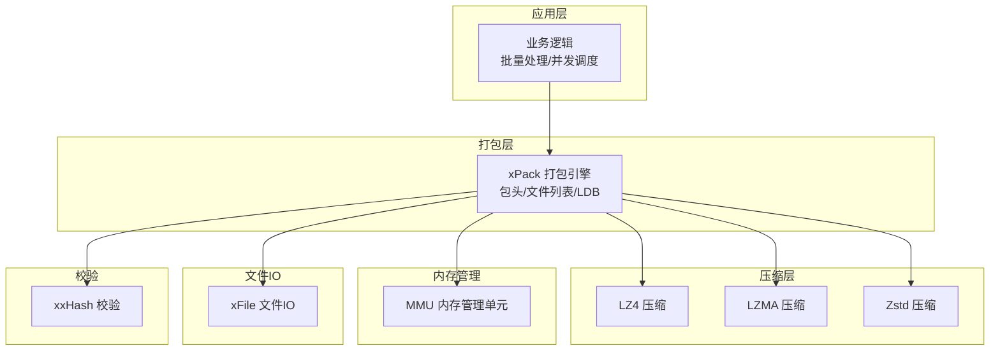
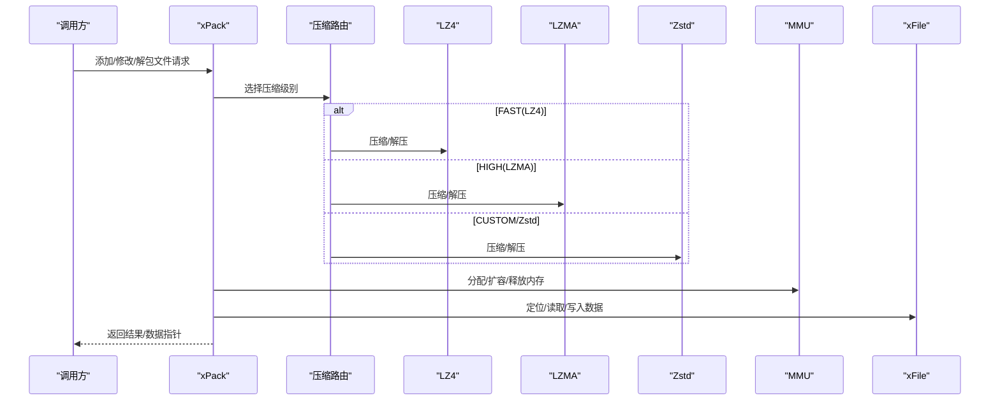
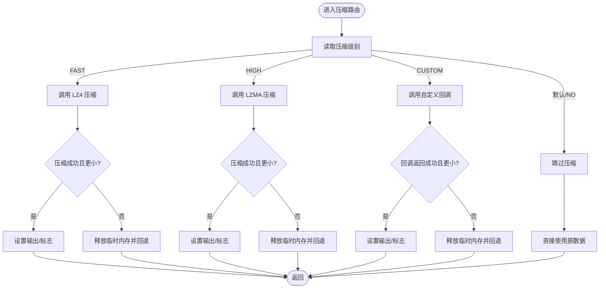
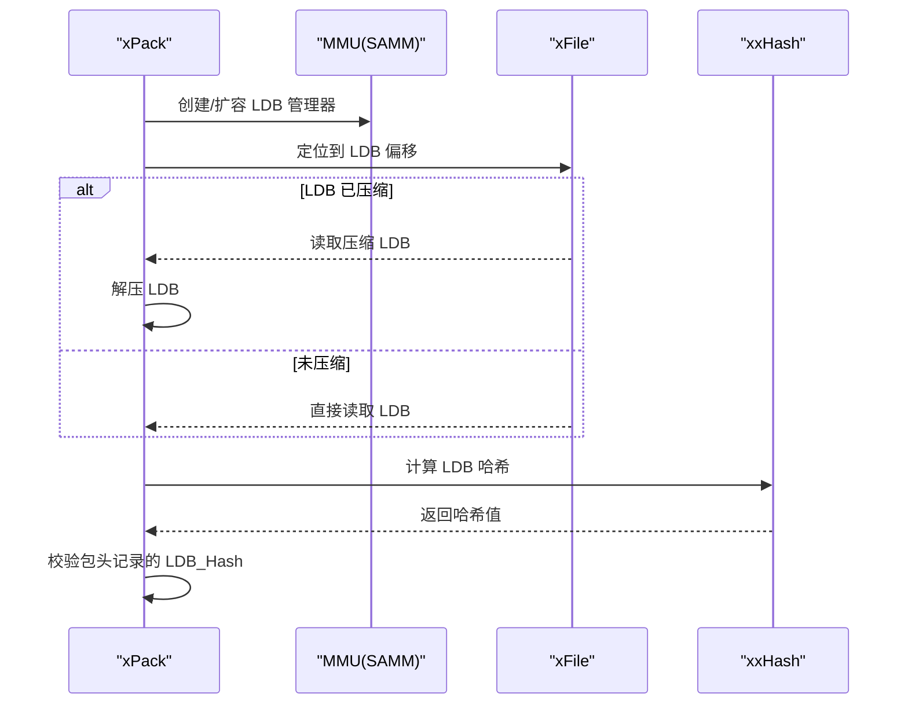
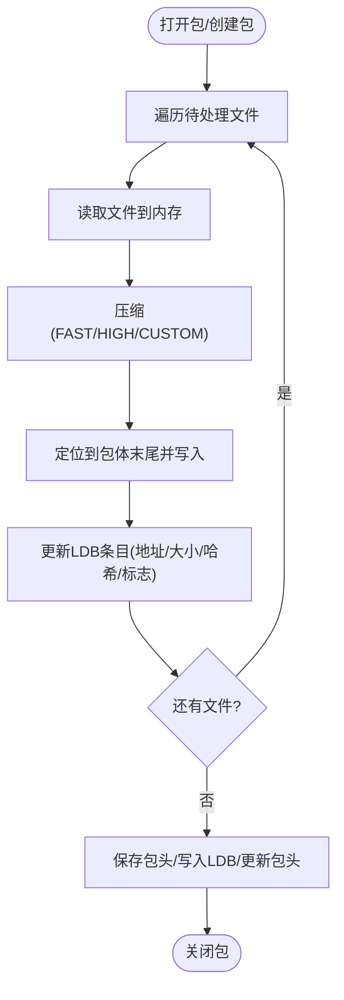
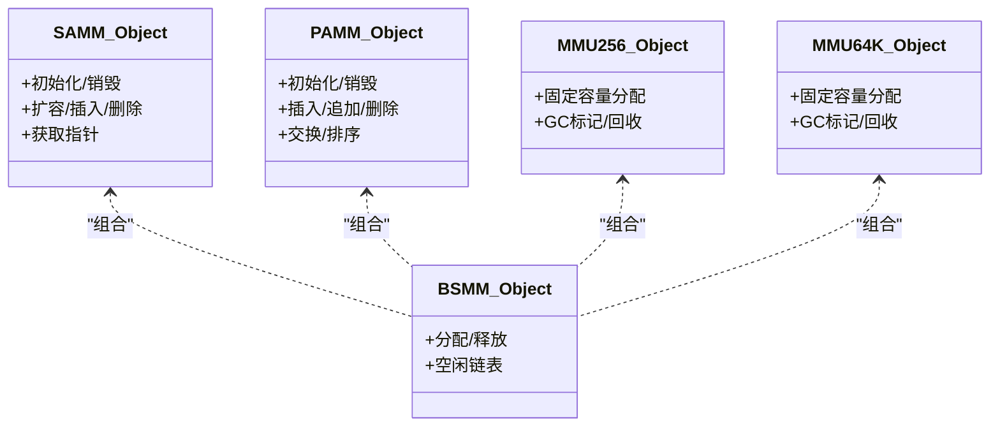
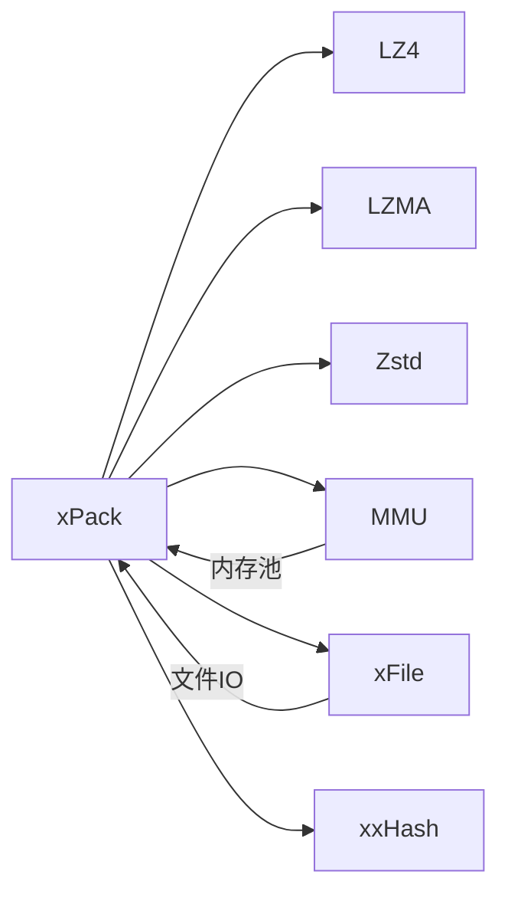

# 性能优化实战

<cite>
**本文引用的文件**
- [xPack.c](file://ver6/xpack/xPack.c)
- [xPack.h](file://ver6/xpack/xPack.h)
- [mmu.c](file://ver6/mmu/mmu.c)
- [mmu.h](file://ver6/mmu/mmu.h)
- [xFile.h](file://ver6/xFile/xFile.h)
- [xCore.c](file://ver6/xCore/xCore.c)
- [lz4.h](file://lib/lz4/lz4.h)
- [LzmaEnc.h](file://ver5/lzma/LzmaEnc.h)
- [LzmaDec.h](file://ver5/lzma/LzmaDec.h)
- [xxhash.h](file://ver6/xxhash32/xxhash.h)
- [zstd.h](file://lib/zstd/zstd.h)
- [test.c](file://ver6/xpack/test.c)
</cite>

## 目录
1. [简介](#简介)
2. [项目结构](#项目结构)
3. [核心组件](#核心组件)
4. [架构总览](#架构总览)
5. [详细组件分析](#详细组件分析)
6. [依赖关系分析](#依赖关系分析)
7. [性能考量](#性能考量)
8. [故障排查指南](#故障排查指南)
9. [结论](#结论)
10. [附录](#附录)

## 简介
本技术文档围绕“性能优化实战”主题，结合仓库中的压缩与打包实现，系统阐述以下内容：
- 不同压缩算法的性能对比与适用场景
- 批量文件处理的性能优化技巧（I/O、内存、并发）
- 性能瓶颈识别与分析方法
- 性能监控与调试工具使用指南
- 面向不同场景的优化策略与最佳实践
- 如何根据实际需求选择最优配置参数
- 性能测试方法与工具推荐

## 项目结构
该仓库采用模块化设计，核心围绕“压缩打包引擎 + 内存管理 + 文件IO + 哈希校验”展开：
- 压缩层：集成 LZ4、LZMA（版本5）、Zstd（库头文件），统一路由到具体压缩实现
- 打包层：xPack 提供包头、文件列表（LDB）管理、增删改查接口
- 内存管理：MMU 提供多种内存管理单元（SAMM/PAMM/BSMM/MM256/MP256等）
- 文件IO：xFile 提供跨平台文件读写、定位、扫描等能力
- 哈希：xxHash 用于文件列表与单文件数据的完整性校验

图示来源
- [xPack.c](file://ver6/xpack/xPack.c#L55-L159)
- [mmu.c](file://ver6/mmu/mmu.c#L284-L462)
- [xFile.h](file://ver6/xFile/xFile.h#L59-L152)
- [xxhash.h](file://ver6/xxhash32/xxhash.h#L1-L2)

章节来源
- [xPack.c](file://ver6/xpack/xPack.c#L1-L120)
- [xPack.h](file://ver6/xpack/xPack.h#L1-L120)
- [mmu.h](file://ver6/mmu/mmu.h#L107-L207)
- [xFile.h](file://ver6/xFile/xFile.h#L1-L120)
- [xxhash.h](file://ver6/xxhash32/xxhash.h#L1-L2)

## 核心组件
- 打包引擎（xPack）：负责包头管理、文件列表（LDB）压缩/解压、文件增删改查、数据压缩路由
- 内存管理（MMU）：提供结构化/指针/缓冲区/块级内存管理，减少频繁分配释放带来的碎片与拷贝
- 文件IO（xFile）：封装底层文件操作，支持二进制读写、定位、大小查询、路径操作
- 哈希（xxHash）：提供高性能32位哈希，用于文件列表与单文件数据完整性校验
- 压缩库（LZ4/LZMA/Zstd）：通过统一路由接口选择压缩算法，兼顾速度与压缩比

章节来源
- [xPack.c](file://ver6/xpack/xPack.c#L55-L203)
- [mmu.c](file://ver6/mmu/mmu.c#L284-L462)
- [xFile.h](file://ver6/xFile/xFile.h#L59-L152)
- [xxhash.h](file://ver6/xxhash32/xxhash.h#L1-L2)

## 架构总览
xPack 通过“压缩路由”在运行时选择 LZ4/LZMA/Zstd，结合 MMU 的内存池与 xFile 的顺序/随机读写，形成高效的批量打包流水线。

图示来源
- [xPack.c](file://ver6/xpack/xPack.c#L55-L159)
- [lz4.h](file://lib/lz4/lz4.h#L177-L226)
- [LzmaEnc.h](file://ver5/lzma/LzmaEnc.h#L69-L77)
- [LzmaDec.h](file://ver5/lzma/LzmaDec.h#L200-L224)
- [zstd.h](file://lib/zstd/zstd.h#L154-L175)

## 详细组件分析

### 组件A：压缩路由与算法选择
- 路由逻辑：根据压缩级别选择 LZ4（快速）、LZMA（高压缩比）、或自定义/第三方（如 Zstd）
- 失败回退：若压缩后不降反升，自动回退为未压缩
- LDB 压缩：文件列表（LDB）默认使用 LZMA 压缩，提高包头空间利用率

图示来源
- [xPack.c](file://ver6/xpack/xPack.c#L55-L101)
- [lz4.h](file://lib/lz4/lz4.h#L177-L226)
- [LzmaEnc.h](file://ver5/lzma/LzmaEnc.h#L69-L77)

章节来源
- [xPack.c](file://ver6/xpack/xPack.c#L55-L101)
- [lz4.h](file://lib/lz4/lz4.h#L177-L226)
- [LzmaEnc.h](file://ver5/lzma/LzmaEnc.h#L69-L77)

### 组件B：文件列表（LDB）管理与哈希校验
- LDB 压缩：LDB 段可选压缩，压缩类型由包头标志记录
- 哈希校验：使用 xxHash 对 LDB 内容进行完整性校验，确保列表未被篡改
- 动态扩容：通过 MMU 的结构化内存管理（SAMM）动态分配/扩容 LDB

图示来源
- [xPack.c](file://ver6/xpack/xPack.c#L269-L299)
- [xPack.h](file://ver6/xpack/xPack.h#L22-L44)
- [xxhash.h](file://ver6/xxhash32/xxhash.h#L1-L2)
- [mmu.h](file://ver6/mmu/mmu.h#L285-L354)

章节来源
- [xPack.c](file://ver6/xpack/xPack.c#L164-L203)
- [xPack.c](file://ver6/xpack/xPack.c#L269-L299)
- [xPack.h](file://ver6/xpack/xPack.h#L22-L44)

### 组件C：批量文件处理与I/O优化
- 顺序写入：文件数据按追加顺序写入，减少随机IO
- 批量读取：读取文件到内存后一次性压缩，避免多次系统调用
- 定位与写入：通过文件定位（Seek）将数据写入包体，减少中间缓冲

图示来源
- [xPack.c](file://ver6/xpack/xPack.c#L497-L515)
- [xPack.c](file://ver6/xpack/xPack.c#L452-L494)
- [xFile.h](file://ver6/xFile/xFile.h#L69-L101)

章节来源
- [xPack.c](file://ver6/xpack/xPack.c#L452-L515)
- [xFile.h](file://ver6/xFile/xFile.h#L69-L101)

### 组件D：内存管理与缓存策略
- 结构化内存（SAMM）：按项长度预分配，插入/扩容时按步长增长，降低 realloc 频率
- 指针数组（PAMM）：适合动态索引访问，支持插入/删除/交换
- 块级内存（BSMM）：固定块大小，适合高频小对象分配
- 固定容量内存（MMU256/64K）：极致分配效率，适合热点对象池化

图示来源
- [mmu.h](file://ver6/mmu/mmu.h#L285-L354)
- [mmu.h](file://ver6/mmu/mmu.h#L209-L280)
- [mmu.h](file://ver6/mmu/mmu.h#L421-L459)
- [mmu.h](file://ver6/mmu/mmu.h#L472-L534)
- [mmu.h](file://ver6/mmu/mmu.h#L547-L610)

章节来源
- [mmu.c](file://ver6/mmu/mmu.c#L284-L462)
- [mmu.h](file://ver6/mmu/mmu.h#L209-L354)

## 依赖关系分析
- xPack 依赖压缩库（LZ4/LZMA/Zstd）、MMU、xFile、xxHash
- MMU 为 xPack 的 LDB 管理提供内存支撑
- xFile 为 xPack 的文件读写提供抽象
- xxHash 为 LDB 与单文件数据提供完整性校验

图示来源
- [xPack.c](file://ver6/xpack/xPack.c#L9-L27)
- [mmu.h](file://ver6/mmu/mmu.h#L107-L207)
- [xFile.h](file://ver6/xFile/xFile.h#L59-L152)
- [xxhash.h](file://ver6/xxhash32/xxhash.h#L1-L2)

章节来源
- [xPack.c](file://ver6/xpack/xPack.c#L9-L27)

## 性能考量

### 不同压缩算法的性能对比与选择
- LZ4：极快压缩/解压，适合实时性要求高、CPU受限场景；压缩比一般
- LZMA：高压缩比，CPU消耗较高，适合离线打包、带宽敏感场景
- Zstd：平衡速度与压缩比，支持多线程（取决于编译宏），适合通用场景
- 选择建议：
  - 实时打包/热更新：优先 LZ4
  - 离线归档/网络传输：优先 LZMA 或 Zstd
  - 混合策略：大文件用高压缩比，小文件用快速压缩

章节来源
- [lz4.h](file://lib/lz4/lz4.h#L47-L74)
- [LzmaEnc.h](file://ver5/lzma/LzmaEnc.h#L13-L32)
- [zstd.h](file://lib/zstd/zstd.h#L80-L109)

### 批量文件处理的性能优化技巧
- I/O 优化
  - 顺序写入：避免随机写导致的磁盘寻道开销
  - 批量读取：单次读取整个文件到内存，减少系统调用
  - 定位写入：使用 Seek 定位到包体末尾，避免重复读写
- 内存管理
  - 使用 SAMM 预分配步长，降低 realloc 频率
  - 使用 BSMM/固定容量内存池（MMU256/64K）减少碎片
  - 压缩前预估输出缓冲区大小，避免二次分配
- 并发处理
  - 文件级并行：独立文件可并行压缩/写入
  - 注意：xPack 当前未显式多线程实现，建议在上层业务层做任务拆分与合并

章节来源
- [xPack.c](file://ver6/xpack/xPack.c#L497-L515)
- [xPack.c](file://ver6/xpack/xPack.c#L452-L494)
- [mmu.c](file://ver6/mmu/mmu.c#L322-L355)
- [mmu.c](file://ver6/mmu/mmu.c#L443-L448)

### 性能瓶颈识别与分析方法
- CPU瓶颈：压缩算法选择不当（LZMA 过度使用于实时场景）
- I/O瓶颈：随机读写/频繁 Seek 导致磁盘寻道
- 内存瓶颈：频繁分配/释放导致碎片与拷贝
- 方法：
  - 使用性能计数器（如 CPU 时钟周期、缓存命中率）定位热点
  - 通过日志/回调统计压缩耗时、I/O 调用次数
  - 对比不同压缩级别/算法的吞吐与延迟

章节来源
- [xPack.c](file://ver6/xpack/xPack.c#L55-L101)
- [xPack.c](file://ver6/xpack/xPack.c#L164-L203)

### 性能监控与调试工具使用指南
- 基础指标
  - 压缩/解压耗时、压缩比、吞吐（MB/s）
  - 内存分配次数、峰值内存、碎片率
  - I/O 次数、平均延迟、磁盘带宽
- 工具推荐
  - Windows：PerfView/ETW、WPR/WPA、VMMap
  - Linux：perf、valgrind/callgrind、strace
  - 通用：Intel VTune、Visual Studio Profiler
- 在代码中埋点
  - 在压缩路由前后打点，统计各算法耗时
  - 在文件读取/写入处记录 I/O 时间
  - 在内存分配/释放处记录次数与大小

章节来源
- [xCore.c](file://ver6/xCore/xCore.c#L30-L56)
- [xPack.c](file://ver6/xpack/xPack.c#L55-L101)

### 不同场景下的优化策略与最佳实践
- 实时打包（游戏/在线服务）
  - 选择 LZ4，禁用 LDB 压缩，减少包头解析开销
  - 使用固定容量内存池（MMU256/64K）降低分配成本
- 离线归档（备份/分发）
  - 选择 LZMA 或 Zstd，启用 LDB 压缩
  - 批量处理时使用顺序写入与预分配
- 大型项目（多文件/多模块）
  - 分卷/分组打包，避免单包过大
  - 使用哈希索引（Index/Linux/Win32）加速定位

章节来源
- [xPack.h](file://ver6/xpack/xPack.h#L9-L18)
- [xPack.c](file://ver6/xpack/xPack.c#L164-L203)

### 如何根据实际需求选择最优配置参数
- 压缩级别
  - FAST：追求速度，适合热更新/实时打包
  - HIGH：追求压缩比，适合离线归档
  - CUSTOM：自定义算法，适合特定数据特征
- LDB 压缩
  - 默认启用 LZMA，显著减小包头体积
- 内存策略
  - SAMM 步长：根据文件数量估算初始容量
  - BSMM 块大小：根据对象尺寸选择合适块
- I/O 策略
  - 顺序读取/写入，避免随机访问
  - 批量提交，减少 fsync 次数

章节来源
- [xPack.c](file://ver6/xpack/xPack.c#L174-L184)
- [mmu.c](file://ver6/mmu/mmu.c#L322-L355)

### 性能测试方法与工具推荐
- 基准测试
  - 测试集：不同数据类型（文本/二进制/图片/日志）
  - 场景：小文件（<100KB）、中文件（100KB-10MB）、大文件（>10MB）
  - 指标：压缩比、压缩/解压时间、内存峰值、I/O 次数
- 工具
  - 自研基准：参考测试样例，构造批量文件场景
  - 第三方：LZ4/Zstd 官方 benchmark，LZMA 官方测试集
- 结果解读
  - 以吞吐（MB/s）与压缩比双维度评估
  - 结合业务场景权衡 CPU/带宽/存储

章节来源
- [test.c](file://ver6/xpack/test.c#L24-L278)

## 故障排查指南
- 常见错误与处理
  - 文件无法访问/格式不正确：检查路径与只读标志
  - 内存申请失败：检查可用内存与分配策略
  - 文件列表读取/校验失败：检查 LDB 压缩标志与哈希
  - I/O 读写失败：检查 Seek/Size/写入长度
- 排查步骤
  - 打印 LastErrorID/LastError，定位阶段
  - 分段测试：单独测试压缩/解压、LDB 读写、哈希校验
  - 逐步缩小范围：单文件 vs 批量文件，不同压缩级别
- 回调与日志
  - 使用 OnError 回调输出详细错误
  - 在关键路径埋点统计耗时与内存

章节来源
- [xPack.c](file://ver6/xpack/xPack.c#L36-L51)
- [xPack.c](file://ver6/xpack/xPack.c#L164-L203)
- [xCore.c](file://ver6/xCore/xCore.c#L30-L56)

## 结论
通过统一的压缩路由、高效的内存管理与稳健的文件IO抽象，xPack 在不同场景下实现了良好的性能与可维护性。实践中应：
- 根据业务特性选择合适的压缩算法与参数
- 优化 I/O 与内存分配策略，减少系统调用与碎片
- 建立完善的性能监控与基准测试体系
- 在保证正确性的前提下持续迭代优化

## 附录
- 示例测试：参考测试样例，验证 Core/Index/Win32 模式与不同压缩级别的行为
- 参数对照：LZ4/LZMA/Zstd 的典型参数与适用场景

章节来源
- [test.c](file://ver6/xpack/test.c#L24-L278)