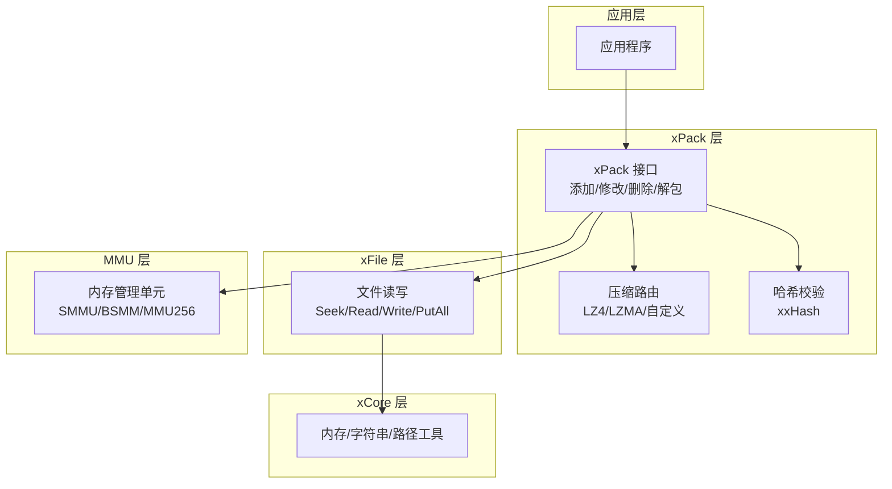
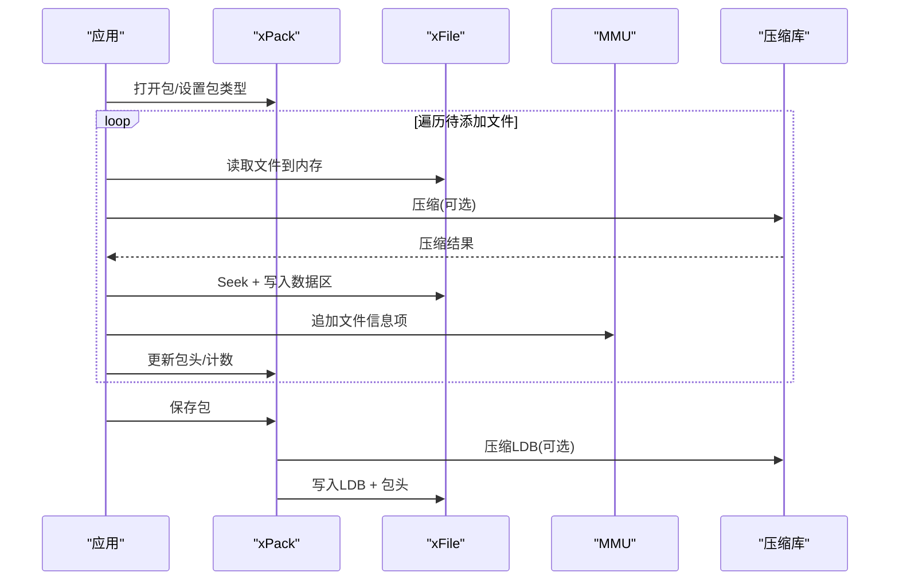
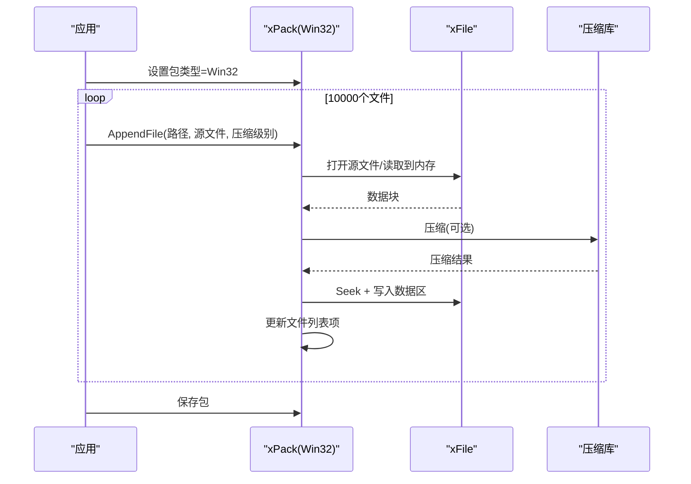
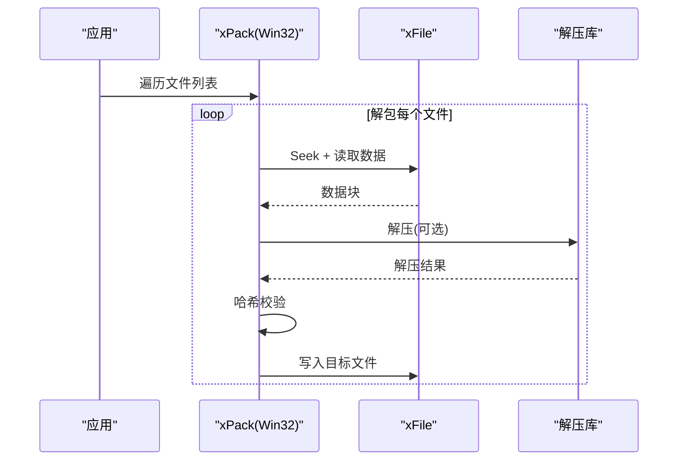
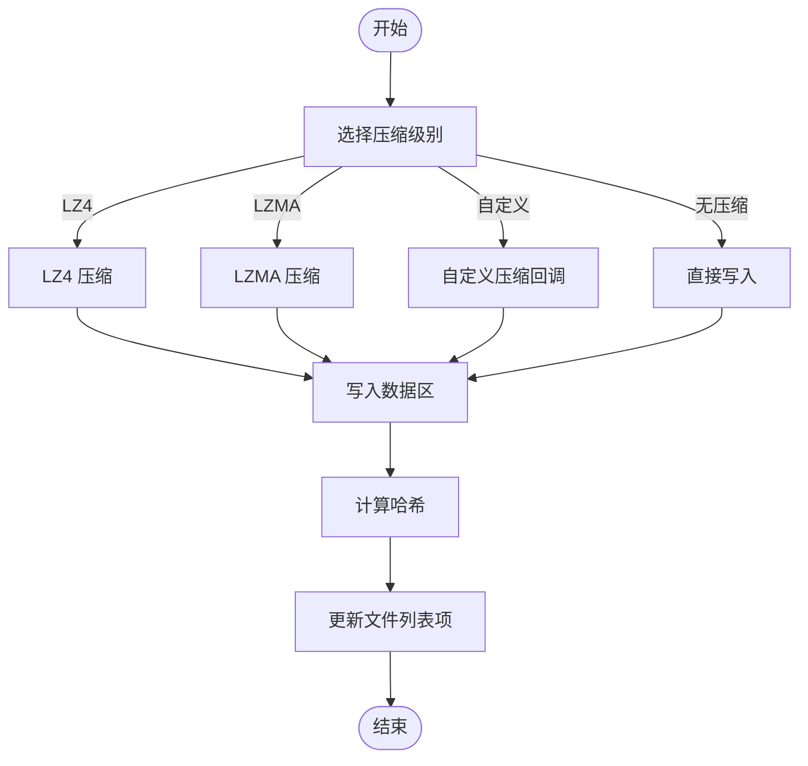
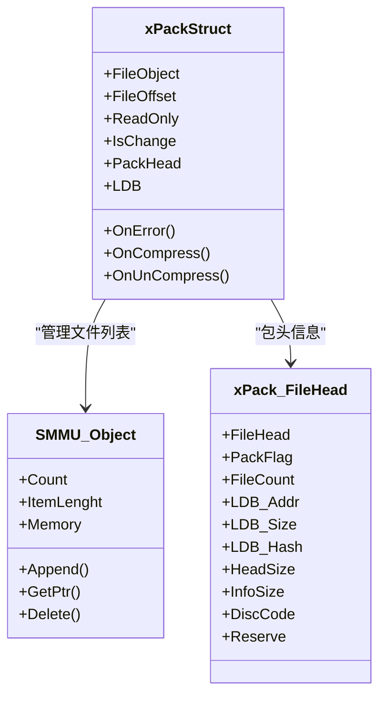
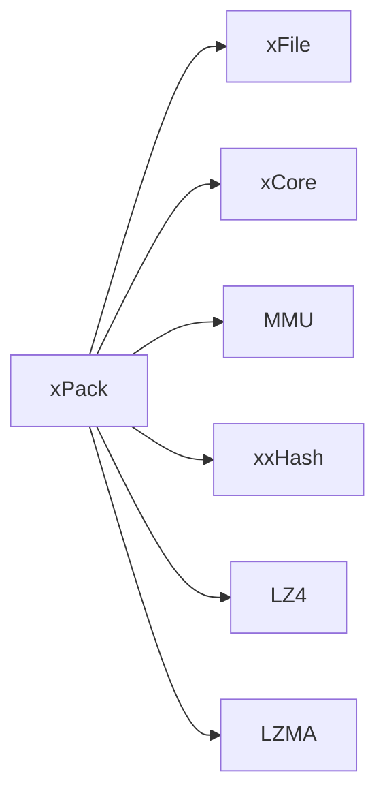

# 批量文件处理

<cite>
**本文引用的文件**
- [xPack.h](file://ver6/xpack/xPack.h)
- [xPack.c](file://ver6/xpack/xPack.c)
- [xFile.h](file://ver6/xFile/xFile.h)
- [xCore.h](file://ver6/xCore/xCore.h)
- [mmu.h](file://ver6/mmu/mmu.h)
- [xxhash.h](file://ver6/xxhash32/xxhash.h)
- [test.c](file://ver6/xpack/test.c)
- [build_TCC_DLL_x64.bat](file://ver6/xpack/build_TCC_DLL_x64.bat)
</cite>

## 目录
1. [简介](#简介)
2. [项目结构](#项目结构)
3. [核心组件](#核心组件)
4. [架构总览](#架构总览)
5. [详细组件分析](#详细组件分析)
6. [依赖关系分析](#依赖关系分析)
7. [性能考量](#性能考量)
8. [故障排查指南](#故障排查指南)
9. [结论](#结论)
10. [附录](#附录)

## 简介
本技术文档围绕“批量文件处理”主题，基于仓库中的 xPack 模块，系统阐述如何高效处理大量文件（例如 10000 个文件）的完整实现方案。文档涵盖：
- 批量添加与解包的 Win32 模式实现细节
- 性能优化策略：内存管理、I/O 优化、压缩选择
- 错误处理与异常情况处理
- 性能指标与瓶颈识别方法
- 最佳实践与常见问题解决方案

## 项目结构
该仓库采用模块化设计，核心模块如下：
- xPack：压缩包封装与文件增删改查接口
- xFile：跨平台文件 I/O 操作
- xCore：通用运行时与工具函数
- MMU：内存管理单元（内存池、结构体数组等）
- xxHash：轻量级哈希算法
- 测试样例：演示不同模式下的批量操作

图表来源
- [xPack.c](file://ver6/xpack/xPack.c#L1-L800)
- [xFile.h](file://ver6/xFile/xFile.h#L60-L150)
- [xCore.h](file://ver6/xCore/xCore.h#L405-L450)
- [mmu.h](file://ver6/mmu/mmu.h#L300-L450)

章节来源
- [xPack.h](file://ver6/xpack/xPack.h#L1-L252)
- [xPack.c](file://ver6/xpack/xPack.c#L1-L800)
- [xFile.h](file://ver6/xFile/xFile.h#L1-L202)
- [xCore.h](file://ver6/xCore/xCore.h#L1-L450)
- [mmu.h](file://ver6/mmu/mmu.h#L1-L800)

## 核心组件
- 压缩包对象与文件信息结构
  - 包头、文件信息头、扩展字段
  - 支持 Core/Index/Linux/Win32 四种模式
- 批量添加与解包
  - Core 模式：顺序追加与解包
  - Index 模式：按索引无序添加与解包
  - Win32 模式：Windows 文件系统兼容，带路径与属性
- 压缩与解压
  - LZ4 快速压缩、LZMA 高压缩比、自定义压缩
  - 解压时自动进行哈希校验
- 内存与 I/O
  - 使用 MMU 结构体数组管理文件列表
  - 文件数据直接写入包文件，减少中间拷贝

章节来源
- [xPack.h](file://ver6/xpack/xPack.h#L22-L84)
- [xPack.c](file://ver6/xpack/xPack.c#L451-L664)
- [xFile.h](file://ver6/xFile/xFile.h#L60-L150)
- [mmu.h](file://ver6/mmu/mmu.h#L293-L353)

## 架构总览
xPack 的批量处理流程如下：
- 打开/创建包文件，读取/写入包头与文件列表
- 逐个文件读取到内存，按配置压缩，写入包文件数据区
- 更新文件列表项（数据地址、大小、哈希、压缩标志）
- 保存时计算 LDB 哈希，可选压缩 LDB 列表，写回包头

图表来源
- [xPack.c](file://ver6/xpack/xPack.c#L163-L203)
- [xPack.c](file://ver6/xpack/xPack.c#L451-L494)
- [xPack.c](file://ver6/xpack/xPack.c#L511-L515)
- [xFile.h](file://ver6/xFile/xFile.h#L69-L100)
- [mmu.h](file://ver6/mmu/mmu.h#L300-L353)

## 详细组件分析

### 组件一：批量添加（Win32 模式）
- 实现要点
  - 设置包类型为 Win32
  - 逐个调用 Win32 模式添加接口，传入完整路径与源文件
  - 数据区写入后，文件列表项记录路径、哈希、压缩标志等
- 并发与性能
  - 当前实现为顺序添加，适合稳定可靠场景
  - 对于 10000 个文件，建议结合外部线程池与队列，分批提交，避免阻塞主线程
- 错误处理
  - 文件打开失败、读取失败、写入失败、Seek 失败均有明确错误码与回调通知

图表来源
- [xPack.c](file://ver6/xpack/xPack.c#L114-L159)
- [xPack.c](file://ver6/xpack/xPack.c#L451-L494)
- [xPack.c](file://ver6/xpack/xPack.c#L790-L840)
- [test.c](file://ver6/xpack/test.c#L152-L252)

章节来源
- [xPack.h](file://ver6/xpack/xPack.h#L233-L249)
- [xPack.c](file://ver6/xpack/xPack.c#L790-L840)
- [test.c](file://ver6/xpack/test.c#L152-L252)

### 组件二：批量解包（Win32 模式）
- 实现要点
  - 通过文件列表项获取目标路径与数据信息
  - 读取压缩数据，必要时解压，进行哈希校验
  - 输出到目标路径，自动创建目录
- 并发与性能
  - 解包过程同样为顺序执行，建议多线程并行解包，注意磁盘写入顺序与冲突
- 错误处理
  - 解压失败、哈希不一致、写入失败均触发错误回调

图表来源
- [xPack.c](file://ver6/xpack/xPack.c#L582-L654)
- [xFile.h](file://ver6/xFile/xFile.h#L69-L100)
- [xPack.h](file://ver6/xpack/xPack.h#L71-L84)

章节来源
- [xPack.c](file://ver6/xpack/xPack.c#L582-L654)
- [xPack.h](file://ver6/xpack/xPack.h#L71-L84)

### 组件三：压缩与哈希
- 压缩策略
  - LZ4：快速压缩，适合大文本/日志类文件
  - LZMA：高压缩比，适合体积敏感场景
  - 自定义压缩：通过回调注入
- 哈希校验
  - 使用 xxHash 对压缩前后数据进行校验，确保完整性
- 性能影响
  - 压缩级别越高，CPU 占用越大；LZMA 显著优于 LZ4 的压缩率但速度较慢

图表来源
- [xPack.c](file://ver6/xpack/xPack.c#L54-L101)
- [xPack.c](file://ver6/xpack/xPack.c#L103-L159)
- [xxhash.h](file://ver6/xxhash32/xxhash.h#L1-L2)

章节来源
- [xPack.c](file://ver6/xpack/xPack.c#L54-L101)
- [xPack.c](file://ver6/xpack/xPack.c#L103-L159)
- [xxhash.h](file://ver6/xxhash32/xxhash.h#L1-L2)

### 组件四：内存管理与文件列表
- 文件列表采用结构体数组（SMMU），支持动态扩容
- 数据区连续写入，避免碎片化
- 保存时可选择压缩 LDB 列表，进一步减小包头尺寸

图表来源
- [xPack.h](file://ver6/xpack/xPack.h#L98-L109)
- [xPack.h](file://ver6/xpack/xPack.h#L22-L34)
- [mmu.h](file://ver6/mmu/mmu.h#L300-L353)

章节来源
- [xPack.h](file://ver6/xpack/xPack.h#L98-L109)
- [mmu.h](file://ver6/mmu/mmu.h#L300-L353)

## 依赖关系分析
- 模块耦合
  - xPack 依赖 xFile（I/O）、xCore（内存/工具）、MMU（内存管理）、xxHash（哈希）、压缩库（LZ4/LZMA）
  - 低耦合：压缩策略可通过回调注入，便于扩展
- 外部依赖
  - Windows API（文件句柄、路径等）
  - 第三方压缩库（LZ4/LZMA）

图表来源
- [xPack.c](file://ver6/xpack/xPack.c#L9-L27)
- [xPack.h](file://ver6/xpack/xPack.h#L98-L109)

章节来源
- [xPack.c](file://ver6/xpack/xPack.c#L9-L27)
- [xPack.h](file://ver6/xpack/xPack.h#L98-L109)

## 性能考量
- 内存管理
  - 使用结构体数组（SMMU）减少频繁 malloc/free，提高缓存局部性
  - 压缩失败回退到无压缩，避免额外内存分配
- I/O 优化
  - 连续写入数据区，减少随机写
  - 保存时一次性写入 LDB 与包头，避免多次 Seek
- 压缩策略
  - 大量小文件建议使用 LZ4，兼顾速度与压缩率
  - 大文件或长期存储建议 LZMA
- 并发处理
  - 建议使用线程池分批处理，避免单线程阻塞
  - 注意磁盘写入顺序与锁竞争，可采用队列+异步写入
- 指标与瓶颈
  - CPU：压缩阶段（LZ4/LZMA）
  - I/O：磁盘写入（数据区 + LDB + 包头）
  - 内存：压缩缓冲区与文件列表
  - 建议监控：吞吐量、CPU 利用率、磁盘写入速率、内存峰值

章节来源
- [xPack.c](file://ver6/xpack/xPack.c#L163-L203)
- [xPack.c](file://ver6/xpack/xPack.c#L451-L494)
- [mmu.h](file://ver6/mmu/mmu.h#L300-L353)

## 故障排查指南
- 常见错误与定位
  - 文件无法访问/格式不正确：检查路径与权限
  - 内存申请失败：检查可用内存与压缩缓冲区大小
  - 文件列表读取/写入失败：检查磁盘空间与文件句柄
  - 哈希校验失败：确认压缩/解压流程与数据完整性
- 错误回调
  - 通过 OnError 回调统一处理，便于日志与告警
- 建议流程
  - 打开包 → 设置包类型 → 批量添加/解包 → 保存 → 关闭
  - 每步检查返回值与错误码，及时中断并清理资源

章节来源
- [xPack.c](file://ver6/xpack/xPack.c#L35-L53)
- [xPack.c](file://ver6/xpack/xPack.c#L205-L216)

## 结论
xPack 提供了稳定高效的批量文件处理能力，尤其在 Win32 模式下能够满足大规模文件打包与解包的需求。通过合理的内存管理、I/O 优化与压缩策略选择，可在保证数据安全的前提下显著提升吞吐量。对于 10000 个文件的批量处理，建议结合线程池与异步写入，配合监控指标持续优化性能。

## 附录
- 构建脚本
  - xPack 动态库构建脚本示例，包含依赖库链接
- 示例程序
  - test.c 展示了 Core/Index/Win32 三种模式的批量添加与解包示例，包含 Win32 模式下 10000 个文件的批量添加演示

章节来源
- [build_TCC_DLL_x64.bat](file://ver6/xpack/build_TCC_DLL_x64.bat#L1-L7)
- [test.c](file://ver6/xpack/test.c#L1-L278)