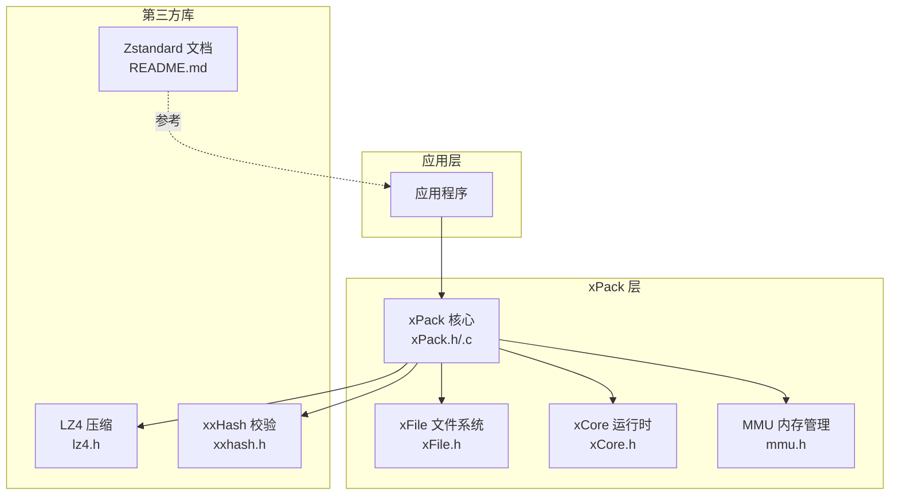
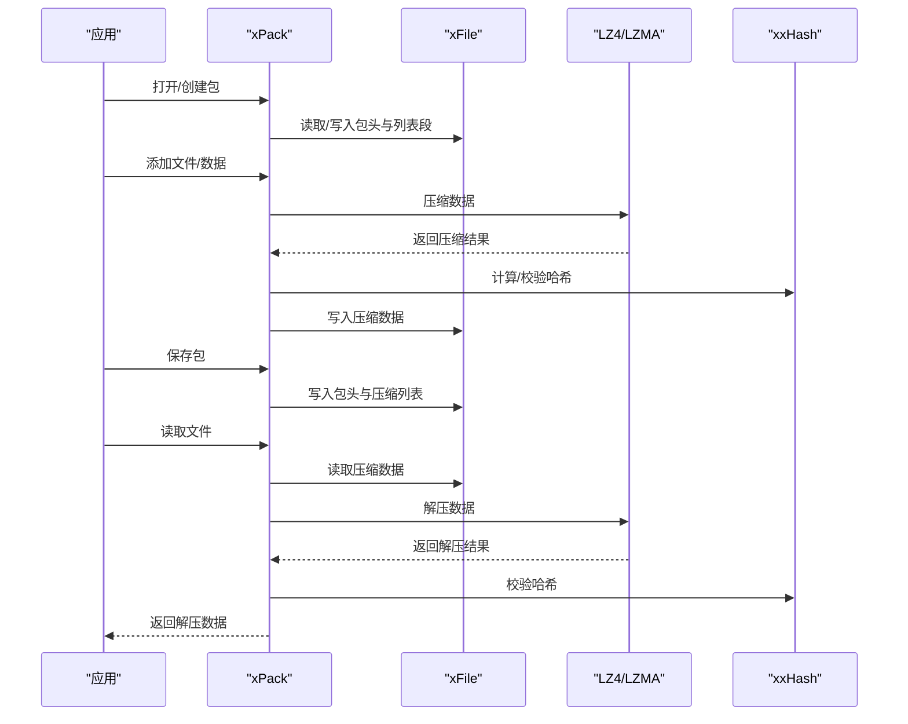
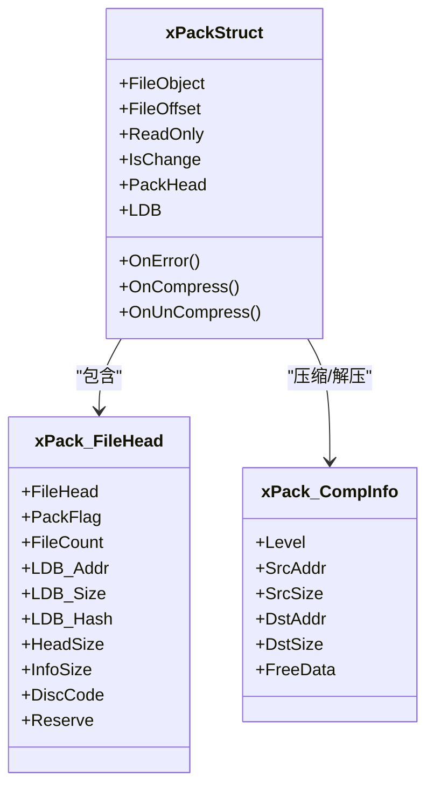
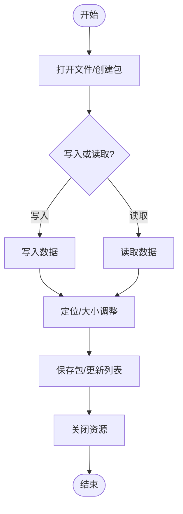
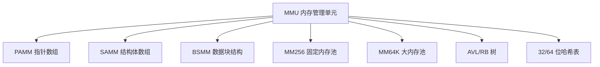
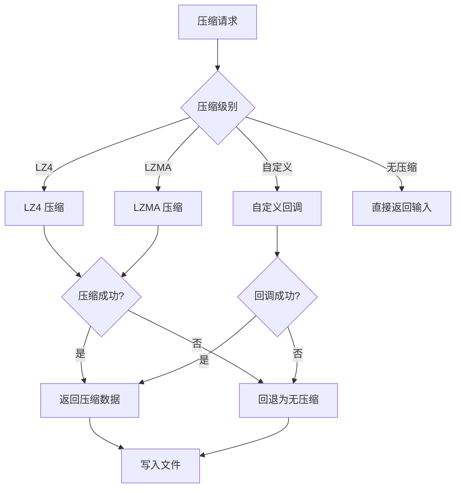
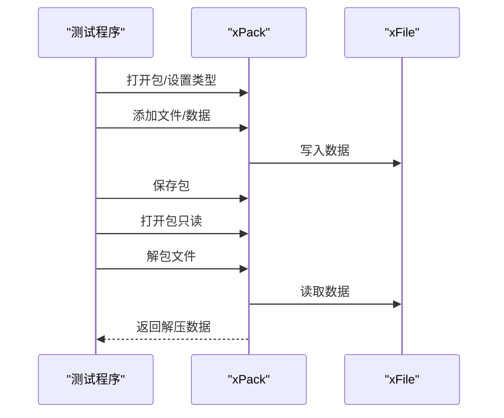
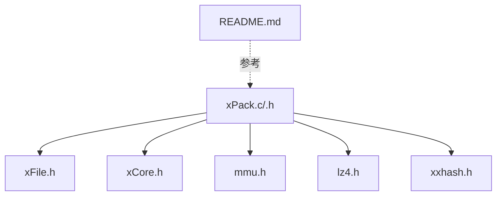

# 系统集成最佳实践

<cite>
**本文档引用的文件**
- [xPack.h](file://ver6/xpack/xPack.h)
- [xPack.c](file://ver6/xpack/xPack.c)
- [mmu.h](file://ver6/mmu/mmu.h)
- [xFile.h](file://ver6/xFile/xFile.h)
- [xCore.h](file://ver6/xCore/xCore.h)
- [xxhash.h](file://ver6/xxhash32/xxhash.h)
- [lz4.h](file://lib/lz4/lz4.h)
- [test.c](file://ver6/xpack/test.c)
- [readme_cn.md](file://ver6/mmu/readme_cn.md)
- [README.md](file://lib/zstd/README.md)
</cite>

## 目录
1. [简介](#简介)
2. [项目结构](#项目结构)
3. [核心组件](#核心组件)
4. [架构概览](#架构概览)
5. [详细组件分析](#详细组件分析)
6. [依赖关系分析](#依赖关系分析)
7. [性能考量](#性能考量)
8. [故障排除指南](#故障排除指南)
9. [结论](#结论)
10. [附录](#附录)

## 简介
本指南面向希望将 xPack 系统集成到现有应用中的开发者，涵盖文件系统、数据库与网络服务的集成策略，跨平台兼容性与版本冲突处理，以及安全与性能优化建议。文档基于仓库中的源码与测试示例，提供可操作的集成步骤、架构设计建议与常见问题排查方法。

## 项目结构
xPack 采用模块化设计，核心模块包括：
- xPack：压缩包管理与文件读写接口
- xFile：跨平台文件系统抽象
- xCore：基础运行时与工具函数
- MMU：高性能内存管理单元
- 第三方压缩库：LZ4、LZMA（通过宏条件编译集成）

**图表来源**
- [xPack.h](file://ver6/xpack/xPack.h#L1-L252)
- [xPack.c](file://ver6/xpack/xPack.c#L1-L300)
- [xFile.h](file://ver6/xFile/xFile.h#L1-L202)
- [xCore.h](file://ver6/xCore/xCore.h#L1-L450)
- [mmu.h](file://ver6/mmu/mmu.h#L1-L200)
- [lz4.h](file://lib/lz4/lz4.h#L1-L200)
- [xxhash.h](file://ver6/xxhash32/xxhash.h#L1-L2)

**章节来源**
- [xPack.h](file://ver6/xpack/xPack.h#L1-L252)
- [xPack.c](file://ver6/xpack/xPack.c#L1-L300)
- [xFile.h](file://ver6/xFile/xFile.h#L1-L202)
- [xCore.h](file://ver6/xCore/xCore.h#L1-L450)
- [mmu.h](file://ver6/mmu/mmu.h#L1-L200)
- [lz4.h](file://lib/lz4/lz4.h#L1-L200)
- [xxhash.h](file://ver6/xxhash32/xxhash.h#L1-L2)

## 核心组件
- xPack：提供压缩包的创建、读取、修改与保存，支持多种包类型（Core/Index/Linux/Win32），内置压缩路由与自定义压缩回调。
- xFile：统一的文件系统抽象，支持编码转换、路径操作、网络路径识别与批量扫描。
- xCore：基础运行时，提供字符串处理、路径解析、时间与随机数、进程与系统信息等。
- MMU：高性能内存管理单元，提供多种内存池与数据结构管理器，减少频繁分配与释放带来的性能损耗。
- 第三方库：LZ4 用于快速压缩，xxHash 用于数据完整性校验，Zstandard 提供参考的构建与多线程配置选项。

**章节来源**
- [xPack.h](file://ver6/xpack/xPack.h#L98-L252)
- [xPack.c](file://ver6/xpack/xPack.c#L54-L203)
- [xFile.h](file://ver6/xFile/xFile.h#L25-L202)
- [xCore.h](file://ver6/xCore/xCore.h#L412-L450)
- [mmu.h](file://ver6/mmu/mmu.h#L107-L200)
- [lz4.h](file://lib/lz4/lz4.h#L176-L226)
- [xxhash.h](file://ver6/xxhash32/xxhash.h#L1-L2)

## 架构概览
xPack 的核心流程围绕“包对象”展开：打开/创建包、设置包类型与扩展字段、添加/修改/删除文件、保存包头与列表段、按需解压与校验。文件读写通过 xFile 抽象，压缩/解压通过 LZ4/LZMA 路由，数据完整性通过 xxHash 校验。

**图表来源**
- [xPack.c](file://ver6/xpack/xPack.c#L163-L203)
- [xPack.c](file://ver6/xpack/xPack.c#L218-L302)
- [xPack.c](file://ver6/xpack/xPack.c#L451-L515)
- [xPack.c](file://ver6/xpack/xPack.c#L582-L654)
- [lz4.h](file://lib/lz4/lz4.h#L176-L226)
- [xxhash.h](file://ver6/xxhash32/xxhash.h#L1-L2)

**章节来源**
- [xPack.c](file://ver6/xpack/xPack.c#L163-L203)
- [xPack.c](file://ver6/xpack/xPack.c#L218-L302)
- [xPack.c](file://ver6/xpack/xPack.c#L451-L515)
- [xPack.c](file://ver6/xpack/xPack.c#L582-L654)

## 详细组件分析

### xPack 压缩包管理
- 包类型与标志位：支持 Core/Index/Linux/Win32 四种包类型，通过标志位控制压缩列表段的压缩方式与扩展字段长度。
- 文件信息结构：包含数据位置、大小、解压后大小、哈希值与压缩标志，支持扩展字段以满足不同平台需求。
- 压缩路由：根据压缩级别选择 LZ4（快速）或 LZMA（高压缩比），失败时回退为无压缩。
- 保存与关闭：自动计算列表段哈希、写入压缩列表、更新包头，关闭时清理资源。

**图表来源**
- [xPack.h](file://ver6/xpack/xPack.h#L22-L109)
- [xPack.h](file://ver6/xpack/xPack.h#L86-L94)

**章节来源**
- [xPack.h](file://ver6/xpack/xPack.h#L22-L109)
- [xPack.c](file://ver6/xpack/xPack.c#L54-L101)
- [xPack.c](file://ver6/xpack/xPack.c#L163-L203)

### 文件系统集成（xFile）
- 编码与路径：支持多种编码（UTF-8/UTF-16/GB18030 等），提供路径拼接、相对/绝对路径转换与安全检查。
- 文件操作：统一的打开/关闭、读写、Seek、大小查询与批量扫描接口，支持网络路径识别。
- 目录与属性：创建目录、复制/移动/删除文件与目录，获取/设置属性。

**图表来源**
- [xFile.h](file://ver6/xFile/xFile.h#L59-L151)
- [xPack.c](file://ver6/xpack/xPack.c#L163-L203)

**章节来源**
- [xFile.h](file://ver6/xFile/xFile.h#L25-L202)
- [xPack.c](file://ver6/xpack/xPack.c#L163-L203)

### 内存管理（MMU）
- 模块化内存管理：提供 PAMM/SAMM/MBMU/BSMM 等多种管理器，支持固定/动态内存池与数据结构（栈、链表、树、哈希表）。
- 性能与裁剪：通过宏定义选择所需模块，避免不必要的代码膨胀；内置缓冲与回收机制提升性能。

**图表来源**
- [mmu.h](file://ver6/mmu/mmu.h#L200-L353)
- [mmu.h](file://ver6/mmu/mmu.h#L471-L620)

**章节来源**
- [mmu.h](file://ver6/mmu/mmu.h#L107-L200)
- [mmu.h](file://ver6/mmu/mmu.h#L200-L353)
- [mmu.h](file://ver6/mmu/mmu.h#L471-L620)
- [readme_cn.md](file://ver6/mmu/readme_cn.md#L1-L306)

### 压缩与校验
- 压缩选择：快速压缩（LZ4）与高压缩比（LZMA），失败时自动回退为无压缩。
- 解压流程：根据标志位选择解压算法，必要时进行字符串截断以适配文本读取。
- 校验机制：使用 xxHash 对压缩前/后数据进行一致性校验。

**图表来源**
- [xPack.c](file://ver6/xpack/xPack.c#L54-L101)
- [xPack.c](file://ver6/xpack/xPack.c#L103-L159)
- [lz4.h](file://lib/lz4/lz4.h#L176-L226)
- [xxhash.h](file://ver6/xxhash32/xxhash.h#L1-L2)

**章节来源**
- [xPack.c](file://ver6/xpack/xPack.c#L54-L101)
- [xPack.c](file://ver6/xpack/xPack.c#L103-L159)
- [lz4.h](file://lib/lz4/lz4.h#L176-L226)
- [xxhash.h](file://ver6/xxhash32/xxhash.h#L1-L2)

### 测试与集成示例
- Core/Index/Win32 模式测试：演示不同包类型的添加、解包与路径处理。
- 实际项目集成：通过测试用例了解 API 使用方式与错误处理回调。

**图表来源**
- [test.c](file://ver6/xpack/test.c#L24-L275)

**章节来源**
- [test.c](file://ver6/xpack/test.c#L24-L275)

## 依赖关系分析
- 模块耦合：xPack 依赖 xFile、xCore、MMU 与第三方压缩库；第三方库通过宏条件编译切换只读/读写版本。
- 外部依赖：LZ4/LZMA 提供压缩能力，xxHash 提供哈希校验，Zstandard 提供构建与多线程参考配置。

**图表来源**
- [xPack.c](file://ver6/xpack/xPack.c#L9-L27)
- [xPack.h](file://ver6/xpack/xPack.h#L1-L252)
- [lz4.h](file://lib/lz4/lz4.h#L1-L100)
- [xxhash.h](file://ver6/xxhash32/xxhash.h#L1-L2)
- [README.md](file://lib/zstd/README.md#L1-L269)

**章节来源**
- [xPack.c](file://ver6/xpack/xPack.c#L9-L27)
- [xPack.h](file://ver6/xpack/xPack.h#L1-L252)
- [lz4.h](file://lib/lz4/lz4.h#L1-L100)
- [xxhash.h](file://ver6/xxhash32/xxhash.h#L1-L2)
- [README.md](file://lib/zstd/README.md#L1-L269)

## 性能考量
- 压缩策略：根据场景选择 LZ4（快速）或 LZMA（高压缩比），失败时自动回退无压缩，确保稳定性。
- 内存管理：使用 MMU 的内存池与缓冲机制减少频繁分配/释放，提升吞吐量。
- I/O 优化：批量写入与 Seek 定位，避免重复磁盘寻道；列表段压缩与哈希缓存减少重复计算。
- 多线程：Zstandard 提供多线程构建选项，结合 POSIX 线程编译标志可启用多线程压缩/解压（参考 Zstandard 文档）。

**章节来源**
- [xPack.c](file://ver6/xpack/xPack.c#L54-L101)
- [mmu.h](file://ver6/mmu/mmu.h#L107-L200)
- [README.md](file://lib/zstd/README.md#L35-L56)

## 故障排除指南
- 文件访问失败：检查文件路径、编码与权限；确认 xFile 的打开/关闭流程正确。
- 格式不正确：核对包头版本与标志位，确保包类型与扩展字段设置一致。
- 内存申请失败：检查可用内存与 MMU 配置，适当调整内存池大小或裁剪模块。
- 列表读取/写入失败：确认 Seek 位置与文件大小，检查保存流程中的写入长度。
- 哈希校验失败：确认压缩/解压前后数据未被篡改，检查 xxHash 计算与比较逻辑。
- 找不到文件：核对包内文件索引或路径映射，确认包类型与查找方式匹配。

**章节来源**
- [xPack.c](file://ver6/xpack/xPack.c#L36-L53)
- [xPack.c](file://ver6/xpack/xPack.c#L163-L203)
- [xPack.c](file://ver6/xpack/xPack.c#L582-L627)

## 结论
xPack 提供了跨平台、可扩展的压缩包管理能力，结合 xFile 的文件系统抽象与 MMU 的高性能内存管理，能够在多种应用场景中实现稳定高效的集成。通过合理的压缩策略、内存管理与 I/O 优化，配合第三方库的多线程能力，可进一步提升系统性能与可靠性。建议在集成过程中关注版本兼容性、错误处理与安全校验，确保系统在生产环境中的稳定性。

## 附录
- 集成步骤建议
  - 选择包类型与扩展字段：根据目标平台（Core/Index/Linux/Win32）设置包类型与 Info/Head 扩展长度。
  - 配置压缩策略：根据性能与存储需求选择 LZ4 或 LZMA，必要时实现自定义压缩回调。
  - 集成文件系统：使用 xFile 统一处理路径、编码与网络路径，确保跨平台一致性。
  - 内存管理：引入 MMU 的内存池与数据结构，减少频繁分配/释放带来的性能损耗。
  - 错误处理：注册 OnError 回调，捕获并记录关键错误，便于诊断与恢复。
  - 安全校验：使用 xxHash 对关键数据进行哈希校验，确保数据完整性。
  - 多线程优化：参考 Zstandard 的多线程构建选项，结合 POSIX 线程编译标志启用多线程压缩/解压。

- 兼容性与版本冲突处理
  - 第三方库版本：确保 LZ4/LZMA/xxHash 版本与 xPack 接口兼容，必要时通过宏条件编译切换只读/读写版本。
  - 平台差异：针对 Windows/Linux/macOS 的路径分隔符、编码与权限差异，统一通过 xFile 抽象处理。
  - API 变更：关注第三方库的废弃 API 与可见性宏，及时迁移至稳定 API。

- 安全考虑
  - 输入验证：对文件路径与索引进行合法性检查，防止路径穿越与越界访问。
  - 权限控制：限制文件写入权限，避免在只读模式下进行写操作。
  - 数据完整性：启用哈希校验，防止数据损坏与篡改。
  - 错误隔离：通过回调与异常处理机制隔离错误，避免影响主流程。

**章节来源**
- [xPack.h](file://ver6/xpack/xPack.h#L98-L252)
- [xFile.h](file://ver6/xFile/xFile.h#L25-L202)
- [mmu.h](file://ver6/mmu/mmu.h#L107-L200)
- [lz4.h](file://lib/lz4/lz4.h#L176-L226)
- [xxhash.h](file://ver6/xxhash32/xxhash.h#L1-L2)
- [README.md](file://lib/zstd/README.md#L35-L56)