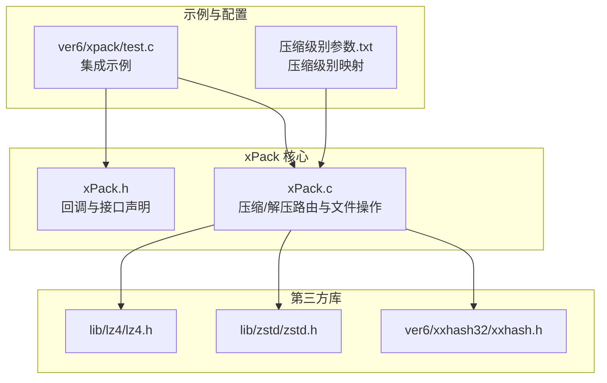
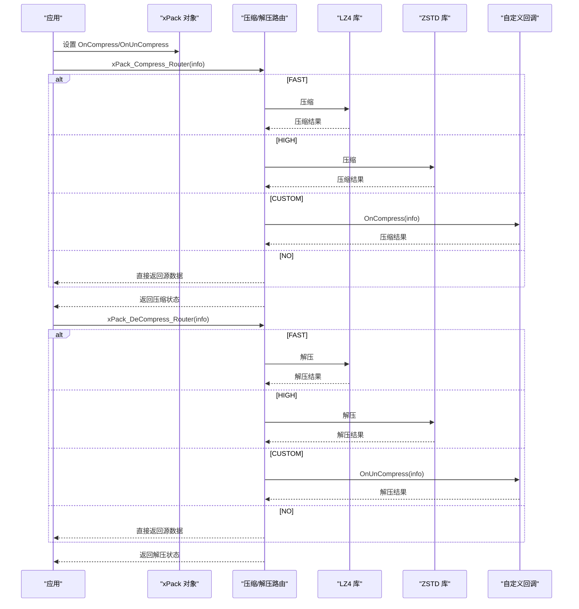
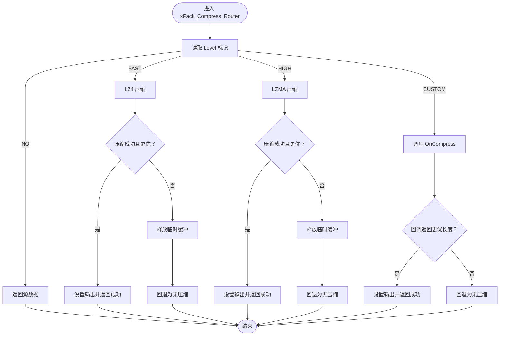
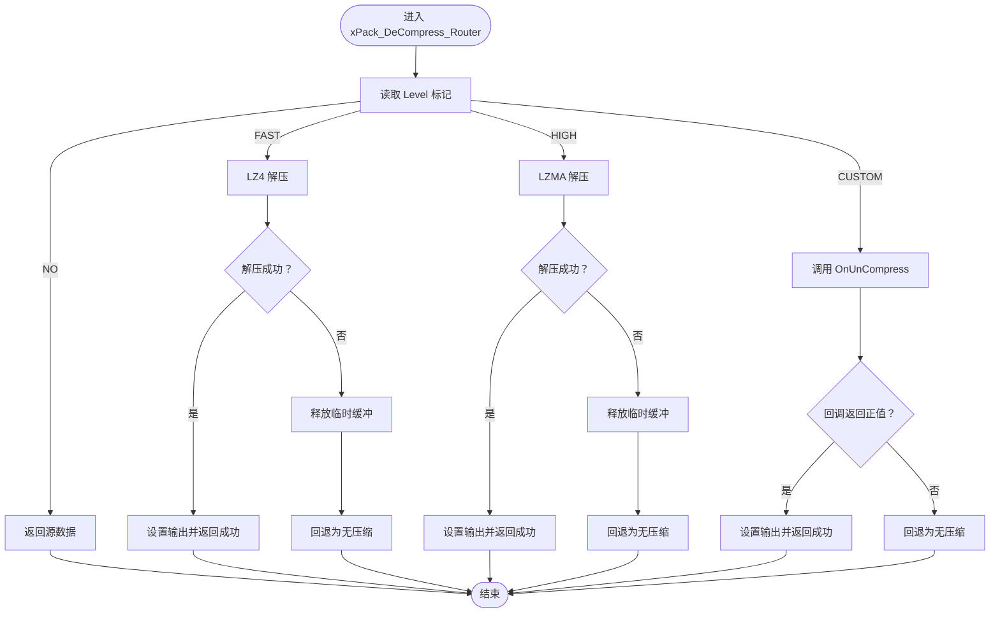
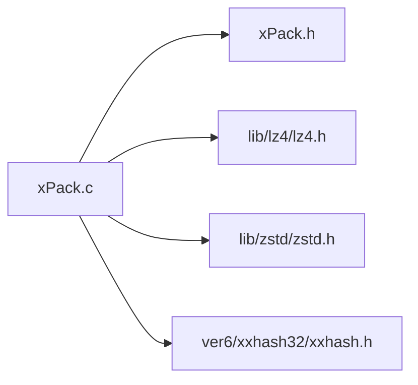

# 自定义压缩算法集成

<cite>
**本文引用的文件**
- [xPack.h](file://ver6/xpack/xPack.h)
- [xPack.c](file://ver6/xpack/xPack.c)
- [xxhash.h](file://ver6/xxhash32/xxhash.h)
- [lz4.h](file://lib/lz4/lz4.h)
- [zstd.h](file://lib/zstd/zstd.h)
- [压缩级别参数.txt](file://压缩级别参数.txt)
- [test.c](file://ver6/xpack/test.c)
</cite>

## 目录
1. [简介](#简介)
2. [项目结构](#项目结构)
3. [核心组件](#核心组件)
4. [架构总览](#架构总览)
5. [详细组件分析](#详细组件分析)
6. [依赖关系分析](#依赖关系分析)
7. [性能考量与选择策略](#性能考量与选择策略)
8. [故障排查指南](#故障排查指南)
9. [结论](#结论)
10. [附录](#附录)

## 简介
本文件面向希望在 xPack 框架中集成自定义压缩算法的开发者，系统性阐述如何通过回调函数实现自定义压缩与解压流程，覆盖接口定义、参数传递、返回值处理、第三方库集成、性能对比与选择策略，并提供可复用的实现思路与测试参考。

## 项目结构
围绕自定义压缩算法集成的关键模块如下：
- xPack 核心接口与回调声明：位于 xPack.h
- 压缩/解压路由与文件打包逻辑：位于 xPack.c
- 哈希与第三方压缩库头文件：xxhash.h、lz4.h、zstd.h
- 压缩级别映射与策略参考：压缩级别参数.txt
- 示例测试程序：ver6/xpack/test.c

图表来源
- [xPack.h](file://ver6/xpack/xPack.h#L99-L109)
- [xPack.c](file://ver6/xpack/xPack.c#L54-L159)
- [lz4.h](file://lib/lz4/lz4.h#L177-L200)
- [zstd.h](file://lib/zstd/zstd.h#L154-L174)
- [xxhash.h](file://ver6/xxhash32/xxhash.h#L1-L2)
- [压缩级别参数.txt](file://压缩级别参数.txt#L40-L70)
- [test.c](file://ver6/xpack/test.c#L19-L278)

章节来源
- [xPack.h](file://ver6/xpack/xPack.h#L99-L109)
- [xPack.c](file://ver6/xpack/xPack.c#L54-L159)
- [lz4.h](file://lib/lz4/lz4.h#L177-L200)
- [zstd.h](file://lib/zstd/zstd.h#L154-L174)
- [xxhash.h](file://ver6/xxhash32/xxhash.h#L1-L2)
- [压缩级别参数.txt](file://压缩级别参数.txt#L40-L70)
- [test.c](file://ver6/xpack/test.c#L19-L278)

## 核心组件
- 回调函数结构
  - OnCompress：自定义压缩回调，接收 xPack_CompInfo，返回压缩后长度；若小于源长度则视为成功。
  - OnUnCompress：自定义解压回调，接收 xPack_CompInfo，返回解压后长度；成功时大于 0。
- 压缩路由
  - 支持 FAST（LZ4）、HIGH（LZMA）、CUSTOM（自定义）、NO（无压缩）四种模式。
  - 当选择 CUSTOM 且存在回调时，由回调负责压缩；否则回退为无压缩。
- 解压路由
  - 同样支持 FAST/HIGH/CUSTOM/NO；CUSTOM 模式下由 OnUnCompress 完成解压。
- 文件打包与保存
  - 保存时会根据压缩结果更新包头标志位，决定 LDB 段是否压缩及压缩算法类型。

章节来源
- [xPack.h](file://ver6/xpack/xPack.h#L86-L109)
- [xPack.c](file://ver6/xpack/xPack.c#L54-L159)
- [xPack.c](file://ver6/xpack/xPack.c#L163-L203)

## 架构总览
xPack 在压缩/解压阶段通过统一的 xPack_CompInfo 结构传递数据，路由层根据压缩级别选择内置算法或调用自定义回调。文件操作层负责将压缩后的数据写入包文件，并维护 LDB 列表段的压缩状态。

图表来源
- [xPack.c](file://ver6/xpack/xPack.c#L54-L159)
- [lz4.h](file://lib/lz4/lz4.h#L177-L200)
- [zstd.h](file://lib/zstd/zstd.h#L154-L174)

## 详细组件分析

### 回调接口与数据结构
- xPack_CompInfo 字段
  - Level：压缩级别（含 CUSTOM 标记）
  - SrcAddr/SrcSize：输入数据地址与长度
  - DstAddr/DstSize：输出缓冲区地址与长度（解压时 DstSize 为期望长度）
  - FreeData：指示返回数据是否可安全释放
- 回调约定
  - OnCompress：成功返回压缩后长度；若返回值小于 SrcSize 则认为压缩有效。
  - OnUnCompress：成功返回解压后长度；若返回值大于 0 则认为解压有效。
  - 若回调未设置或返回失败，路由层将回退为无压缩（压缩）或直接返回源数据（解压）。

章节来源
- [xPack.h](file://ver6/xpack/xPack.h#L86-L109)
- [xPack.c](file://ver6/xpack/xPack.c#L54-L101)
- [xPack.c](file://ver6/xpack/xPack.c#L104-L159)

### 压缩路由实现要点
- FAST（LZ4）
  - 使用 LZ4_compressBound 计算上限，分配输出缓冲区，调用 LZ4_compress_default。
  - 成功且压缩率更优时，设置 DstAddr/DstSize/FreeData 并返回成功。
- HIGH（LZMA）
  - 分配与源等大的输出缓冲区，调用 Lzma_Compress。
  - 成功且压缩率更优时，设置返回值并释放临时缓冲。
- CUSTOM
  - 若存在 OnCompress，调用回调；成功条件同上。
  - 否则回退为无压缩。
- NO
  - 直接返回源数据，FreeData 设为 FALSE。

图表来源
- [xPack.c](file://ver6/xpack/xPack.c#L54-L101)

章节来源
- [xPack.c](file://ver6/xpack/xPack.c#L54-L101)

### 解压路由实现要点
- FAST/HIGH：分别调用 LZ4_decompress_safe 或 Lzma_Uncompress，成功后设置 DstAddr/DstSize/FreeData，并在必要时进行字符串截断以适配文本读取。
- CUSTOM：调用 OnUnCompress，成功返回正值即视为成功。
- NO：直接返回源数据，FreeData 设为 FALSE。

图表来源
- [xPack.c](file://ver6/xpack/xPack.c#L104-L159)

章节来源
- [xPack.c](file://ver6/xpack/xPack.c#L104-L159)

### 文件打包与 LDB 压缩
- 保存时默认使用 HIGH（LZMA）压缩 LDB 列表段，并根据压缩结果更新包头标志位（是否压缩、压缩算法类型）。
- 打开时若检测到 LDB 已压缩，会按标志位选择对应算法解压列表。

章节来源
- [xPack.c](file://ver6/xpack/xPack.c#L163-L203)
- [xPack.c](file://ver6/xpack/xPack.c#L269-L294)

### 第三方压缩库集成指南
- 集成 LZ4
  - 引入头文件：lib/lz4/lz4.h
  - 路由中已包含 LZ4_compressBound、LZ4_compress_default、LZ4_decompress_safe 的使用示例
- 集成 ZSTD
  - 引入头文件：lib/zstd/zstd.h
  - 路由中已包含 ZSTD_compress、ZSTD_decompress 的使用示例
- 集成自定义算法
  - 在 xPack 对象中设置 OnCompress/OnUnCompress 回调
  - 回调内部负责：
    - 依据 Level 参数选择具体压缩等级或参数
    - 分配输出缓冲区（或复用输入缓冲区，视算法而定）
    - 执行压缩/解压并返回长度
    - 管理内存生命周期（FreeData 标记）

章节来源
- [xPack.c](file://ver6/xpack/xPack.c#L16-L27)
- [lz4.h](file://lib/lz4/lz4.h#L177-L200)
- [zstd.h](file://lib/zstd/zstd.h#L154-L174)
- [xPack.h](file://ver6/xpack/xPack.h#L107-L108)

### 实现自定义压缩算法步骤
- 步骤一：定义回调函数
  - 压缩回调：OnCompress(xPackObject, xPack_CompInfo*)
  - 解压回调：OnUnCompress(xPackObject, xPack_CompInfo*)
- 步骤二：在对象初始化后设置回调
  - xpk->OnCompress = your_compress_cb
  - xpk->OnUnCompress = your_uncompress_cb
- 步骤三：在回调中处理参数与返回值
  - 依据 Level 选择算法参数
  - 分配/复用输出缓冲区
  - 执行压缩/解压，返回长度
  - 设置 FreeData（若返回数据非源数据副本）
- 步骤四：在文件操作中使用 CUSTOM 级别
  - 添加/修改文件时传入 XPK_COMP_CUSTOM
  - 路由层将调用你的回调

章节来源
- [xPack.h](file://ver6/xpack/xPack.h#L86-L109)
- [xPack.c](file://ver6/xpack/xPack.c#L85-L92)
- [xPack.c](file://ver6/xpack/xPack.c#L143-L150)

### 测试用例与示例参考
- 示例程序展示了不同模式（Core/Index/Win32）下的添加与解包流程，可作为自定义压缩集成的参考模板。
- 建议在测试中：
  - 先以 NO/FAST/HIGH 验证基本流程
  - 再接入 CUSTOM 回调，逐步替换压缩算法
  - 对比压缩率与性能，调整算法参数

章节来源
- [test.c](file://ver6/xpack/test.c#L19-L278)

## 依赖关系分析
- 内部依赖
  - xPack.c 依赖 xPack.h 中的结构与回调声明
  - 路由层依赖第三方压缩库头文件（LZ4/ZSTD）进行压缩/解压
  - 保存流程依赖 xxHash 进行 LDB 列表段哈希校验
- 外部依赖
  - LZ4：lib/lz4/lz4.h
  - ZSTD：lib/zstd/zstd.h
  - xxHash：ver6/xxhash32/xxhash.h

图表来源
- [xPack.c](file://ver6/xpack/xPack.c#L9-L27)
- [xPack.h](file://ver6/xpack/xPack.h#L99-L109)

章节来源
- [xPack.c](file://ver6/xpack/xPack.c#L9-L27)
- [xPack.h](file://ver6/xpack/xPack.h#L99-L109)

## 性能考量与选择策略
- 压缩级别映射与建议
  - 参考压缩级别参数.txt 中的映射表，结合业务场景选择合适级别：
    - 实时加载类资源：优先 FAST（LZ4）或 CUSTOM（低延迟）
    - 一般应用：默认级别（如 ZSTD 6）
    - 软件分发包：较高压缩比（ZSTD 8-10）
    - 数据归档：追求压缩比（ZSTD 12-15）
    - 已压缩文件（如图片/音频）：避免重复压缩（NO）
- 性能指标参考
  - 压缩级别参数.txt 提供了典型压缩比与吞吐量参考，便于在速度与压缩比之间权衡
- 最佳实践
  - 对小文件优先考虑 LZ4；对大文件或静态资源优先考虑 ZSTD
  - 自定义算法应提供稳定的内存管理与错误处理
  - 在 CUSTOM 回调中尽量避免不必要的内存拷贝，提升吞吐

章节来源
- [压缩级别参数.txt](file://压缩级别参数.txt#L20-L38)
- [压缩级别参数.txt](file://压缩级别参数.txt#L40-L70)

## 故障排查指南
- 常见错误码与定位
  - 文件无法访问、格式不正确、内存申请失败、列表读取/写入失败、包类型不匹配、文件哈希校验失败等
  - 路由层通过 OnError 回调输出错误文本，便于定位问题
- 回调失败回退
  - 自定义压缩/解压失败时，路由层会回退为无压缩（压缩）或直接返回源数据（解压），确保流程可用
- 建议排查步骤
  - 检查 OnError 回调输出
  - 确认 Level 与算法匹配
  - 校验回调返回值与缓冲区长度
  - 验证 LDB 哈希一致性（保存/打开时）

章节来源
- [xPack.c](file://ver6/xpack/xPack.c#L36-L53)
- [xPack.c](file://ver6/xpack/xPack.c#L54-L101)
- [xPack.c](file://ver6/xpack/xPack.c#L104-L159)
- [xPack.c](file://ver6/xpack/xPack.c#L163-L203)

## 结论
通过回调机制，xPack 为自定义压缩算法提供了清晰、可扩展的集成点。开发者只需在 xPack 对象中设置 OnCompress/OnUnCompress，即可无缝接入任意第三方压缩库或自研算法。配合压缩级别映射与性能参考，可在速度与压缩比之间找到最优平衡，满足从实时加载到归档存储的多样化需求。

## 附录
- 快速对照表
  - 压缩级别常量：XPK_COMP_NO、XPK_COMP_FAST、XPK_COMP_HIGH、XPK_COMP_CUSTOM
  - 回调设置：xpk->OnCompress、xpk->OnUnCompress
  - 文件操作：Core/Index/Win32 模式下的添加/修改/解包接口
- 参考实现路径
  - 路由与回调：[xPack.c](file://ver6/xpack/xPack.c#L54-L159)
  - 接口与回调声明：[xPack.h](file://ver6/xpack/xPack.h#L86-L109)
  - LZ4 接口：[lz4.h](file://lib/lz4/lz4.h#L177-L200)
  - ZSTD 接口：[zstd.h](file://lib/zstd/zstd.h#L154-L174)
  - 哈希接口：[xxhash.h](file://ver6/xxhash32/xxhash.h#L1-L2)
  - 示例测试：[test.c](file://ver6/xpack/test.c#L19-L278)