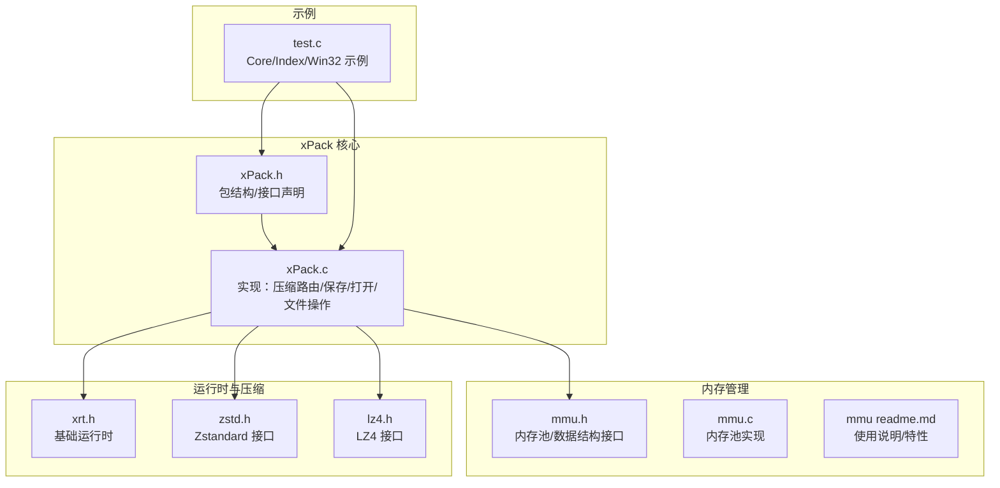
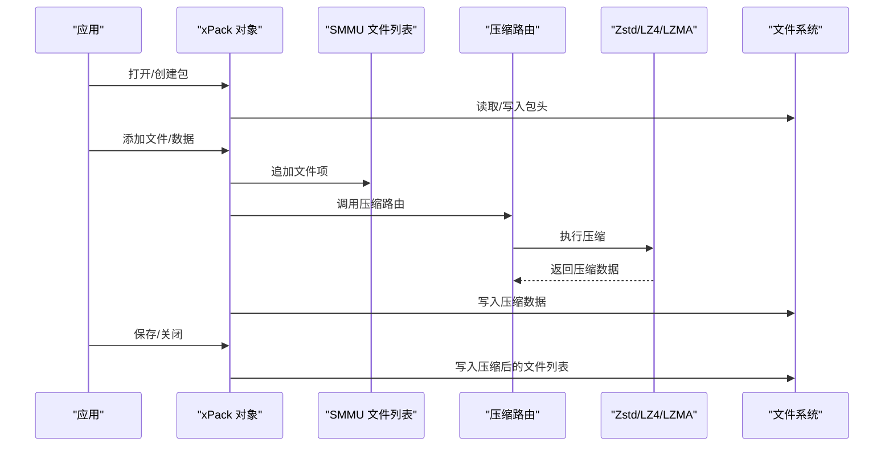
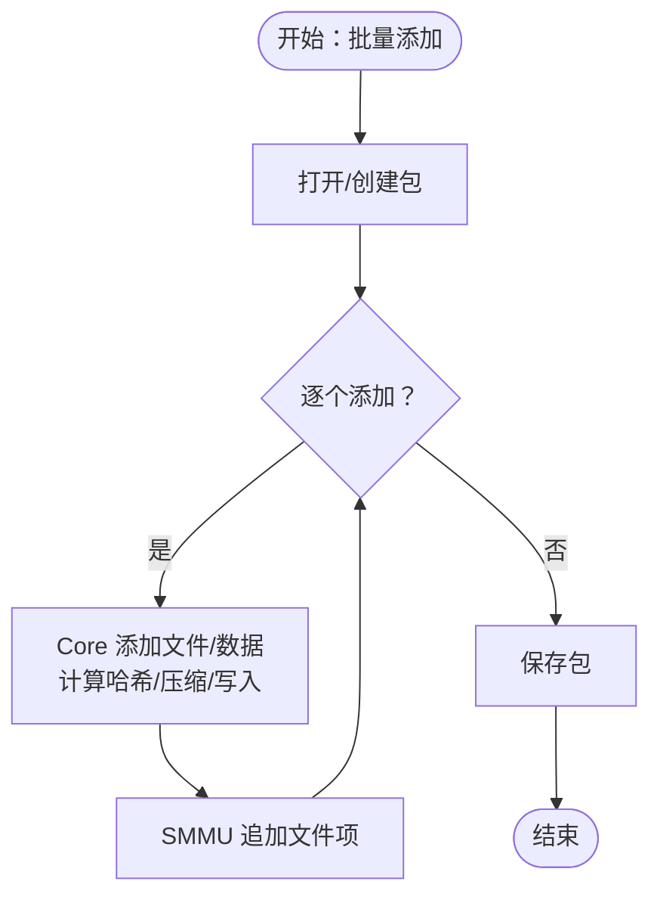
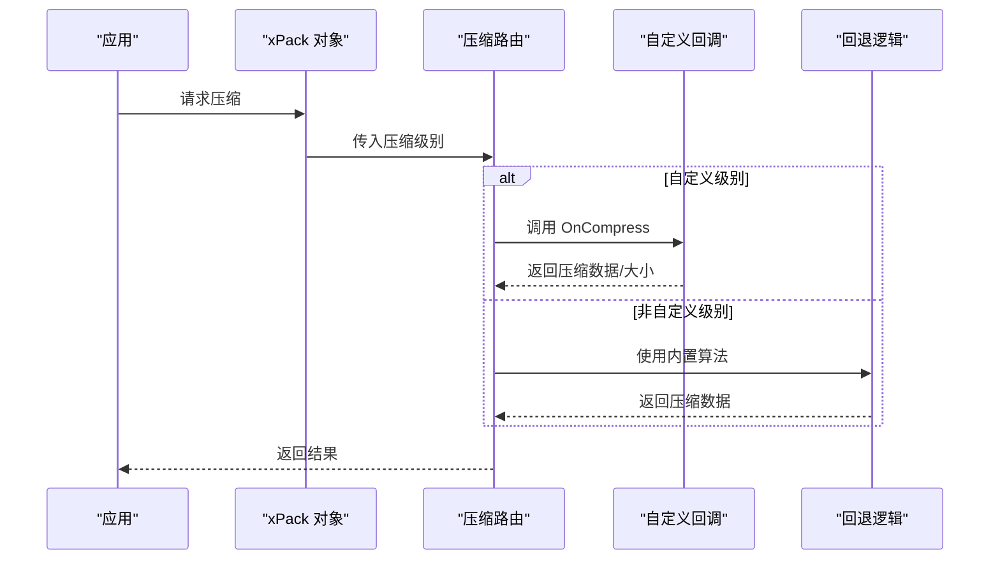
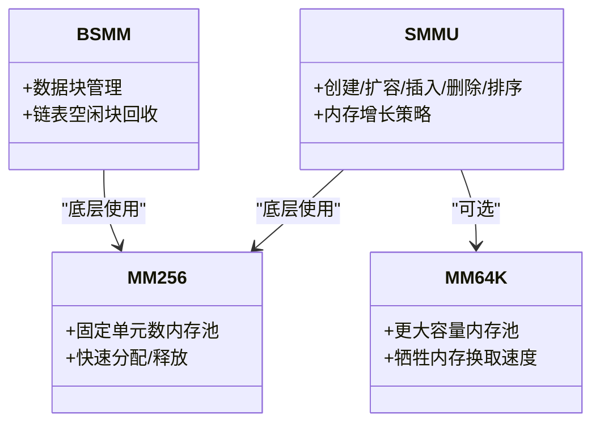
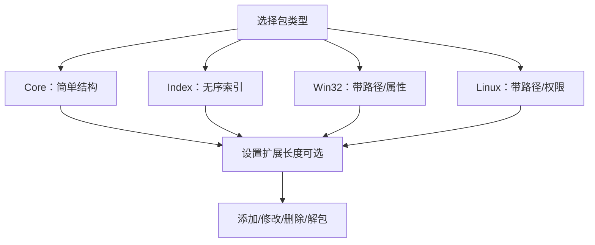
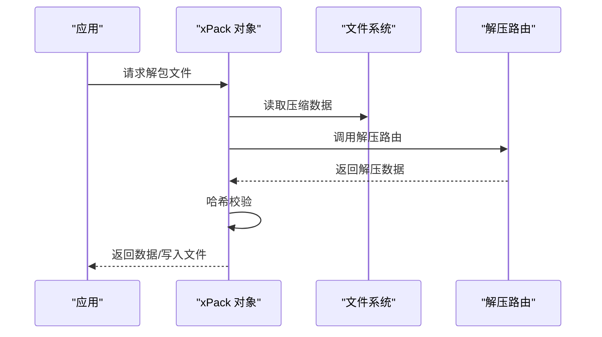
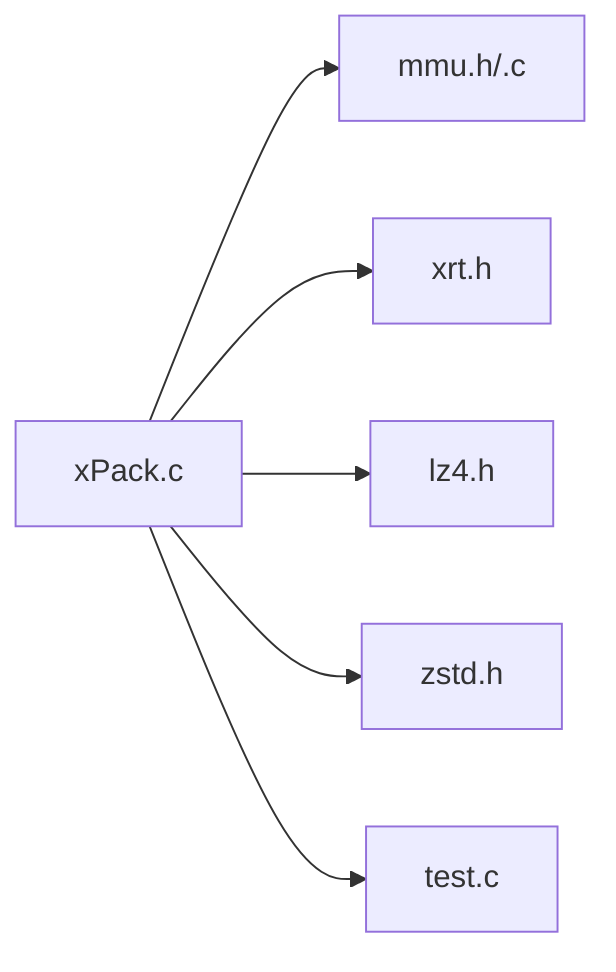

# 高级应用场景

<cite>
**本文引用的文件**
- [xPack.h](file://ver6/xpack/xPack.h)
- [xPack.c](file://ver6/xpack/xPack.c)
- [mmu.h](file://ver6/mmu/mmu.h)
- [mmu.c](file://ver6/mmu/mmu.c)
- [mmu readme.md](file://ver6/mmu/readme.md)
- [xrt.h](file://lib/xrt/xrt.h)
- [zstd.h](file://lib/zstd/zstd.h)
- [lz4.h](file://lib/lz4/lz4.h)
- [test.c](file://ver6/xpack/test.c)
</cite>

## 目录
1. [简介](#简介)
2. [项目结构](#项目结构)
3. [核心组件](#核心组件)
4. [架构总览](#架构总览)
5. [详细组件分析](#详细组件分析)
6. [依赖关系分析](#依赖关系分析)
7. [性能考量](#性能考量)
8. [故障排查指南](#故障排查指南)
9. [结论](#结论)
10. [附录](#附录)

## 简介
本文件面向有经验的开发者，系统化梳理 xPack 在“高级应用场景”下的综合实践，涵盖：
- 大量文件的高效添加与解包流程
- 自定义压缩算法的集成与回调机制
- 内存优化策略与多类内存池选择
- 复杂文件包结构设计与实现
- 性能优化与基准测试思路
- 与外部系统集成的最佳实践

目标是帮助你在真实工程中，利用 xPack 的能力解决大规模、高性能、可扩展的打包与解包问题。

## 项目结构
仓库采用模块化组织，核心模块与相关依赖如下：
- ver6/xpack：xPack 主体，提供包结构、压缩路由、文件增删改查、保存关闭等接口
- ver6/mmu：内存管理单元（MMU），提供多种内存池与数据结构管理器
- lib/xrt：基础运行时库，提供内存、文件、字符串、时间等通用能力
- lib/zstd、lib/lz4：第三方压缩库头文件，供 xPack 压缩路由使用
- ver6/xpack/test.c：示例程序，演示 Core/Index/Win32 三种包类型的添加与解包

**图表来源**
- [xPack.h](file://ver6/xpack/xPack.h#L1-L252)
- [xPack.c](file://ver6/xpack/xPack.c#L1-L200)
- [mmu.h](file://ver6/mmu/mmu.h#L1-L120)
- [mmu.c](file://ver6/mmu/mmu.c#L1-L120)
- [xrt.h](file://lib/xrt/xrt.h#L1-L120)
- [zstd.h](file://lib/zstd/zstd.h#L1-L120)
- [lz4.h](file://lib/lz4/lz4.h#L1-L120)
- [test.c](file://ver6/xpack/test.c#L1-L60)

**章节来源**
- [xPack.h](file://ver6/xpack/xPack.h#L1-L252)
- [xPack.c](file://ver6/xpack/xPack.c#L1-L200)
- [mmu.h](file://ver6/mmu/mmu.h#L1-L120)
- [mmu.c](file://ver6/mmu/mmu.c#L1-L120)
- [xrt.h](file://lib/xrt/xrt.h#L1-L120)
- [zstd.h](file://lib/zstd/zstd.h#L1-L120)
- [lz4.h](file://lib/lz4/lz4.h#L1-L120)
- [test.c](file://ver6/xpack/test.c#L1-L60)

## 核心组件
- 包结构与接口
  - 包头、文件信息头、压缩回调结构、对象封装等
  - 提供打开/保存/关闭、设置包类型/扩展长度、获取文件信息、添加/修改/删除/解包等接口
- 压缩路由
  - 快速压缩（LZ4）、高压缩比（LZMA/Zstd）、自定义压缩（回调）
  - 路由失败回退为不压缩，保证可用性
- 内存管理
  - 使用 MMU 的结构体数组管理器（SMMU）管理文件列表，减少频繁内存申请
  - 支持多种内存池（MM256/64K、BSMM、PAMM/SAMM 等）以适配不同场景
- 运行时与工具
  - xrt 提供统一的内存、文件、字符串、时间等基础能力
  - 第三方压缩库头文件用于集成不同压缩算法

**章节来源**
- [xPack.h](file://ver6/xpack/xPack.h#L22-L110)
- [xPack.c](file://ver6/xpack/xPack.c#L54-L159)
- [mmu.h](file://ver6/mmu/mmu.h#L293-L354)
- [xrt.h](file://lib/xrt/xrt.h#L120-L200)

## 架构总览
xPack 的整体架构围绕“包对象 + 压缩路由 + 内存管理 + 外部压缩库”的组合展开。核心流程包括：
- 打开/创建包 → 读取/写入包头 → 管理文件列表（SMMU）→ 文件数据流（LZ4/LZMA/Zstd 或自定义）→ 保存/关闭
- 回调机制允许注入自定义压缩/解压逻辑，满足特定业务需求

**图表来源**
- [xPack.c](file://ver6/xpack/xPack.c#L163-L203)
- [xPack.c](file://ver6/xpack/xPack.c#L451-L515)
- [xPack.c](file://ver6/xpack/xPack.c#L582-L654)
- [zstd.h](file://lib/zstd/zstd.h#L154-L175)
- [lz4.h](file://lib/lz4/lz4.h#L177-L209)

**章节来源**
- [xPack.c](file://ver6/xpack/xPack.c#L163-L203)
- [xPack.c](file://ver6/xpack/xPack.c#L451-L515)
- [xPack.c](file://ver6/xpack/xPack.c#L582-L654)
- [zstd.h](file://lib/zstd/zstd.h#L154-L175)
- [lz4.h](file://lib/lz4/lz4.h#L177-L209)

## 详细组件分析

### 组件A：批量文件处理与高效添加
- 设计要点
  - 使用 SMMU 管理文件列表，避免频繁内存分配
  - 通过 Core 模式批量添加文件/数据，自动计算哈希并写入数据段
  - 支持不同压缩级别（无压缩、快速、高压缩、自定义）
- 实现路径
  - 添加文件：[xPack_Core_AppendFile](file://ver6/xpack/xPack.c#L497-L515)
  - 添加数据：[xPack_Core_AppendData](file://ver6/xpack/xPack.c#L452-L494)
  - 修改文件/数据：[xPack_Core_ChangeFile](file://ver6/xpack/xPack.c#L562-L580)、[xPack_Core_ChangeData](file://ver6/xpack/xPack.c#L518-L559)
  - 删除文件：[xPack_Core_DeleteFile](file://ver6/xpack/xPack.c#L657-L664)
- 示例参考
  - Core 模式批量添加与解包：[test.c](file://ver6/xpack/test.c#L31-L66)

**图表来源**
- [xPack.c](file://ver6/xpack/xPack.c#L452-L515)
- [xPack.c](file://ver6/xpack/xPack.c#L163-L203)
- [test.c](file://ver6/xpack/test.c#L31-L66)

**章节来源**
- [xPack.c](file://ver6/xpack/xPack.c#L452-L515)
- [xPack.c](file://ver6/xpack/xPack.c#L518-L580)
- [xPack.c](file://ver6/xpack/xPack.c#L657-L664)
- [test.c](file://ver6/xpack/test.c#L31-L66)

### 组件B：自定义压缩算法集成与回调
- 设计要点
  - 通过回调函数注入自定义压缩/解压逻辑
  - 路由层在未启用自定义或失败时回退为不压缩
- 实现路径
  - 压缩路由：[xPack_Compress_Router](file://ver6/xpack/xPack.c#L55-L101)
  - 解压路由：[xPack_DeCompress_Router](file://ver6/xpack/xPack.c#L104-L159)
  - 回调字段：[xPack.h](file://ver6/xpack/xPack.h#L106-L109)
- 使用建议
  - 在回调中实现压缩参数选择、多线程/内存池策略
  - 严格控制返回值与内存释放语义，避免重复释放或泄漏

**图表来源**
- [xPack.c](file://ver6/xpack/xPack.c#L55-L101)
- [xPack.c](file://ver6/xpack/xPack.c#L104-L159)
- [xPack.h](file://ver6/xpack/xPack.h#L106-L109)

**章节来源**
- [xPack.c](file://ver6/xpack/xPack.c#L55-L101)
- [xPack.c](file://ver6/xpack/xPack.c#L104-L159)
- [xPack.h](file://ver6/xpack/xPack.h#L106-L109)

### 组件C：内存优化策略与内存池选择
- 设计要点
  - 文件列表使用 SMMU（结构体数组管理器）集中管理，减少碎片与分配次数
  - MMU 提供多种内存池（MM256/64K、BSMM、PAMM/SAMM 等），按场景权衡速度与内存
- 实现路径
  - SMMU 创建/扩容/删除：[mmu.h](file://ver6/mmu/mmu.h#L293-L354)
  - MM256/64K 内存池：[mmu.h](file://ver6/mmu/mmu.h#L472-L721)、[mmu.h](file://ver6/mmu/mmu.h#L793-L800)
  - BSMM 数据块管理：[mmu.h](file://ver6/mmu/mmu.h#L421-L459)
- 使用建议
  - 小规模/高频小对象：优先 MM256/64K 或 BSMM
  - 大量结构体数组：SMMU 更合适
  - 按需裁剪容量，避免过度预分配

**图表来源**
- [mmu.h](file://ver6/mmu/mmu.h#L293-L354)
- [mmu.h](file://ver6/mmu/mmu.h#L472-L721)
- [mmu.h](file://ver6/mmu/mmu.h#L793-L800)
- [mmu.h](file://ver6/mmu/mmu.h#L421-L459)

**章节来源**
- [mmu.h](file://ver6/mmu/mmu.h#L293-L354)
- [mmu.h](file://ver6/mmu/mmu.h#L472-L721)
- [mmu.h](file://ver6/mmu/mmu.h#L793-L800)
- [mmu.h](file://ver6/mmu/mmu.h#L421-L459)

### 组件D：复杂文件包结构设计与实现
- 设计要点
  - 支持多种包类型：Core、Index、Linux、Win32
  - 通过扩展长度支持自定义文件信息头，满足复杂元数据需求
  - 路径/索引/标签等字段用于快速定位与检索
- 实现路径
  - 包类型设置与扩展长度：[xPack_SetPackType](file://ver6/xpack/xPack.c#L314-L336)、[xPack_SetFileInfoExtSize](file://ver6/xpack/xPack.c#L346-L354)、[xPack_SetPackInfoExtSize](file://ver6/xpack/xPack.c#L364-L372)
  - Index/Win32 路径查询与操作：[xPack_IndexToPos](file://ver6/xpack/xPack.c#L669-L681)、[xPack_Win32ToPos](file://ver6/xpack/xPack.c#L772-L787)
- 示例参考
  - Index/Win32 模式批量添加与解包：[test.c](file://ver6/xpack/test.c#L70-L145)、[test.c](file://ver6/xpack/test.c#L149-L271)

**图表来源**
- [xPack.c](file://ver6/xpack/xPack.c#L314-L372)
- [xPack.c](file://ver6/xpack/xPack.c#L669-L787)
- [test.c](file://ver6/xpack/test.c#L70-L145)

**章节来源**
- [xPack.c](file://ver6/xpack/xPack.c#L314-L372)
- [xPack.c](file://ver6/xpack/xPack.c#L669-L787)
- [test.c](file://ver6/xpack/test.c#L70-L145)

### 组件E：解包流程与哈希校验
- 设计要点
  - 解包时读取压缩数据，按文件标志选择解压算法或直接返回
  - 读取/解压后进行哈希校验，确保数据完整性
- 实现路径
  - 解包数据：[xPack_Core_UnpackData](file://ver6/xpack/xPack.c#L582-L627)
  - 解包文件：[xPack_Core_UnpackFile](file://ver6/xpack/xPack.c#L629-L654)
  - 哈希校验：[xPack.c](file://ver6/xpack/xPack.c#L616-L624)

**图表来源**
- [xPack.c](file://ver6/xpack/xPack.c#L582-L654)
- [xPack.c](file://ver6/xpack/xPack.c#L616-L624)

**章节来源**
- [xPack.c](file://ver6/xpack/xPack.c#L582-L654)
- [xPack.c](file://ver6/xpack/xPack.c#L616-L624)

## 依赖关系分析
- 组件耦合
  - xPack.c 依赖 mmu.h（SMMU）、xrt.h（内存/文件）、zstd.h/lz4.h（压缩库）
  - 回调函数使压缩算法与包逻辑解耦，便于替换与扩展
- 外部依赖
  - LZ4：快速压缩
  - Zstd：高压缩比
  - LZMA：作为备用或历史兼容
- 潜在循环依赖
  - 当前结构清晰，未见循环 include；注意在自定义回调中避免反向依赖

**图表来源**
- [xPack.c](file://ver6/xpack/xPack.c#L9-L27)
- [mmu.h](file://ver6/mmu/mmu.h#L1-L60)
- [xrt.h](file://lib/xrt/xrt.h#L1-L60)
- [lz4.h](file://lib/lz4/lz4.h#L1-L60)
- [zstd.h](file://lib/zstd/zstd.h#L1-L60)
- [test.c](file://ver6/xpack/test.c#L1-L20)

**章节来源**
- [xPack.c](file://ver6/xpack/xPack.c#L9-L27)
- [mmu.h](file://ver6/mmu/mmu.h#L1-L60)
- [xrt.h](file://lib/xrt/xrt.h#L1-L60)
- [lz4.h](file://lib/lz4/lz4.h#L1-L60)
- [zstd.h](file://lib/zstd/zstd.h#L1-L60)
- [test.c](file://ver6/xpack/test.c#L1-L20)

## 性能考量
- 压缩策略
  - 小文件/实时性优先：LZ4 快速压缩
  - 大文件/空间优先：Zstd/LZMA 高压缩比
  - 自定义算法：结合业务特征（如重复数据/顺序访问）定制
- 内存管理
  - 使用 SMMU 管理文件列表，减少分配次数
  - 根据对象规模选择 MM256/64K 或 BSMM，平衡速度与内存
- I/O 优化
  - 批量写入数据段，减少 seek 次数
  - 解包时按需解压，避免一次性加载全部数据
- 基准测试建议
  - 测试维度：文件数量、文件大小分布、压缩级别、内存池类型、CPU 核心数
  - 指标：吞吐量（MB/s）、CPU 利用率、内存峰值、磁盘 IO、延迟

[本节为通用指导，不直接分析具体文件]

## 故障排查指南
- 常见错误与定位
  - 文件无法访问/格式不正确/读写失败：检查文件路径、权限与包头版本
  - 内存申请失败：检查内存池配置与可用内存
  - 文件列表读取/添加失败：确认 SMMU 扩容与哈希一致性
  - 哈希校验失败：确认解压算法与数据完整性
- 回调错误处理
  - 在自定义压缩回调中严格返回值与内存释放，避免重复释放
  - 使用 OnError 回调输出详细错误信息
- 示例参考
  - 错误码与回调：[xPack.h](file://ver6/xpack/xPack.h#L36-L51)、[xPack.c](file://ver6/xpack/xPack.c#L51-L52)

**章节来源**
- [xPack.h](file://ver6/xpack/xPack.h#L36-L51)
- [xPack.c](file://ver6/xpack/xPack.c#L51-L52)

## 结论
xPack 在高级应用场景下提供了完善的基础设施：
- 批量文件处理通过 SMMU 与压缩路由实现高效增删改查
- 自定义压缩通过回调机制无缝集成
- 多内存池策略满足不同性能与内存约束
- 复杂包结构支持多种访问模型与扩展元数据
- 配套的错误处理与示例便于落地实施

建议在实际项目中结合业务特征选择合适的压缩算法与内存池，并建立系统性的基准测试体系以持续优化。

## 附录
- 示例程序
  - Core/Index/Win32 模式批量添加与解包：[test.c](file://ver6/xpack/test.c#L31-L271)
- 内存管理特性说明
  - MMU 使用与裁剪：[mmu readme.md](file://ver6/mmu/readme.md#L31-L127)
- 压缩库接口
  - Zstd 接口：[zstd.h](file://lib/zstd/zstd.h#L154-L175)
  - LZ4 接口：[lz4.h](file://lib/lz4/lz4.h#L177-L209)

**章节来源**
- [test.c](file://ver6/xpack/test.c#L31-L271)
- [mmu readme.md](file://ver6/mmu/readme.md#L31-L127)
- [zstd.h](file://lib/zstd/zstd.h#L154-L175)
- [lz4.h](file://lib/lz4/lz4.h#L177-L209)