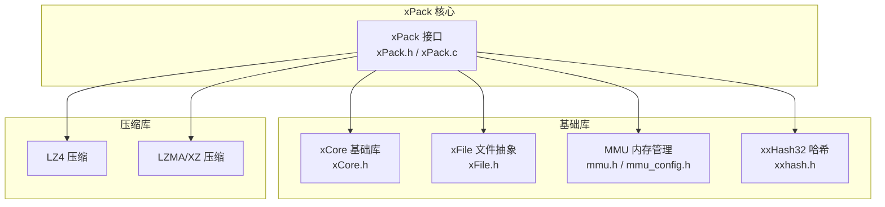
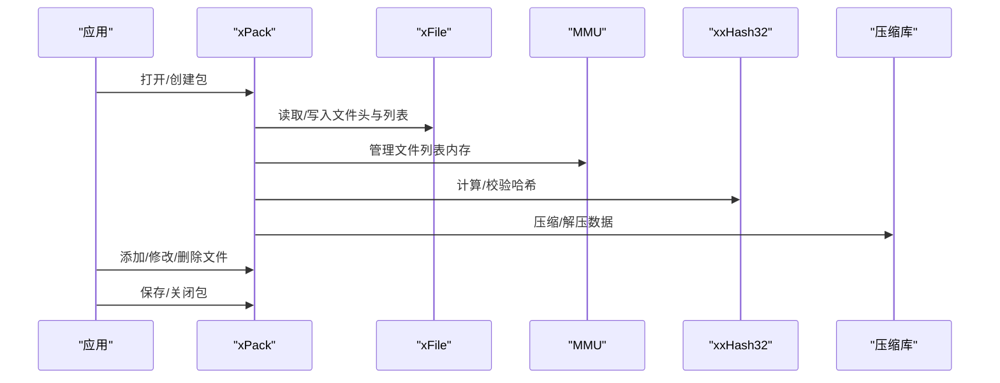
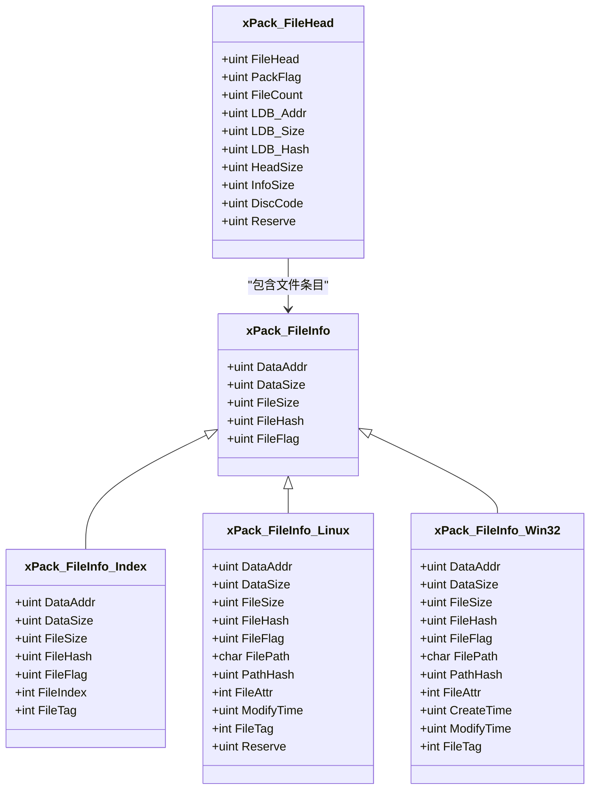
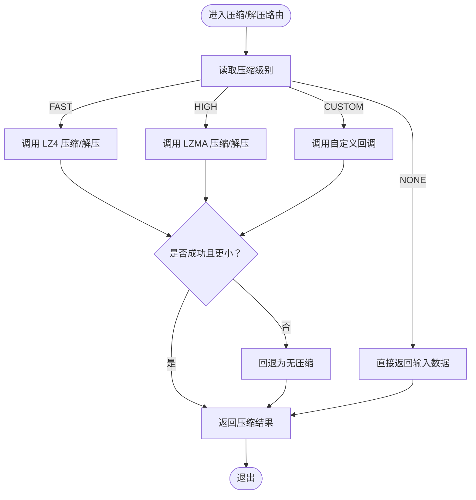
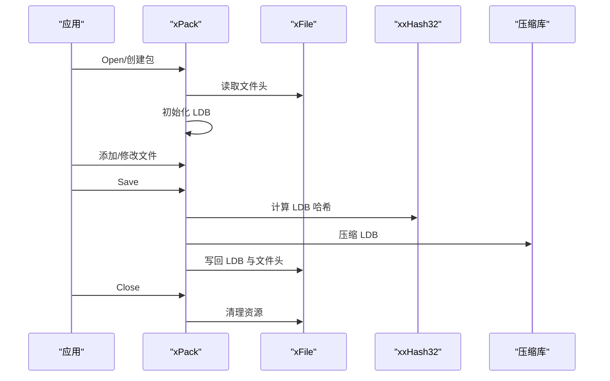
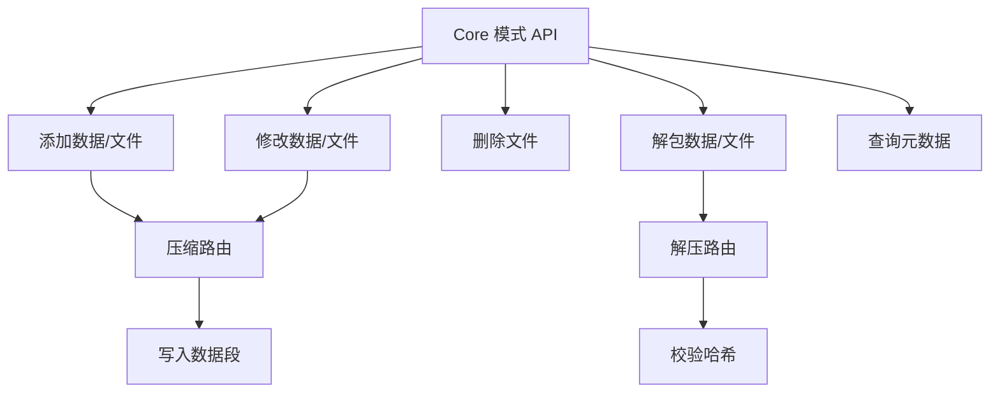
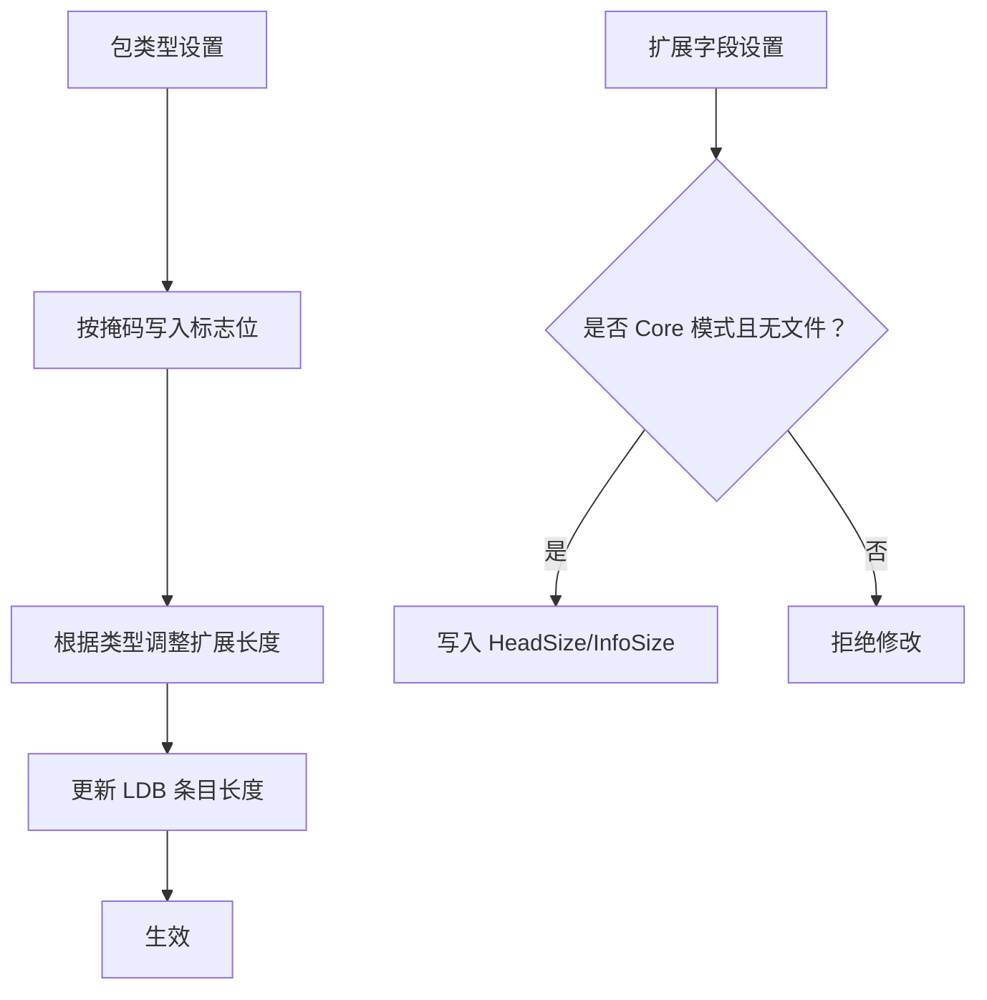
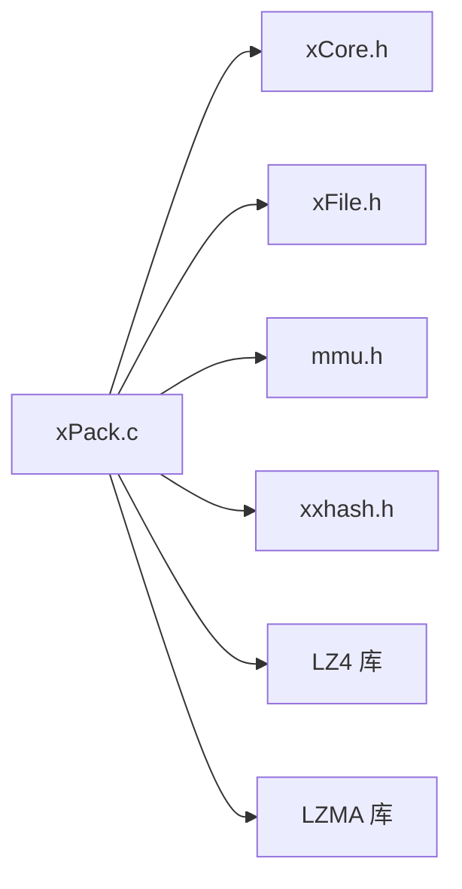

# 附录

<cite>
**本文引用的文件**
- [xPack.h](file://ver6/xpack/xPack.h)
- [xPack.c](file://ver6/xpack/xPack.c)
- [mmu.h](file://ver6/mmu/mmu.h)
- [mmu_config.h](file://ver6/mmu/mmu_config.h)
- [xCore.h](file://ver6/xCore/xCore.h)
- [xFile.h](file://ver6/xFile/xFile.h)
- [xxhash.h](file://ver6/xxhash32/xxhash.h)
- [压缩级别参数.txt](file://压缩级别参数.txt)
- [build_TCC_DLL_x64.bat](file://ver6/xpack/build_TCC_DLL_x64.bat)
- [test.c](file://ver6/xpack/test.c)
- [readme.md](file://ver6/mmu/readme.md)
</cite>

## 目录
1. [简介](#简介)
2. [项目结构](#项目结构)
3. [核心组件](#核心组件)
4. [架构总览](#架构总览)
5. [详细组件分析](#详细组件分析)
6. [依赖关系分析](#依赖关系分析)
7. [性能考量](#性能考量)
8. [故障排查指南](#故障排查指南)
9. [结论](#结论)
10. [附录](#附录)

## 简介
本附录面向 xPack 项目使用者与维护者，提供补充参考资料，包括：
- 完整 API 索引与快速查找表
- 配置参数含义与使用方法
- 版本变更与升级指南
- 相关资源链接与外部参考
- 术语表与缩写词解释
- 许可证信息与法律声明
- 联系方式与支持渠道

## 项目结构
xPack 位于 ver6/xpack 子目录，采用“核心库 + 多语言/平台适配”的模块化组织方式：
- ver6/xpack：xPack 核心实现与接口定义
- ver6/mmu：内存管理单元（MMU）
- ver6/xCore：跨平台基础库
- ver6/xFile：文件 I/O 抽象层
- ver6/xxhash32：32 位哈希
- ver6/lz4、ver6/lzma：压缩算法库（按需编译）

图表来源
- [xPack.h](file://ver6/xpack/xPack.h#L1-L252)
- [xPack.c](file://ver6/xpack/xPack.c#L1-L30)
- [mmu.h](file://ver6/mmu/mmu.h#L1-L120)
- [xCore.h](file://ver6/xCore/xCore.h#L1-L120)
- [xFile.h](file://ver6/xFile/xFile.h#L1-L60)
- [xxhash.h](file://ver6/xxhash32/xxhash.h#L1-L2)

章节来源
- [xPack.h](file://ver6/xpack/xPack.h#L1-L252)
- [xPack.c](file://ver6/xpack/xPack.c#L1-L30)
- [mmu.h](file://ver6/mmu/mmu.h#L1-L120)
- [xCore.h](file://ver6/xCore/xCore.h#L1-L120)
- [xFile.h](file://ver6/xFile/xFile.h#L1-L60)
- [xxhash.h](file://ver6/xxhash32/xxhash.h#L1-L2)

## 核心组件
- xPack 接口层：提供统一的打包/解包 API，支持多种包类型与压缩策略
- xCore 基础库：跨平台类型、字符串、路径、时间等工具与全局状态
- xFile 文件抽象：统一的文件读写、编码、路径操作
- MMU 内存管理：高性能内存池与数据结构管理
- 哈希与压缩：xxHash32、LZ4、LZMA/XZ

章节来源
- [xPack.h](file://ver6/xpack/xPack.h#L98-L252)
- [xPack.c](file://ver6/xpack/xPack.c#L35-L160)
- [xCore.h](file://ver6/xCore/xCore.h#L412-L450)
- [xFile.h](file://ver6/xFile/xFile.h#L25-L31)
- [mmu.h](file://ver6/mmu/mmu.h#L107-L145)

## 架构总览
xPack 的核心流程包括：打开/创建包、设置包类型与扩展字段、添加/修改/删除文件、保存/关闭包；内部通过 MMU 管理文件列表，通过哈希校验与压缩算法保障一致性与体积。

图表来源
- [xPack.c](file://ver6/xpack/xPack.c#L218-L302)
- [xPack.c](file://ver6/xpack/xPack.c#L450-L515)
- [xPack.c](file://ver6/xpack/xPack.c#L163-L203)
- [mmu.h](file://ver6/mmu/mmu.h#L300-L353)
- [xxhash.h](file://ver6/xxhash32/xxhash.h#L1-L2)

## 详细组件分析

### 组件一：包类型与文件信息结构
- 包类型标志位：Core/Index/Linux/Win32
- 文件信息结构：Core 基础结构，以及 Index/Linux/Win32 扩展字段
- 路径与哈希：Linux 使用大小写敏感路径哈希，Win32 使用小写路径哈希

图表来源
- [xPack.h](file://ver6/xpack/xPack.h#L22-L84)

章节来源
- [xPack.h](file://ver6/xpack/xPack.h#L22-L84)

### 组件二：压缩与解压路由
- 支持压缩级别：无压缩、LZ4（FAST）、LZMA（HIGH）、自定义压缩
- 路由器根据级别选择对应压缩/解压实现，失败时回退为无压缩
- 解压时自动添加字符串终止位，便于文本读取

图表来源
- [xPack.c](file://ver6/xpack/xPack.c#L54-L101)
- [xPack.c](file://ver6/xpack/xPack.c#L103-L159)

章节来源
- [xPack.c](file://ver6/xpack/xPack.c#L54-L101)
- [xPack.c](file://ver6/xpack/xPack.c#L103-L159)

### 组件三：包生命周期与保存流程
- 打开/创建：校验版本、读取/写入文件头、初始化 LDB 列表
- 保存：计算 LDB 哈希、压缩列表、写回文件头与列表
- 关闭：自动保存（如有修改）、清理资源

图表来源
- [xPack.c](file://ver6/xpack/xPack.c#L218-L302)
- [xPack.c](file://ver6/xpack/xPack.c#L163-L203)

章节来源
- [xPack.c](file://ver6/xpack/xPack.c#L218-L302)
- [xPack.c](file://ver6/xpack/xPack.c#L163-L203)

### 组件四：文件操作 API（核心模式）
- 添加/修改/删除/解包数据与文件
- 获取文件大小、数据大小、哈希、压缩级别
- 通过回调实现自定义压缩/解压

图表来源
- [xPack.h](file://ver6/xpack/xPack.h#L170-L190)
- [xPack.h](file://ver6/xpack/xPack.h#L450-L447)
- [xPack.c](file://ver6/xpack/xPack.c#L450-L515)
- [xPack.c](file://ver6/xpack/xPack.c#L517-L580)
- [xPack.c](file://ver6/xpack/xPack.c#L582-L664)

章节来源
- [xPack.h](file://ver6/xpack/xPack.h#L170-L190)
- [xPack.h](file://ver6/xpack/xPack.h#L450-L447)
- [xPack.c](file://ver6/xpack/xPack.c#L450-L515)
- [xPack.c](file://ver6/xpack/xPack.c#L517-L580)
- [xPack.c](file://ver6/xpack/xPack.c#L582-L664)

### 组件五：包类型与扩展字段
- 设置/获取包类型：Core/Index/Linux/Win32
- 设置/获取扩展长度：包头扩展、文件信息扩展（仅 Core 模式）
- 设置/获取识别代码：DiscCode

图表来源
- [xPack.c](file://ver6/xpack/xPack.c#L313-L336)
- [xPack.c](file://ver6/xpack/xPack.c#L345-L379)

章节来源
- [xPack.c](file://ver6/xpack/xPack.c#L313-L336)
- [xPack.c](file://ver6/xpack/xPack.c#L345-L379)

## 依赖关系分析
- xPack 依赖 xCore（内存、字符串、路径、时间）、xFile（文件 I/O）、MMU（内存池）、xxHash32（哈希）、LZ4/LZMA（压缩）
- 构建脚本示例展示如何将各模块链接为 DLL

图表来源
- [xPack.c](file://ver6/xpack/xPack.c#L9-L27)
- [build_TCC_DLL_x64.bat](file://ver6/xpack/build_TCC_DLL_x64.bat#L1-L7)

章节来源
- [xPack.c](file://ver6/xpack/xPack.c#L9-L27)
- [build_TCC_DLL_x64.bat](file://ver6/xpack/build_TCC_DLL_x64.bat#L1-L7)

## 性能考量
- 内存管理：MMU 提供固定步长内存池与高效分配/回收，减少碎片与系统调用
- 压缩策略：不同压缩级别在速度与压缩比之间权衡，建议根据场景选择
- 哈希校验：文件与列表均使用哈希校验，保障完整性
- I/O 模式：二进制读写，避免编码转换开销

章节来源
- [mmu.h](file://ver6/mmu/mmu.h#L107-L145)
- [readme.md](file://ver6/mmu/readme.md#L19-L30)
- [压缩级别参数.txt](file://压缩级别参数.txt#L1-L20)

## 故障排查指南
常见错误码与处理：
- 文件无法访问、格式不正确、内存申请失败、列表读取/写入失败、无效文件位置、哈希校验失败、包类型不匹配、找不到文件、文件名超长
- 建议：检查路径与权限、确认包类型与扩展长度设置时机、确保在无文件时修改扩展长度、关注压缩失败回退为无压缩

章节来源
- [xPack.c](file://ver6/xpack/xPack.c#L36-L51)
- [xPack.c](file://ver6/xpack/xPack.c#L313-L336)

## 结论
xPack 提供了统一、高效的多模式打包/解包能力，结合 MMU 的高性能内存管理与 xxHash32 的完整性校验，适合在多场景下进行资源打包与分发。通过合理的压缩策略与包类型选择，可在速度与存储之间取得良好平衡。

## 附录

### API 索引与快速查找表
- 打开/关闭/保存
  - 打开包：xPack_Open
  - 保存包：xPack_Save
  - 关闭包：xPack_Close
- 包类型与扩展
  - 设置包类型：xPack_SetPackType
  - 获取包类型：xPack_GetPackType
  - 设置包信息扩展长度：xPack_SetPackInfoExtSize
  - 获取包信息扩展长度：xPack_GetPackInfoExtSize
  - 设置文件信息扩展长度：xPack_SetFileInfoExtSize
  - 获取文件信息扩展长度：xPack_GetFileInfoExtSize
  - 设置识别代码：xPack_SetPackDiscCode
  - 获取识别代码：xPack_GetPackDiscCode
- 文件数量与元数据
  - 文件数量：xPack_FileCount
  - 获取文件信息指针：xPack_GetFileInfo
  - 获取文件大小：xPack_GetFileSize
  - 获取数据大小：xPack_GetFileDataSize
  - 获取文件哈希：xPack_GetFileHash
  - 获取文件压缩级别：xPack_GetFileCompLevel
- 核心模式（Core）
  - 添加文件：xPack_Core_AppendFile
  - 添加数据：xPack_Core_AppendData
  - 修改文件：xPack_Core_ChangeFile
  - 修改数据：xPack_Core_ChangeData
  - 解包文件：xPack_Core_UnpackFile
  - 解包数据：xPack_Core_UnpackData
  - 删除文件：xPack_Core_DeleteFile
- 索引模式（Index）
  - 通过索引定位：xPack_IndexToPos
  - 添加文件：xPack_Index_AppendFile
  - 添加数据：xPack_Index_AppendData
  - 修改文件：xPack_Index_ChangeFile
  - 修改数据：xPack_Index_ChangeData
  - 解包文件：xPack_Index_UnpackFile
  - 解包数据：xPack_Index_UnpackData
  - 删除文件：xPack_Index_DeleteFile
- Linux 模式
  - 路径定位：xPack_LinuxToPos
  - 添加文件：xPack_Linux_AppendFile
  - 修改文件：xPack_Linux_ChangeFile
  - 解包文件：xPack_Linux_UnpackFile
  - 解包数据：xPack_Linux_UnpackData
  - 删除文件：xPack_Linux_DeleteFile
- Win32 模式
  - 路径定位：xPack_Win32ToPos
  - 添加文件：xPack_Win32_AppendFile
  - 修改文件：xPack_Win32_ChangeFile
  - 解包文件：xPack_Win32_UnpackFile
  - 解包数据：xPack_Win32_UnpackData
  - 删除文件：xPack_Win32_DeleteFile

章节来源
- [xPack.h](file://ver6/xpack/xPack.h#L125-L252)

### 配置参数与使用方法
- 包类型标志位
  - XPK_CLASS_Core、XPK_CLASS_Index、XPK_CLASS_Linux、XPK_CLASS_Win32
- 压缩级别
  - XPK_COMP_NO、XPK_COMP_FAST、XPK_COMP_HIGH、XPK_COMP_CUSTOM
- LDB 压缩标记
  - XPK_LDBCOMP、XPK_LDBCOMPTYPE
- 文件路径最大长度
  - XPK_FILEPATHMAX
- 使用建议
  - 在未添加任何文件前设置包类型与扩展长度
  - Core 模式支持自定义压缩回调（OnCompress/OnUnCompress）
  - Linux/Win32 模式通过路径哈希快速定位文件

章节来源
- [xPack.h](file://ver6/xpack/xPack.h#L4-L13)
- [xPack.h](file://ver6/xpack/xPack.h#L15-L18)
- [xPack.h](file://ver6/xpack/xPack.h#L7)
- [xPack.c](file://ver6/xpack/xPack.c#L313-L336)
- [xPack.c](file://ver6/xpack/xPack.c#L86-L93)

### 版本变更与升级指南
- 版本标识：文件头包含版本号（见 xPack.h 中的版本常量）
- 升级步骤
  - 备份现有包
  - 使用新版本 xPack_Open 打开包（内部会校验版本）
  - 如需迁移包类型或扩展字段，请在添加任何文件前完成设置
  - 重新保存包以写入新格式

章节来源
- [xPack.h](file://ver6/xpack/xPack.h#L31)
- [xPack.c](file://ver6/xpack/xPack.c#L246-L255)
- [xPack.c](file://ver6/xpack/xPack.c#L163-L203)

### 相关资源与外部参考
- MMU 设计理念与特性：参见 MMU 文档
- 压缩级别参数参考：参见压缩级别参数说明
- 构建脚本示例：TCC 编译为 DLL 的示例脚本

章节来源
- [readme.md](file://ver6/mmu/readme.md#L1-L30)
- [压缩级别参数.txt](file://压缩级别参数.txt#L1-L20)
- [build_TCC_DLL_x64.bat](file://ver6/xpack/build_TCC_DLL_x64.bat#L1-L7)

### 术语表与缩写词
- xPack：资源打包库
- LDB：列表数据段（List Data Block）
- Core：核心模式（顺序访问）
- Index：无序索引模式
- Linux/Win32：文件系统兼容模式
- FAST/HIGH：压缩级别代称
- API：应用程序接口
- DLL：动态链接库

章节来源
- [xPack.h](file://ver6/xpack/xPack.h#L9-L13)
- [xPack.h](file://ver6/xpack/xPack.h#L15-L18)

### 许可证信息与法律声明
- MMU：MIT 许可证
- 作者邮箱：xywhsoft@qq.com

章节来源
- [mmu.h](file://ver6/mmu/mmu.h#L4-L26)
- [readme.md](file://ver6/mmu/readme.md#L303-L303)

### 联系方式与支持渠道
- 作者联系：xywhsoft@qq.com
- 测试示例：test.c 展示了 Core/Index/Win32 模式的使用方式

章节来源
- [readme.md](file://ver6/mmu/readme.md#L303-L303)
- [test.c](file://ver6/xpack/test.c#L24-L278)