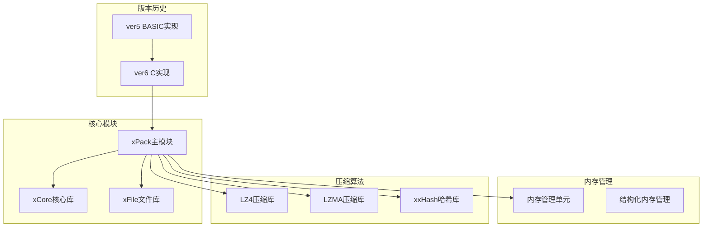
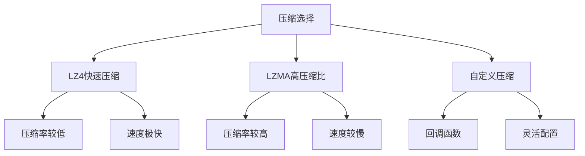
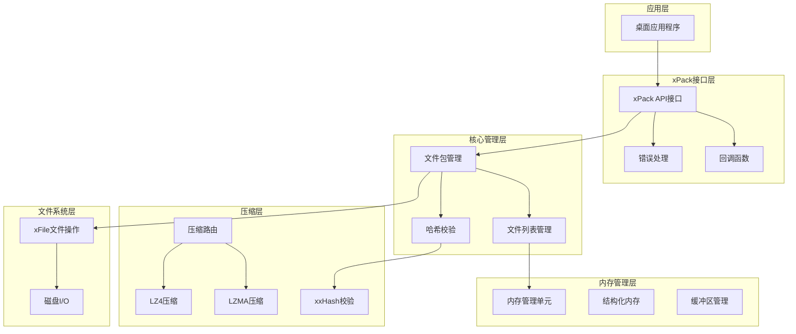
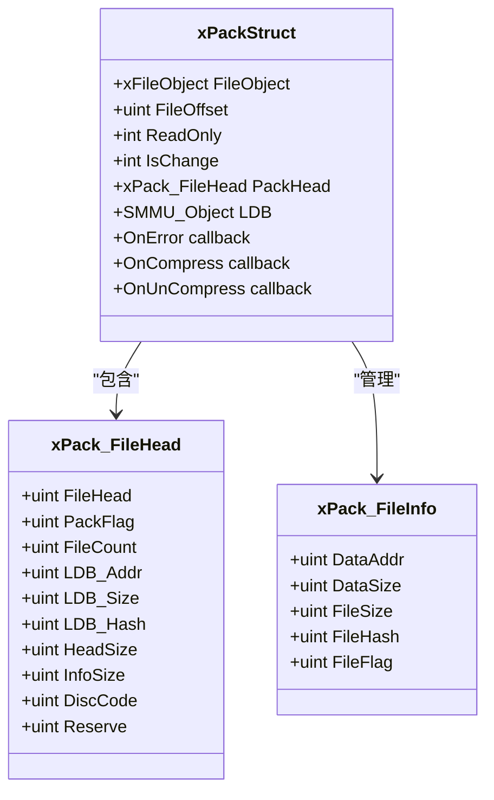
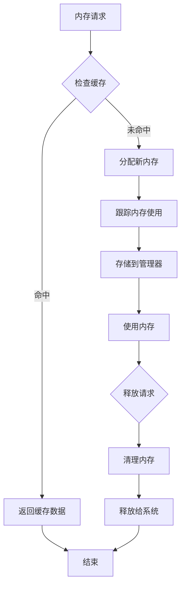
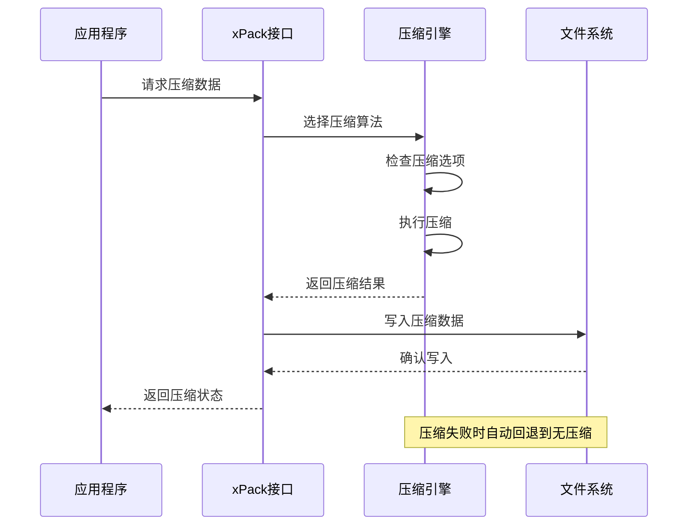
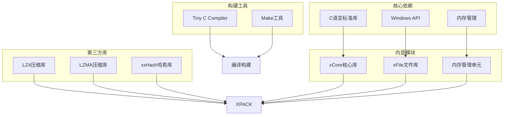
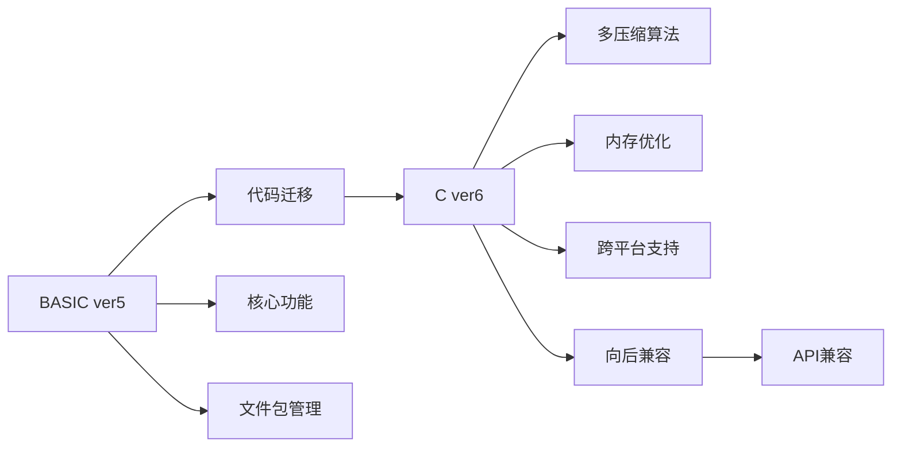

# 项目概述

<cite>
**本文档引用的文件**
- [xPack.h](file://ver6/xpack/xPack.h)
- [xPack.c](file://ver6/xpack/xPack.c)
- [xCore.h](file://ver6/xCore/xCore.h)
- [xFile.h](file://ver6/xFile/xFile.h)
- [mmu.h](file://ver6/mmu/mmu.h)
- [xxhash.h](file://ver6/xxhash32/xxhash.h)
- [lz4.h](file://lib/lz4/lz4.h)
- [zstd.h](file://lib/zstd/zstd.h)
- [xPack.bi](file://ver5/开发目录/xPack Core/Inc/xPack.bi)
- [Core.bi](file://ver5/开发目录/xPack Core/Inc/Core.bi)
- [README.md](file://ver5/README.md)
- [build_TCC_DLL_x64.bat](file://ver6/xpack/build_TCC_DLL_x64.bat)
- [build_TCC_DLL_x86.bat](file://ver6/xpack/build_TCC_DLL_x86.bat)
</cite>

## 目录
1. [简介](#简介)
2. [项目结构](#项目结构)
3. [核心组件](#核心组件)
4. [架构概览](#架构概览)
5. [详细组件分析](#详细组件分析)
6. [依赖关系分析](#依赖关系分析)
7. [性能考虑](#性能考虑)
8. [故障排除指南](#故障排除指南)
9. [结论](#结论)

## 简介

xPack是一个专业的桌面应用程序文件压缩包系统，专为高效管理和压缩文件包而设计。该项目采用C语言实现，提供了完整的多模式文件包管理系统，支持多种压缩算法集成和内存管理优化。

### 项目定位与优势

xPack作为桌面应用程序框架/库，具有以下核心优势：

- **多模式文件包系统**：支持核心模式、索引模式、Linux模式和Win32模式的灵活切换
- **多压缩算法集成**：内置LZ4快速压缩和LZMA高压缩比算法
- **内存管理优化**：采用专门的内存管理单元(MMU)优化内存使用效率
- **跨平台兼容**：支持Windows平台的多架构编译(32位/64位)
- **高性能设计**：针对桌面应用的实时性能优化

### 发展历程

项目经历了从ver5的BASIC实现到ver6的C实现的技术演进：

**ver5阶段**：使用BASIC语言实现，采用面向对象的文件包管理方式
**ver6阶段**：完全重构为C语言实现，引入现代内存管理技术和多压缩算法支持

## 项目结构

**图表来源**
- [xPack.c](file://ver6/xpack/xPack.c#L1-L50)
- [xCore.h](file://ver6/xCore/xCore.h#L1-L50)
- [xFile.h](file://ver6/xFile/xFile.h#L1-L50)
- [mmu.h](file://ver6/mmu/mmu.h#L1-L50)

**章节来源**
- [xPack.h](file://ver6/xpack/xPack.h#L1-L100)
- [xPack.c](file://ver6/xpack/xPack.c#L1-L100)

## 核心组件

### 文件包管理系统

xPack提供了完整的文件包管理功能，支持多种文件包类型：

| 包类型 | 描述 | 特殊功能 |
|--------|------|----------|
| Core模式 | 核心压缩包，支持顺序读取 | 基础文件包管理 |
| Index模式 | 通过索引访问的压缩包 | 支持无序索引访问 |
| Linux模式 | Linux文件系统兼容包 | 支持Linux文件属性 |
| Win32模式 | Win32文件系统兼容包 | 支持Windows文件属性 |

### 压缩算法集成

系统集成了两种主要压缩算法：

**图表来源**
- [xPack.c](file://ver6/xpack/xPack.c#L55-L101)
- [xPack.h](file://ver6/xpack/xPack.h#L15-L18)

**章节来源**
- [xPack.h](file://ver6/xpack/xPack.h#L9-L25)
- [xPack.c](file://ver6/xpack/xPack.c#L55-L159)

## 架构概览

**图表来源**
- [xPack.c](file://ver6/xpack/xPack.c#L1-L100)
- [xCore.h](file://ver6/xCore/xCore.h#L405-L450)
- [xFile.h](file://ver6/xFile/xFile.h#L25-L30)

## 详细组件分析

### 文件包结构设计

xPack采用了精心设计的文件包结构，确保数据的完整性和可访问性：

**图表来源**
- [xPack.h](file://ver6/xpack/xPack.h#L22-L109)

### 内存管理优化

系统采用了多层内存管理策略：

**图表来源**
- [mmu.h](file://ver6/mmu/mmu.h#L472-L533)

**章节来源**
- [mmu.h](file://ver6/mmu/mmu.h#L1-L200)
- [xPack.c](file://ver6/xpack/xPack.c#L163-L203)

### 压缩流程管理

**图表来源**
- [xPack.c](file://ver6/xpack/xPack.c#L55-L101)
- [xPack.c](file://ver6/xpack/xPack.c#L104-L159)

**章节来源**
- [xPack.c](file://ver6/xpack/xPack.c#L55-L159)

## 依赖关系分析

### 技术栈组成

**图表来源**
- [xPack.c](file://ver6/xpack/xPack.c#L4-L27)
- [build_TCC_DLL_x64.bat](file://ver6/xpack/build_TCC_DLL_x64.bat#L1)

### 版本兼容性

**图表来源**
- [xPack.bi](file://ver5/开发目录/xPack Core/Inc/xPack.bi#L1-L50)
- [Core.bi](file://ver5/开发目录/xPack Core/Inc/Core.bi#L1-L27)

**章节来源**
- [xPack.bi](file://ver5/开发目录/xPack Core/Inc/xPack.bi#L1-L685)
- [Core.bi](file://ver5/开发目录/xPack Core/Inc/Core.bi#L1-L27)

## 性能考虑

### 内存使用优化

xPack在内存管理方面采用了多项优化策略：

- **内存池管理**：使用专门的内存池减少内存碎片
- **预分配机制**：预先分配内存避免频繁的内存申请
- **垃圾回收**：智能的内存回收机制减少内存泄漏风险

### 压缩性能优化

- **算法选择**：根据数据特征自动选择最优压缩算法
- **批量处理**：支持批量压缩提高处理效率
- **缓存机制**：利用缓存减少重复计算

### I/O性能优化

- **异步操作**：支持异步文件操作提高响应速度
- **流式处理**：支持流式压缩减少内存占用
- **预读机制**：智能预读提高文件访问效率

## 故障排除指南

### 常见错误类型

| 错误代码 | 错误描述 | 可能原因 | 解决方案 |
|----------|----------|----------|----------|
| 1 | 文件无法访问 | 权限问题或文件被占用 | 检查文件权限和占用状态 |
| 2 | 文件格式不正确 | 文件损坏或版本不兼容 | 验证文件完整性和版本匹配 |
| 3 | 内存申请失败 | 系统内存不足 | 释放不必要的内存或增加系统内存 |
| 4 | 文件列表读取失败 | 文件包损坏 | 检查文件包完整性并重建 |
| 6 | 无效的文件位置 | 索引超出范围 | 验证文件位置和索引有效性 |

### 调试建议

1. **启用详细日志**：通过回调函数获取详细的错误信息
2. **检查内存使用**：监控内存使用情况避免内存泄漏
3. **验证数据完整性**：使用哈希校验确保数据完整性
4. **测试压缩效果**：评估不同压缩算法的效果

**章节来源**
- [xPack.c](file://ver6/xpack/xPack.c#L36-L51)

## 结论

xPack文件压缩包系统是一个设计精良的专业级桌面应用程序框架，具有以下突出特点：

### 技术优势

- **模块化设计**：清晰的模块分离便于维护和扩展
- **高性能实现**：针对桌面应用优化的性能表现
- **内存友好**：高效的内存管理减少资源消耗
- **算法丰富**：支持多种压缩算法满足不同需求

### 应用价值

xPack特别适合以下应用场景：

- **桌面软件打包**：为桌面应用程序提供高效的文件包管理
- **游戏资源管理**：支持游戏资源的压缩和快速访问
- **多媒体处理**：处理大量多媒体文件的压缩和存储
- **数据备份系统**：提供可靠的数据压缩和恢复功能

### 发展前景

随着技术的不断进步，xPack将继续演进：

- **算法优化**：持续改进压缩算法提升压缩比和速度
- **平台扩展**：支持更多操作系统和硬件平台
- **功能增强**：增加更多高级功能满足专业需求
- **性能提升**：进一步优化性能满足更高要求

通过其专业的设计理念和技术实现，xPack为文件压缩包管理领域提供了优秀的解决方案，具有广阔的应用前景和发展潜力。