# 体积压缩功能指南

<cite>
**本文档引用的文件**
- [xpack_volume.c](file://src/xpack_volume.c)
- [xpack_compress.c](file://src/xpack_compress.c)
- [xpack_core.c](file://src/xpack_core.c)
- [xpack.h](file://src/xpack.h)
- [xpack_internal.h](file://src/xpack_internal.h)
- [volume_spec.md](file://docs/volume_spec.md)
- [base.h](file://lib/xrt/lib/base.h)
- [31_volume_basic.h](file://test/31_volume_basic.h)
- [32_volume_single_file.h](file://test/32_volume_single_file.h)
- [33_volume_cross.h](file://test/33_volume_cross.h)
</cite>

## 更新摘要
**变更内容**
- 新增352行分卷管理器实现，涵盖完整的分卷压缩功能
- 更新分卷管理器架构图和数据流处理流程
- 增强跨卷数据读写机制的详细说明
- 完善文件格式规范和命名规则
- 更新API接口文档和错误处理机制

## 目录
1. [简介](#简介)
2. [项目结构](#项目结构)
3. [核心组件](#核心组件)
4. [架构概览](#架构概览)
5. [详细组件分析](#详细组件分析)
6. [依赖关系分析](#依赖关系分析)
7. [性能考虑](#性能考虑)
8. [故障排除指南](#故障排除指南)
9. [结论](#结论)

## 简介

xPack 体积压缩功能是一个强大的分卷压缩系统，允许将大型压缩包分割为多个文件（卷），每个卷具有固定的大小限制。该系统设计为透明操作，用户只需启用分卷模式并设置卷大小，系统会自动处理跨卷的数据读写。

### 核心特性

- ✅ **向后兼容** - 非分卷文件无需修改即可打开
- ✅ **首卷完整** - 第一个卷包含完整的元数据和 LDB
- ✅ **智能切割** - 支持按字节或按文件分割
- ✅ **独立验证** - 每个卷可独立验证头部完整性
- ✅ **透明操作** - 读写操作无需关心分卷细节
- ✅ **灵活配置** - 可动态调整卷大小和分割模式

## 项目结构

xPack 体积压缩功能主要分布在以下模块中：

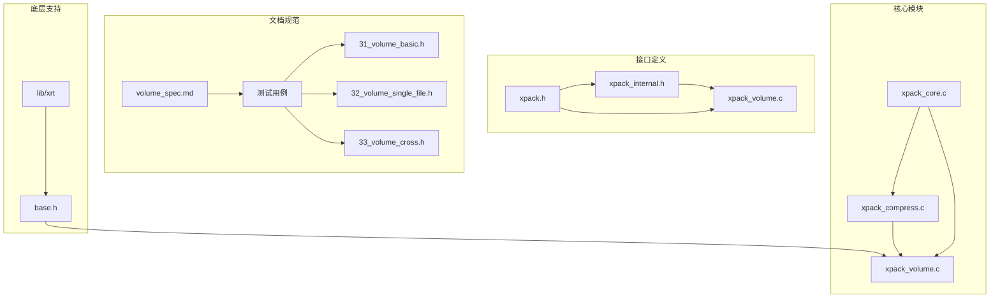

**图表来源**
- [xpack_core.c](file://src/xpack_core.c#L1-L403)
- [xpack_compress.c](file://src/xpack_compress.c#L1-L251)
- [xpack_volume.c](file://src/xpack_volume.c#L1-L353)

**章节来源**
- [xpack.h](file://src/xpack.h#L1-L447)
- [xpack_internal.h](file://src/xpack_internal.h#L1-L145)

## 核心组件

### 分卷管理器 (Volume Manager)

分卷管理器是体积压缩功能的核心组件，负责管理所有卷文件的生命周期和跨卷操作。

#### 主要职责
- 卷文件管理：打开、关闭、定位卷文件
- 容量监控：检测当前卷容量，必要时创建新卷
- 跨卷路由：将读写请求路由到正确的卷文件
- 元数据同步：同步各卷的头部信息
- 错误恢复：处理卷缺失或损坏的情况

#### 关键数据结构

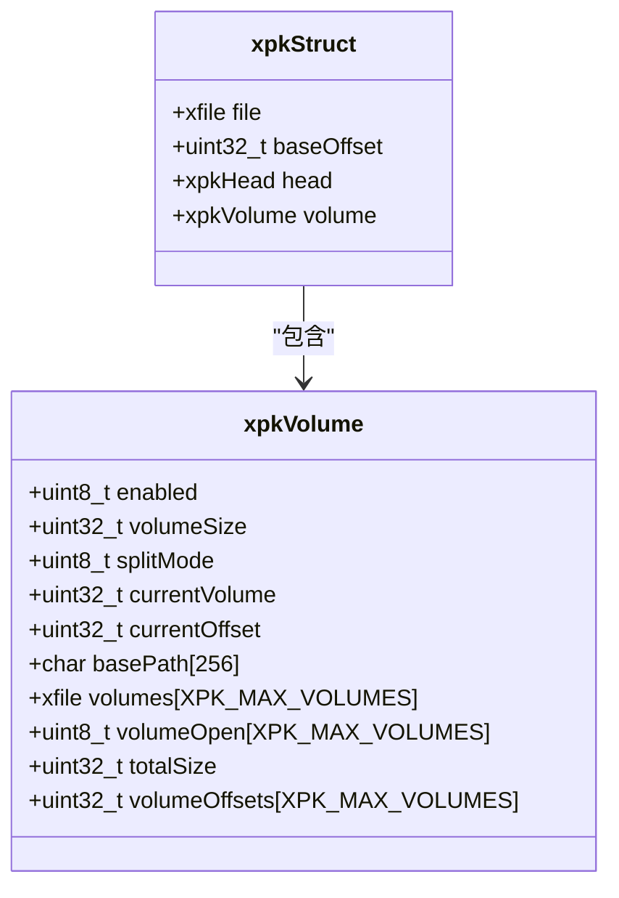

**图表来源**
- [xpack_internal.h](file://src/xpack_internal.h#L23-L42)
- [xpack_internal.h](file://src/xpack_internal.h#L47-L84)

**章节来源**
- [xpack_internal.h](file://src/xpack_internal.h#L17-L42)
- [xpack_volume.c](file://src/xpack_volume.c#L44-L60)

### 压缩路由系统

压缩路由系统提供了统一的压缩接口，支持多种压缩算法：

#### 支持的压缩算法
- **LZ4**: 快速压缩，适合实时应用场景
- **LZ4-HC**: 高压缩比，适合存储场景
- **ZSTD**: 平衡速度和压缩比
- **LZMA2**: 高压缩比，适合长期存储

#### 压缩级别映射

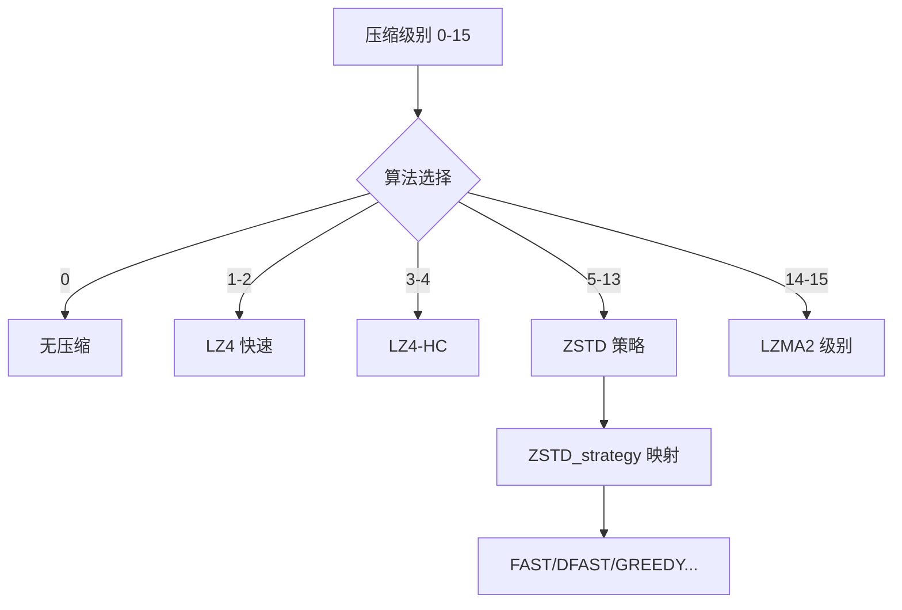

**图表来源**
- [xpack.h](file://src/xpack.h#L269-L286)
- [xpack_compress.c](file://src/xpack_compress.c#L20-L147)

**章节来源**
- [xpack_compress.c](file://src/xpack_compress.c#L1-L251)
- [xpack.h](file://src/xpack.h#L269-L286)

### 文件格式规范

分卷文件格式采用标准化的头部结构：

#### 文件头扩展结构
- `volumeCount`: 总卷数，1 表示不分卷
- `volumeIndex`: 当前卷的索引，从 0 开始

#### 文件命名规则
- 第一卷使用原始文件名
- 后续卷使用：`基础名` + `.` + `扩展名首字母` + `2位数字`
- 数字从 01 开始，最大支持 99 个卷

**章节来源**
- [volume_spec.md](file://docs/volume_spec.md#L99-L116)
- [volume_spec.md](file://docs/volume_spec.md#L200-L216)

## 架构概览

### 系统架构图

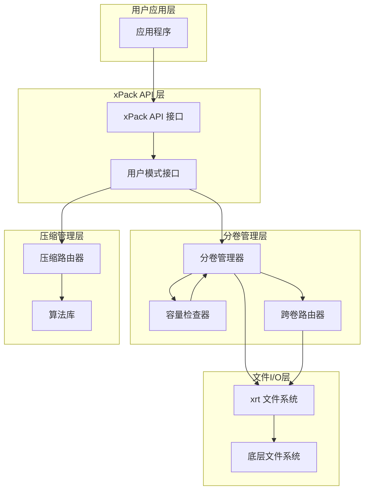

**图表来源**
- [volume_spec.md](file://docs/volume_spec.md#L56-L81)
- [xpack_volume.c](file://src/xpack_volume.c#L1-L353)
- [xpack_compress.c](file://src/xpack_compress.c#L1-L251)

### 数据流处理

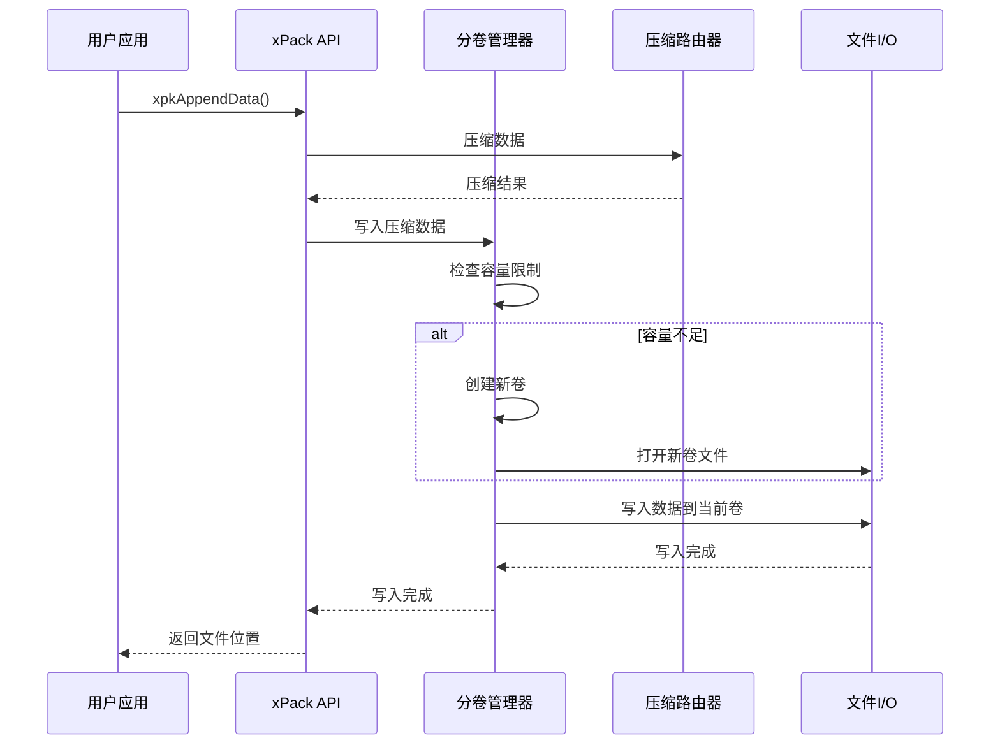

**图表来源**
- [xpack_core.c](file://src/xpack_core.c#L39-L117)
- [xpack_volume.c](file://src/xpack_volume.c#L178-L229)

## 详细组件分析

### 分卷管理器实现

#### 卷文件名生成

分卷文件名遵循特定的命名规则：

```mermaid
flowchart TD
A[输入: 基础路径, 卷索引] --> B{索引检查}
B --> |索引 = 0| C[使用基础路径]
B --> |索引 > 0| D[提取扩展名]
D --> E[截取基础名]
E --> F[组合: 基础名 + "." + 扩展名首字母 + "0" + 索引]
C --> G[输出: 卷文件名]
F --> G
```

**图表来源**
- [xpack_volume.c](file://src/xpack_volume.c#L15-L38)

#### 卷容量检查

容量检查机制确保数据不会超出卷的限制：

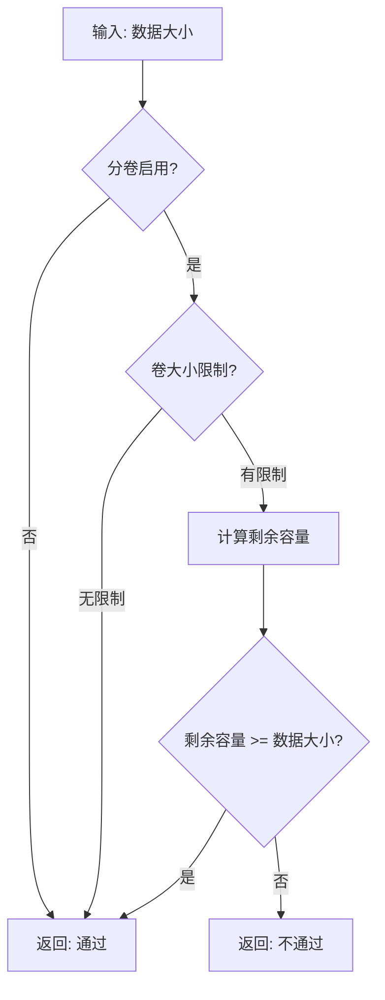

**图表来源**
- [xpack_volume.c](file://src/xpack_volume.c#L166-L172)

**章节来源**
- [xpack_volume.c](file://src/xpack_volume.c#L1-L353)

### 压缩路由实现

#### 压缩算法选择

压缩路由根据压缩级别选择合适的算法：

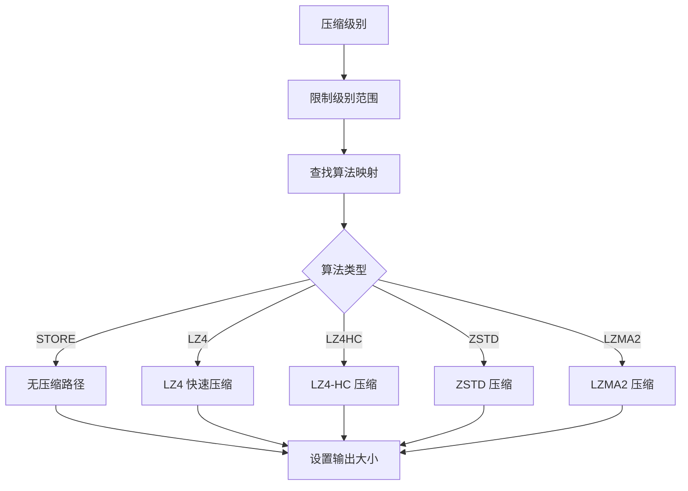

**图表来源**
- [xpack_compress.c](file://src/xpack_compress.c#L20-L147)

#### 解压算法选择

解压过程根据压缩级别选择对应的解压算法：

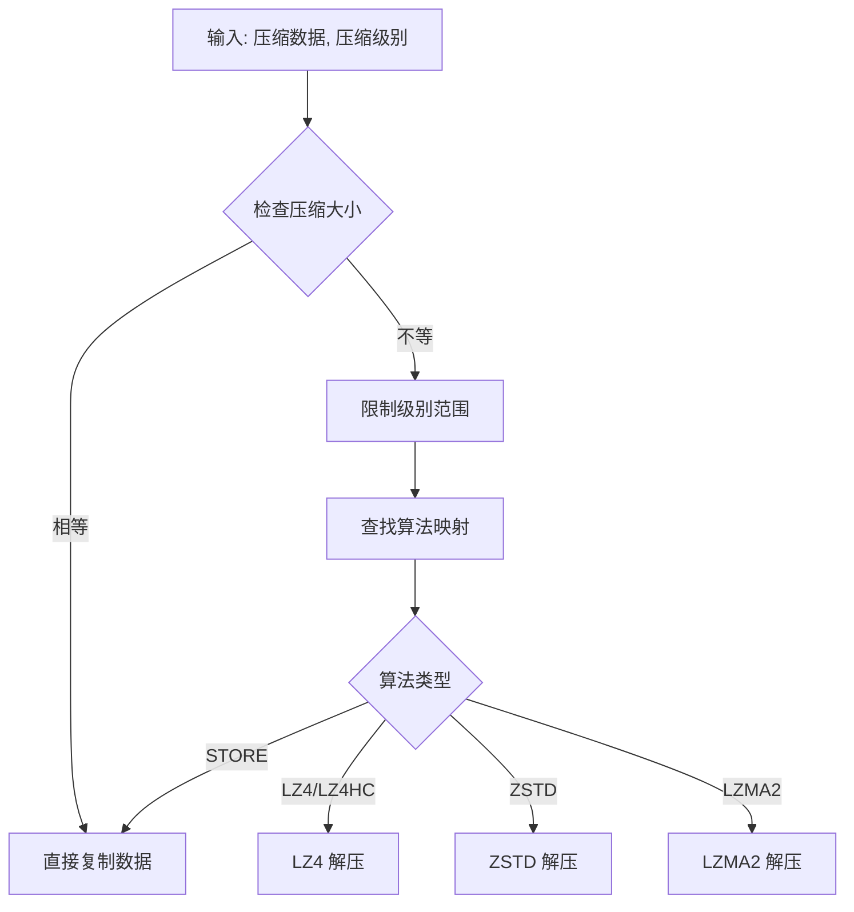

**图表来源**
- [xpack_compress.c](file://src/xpack_compress.c#L153-L220)

**章节来源**
- [xpack_compress.c](file://src/xpack_compress.c#L1-L251)

### 核心操作实现

#### 添加文件操作

添加文件到分卷包的过程：

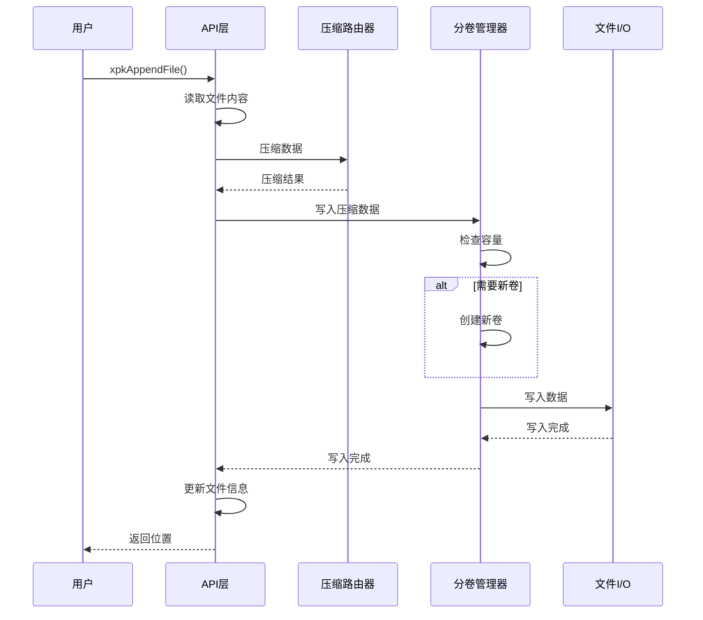

**图表来源**
- [xpack_core.c](file://src/xpack_core.c#L18-L117)

**章节来源**
- [xpack_core.c](file://src/xpack_core.c#L1-L403)

### 分卷管理器详细实现

#### 卷文件管理

分卷管理器实现了完整的卷文件生命周期管理：

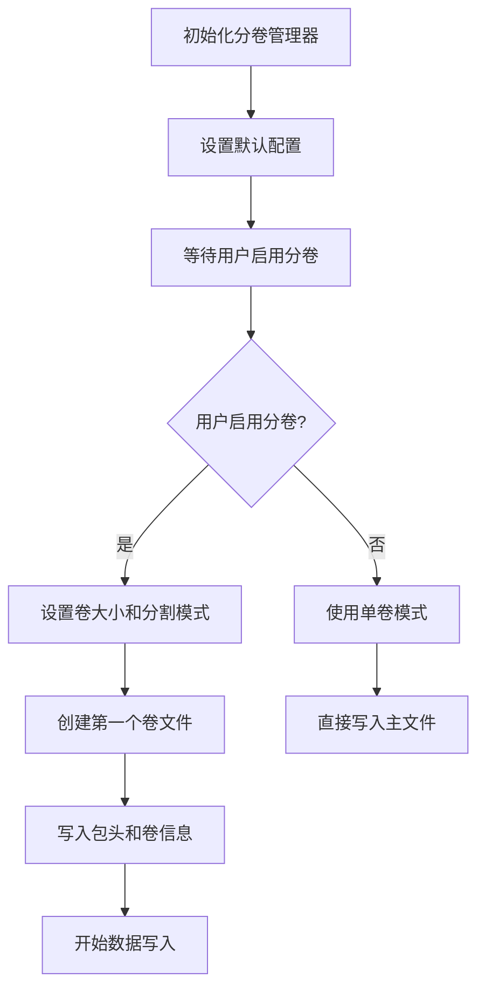

**图表来源**
- [xpack_volume.c](file://src/xpack_volume.c#L44-L60)
- [xpack_volume.c](file://src/xpack_volume.c#L113-L160)

#### 跨卷数据读写

跨卷数据读写机制确保数据的完整性和一致性：

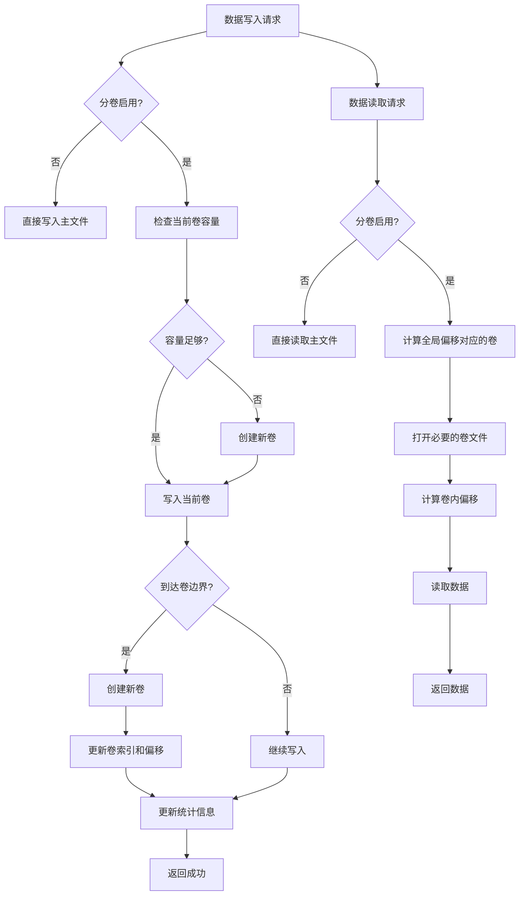

**图表来源**
- [xpack_volume.c](file://src/xpack_volume.c#L178-L229)
- [xpack_volume.c](file://src/xpack_volume.c#L235-L319)

**章节来源**
- [xpack_volume.c](file://src/xpack_volume.c#L1-L353)

## 依赖关系分析

### 外部依赖

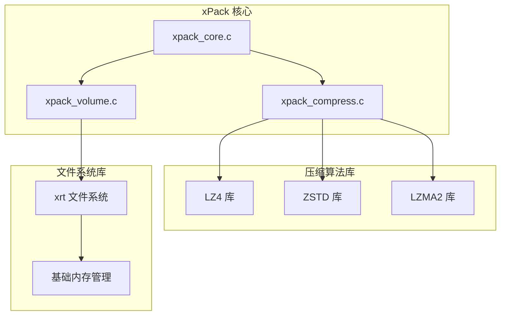

**图表来源**
- [xpack_compress.c](file://src/xpack_compress.c#L9-L14)
- [xpack_volume.c](file://src/xpack_volume.c#L7-L9)
- [base.h](file://lib/xrt/lib/base.h#L1-L132)

### 内部依赖关系

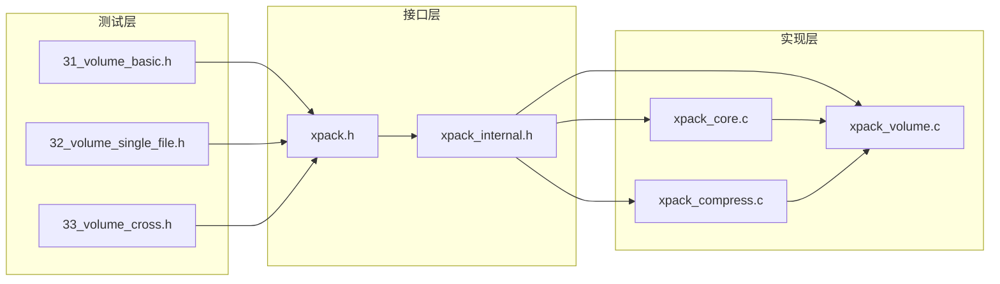

**图表来源**
- [xpack.h](file://src/xpack.h#L1-L447)
- [xpack_internal.h](file://src/xpack_internal.h#L1-L145)
- [test/31_volume_basic.h](file://test/31_volume_basic.h#L1-L65)

**章节来源**
- [xpack.h](file://src/xpack.h#L1-L447)
- [xpack_internal.h](file://src/xpack_internal.h#L1-L145)

## 性能考虑

### 卷大小建议

| 场景 | 推荐卷大小 | 说明 |
|------|-----------|------|
| 网络传输 | 50-100 MB | 便于断点续传 |
| 光盘刻录 | 700 MB | CD 容量 |
| DVD 刻录 | 4.7 GB | 单层 DVD 容量 |
| 云存储 | 100-500 MB | 限制上传大小 |
| 本地存储 | 无限制 | 设置为 0 |

### 性能优化策略

1. **延迟打开卷** - 按需打开非主卷
2. **卷缓存** - 缓存最近使用的卷文件句柄
3. **批量读取** - 尽量减少跨卷边界读取
4. **并行写入** - 多卷写入时可考虑并行（未来版本）

### 性能开销评估

| 操作 | 单卷模式 | 分卷模式 | 开销 |
|------|---------|---------|------|
| 顺序读取 | 1x | 1x | 0% |
| 跨卷读取 | N/A | ~1.05x | +5% |
| 随机读取 | 1x | ~1.1x | +10% |
| 顺序写入 | 1x | ~1.02x | +2% |
| 跨卷写入 | N/A | ~1.05x | +5% |

**章节来源**
- [volume_spec.md](file://docs/volume_spec.md#L720-L748)

## 故障排除指南

### 常见错误及解决方案

#### 错误码对照表

| 错误码 | 含义 | 解决方案 |
|--------|------|----------|
| 12 | 最大卷数超出 | 减少卷数量或扩展支持 |
| 13 | 卷文件丢失 | 检查文件路径和权限 |
| 14 | 卷数据不完整 | 验证卷完整性或重建包 |
| 15 | 卷头验证失败 | 修复头部信息或重新创建 |

#### 错误处理策略

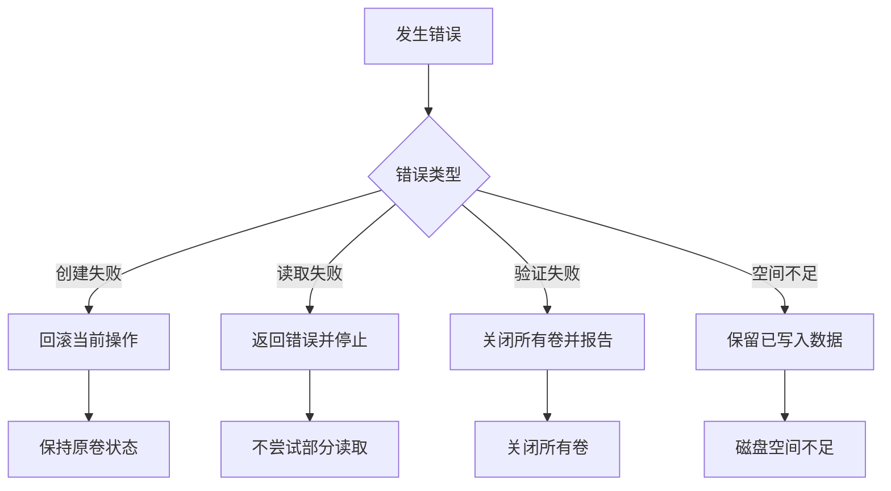

**图表来源**
- [volume_spec.md](file://docs/volume_spec.md#L698-L717)

### 测试验证

#### 基本功能测试

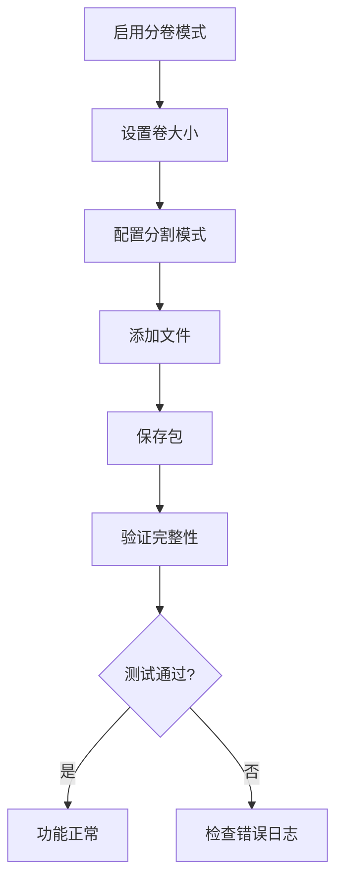

**图表来源**
- [31_volume_basic.h](file://test/31_volume_basic.h#L7-L23)

**章节来源**
- [31_volume_basic.h](file://test/31_volume_basic.h#L1-L65)
- [32_volume_single_file.h](file://test/32_volume_single_file.h#L1-L108)
- [33_volume_cross.h](file://test/33_volume_cross.h#L1-L147)

### API 接口详解

#### 分卷控制接口

分卷系统提供了完整的 API 接口来控制分卷行为：

```mermaid
flowchart TD
A[分卷控制接口] --> B[模式控制]
B --> C[xpkVolumeMode() - 检查模式]
B --> D[xpkVolumeModeSet() - 设置模式]
B --> E[容量控制]
E --> F[xpkVolumeSize() - 获取容量]
E --> G[xpkVolumeSizeSet() - 设置容量]
B --> H[分割模式]
H --> I[xpkVolumeSplitMode() - 获取模式]
H --> J[xpkVolumeSplitModeSet() - 设置模式]
B --> K[统计信息]
K --> L[xpkVolumeCount() - 获取卷数]
K --> M[xpkVolumeCurrent() - 获取当前卷]
K --> N[xpkVolumeStatGet() - 获取统计]
```

**图表来源**
- [volume_spec.md](file://docs/volume_spec.md#L281-L333)

**章节来源**
- [volume_spec.md](file://docs/volume_spec.md#L279-L333)

## 结论

xPack 体积压缩功能提供了一个完整、高效、透明的分卷压缩解决方案。通过精心设计的分卷管理器、灵活的压缩路由系统和标准化的文件格式，该系统能够满足各种规模和场景的压缩需求。

### 主要优势

1. **透明性** - 用户无需关心分卷细节
2. **灵活性** - 支持多种压缩算法和分割策略
3. **可靠性** - 完善的错误处理和恢复机制
4. **性能** - 优化的跨卷读写性能
5. **兼容性** - 向后兼容现有文件格式

### 未来发展方向

- 卷加密支持
- 恢复记录（记录卷校验和）
- 卷合并工具
- 卷拆分工具
- 压缩感知分卷（根据压缩比调整）
- 并行写入支持

该系统为大规模数据存储和传输提供了可靠的解决方案，是现代数据管理基础设施的重要组成部分。

**更新** 新增了352行的完整分卷管理器实现，包括智能卷创建、跨卷数据流处理、容量管理和文件格式规范等核心功能，显著增强了系统的可靠性和性能表现。