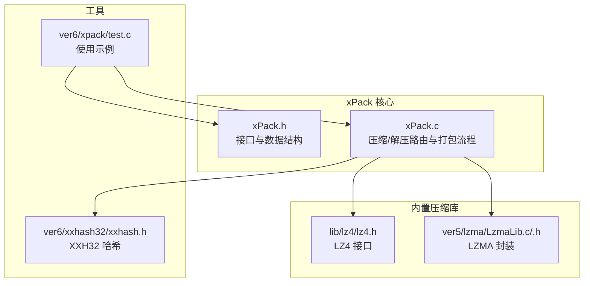
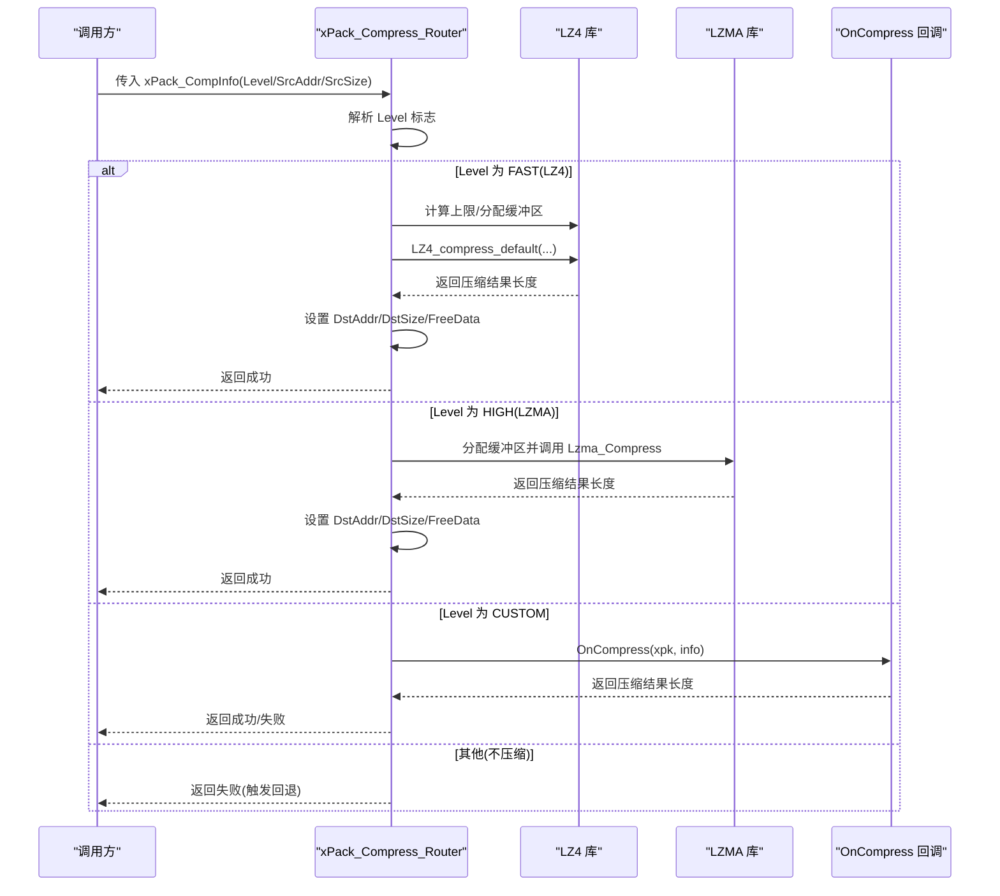
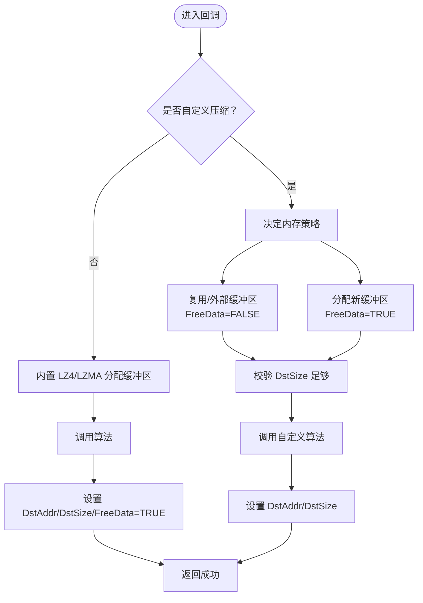
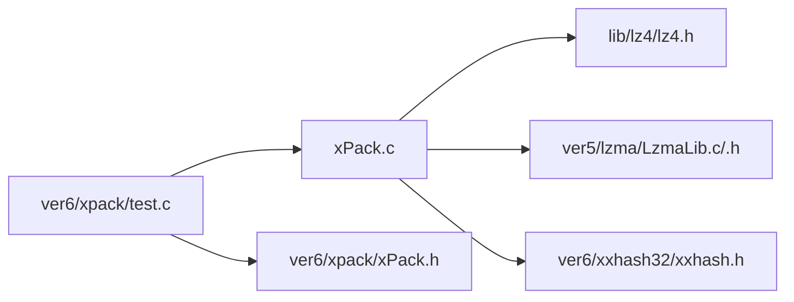

# 压缩回调函数

<cite>
**本文引用的文件**
- [xPack.h](file://ver6/xpack/xPack.h)
- [xPack.c](file://ver6/xpack/xPack.c)
- [lz4.h](file://lib/lz4/lz4.h)
- [LzmaLib.c](file://ver5/lzma/LzmaLib.c)
- [LzmaLib.h](file://ver5/lzma/LzmaLib.h)
- [xxhash.h](file://ver6/xxhash32/xxhash.h)
- [test.c](file://ver6/xpack/test.c)
- [压缩级别参数.txt](file://压缩级别参数.txt)
</cite>

## 目录
1. [简介](#简介)
2. [项目结构](#项目结构)
3. [核心组件](#核心组件)
4. [架构总览](#架构总览)
5. [详细组件分析](#详细组件分析)
6. [依赖关系分析](#依赖关系分析)
7. [性能考量](#性能考量)
8. [故障排查指南](#故障排查指南)
9. [结论](#结论)
10. [附录](#附录)

## 简介
本文围绕 xPack 的压缩回调函数 xPack_OnCompress 展开，系统讲解其函数签名、参数结构 xPack_CompInfo 的字段语义与返回值约定；详解压缩级别 Level 的作用与取值范围；说明源数据地址 SrcAddr 与源数据大小 SrcSize 的传递机制；阐述目标数据地址 DstAddr 与目标数据大小 DstSize 的分配与管理策略；解释 FreeData 标志位的含义与内存管理注意事项；并提供基于内置 LZ4、LZMA 的完整集成示例与自定义压缩算法的实现步骤与最佳实践，最后给出性能优化技巧与常见问题的解决方案。

## 项目结构
- 核心接口与数据结构位于 ver6/xpack/xPack.h
- 压缩/解压路由逻辑与文件打包流程位于 ver6/xpack/xPack.c
- 内置压缩库头文件与封装位于 lib/lz4/lz4.h 与 ver5/lzma/LzmaLib.c/.h
- 哈希校验位于 ver6/xxhash32/xxhash.h
- 使用示例位于 ver6/xpack/test.c
- 压缩级别参数参考位于 压缩级别参数.txt

**图示来源**
- [xPack.h](file://ver6/xpack/xPack.h#L86-L118)
- [xPack.c](file://ver6/xpack/xPack.c#L54-L159)
- [lz4.h](file://lib/lz4/lz4.h#L177-L200)
- [LzmaLib.c](file://ver5/lzma/LzmaLib.c#L9-L32)
- [LzmaLib.h](file://ver5/lzma/LzmaLib.h#L105-L127)
- [xxhash.h](file://ver6/xxhash32/xxhash.h#L1-L2)
- [test.c](file://ver6/xpack/test.c#L31-L66)

**章节来源**
- [xPack.h](file://ver6/xpack/xPack.h#L86-L118)
- [xPack.c](file://ver6/xpack/xPack.c#L54-L159)
- [lz4.h](file://lib/lz4/lz4.h#L177-L200)
- [LzmaLib.c](file://ver5/lzma/LzmaLib.c#L9-L32)
- [LzmaLib.h](file://ver5/lzma/LzmaLib.h#L105-L127)
- [xxhash.h](file://ver6/xxhash32/xxhash.h#L1-L2)
- [test.c](file://ver6/xpack/test.c#L31-L66)

## 核心组件
- xPack_CompInfo：压缩/解压回调的参数与结果载体，包含压缩级别、源数据指针与大小、目标数据指针与大小、以及 FreeData 标志位。
- xPack_Compress_Router：根据 Level 选择内置 LZ4 或 LZMA 压缩，或调用自定义 OnCompress 回调；失败时回退为不压缩。
- xPack_DeCompress_Router：根据 Level 选择内置 LZ4 或 LZMA 解压，或调用自定义 OnUnCompress 回调；失败时回退为不压缩。
- xPackObject：包含 OnError、OnCompress、OnUnCompress 回调指针，以及包文件头、列表段管理器等。

关键要点
- Level 的取值与行为由 XPK_COMP_FAST、XPK_COMP_HIGH、XPK_COMP_CUSTOM 等标志控制，最终通过按位与提取实际压缩方式。
- 对于内置 LZ4/LZMA，xPack 负责分配/释放内存并设置 FreeData；对于自定义压缩，由回调自行管理内存并设置 FreeData。
- 返回值约定：压缩/解压成功返回非零且通常小于原大小；失败返回零或负值，xPack 会进行回退处理。

**章节来源**
- [xPack.h](file://ver6/xpack/xPack.h#L86-L109)
- [xPack.c](file://ver6/xpack/xPack.c#L54-L159)

## 架构总览
xPack 在压缩/解压时，先解析 Level 的压缩方式，再调用对应内置算法或自定义回调。内置算法由 xPack 分配输出缓冲区并负责释放；自定义回调由使用者接管内存生命周期。

**图示来源**
- [xPack.c](file://ver6/xpack/xPack.c#L54-L101)
- [lz4.h](file://lib/lz4/lz4.h#L177-L191)
- [LzmaLib.c](file://ver5/lzma/LzmaLib.c#L9-L32)

**章节来源**
- [xPack.c](file://ver6/xpack/xPack.c#L54-L101)

## 详细组件分析

### 函数签名与返回值约定
- 函数签名
  - 压缩回调：uint OnCompress(ptr xpk, xPack_CompInfo* info)
  - 解压回调：uint OnUnCompress(ptr xpk, xPack_CompInfo* info)
- 返回值约定
  - 成功：返回压缩/解压后的数据长度，通常小于等于 SrcSize（压缩时）或等于解压后的原始长度（解压时）
  - 失败：返回 0 或负值，xPack 将进行回退处理（压缩时回退为不压缩；解压时回退为原指针）

注意
- 对于自定义压缩，xPack 不关心内部实现细节，仅要求回调正确填充 info 并返回有效长度。
- 若回调返回长度大于等于 SrcSize，xPack 会将其视为失败并回退。

**章节来源**
- [xPack.h](file://ver6/xpack/xPack.h#L107-L108)
- [xPack.c](file://ver6/xpack/xPack.c#L85-L101)

### 参数结构：xPack_CompInfo 字段详解
- Level：压缩级别与方式标志，支持 XPK_COMP_FAST、XPK_COMP_HIGH、XPK_COMP_CUSTOM 等
- SrcAddr：源数据地址（压缩时为原始数据；解压时为压缩数据）
- SrcSize：源数据大小（压缩时为原始数据大小；解压时为压缩数据大小）
- DstAddr：目标数据地址（输出缓冲区地址）
- DstSize：目标数据大小（输入时为期望输出缓冲区大小；输出时为实际写入长度）
- FreeData：内存释放标志
  - TRUE：表示 DstAddr 指向的内存由 xPack 分配，可在后续流程中安全释放
  - FALSE：表示 DstAddr 指向的内存由调用方持有，xPack 不应释放

重要规则
- 内置 LZ4/LZMA：xPack 分配 DstAddr 并设置 FreeData=TRUE；回调结束后由 xPack 释放
- 自定义压缩：回调自行分配/复用 DstAddr，若 xPack 需要释放，必须设置 FreeData=TRUE

**章节来源**
- [xPack.h](file://ver6/xpack/xPack.h#L86-L94)
- [xPack.c](file://ver6/xpack/xPack.c#L54-L101)

### 压缩级别（Level）的作用与取值范围
- 取值与行为
  - XPK_COMP_FAST：使用 LZ4 快速压缩
  - XPK_COMP_HIGH：使用 LZMA 高压缩比
  - XPK_COMP_CUSTOM：使用自定义压缩回调
  - XPK_COMP_NO：不压缩（在某些路径下作为默认）
- 与 ver7 的差异
  - ver6 中 Level 以 2bit 标志位组合的方式表达压缩方式
  - ver7 引入了更细粒度的 4bit 压缩级别参数，支持 0-15 的数值化级别，具备严格单调性（级别提升 → 压缩比提高 → 压缩/解压速度降低），并纯化为 ZSTD 方案，移除 LZMA2/XZ，保留 LZ4 系列以提供极速解压能力
- 实践建议
  - 对已高度压缩的数据（如图片、视频、已压缩包）使用 XPK_COMP_NO
  - 实时加载场景优先 LZ4（Level=1/2/3）
  - 通用场景可考虑 ZSTD（Level≈6）

**章节来源**
- [xPack.h](file://ver6/xpack/xPack.h#L15-L18)
- [压缩级别参数.txt](file://压缩级别参数.txt#L1-L20)

### 源数据地址与大小的传递机制
- 压缩时：SrcAddr 指向原始数据，SrcSize 为原始数据大小
- 解压时：SrcAddr 指向压缩数据，SrcSize 为压缩数据大小
- xPack 在调用回调前会确保这些字段已正确设置

**章节来源**
- [xPack.c](file://ver6/xpack/xPack.c#L466-L470)
- [xPack.c](file://ver6/xpack/xPack.c#L530-L535)
- [xPack.c](file://ver6/xpack/xPack.c#L599-L605)

### 目标数据地址与大小的分配与管理策略
- 内置 LZ4/LZMA
  - xPack 先估算/计算输出上限，分配 DstAddr 缓冲区
  - 调用算法后，设置 DstAddr/DstSize，并将 FreeData 设为 TRUE
  - 后续流程中，xPack 会在必要时释放该缓冲区
- 自定义压缩
  - 回调可选择：
    - 在 info 中提供自有缓冲区（例如复用输入缓冲区或外部池化内存），并将 DstAddr 指向该缓冲区，FreeData 设为 FALSE
    - 分配新的缓冲区，设置 DstAddr 与 DstSize，并将 FreeData 设为 TRUE，让 xPack 负责释放
  - 回调必须保证 DstAddr 指向的内存至少能容纳 DstSize 字节

**图示来源**
- [xPack.c](file://ver6/xpack/xPack.c#L54-L101)
- [xPack.c](file://ver6/xpack/xPack.c#L85-L101)

**章节来源**
- [xPack.c](file://ver6/xpack/xPack.c#L54-L101)

### FreeData 标志位的含义与内存管理注意事项
- FreeData=TRUE
  - 表示 DstAddr 指向的内存由 xPack 分配，应在合适时机释放
  - 内置 LZ4/LZMA 路径下，xPack 会在写入文件列表或后续流程中释放
- FreeData=FALSE
  - 表示 DstAddr 指向的内存由调用方持有，xPack 不应释放
  - 自定义回调必须确保该内存生命周期覆盖所有可能的读取与校验阶段
- 注意事项
  - 自定义回调若复用输入缓冲区，务必确保输入缓冲区在解压/校验期间保持有效
  - 自定义回调若分配新缓冲区，必须保证分配成功后再设置 DstAddr/DstSize/FreeData

**章节来源**
- [xPack.c](file://ver6/xpack/xPack.c#L64-L71)
- [xPack.c](file://ver6/xpack/xPack.c#L78-L84)
- [xPack.c](file://ver6/xpack/xPack.c#L112-L124)
- [xPack.c](file://ver6/xpack/xPack.c#L131-L142)

### 完整压缩回调实现示例（LZ4、LZMA 集成）
以下示例展示如何在自定义回调中集成 LZ4 与 LZMA：

- 集成 LZ4
  - 步骤
    - 估算输出上限：使用 LZ4_compressBound(SrcSize)
    - 分配缓冲区：xCore.malloc(上限)
    - 调用 LZ4_compress_default(SrcAddr, DstAddr, SrcSize, DstSize)
    - 校验返回值：若返回值 > 0 且 < SrcSize，则设置 DstSize=返回值，FreeData=TRUE，返回 TRUE
    - 否则释放缓冲区并返回 FALSE
  - 参考接口
    - [LZ4_compress_default](file://lib/lz4/lz4.h#L177-L191)
    - [LZ4_compressBound](file://lib/lz4/lz4.h#L106)

- 集成 LZMA
  - 步骤
    - 分配缓冲区：大小为 SrcSize（或更大）
    - 调用 Lzma_Compress(SrcAddr, DstAddr, SrcSize, SrcSize, preset=6)
    - 校验返回值：若返回值 > 0 且 < SrcSize，则设置 DstSize=返回值，FreeData=TRUE，返回 TRUE
    - 否则释放缓冲区并返回 FALSE
  - 参考接口
    - [Lzma_Compress](file://ver5/lzma/LzmaLib.c#L9-L32)
    - [LzmaLib.h](file://ver5/lzma/LzmaLib.h#L105-L127)

- 示例参考
  - 测试用例展示了不同压缩方式的使用（XPK_COMP_NO、XPK_COMP_FAST、XPK_COMP_HIGH）
  - 参考：[test.c](file://ver6/xpack/test.c#L31-L66)

**章节来源**
- [lz4.h](file://lib/lz4/lz4.h#L177-L191)
- [LzmaLib.c](file://ver5/lzma/LzmaLib.c#L9-L32)
- [LzmaLib.h](file://ver5/lzma/LzmaLib.h#L105-L127)
- [test.c](file://ver6/xpack/test.c#L31-L66)

### 自定义压缩算法的实现步骤与最佳实践
- 实现步骤
  - 评估输入数据特征：是否已高度压缩、是否需要无损压缩、对速度/空间的要求
  - 选择算法：可选用现有库（如 LZ4/ZSTD/LZMA）或自研算法
  - 决策内存策略：是否复用输入缓冲区（需保证生命周期）、是否分配新缓冲区
  - 实现回调：在 OnCompress 中完成压缩，设置 DstAddr/DstSize/FreeData
  - 错误处理：任何失败均返回 0 或负值，交由 xPack 回退
- 最佳实践
  - 优先使用成熟的压缩库，确保边界条件与安全性
  - 对于高频调用场景，尽量减少内存分配次数，采用池化或复用策略
  - 明确 FreeData 的设置，避免重复释放或泄漏
  - 提供合理的压缩级别映射，便于上层统一配置

**章节来源**
- [xPack.c](file://ver6/xpack/xPack.c#L85-L101)

## 依赖关系分析
- xPack.c 依赖内置 LZ4 与 LZMA 的封装接口
- 哈希校验依赖 xxHash
- 测试用例演示了不同压缩方式的使用

**图示来源**
- [xPack.c](file://ver6/xpack/xPack.c#L16-L27)
- [lz4.h](file://lib/lz4/lz4.h#L1-L34)
- [LzmaLib.c](file://ver5/lzma/LzmaLib.c#L1-L8)
- [xxhash.h](file://ver6/xxhash32/xxhash.h#L1-L2)
- [test.c](file://ver6/xpack/test.c#L15-L16)

**章节来源**
- [xPack.c](file://ver6/xpack/xPack.c#L16-L27)
- [test.c](file://ver6/xpack/test.c#L15-L16)

## 性能考量
- 压缩速度与压缩比权衡
  - LZ4：极高速度，适合实时加载与频繁解压场景
  - LZMA：高压缩比，适合离线打包与存储空间敏感场景
  - ZSTD（ver7）：在速度与压缩比之间提供良好平衡，适合通用场景
- 输出缓冲区大小
  - 内置 LZ4 使用 LZ4_compressBound 估算上限，避免二次分配
  - LZMA 分配 SrcSize 缓冲区，兼顾稳定性与可控性
- 内存管理
  - 尽量减少分配次数，优先复用缓冲区（FreeData=FALSE）
  - 对于自定义算法，确保分配与释放的配对，避免碎片化
- I/O 与校验
  - 使用 XXH32 进行哈希校验，确保数据完整性
  - 写入文件列表时，优先使用内置 LZMA 压缩 LDB 段，提升整体包体积

**章节来源**
- [xPack.c](file://ver6/xpack/xPack.c#L173-L191)
- [xxhash.h](file://ver6/xxhash32/xxhash.h#L1-L2)
- [压缩级别参数.txt](file://压缩级别参数.txt#L10-L20)

## 故障排查指南
- 常见错误与定位
  - 内存申请失败：检查 xCore.malloc 返回值，确认 DstSize 上限合理
  - 压缩失败回退：当 OnCompress 返回失败时，xPack 会回退为不压缩；可通过 OnError 回调获取错误文本
  - 解压失败：检查 DstSize 是否足够，FreeData 设置是否正确
  - 哈希校验失败：确认压缩/解压过程中未修改原始数据，且 DstSize 与原始长度一致
- 建议排查步骤
  - 打印 Level、SrcSize、返回长度，核对是否符合预期
  - 对比内置 LZ4/LZMA 的返回值，判断是否为自定义算法问题
  - 检查 FreeData 与内存释放逻辑，避免重复释放或泄漏
  - 使用测试用例中的不同压缩方式对比，快速定位问题

**章节来源**
- [xPack.c](file://ver6/xpack/xPack.c#L36-L51)
- [xPack.c](file://ver6/xpack/xPack.c#L54-L101)
- [xPack.c](file://ver6/xpack/xPack.c#L103-L159)

## 结论
xPack 的压缩回调函数为用户提供灵活的压缩策略选择：既可直接使用内置 LZ4/LZMA，也可完全自定义压缩算法。通过清晰的参数结构与返回值约定、严格的内存管理规范（FreeData 标志位），xPack 在保证易用性的同时提供了高性能与高可靠性的压缩/解压能力。结合合适的压缩级别与内存策略，可在不同应用场景下取得最优的性能表现。

## 附录
- 使用示例参考
  - Core 模式添加文件与解包：[test.c](file://ver6/xpack/test.c#L31-L66)
  - Index/Win32 模式示例：[test.c](file://ver6/xpack/test.c#L70-L145)
- 相关接口参考
  - xPack_CompInfo 定义：[xPack.h](file://ver6/xpack/xPack.h#L86-L94)
  - 压缩/解压路由：[xPack.c](file://ver6/xpack/xPack.c#L54-L159)
  - LZ4 接口：[lz4.h](file://lib/lz4/lz4.h#L177-L191)
  - LZMA 接口：[LzmaLib.c](file://ver5/lzma/LzmaLib.c#L9-L32)，[LzmaLib.h](file://ver5/lzma/LzmaLib.h#L105-L127)
  - 哈希校验：[xxhash.h](file://ver6/xxhash32/xxhash.h#L1-L2)
  - 压缩级别参数（ver7）：[压缩级别参数.txt](file://压缩级别参数.txt#L1-L20)