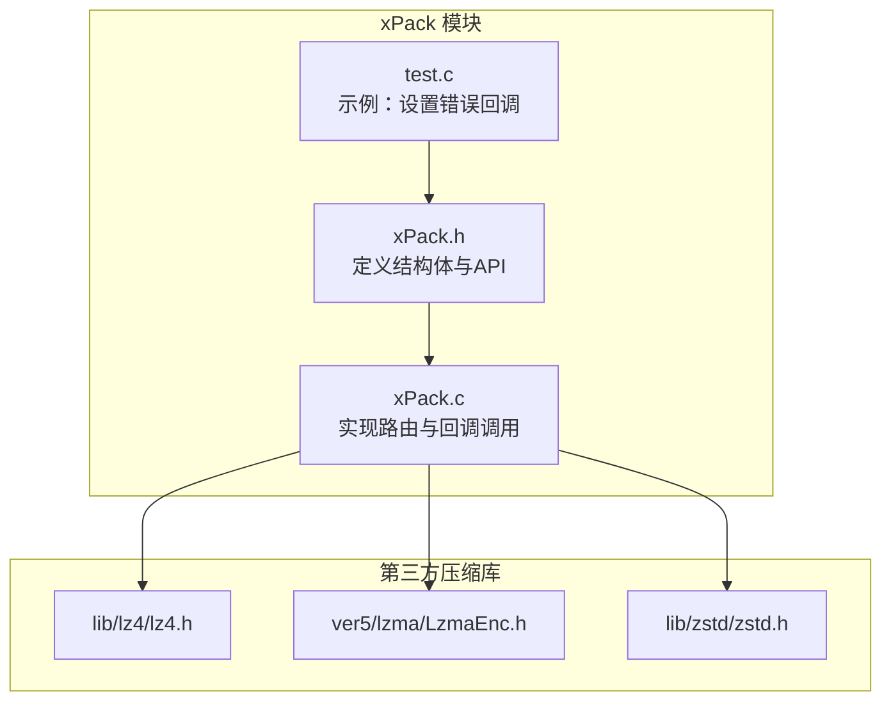
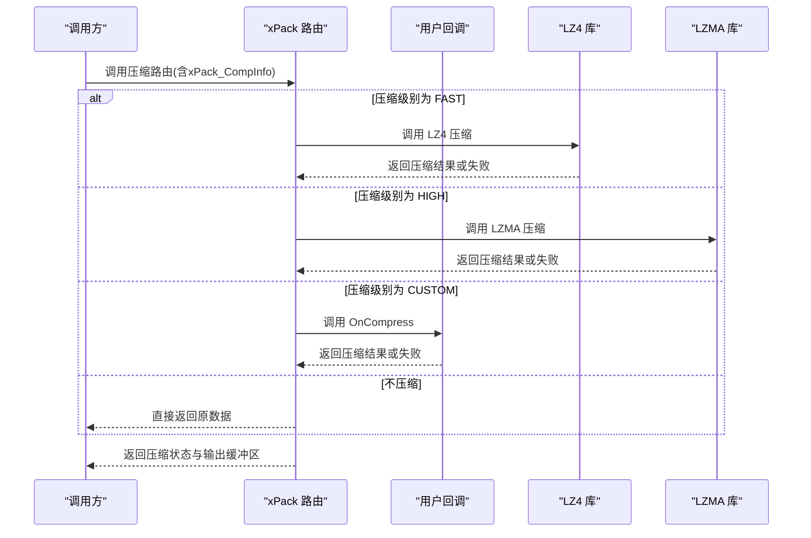
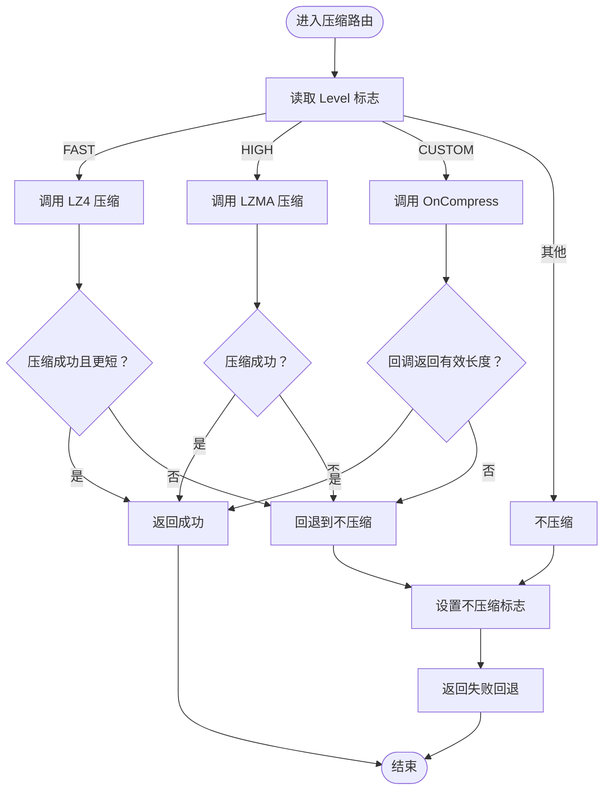
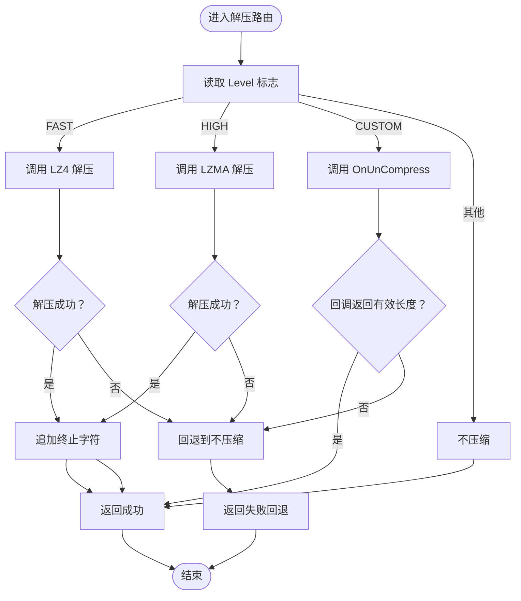
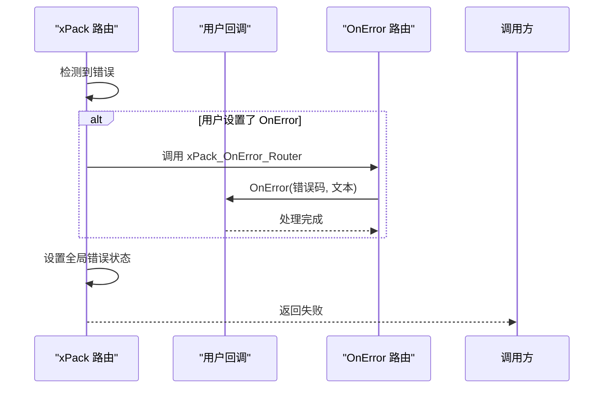
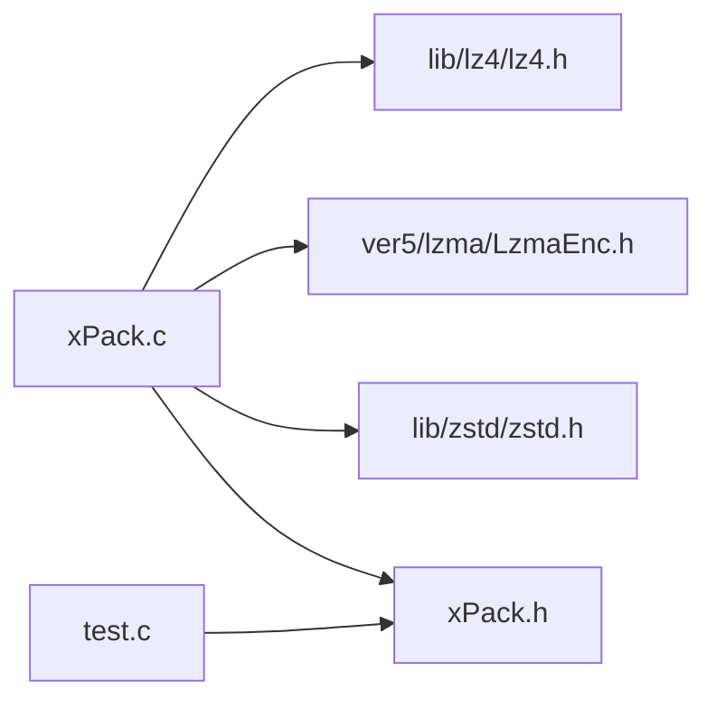

# 回调机制

<cite>
**本文引用的文件**
- [xPack.h](file://ver6/xpack/xPack.h)
- [xPack.c](file://ver6/xpack/xPack.c)
- [test.c](file://ver6/xpack/test.c)
- [lz4.h](file://lib/lz4/lz4.h)
- [lzma.h](file://ver5/lzma/LzmaEnc.h)
- [zstd.h](file://lib/zstd/zstd.h)
</cite>

## 目录
1. [简介](#简介)
2. [项目结构](#项目结构)
3. [核心组件](#核心组件)
4. [架构总览](#架构总览)
5. [详细组件分析](#详细组件分析)
6. [依赖关系分析](#依赖关系分析)
7. [性能考量](#性能考量)
8. [故障排查指南](#故障排查指南)
9. [结论](#结论)

## 简介
本文聚焦于 xPack 的回调机制，系统阐述压缩回调（xPack_OnCompress）、解压回调（xPack_OnUnCompress）与错误处理回调（xPack_OnError）的设计与实现，给出回调函数签名、参数语义、返回值约定及生命周期管理要点；并提供通过回调集成第三方压缩库的实践思路与最佳实践，覆盖多线程安全与异常恢复策略。

## 项目结构
- 回调机制核心位于 xPack 模块，对外暴露回调字段与路由接口，内部通过路由函数根据压缩级别选择内置或自定义压缩路径。
- 测试程序演示了如何设置错误回调，以及不同压缩级别的使用方式。

图表来源
- [xPack.h](file://ver6/xpack/xPack.h#L98-L127)
- [xPack.c](file://ver6/xpack/xPack.c#L54-L159)
- [test.c](file://ver6/xpack/test.c#L19-L22)

章节来源
- [xPack.h](file://ver6/xpack/xPack.h#L98-L127)
- [xPack.c](file://ver6/xpack/xPack.c#L54-L159)
- [test.c](file://ver6/xpack/test.c#L19-L22)

## 核心组件
- 回调结构体字段
  - 错误回调：OnError
  - 压缩回调：OnCompress
  - 解压回调：OnUnCompress
- 路由函数
  - 压缩路由：xPack_Compress_Router
  - 解压路由：xPack_DeCompress_Router
- 回调信息结构体：xPack_CompInfo，承载压缩/解压所需数据与结果

章节来源
- [xPack.h](file://ver6/xpack/xPack.h#L98-L117)
- [xPack.c](file://ver6/xpack/xPack.c#L54-L159)

## 架构总览
xPack 将“压缩/解压”抽象为统一的路由层，路由层根据压缩级别决定使用内置算法（如 LZ4、LZMA）还是调用用户提供的自定义回调。错误通过统一的错误路由触发用户注册的 OnError 回调。

图表来源
- [xPack.c](file://ver6/xpack/xPack.c#L54-L101)
- [lz4.h](file://lib/lz4/lz4.h#L646-L670)
- [lzma.h](file://ver5/lzma/LzmaEnc.h#L1-L50)

## 详细组件分析

### 回调函数签名与约定
- 错误回调
  - 签名：void OnError(int iErrCode, str sErrText)
  - 参数
    - iErrCode：错误码（枚举值）
    - sErrText：对应错误文本描述
  - 作用：统一上报错误，便于上层记录日志或中断流程
- 压缩回调
  - 签名：uint OnCompress(ptr xpk, xPack_CompInfo* info)
  - 参数
    - xpk：xPack 对象指针
    - info：压缩信息结构体（见下）
  - 返回值
    - 成功：返回压缩后数据长度（小于等于源长度）
    - 失败：返回非正值（通常为 0），表示回退到不压缩
- 解压回调
  - 签名：uint OnUnCompress(ptr xpk, xPack_CompInfo* info)
  - 参数
    - xpk：xPack 对象指针
    - info：解压信息结构体（见下）
  - 返回值
    - 成功：返回解压后数据长度（与目标缓冲区容量一致）
    - 失败：返回非正值（通常为 0），表示解压失败

- xPack_CompInfo 结构体字段
  - Level：压缩级别（XPK_COMP_*）
  - SrcAddr：源数据地址
  - SrcSize：源数据长度
  - DstAddr：输出缓冲区地址（可能为压缩/解压后的数据）
  - DstSize：输入/输出缓冲区大小（输入时为期望解压后大小，输出时为实际长度）
  - FreeData：指示原始数据是否可释放（避免返回数据与原始数据指向同一块内存）

章节来源
- [xPack.h](file://ver6/xpack/xPack.h#L86-L117)
- [xPack.c](file://ver6/xpack/xPack.c#L54-L159)

### 路由与回调调用流程

#### 压缩路由（xPack_Compress_Router）
- 逻辑分支
  - FAST（LZ4）：调用 LZ4 压缩，若压缩有效且长度更短则返回成功，否则回退到不压缩
  - HIGH（LZMA）：调用 LZMA 压缩，若压缩有效则返回成功，否则回退到不压缩
  - CUSTOM：若用户设置了 OnCompress，则调用之；成功条件同上
  - 其他：不压缩，直接返回原数据
- 内存管理
  - 成功时：若分配了新缓冲区，设置 FreeData 标志，供上层释放
  - 失败时：释放临时缓冲区，避免泄漏

图表来源
- [xPack.c](file://ver6/xpack/xPack.c#L54-L101)

章节来源
- [xPack.c](file://ver6/xpack/xPack.c#L54-L101)

#### 解压路由（xPack_DeCompress_Router）
- 逻辑分支
  - FAST（LZ4）：调用 LZ4 解压，成功则返回；失败则回退到不压缩
  - HIGH（LZMA）：调用 LZMA 解压，成功则返回；失败则回退到不压缩
  - CUSTOM：若用户设置了 OnUnCompress，则调用之；成功则返回
  - 其他：不压缩，直接返回原数据
- 字符串安全
  - 成功时在目标缓冲区末尾追加若干终止字符，便于 C 风格字符串读取

图表来源
- [xPack.c](file://ver6/xpack/xPack.c#L103-L159)

章节来源
- [xPack.c](file://ver6/xpack/xPack.c#L103-L159)

### 错误处理回调（xPack_OnError）
- 触发时机
  - 路由层在检测到资源不足、IO 失败、格式错误等情形时，通过宏触发用户注册的 OnError
- 宏定义
  - xPack_OnError_Router：若用户设置了 OnError，则调用之
  - xProc_OnError_Router：设置全局错误状态并返回失败
- 错误码与文本
  - 路由层维护错误码到文本的映射数组，便于统一输出

图表来源
- [xPack.c](file://ver6/xpack/xPack.c#L35-L53)

章节来源
- [xPack.c](file://ver6/xpack/xPack.c#L35-L53)

### 自定义压缩算法集成示例（思路）
- 目标：通过 OnCompress/OnUnCompress 集成第三方压缩库（如 ZSTD）
- 步骤
  - 在打开包后设置回调：xpk->OnCompress = MyCompress; xpk->OnUnCompress = MyUnCompress;
  - 在回调中：
    - 压缩：根据 info->Level 选择第三方库的参数；将压缩结果写入 info->DstAddr，设置 info->DstSize 为实际长度；返回长度
    - 解压：根据 info->SrcSize 与 info->DstSize 调整目标缓冲区；将解压结果写入 info->DstAddr；返回长度
  - 注意：若第三方库返回失败，返回非正值，让路由层回退到不压缩
- 参考第三方库接口
  - LZ4：参见 lz4.h 中的压缩/解压函数声明
  - LZMA：参见 ver5/lzma/LzmaEnc.h
  - ZSTD：参见 lib/zstd/zstd.h

章节来源
- [xPack.h](file://ver6/xpack/xPack.h#L106-L108)
- [xPack.c](file://ver6/xpack/xPack.c#L85-L92)
- [lz4.h](file://lib/lz4/lz4.h#L646-L670)
- [lzma.h](file://ver5/lzma/LzmaEnc.h#L1-L50)
- [zstd.h](file://lib/zstd/zstd.h#L1-L50)

### 生命周期与内存管理
- 生命周期
  - 注册：在 xPack_Open 后、首次写入前设置回调
  - 使用：在压缩/解压过程中由路由层调用
  - 释放：xPack_Close 会清理资源，但不负责释放用户回调中的自有资源
- 内存管理
  - 路由层在成功压缩/解压后，若分配了新缓冲区，会设置 FreeData 标志，提示上层释放
  - 若回调自行分配/复用缓冲区，应确保在合适时机释放，避免泄漏
  - 对于字符串类数据，解压成功后会在末尾追加终止字符，便于直接按 C 字符串读取

章节来源
- [xPack.c](file://ver6/xpack/xPack.c#L60-L71)
- [xPack.c](file://ver6/xpack/xPack.c#L109-L124)
- [xPack.c](file://ver6/xpack/xPack.c#L131-L141)

### 多线程安全指南
- 线程模型
  - xPack.c 中包含 DLL 入口的线程事件处理框架，表明库具备基本的线程感知能力
- 使用建议
  - 回调函数应尽量保持无副作用、可重入；避免共享可变状态
  - 若回调需要访问共享资源，应在回调内部进行必要的同步（锁/信号量）
  - 对于第三方库（如 LZ4、LZMA、ZSTD），请遵循其官方并发模型与线程安全文档
  - 避免在回调中长时间阻塞，以免影响整体压缩/解压性能

章节来源
- [xPack.c](file://ver6/xpack/xPack.c#L948-L967)

## 依赖关系分析
- 路由层依赖第三方压缩库接口（LZ4、LZMA、ZSTD）
- 路由层通过统一的 xPack_CompInfo 与回调交互
- 错误处理通过统一的错误码映射与回调路由

图表来源
- [xPack.c](file://ver6/xpack/xPack.c#L18-L27)
- [xPack.h](file://ver6/xpack/xPack.h#L98-L127)
- [test.c](file://ver6/xpack/test.c#L19-L22)

章节来源
- [xPack.c](file://ver6/xpack/xPack.c#L18-L27)
- [xPack.h](file://ver6/xpack/xPack.h#L98-L127)
- [test.c](file://ver6/xpack/test.c#L19-L22)

## 性能考量
- 压缩级别与性能
  - FAST（LZ4）：追求极致解压速度，适合实时/游戏场景
  - HIGH（LZMA）：追求高压缩比，适合离线打包
  - CUSTOM：可按需选择第三方库参数，平衡压缩比与速度
- 路由层回退策略
  - 当压缩无效或失败时，路由层会自动回退到不压缩，保证可用性
- 缓冲区与拷贝
  - 路由层在必要时分配新缓冲区，减少重复拷贝；回调应尽量复用缓冲区以降低开销

## 故障排查指南
- 常见错误码与处理
  - 文件无法访问、格式不正确、内存申请失败、文件列表读取/写入失败、哈希校验失败等
  - 建议：在 OnError 中记录 iErrCode 与 sErrText，结合日志定位问题
- 回调失败的常见原因
  - 第三方库返回失败（长度为 0 或负数）
  - 缓冲区大小不足或未正确设置 DstSize
  - 回调未释放临时资源导致内存泄漏
- 恢复策略
  - 回调失败时，路由层会回退到不压缩；可在上层记录并尝试降级策略
  - 对于 IO 错误，检查文件路径、权限与磁盘空间

章节来源
- [xPack.c](file://ver6/xpack/xPack.c#L35-L53)
- [xPack.c](file://ver6/xpack/xPack.c#L186-L190)
- [xPack.c](file://ver6/xpack/xPack.c#L477-L481)

## 结论
xPack 的回调机制通过统一的路由层与 xPack_CompInfo 结构体，实现了对内置与自定义压缩算法的无缝集成。错误处理回调提供了集中化的错误上报通道。遵循本文的签名约定、生命周期与内存管理要点，以及多线程安全与异常恢复策略，即可稳定地将第三方压缩库接入 xPack，获得灵活、高性能的压缩方案。