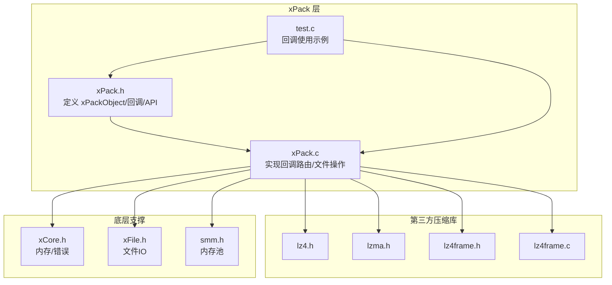
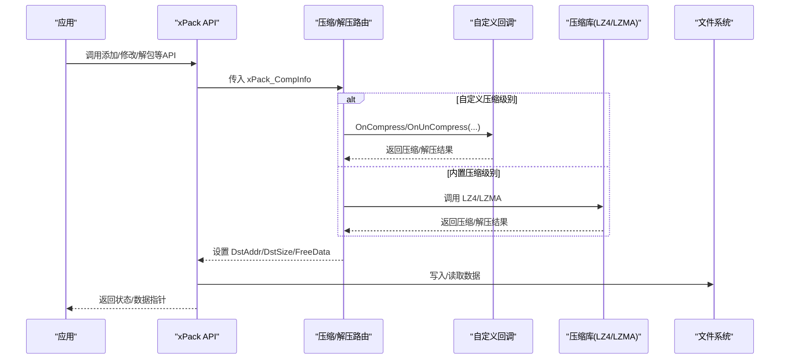
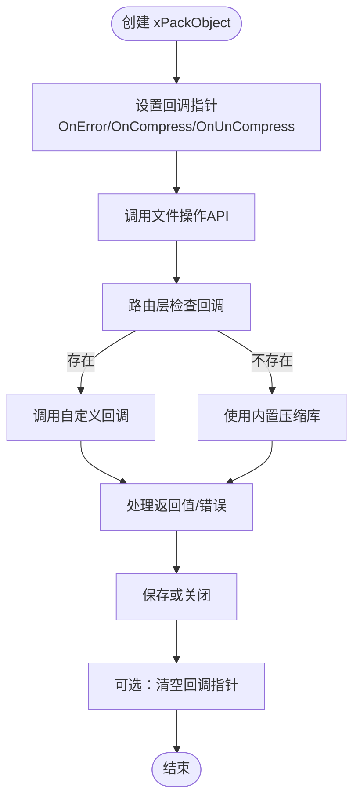
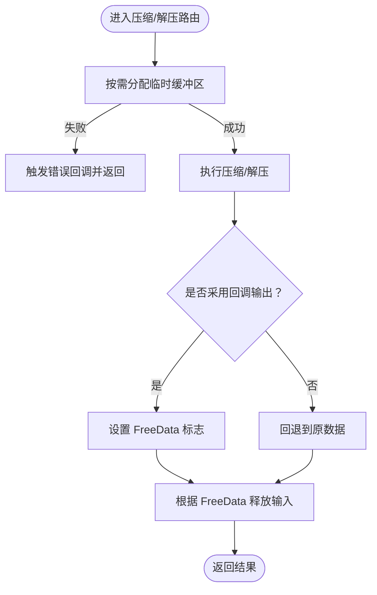
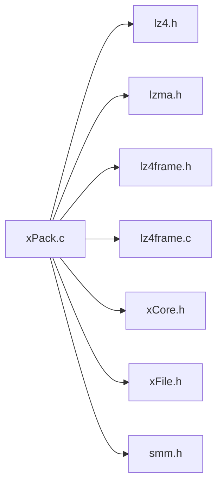

# 回调生命周期管理

<cite>
**本文引用的文件**
- [xPack.h](file://ver6/xpack/xPack.h)
- [xPack.c](file://ver6/xpack/xPack.c)
- [xPack.h（发布版）](file://ver6/xpack/release/inc/xPack.h)
- [test.c](file://ver6/xpack/test.c)
- [lz4.h](file://ver5/lz4/lz4.h)
- [LzmaLib.h](file://ver5/lzma/LzmaLib.h)
- [lz4frame.h](file://lib/lz4/lz4frame.h)
- [lz4frame.c](file://lib/lz4/lz4frame.c)
- [lz4.h（库）](file://lib/lz4/lz4.h)
- [lzma.h（库）](file://ver5/lzma/lzma.h)
- [xCore.h](file://ver6/xCore/xCore.h)
- [xFile.h](file://ver6/xFile/xFile.h)
- [smm.h](file://ver6/xpack/release/inc/smm.h)
</cite>

## 目录
1. [简介](#简介)
2. [项目结构](#项目结构)
3. [核心组件](#核心组件)
4. [架构总览](#架构总览)
5. [详细组件分析](#详细组件分析)
6. [依赖分析](#依赖分析)
7. [性能考量](#性能考量)
8. [故障排查指南](#故障排查指南)
9. [结论](#结论)
10. [附录](#附录)

## 简介
本文件系统性阐述 xPack 回调机制的生命周期与内存管理策略，重点覆盖以下方面：
- 回调函数的注册、调用时机与注销流程
- 在不同文件包操作（添加、修改、删除、解包）中的触发条件
- 线程安全性与并发访问控制
- 内存分配与释放策略，含临时缓冲区管理
- 错误处理与异常传播机制
- 完整示例：如何正确初始化、使用与清理回调
- 回调与 xPackObject 的关联关系与作用域管理
- 最佳实践与常见陷阱

## 项目结构
围绕回调机制的关键文件与职责如下：
- ver6/xpack/xPack.h：定义 xPackObject、回调函数指针、压缩/解压信息结构、公开 API
- ver6/xpack/xPack.c：实现回调路由、压缩/解压入口、文件包的增删改查、保存与关闭
- ver6/xpack/release/inc/xPack.h：发布版头文件，接口一致
- ver6/xpack/test.c：演示 OnError 回调的注册与使用
- 第三方压缩库头文件：lz4.h、lzma.h、lz4frame.h/c，用于底层压缩/解压
- ver6/xCore/xCore.h、ver6/xFile/xFile.h、ver6/xpack/release/inc/smm.h：底层内存、文件与内存池接口

图表来源
- [xPack.h](file://ver6/xpack/xPack.h#L98-L119)
- [xPack.c](file://ver6/xpack/xPack.c#L54-L159)
- [lz4.h](file://ver5/lz4/lz4.h#L86-L109)
- [lzma.h（库）](file://ver5/lzma/lzma.h)
- [lz4frame.h](file://lib/lz4/lz4frame.h#L354-L373)
- [lz4frame.c](file://lib/lz4/lz4frame.c#L1624-L1644)
- [xCore.h](file://ver6/xCore/xCore.h)
- [xFile.h](file://ver6/xFile/xFile.h)
- [smm.h](file://ver6/xpack/release/inc/smm.h)

章节来源
- [xPack.h](file://ver6/xpack/xPack.h#L98-L119)
- [xPack.c](file://ver6/xpack/xPack.c#L54-L159)
- [xPack.h（发布版）](file://ver6/xpack/release/inc/xPack.h#L108-L119)
- [test.c](file://ver6/xpack/test.c#L19-L275)

## 核心组件
- xPackObject：封装文件句柄、偏移、只读标志、变更标志、包头、列表数据管理器以及三类回调
  - OnError：错误回调
  - OnCompress：自定义压缩回调
  - OnUnCompress：自定义解压回调
- xPack_CompInfo：压缩/解压参数与返回数据结构，包含 Level、SrcAddr/SrcSize、DstAddr/DstSize、FreeData
- 路由函数：
  - xPack_Compress_Router：根据级别选择 LZ4/LZMA 或自定义回调
  - xPack_DeCompress_Router：根据级别选择 LZ4/LZMA 或自定义回调

章节来源
- [xPack.h](file://ver6/xpack/xPack.h#L98-L119)
- [xPack.h](file://ver6/xpack/xPack.h#L86-L94)
- [xPack.c](file://ver6/xpack/xPack.c#L54-L159)

## 架构总览
xPack 将“业务操作”与“底层压缩/解压”解耦：
- 业务层通过 API 触发文件操作（添加/修改/删除/解包）
- 路由层根据压缩级别决定使用内置压缩库或调用用户自定义回调
- 回调负责实际的数据压缩/解压，并返回结果给路由层
- 路由层统一处理内存分配、释放与错误传播

图表来源
- [xPack.c](file://ver6/xpack/xPack.c#L54-L159)
- [xPack.h](file://ver6/xpack/xPack.h#L86-L119)

## 详细组件分析

### 回调注册与注销
- 注册：在 xPackObject 上设置回调指针（例如 OnError、OnCompress、OnUnCompress）
- 使用：在压缩/解压路由中按需调用
- 注销：xPack_Close 会释放 xPackObject；若需要，可在业务侧将回调指针置空以避免悬挂引用

图表来源
- [xPack.c](file://ver6/xpack/xPack.c#L54-L159)
- [xPack.c](file://ver6/xpack/xPack.c#L205-L216)
- [xPack.h](file://ver6/xpack/xPack.h#L98-L119)

章节来源
- [xPack.c](file://ver6/xpack/xPack.c#L205-L216)
- [xPack.h](file://ver6/xpack/xPack.h#L98-L119)
- [test.c](file://ver6/xpack/test.c#L19-L275)

### 回调调用时机与触发条件
- 添加文件/数据（Core/Index/Linux/Win32）：在写入数据前进行压缩，若启用自定义压缩级别则调用 OnCompress
- 修改文件/数据：先读取旧数据，再对新数据进行压缩，调用 OnCompress
- 解包文件/数据：若文件标记为自定义压缩级别，调用 OnUnCompress；否则走内置解压
- 保存包：写入 LDB 列表前进行压缩，调用 OnCompress；发生错误时通过 OnError 通知

章节来源
- [xPack.c](file://ver6/xpack/xPack.c#L451-L515)
- [xPack.c](file://ver6/xpack/xPack.c#L517-L580)
- [xPack.c](file://ver6/xpack/xPack.c#L582-L654)
- [xPack.c](file://ver6/xpack/xPack.c#L163-L203)

### 错误回调 OnError 的传播机制
- 路由层在关键错误点调用 xPack_OnError_Router，将错误码与文本传递给用户回调
- 同时设置 xCore.LastErrorID 与 xCore.LastError，便于上层统一处理
- 业务侧可在 OnError 中记录日志、中断流程或进行补偿

章节来源
- [xPack.c](file://ver6/xpack/xPack.c#L35-L53)
- [xPack.c](file://ver6/xpack/xPack.c#L163-L203)
- [test.c](file://ver6/xpack/test.c#L19-L275)

### 自定义压缩回调 OnCompress/OnUnCompress
- OnCompress：接收 xPack_CompInfo，返回压缩后数据与长度；若压缩效果不佳，可返回原数据以回退
- OnUnCompress：接收压缩数据，返回解压后数据与长度
- 路由层根据返回值决定是否采用回调输出，并依据 FreeData 决定是否释放原始输入

章节来源
- [xPack.c](file://ver6/xpack/xPack.c#L54-L159)
- [xPack.h](file://ver6/xpack/xPack.h#L86-L119)

### 线程安全与并发访问控制
- xPack.c 中未显式加锁，建议：
  - 单线程使用：在单线程上下文中直接调用 API
  - 多线程使用：在业务层自行加锁保护同一 xPackObject 的并发调用
  - 回调函数内部应避免阻塞与递归调用 xPack API，防止死锁
- DLLMain 中对线程附加/分离事件留空，不进行特殊处理

章节来源
- [xPack.c](file://ver6/xpack/xPack.c#L948-L967)

### 内存管理策略与临时缓冲区
- 路由层在压缩/解压前按需分配临时缓冲区，失败时立即释放并触发错误回调
- 当回调返回数据时，路由层根据 FreeData 决定是否释放原始输入
- 解包时为字符串末尾预留终止符空间，确保字符串安全访问
- 保存/关闭时释放 xPackObject 与相关资源

图表来源
- [xPack.c](file://ver6/xpack/xPack.c#L54-L159)
- [xPack.c](file://ver6/xpack/xPack.c#L163-L203)

章节来源
- [xPack.c](file://ver6/xpack/xPack.c#L54-L159)
- [xPack.c](file://ver6/xpack/xPack.c#L163-L203)

### 文件包操作中的回调触发
- 添加文件/数据：触发 OnCompress（若级别为自定义）
- 修改文件/数据：先读取旧数据，再对新数据触发 OnCompress
- 解包文件/数据：若标记为自定义压缩，触发 OnUnCompress；否则走内置解压
- 保存包：写入 LDB 前触发 OnCompress；发生 IO 错误时触发 OnError

章节来源
- [xPack.c](file://ver6/xpack/xPack.c#L451-L515)
- [xPack.c](file://ver6/xpack/xPack.c#L517-L580)
- [xPack.c](file://ver6/xpack/xPack.c#L582-L654)
- [xPack.c](file://ver6/xpack/xPack.c#L163-L203)

### 回调与 xPackObject 的关联与作用域
- 回调作为 xPackObject 的成员，随对象生命周期存在
- 建议在对象销毁前显式清空回调指针，避免悬垂引用
- 回调函数签名与 xPackObject 绑定，确保回调能访问必要的上下文

章节来源
- [xPack.h](file://ver6/xpack/xPack.h#L98-L119)
- [xPack.c](file://ver6/xpack/xPack.c#L205-L216)

### 完整示例：初始化、使用与清理
- 初始化：调用 xCoreInit，打开包 xPack_Open
- 注册回调：设置 OnError；如需自定义压缩，设置 OnCompress/OnUnCompress
- 使用：调用 Core/Index/Linux/Win32 模式下的添加/修改/解包 API
- 清理：调用 xPack_Close，释放资源；必要时将回调指针置空

章节来源
- [test.c](file://ver6/xpack/test.c#L24-L275)
- [xPack.c](file://ver6/xpack/xPack.c#L218-L302)
- [xPack.c](file://ver6/xpack/xPack.c#L205-L216)

## 依赖分析
- xPack.c 依赖：
  - 压缩库头文件：lz4.h、lzma.h、lz4frame.h/c
  - 底层支撑：xCore.h（内存/错误）、xFile.h（文件IO）、smm.h（内存池）
- 回调与外部库的关系：
  - OnCompress/OnUnCompress 可基于 LZ4/ZSTD 等算法实现，但具体实现不在 xPack 内部

图表来源
- [xPack.c](file://ver6/xpack/xPack.c#L9-L27)
- [lz4.h](file://ver5/lz4/lz4.h#L86-L109)
- [lzma.h（库）](file://ver5/lzma/lzma.h)
- [lz4frame.h](file://lib/lz4/lz4frame.h#L354-L373)
- [lz4frame.c](file://lib/lz4/lz4frame.c#L1624-L1644)
- [xCore.h](file://ver6/xCore/xCore.h)
- [xFile.h](file://ver6/xFile/xFile.h)
- [smm.h](file://ver6/xpack/release/inc/smm.h)

章节来源
- [xPack.c](file://ver6/xpack/xPack.c#L9-L27)

## 性能考量
- 自定义回调的性能直接影响整体吞吐，建议：
  - 选择合适的压缩级别（XPK_COMP_FAST/HIGH/CUSTOM），避免不必要的压缩
  - 在回调中复用缓冲区，减少频繁分配/释放
  - 对大块数据采用流式处理，避免一次性分配过大的中间缓冲区
- 路由层已对 FreeData 进行合理释放，避免重复释放与泄漏

## 故障排查指南
- 常见错误码与含义：
  - 文件无法访问、格式不正确、内存申请失败、列表读取/写入失败、包类型不匹配、文件不存在、文件名超长等
- 排查步骤：
  - 检查 OnError 回调是否被正确设置与触发
  - 确认压缩级别与回调是否匹配
  - 核对 FreeData 标志，避免重复释放
  - 多线程环境下确认业务侧的互斥保护

章节来源
- [xPack.c](file://ver6/xpack/xPack.c#L35-L53)
- [xPack.c](file://ver6/xpack/xPack.c#L163-L203)
- [test.c](file://ver6/xpack/test.c#L19-L275)

## 结论
xPack 的回调机制通过清晰的路由层与标准的回调签名，实现了压缩/解压逻辑的可插拔化。配合完善的错误回调与内存管理策略，能够在保证性能的同时提供良好的扩展性。遵循本文的最佳实践与注意事项，可有效避免并发问题、内存泄漏与回调滥用等陷阱。

## 附录
- 压缩级别与算法映射（参考头文件常量与注释）
- 回调函数签名与返回约定（参见 xPack_CompInfo 与回调声明）