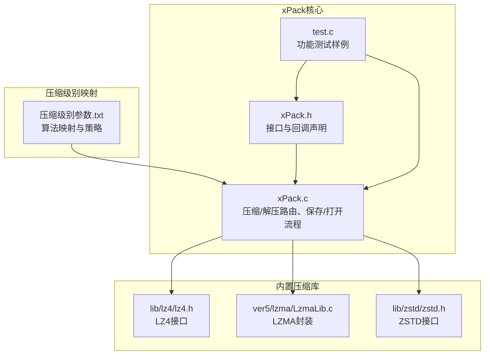
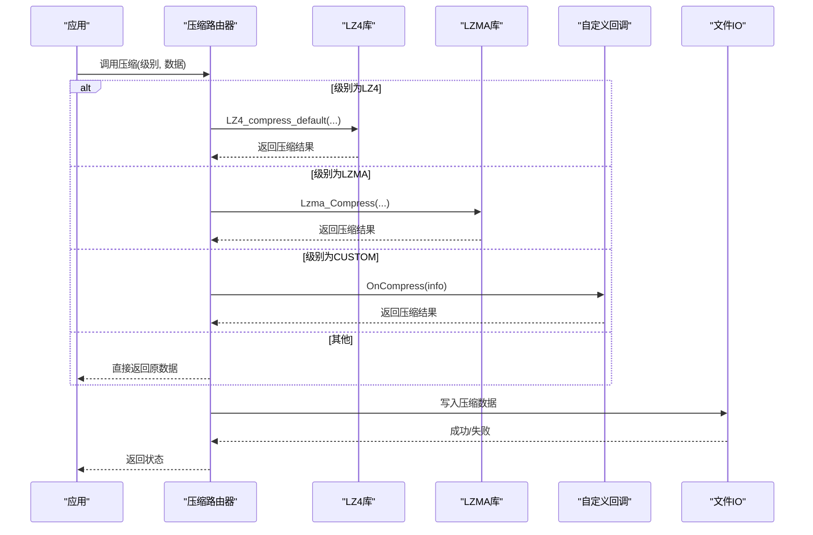
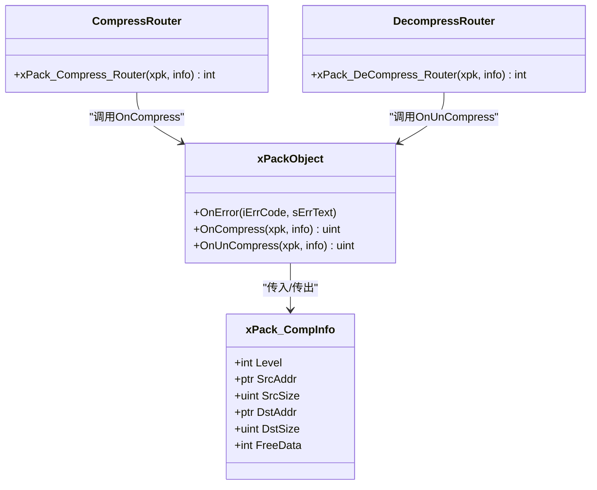
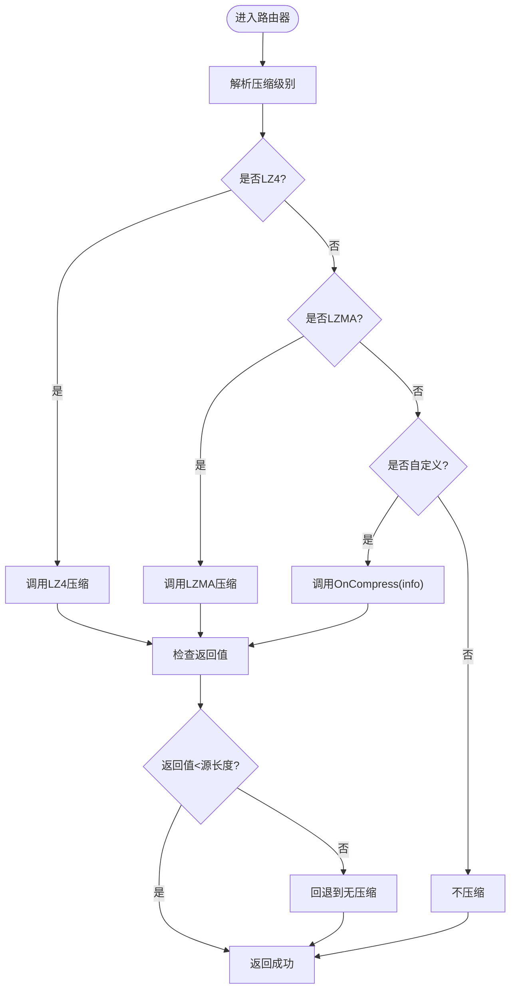
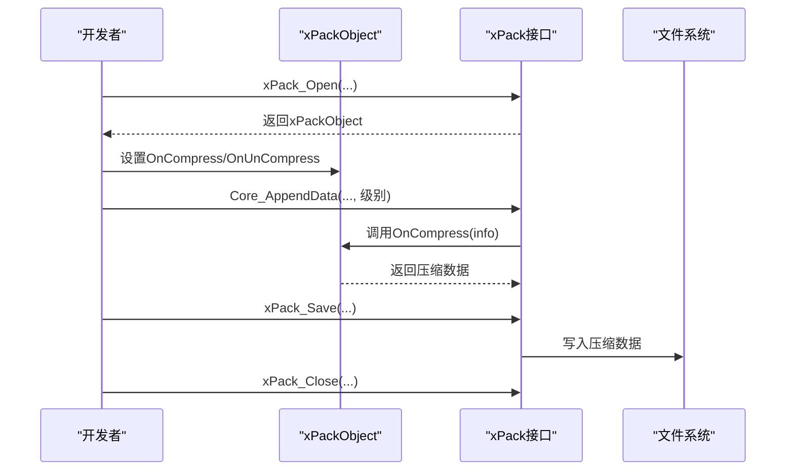
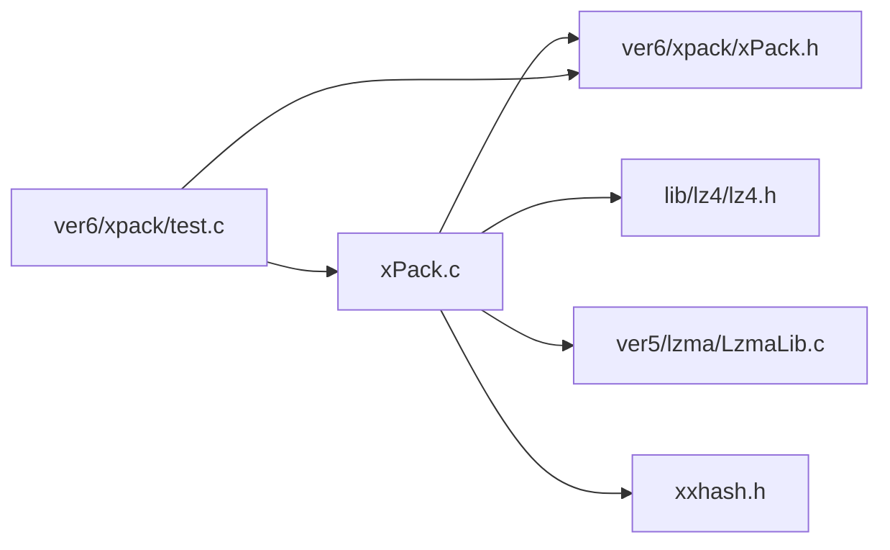

# 自定义压缩算法集成

<cite>
**本文引用的文件**
- [xPack.h](file://ver6/xpack/xPack.h)
- [xPack.c](file://ver6/xpack/xPack.c)
- [压缩级别参数.txt](file://压缩级别参数.txt)
- [test.c](file://ver6/xpack/test.c)
- [lz4.h](file://lib/lz4/lz4.h)
- [lzma.c](file://ver5/lzma/lzma.c)
- [LzmaLib.c](file://ver5/lzma/LzmaLib.c)
- [zstd.h](file://lib/zstd/zstd.h)
</cite>

## 目录
1. [简介](#简介)
2. [项目结构](#项目结构)
3. [核心组件](#核心组件)
4. [架构总览](#架构总览)
5. [详细组件分析](#详细组件分析)
6. [依赖关系分析](#依赖关系分析)
7. [性能考量](#性能考量)
8. [故障排查指南](#故障排查指南)
9. [结论](#结论)
10. [附录](#附录)

## 简介
本文面向希望在xPack中集成自定义压缩算法的开发者，系统讲解如何通过回调机制接入第三方压缩库，并给出算法选择、参数传递、兼容性与性能对比、注册配置、完整集成示例、测试验证以及最佳实践与优化技巧。同时对比内置LZ4与LZMA算法，指导如何扩展支持新的压缩算法格式。

## 项目结构
xPack位于ver6/xpack目录，核心接口与路由逻辑集中在xPack.h与xPack.c；压缩级别映射与策略参考压缩级别参数.txt；测试样例位于ver6/xpack/test.c；内置压缩库头文件位于lib/lz4、ver5/lzma等目录。

**图表来源**
- [xPack.h](file://ver6/xpack/xPack.h#L86-L119)
- [xPack.c](file://ver6/xpack/xPack.c#L54-L159)
- [压缩级别参数.txt](file://压缩级别参数.txt#L1-L71)

**章节来源**
- [xPack.h](file://ver6/xpack/xPack.h#L1-L252)
- [xPack.c](file://ver6/xpack/xPack.c#L1-L970)
- [压缩级别参数.txt](file://压缩级别参数.txt#L1-L71)
- [test.c](file://ver6/xpack/test.c#L1-L278)

## 核心组件
- 回调接口：xPackObject包含OnError、OnCompress、OnUnCompress三个回调，分别用于错误通知、自定义压缩与自定义解压。
- 路由器：xPack_Compress_Router与xPack_DeCompress_Router根据压缩级别选择内置算法或调用自定义回调。
- 数据结构：xPack_CompInfo承载压缩/解压的输入输出缓冲、尺寸与释放标志。
- 算法映射：压缩级别参数.txt定义了从4位压缩级别到具体算法与参数的映射，便于统一策略。

**章节来源**
- [xPack.h](file://ver6/xpack/xPack.h#L86-L119)
- [xPack.c](file://ver6/xpack/xPack.c#L54-L159)
- [压缩级别参数.txt](file://压缩级别参数.txt#L40-L71)

## 架构总览
xPack通过“路由器+回调”的双层机制实现压缩算法的可插拔性：内置算法负责常见场景，自定义回调负责特殊需求。路由器根据压缩级别判断优先级，失败时回退到无压缩。

**图表来源**
- [xPack.c](file://ver6/xpack/xPack.c#L54-L101)
- [xPack.c](file://ver6/xpack/xPack.c#L103-L159)

## 详细组件分析

### 回调机制与注册
- 注册点：在创建xPack对象后，设置xPackObject.OnCompress与xPackObject.OnUnCompress即可启用自定义压缩。
- 调用时机：压缩路由器在需要压缩时调用OnCompress；解压路由器在需要解压时调用OnUnCompress。
- 返回约定：自定义回调应返回压缩后数据的长度，若小于源长度则视为成功；否则路由器会回退到无压缩。

**图表来源**
- [xPack.h](file://ver6/xpack/xPack.h#L86-L119)
- [xPack.c](file://ver6/xpack/xPack.c#L54-L159)

**章节来源**
- [xPack.h](file://ver6/xpack/xPack.h#L98-L119)
- [xPack.c](file://ver6/xpack/xPack.c#L54-L159)

### 算法选择与参数传递
- 级别解析：路由器通过按位与提取压缩级别，支持FAST(LZ4)、HIGH(LZMA)、CUSTOM三种内置路径。
- 参数映射：压缩级别参数.txt提供从4位级别到算法与参数的映射，便于统一策略与UI选择。
- 自定义参数：自定义回调可通过info.Level携带自定义参数（如算法ID、等级、策略），并在回调内部解析。

**图表来源**
- [xPack.c](file://ver6/xpack/xPack.c#L54-L101)
- [压缩级别参数.txt](file://压缩级别参数.txt#L47-L67)

**章节来源**
- [xPack.c](file://ver6/xpack/xPack.c#L54-L101)
- [压缩级别参数.txt](file://压缩级别参数.txt#L40-L71)

### 兼容性与性能对比
- 兼容性：自定义算法需保证返回值小于源长度才被视为有效压缩；否则路由器会自动回退到无压缩，确保数据可用性。
- 性能：内置LZ4适合实时/低延迟场景；LZMA适合高压缩比场景；ZSTD在平衡点上表现优异。自定义算法可根据业务场景选择不同策略。
- 错误处理：路由器在内存分配失败、文件读写失败、哈希校验失败等情况下触发OnError回调，便于统一错误上报。

**章节来源**
- [xPack.c](file://ver6/xpack/xPack.c#L36-L53)
- [xPack.c](file://ver6/xpack/xPack.c#L163-L203)

### 注册与配置过程
- 创建包：使用xPack_Open创建或打开包，设置包类型与扩展字段。
- 设置回调：在xPackObject上设置OnCompress与OnUnCompress回调。
- 添加数据：调用Core/Index/Linux/Win32系列接口添加数据，传入压缩级别。
- 保存关闭：调用xPack_Save保存并xPack_Close释放资源。

**图表来源**
- [xPack.c](file://ver6/xpack/xPack.c#L451-L494)
- [xPack.c](file://ver6/xpack/xPack.c#L163-L203)

**章节来源**
- [xPack.c](file://ver6/xpack/xPack.c#L218-L302)
- [xPack.c](file://ver6/xpack/xPack.c#L451-L494)

### 完整集成示例（步骤说明）
- 步骤1：实现自定义压缩回调
  - 在回调中解析info.Level，决定算法与参数。
  - 分配目标缓冲区，调用第三方压缩库进行压缩。
  - 返回压缩后长度；若失败返回非正值。
- 步骤2：实现自定义解压回调
  - 根据info.Level解析参数，调用对应解压库。
  - 返回解压后长度；若失败返回非正值。
- 步骤3：注册回调
  - 在xPackObject上设置OnCompress与OnUnCompress。
- 步骤4：添加数据
  - 使用Core_AppendData等接口添加数据，传入XPK_COMP_CUSTOM级别。
- 步骤5：保存与验证
  - 调用xPack_Save保存，随后通过解包验证哈希一致性。

**章节来源**
- [xPack.h](file://ver6/xpack/xPack.h#L98-L119)
- [xPack.c](file://ver6/xpack/xPack.c#L54-L159)
- [test.c](file://ver6/xpack/test.c#L24-L66)

### 与内置算法对比与选择策略
- LZ4：极高速度，适合实时加载与低延迟场景。
- LZMA：高压缩比，适合离线打包与归档。
- ZSTD：在压缩比与速度间取得良好平衡，适合多数场景。
- 自定义算法：可针对特定数据类型或业务需求定制，但需保证稳定性与性能。

**章节来源**
- [压缩级别参数.txt](file://压缩级别参数.txt#L10-L38)
- [lz4.h](file://lib/lz4/lz4.h#L646-L670)
- [LzmaLib.c](file://ver5/lzma/LzmaLib.c#L9-L40)
- [zstd.h](file://lib/zstd/zstd.h#L2995-L3015)

### 测试与验证方法
- 功能测试：使用test.c中的Core/Index/Win32模式测试样例，验证添加、解包、哈希校验等流程。
- 回退验证：当自定义算法失败时，确认路由器回退到无压缩且数据可用。
- 性能验证：对比不同级别下的压缩比与速度，结合业务场景选择最优级别。

**章节来源**
- [test.c](file://ver6/xpack/test.c#L24-L278)
- [xPack.c](file://ver6/xpack/xPack.c#L163-L203)

## 依赖关系分析
xPack.c直接依赖内置压缩库头文件与xxhash库；压缩路由器根据级别调用相应库；测试样例依赖xPack接口与文件系统。

**图表来源**
- [xPack.c](file://ver6/xpack/xPack.c#L9-L27)
- [test.c](file://ver6/xpack/test.c#L9-L16)

**章节来源**
- [xPack.c](file://ver6/xpack/xPack.c#L9-L27)
- [test.c](file://ver6/xpack/test.c#L9-L16)

## 性能考量
- 内存管理：回调中应合理分配目标缓冲区，避免重复拷贝；若返回值与源地址相同，注意FreeData标志避免重复释放。
- 级别选择：根据数据特征与业务需求选择合适级别；对已压缩数据避免重复压缩。
- 并发安全：自定义回调需考虑线程安全与资源竞争问题。
- 缓冲区边界：确保目标缓冲区至少满足压缩库的最大预期长度，防止失败回退。

**章节来源**
- [xPack.c](file://ver6/xpack/xPack.c#L54-L101)
- [lz4.h](file://lib/lz4/lz4.h#L646-L670)

## 故障排查指南
- 常见错误码：文件无法访问、格式不正确、内存申请失败、列表读取/写入失败、哈希校验失败等。
- 排查要点：检查OnError回调输出；确认文件路径与权限；验证压缩/解压返回值；核对FreeData标志。
- 回退行为：自定义算法失败时会自动回退到无压缩，确保数据完整性。

**章节来源**
- [xPack.c](file://ver6/xpack/xPack.c#L36-L53)
- [xPack.c](file://ver6/xpack/xPack.c#L163-L203)

## 结论
通过回调机制，xPack实现了对自定义压缩算法的无缝集成。开发者只需实现OnCompress/OnUnCompress回调，即可在不改动核心逻辑的前提下接入任意第三方压缩库。配合压缩级别映射与路由器的回退策略，可在保证兼容性的前提下获得灵活的压缩体验。

## 附录
- 最佳实践
  - 明确算法选择逻辑：根据数据类型与业务场景选择合适算法与参数。
  - 严格的参数验证：在回调中校验输入参数与返回值，确保安全性与稳定性。
  - 完善的错误处理：利用OnError回调统一上报错误，便于定位问题。
  - 性能优化：减少不必要的内存拷贝，合理设置缓冲区大小，避免重复压缩。
- 扩展新算法格式
  - 在回调中解析自定义参数，调用第三方库进行压缩/解压。
  - 保持返回值规范，确保路由器能够正确识别压缩结果。
  - 提供对应的解压回调，保证读取流程一致。