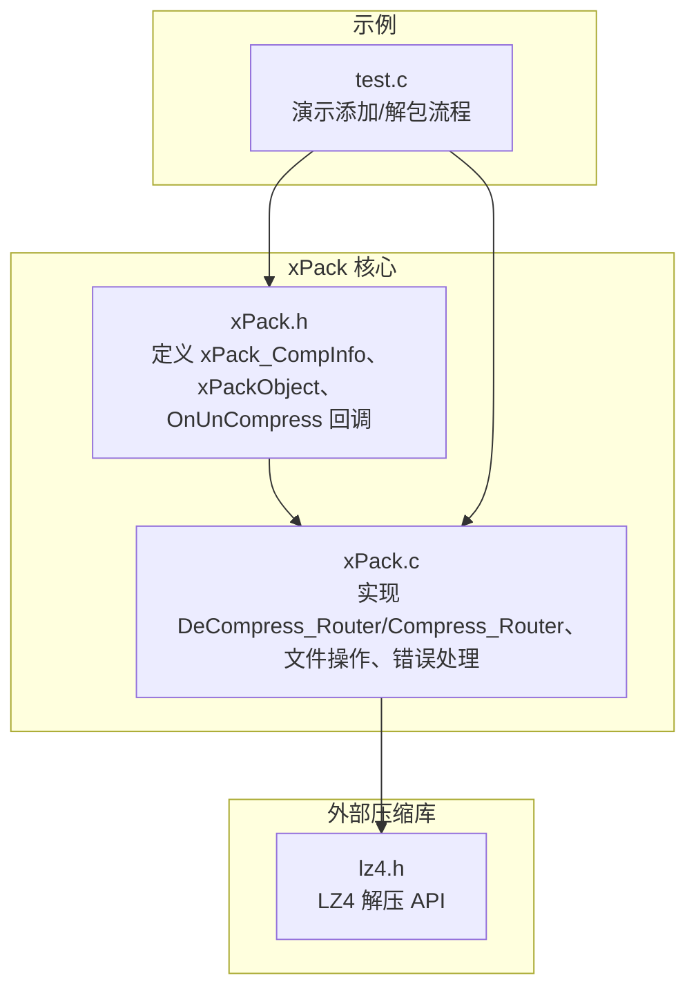
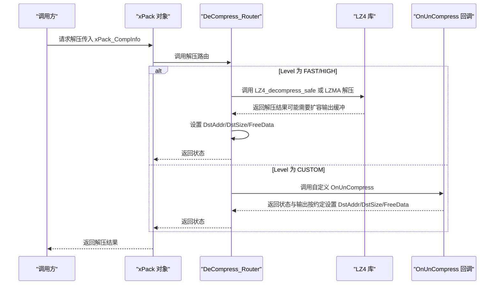
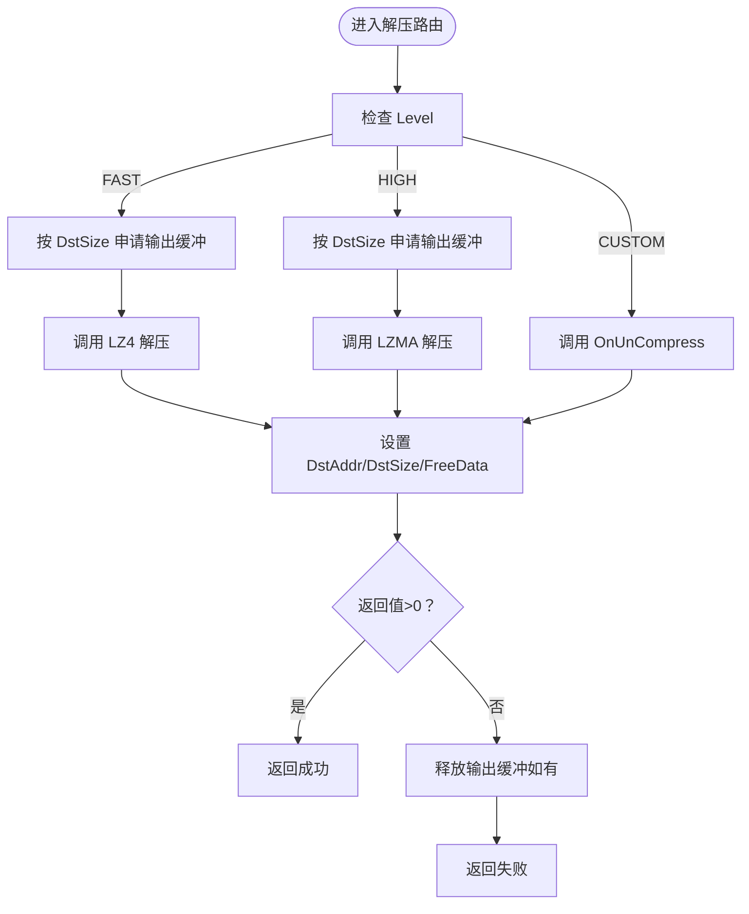
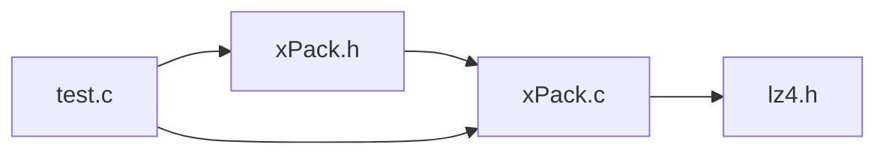

# 解压回调函数

<cite>
**本文引用的文件**
- [xPack.h](file://ver6/xpack/xPack.h)
- [xPack.c](file://ver6/xpack/xPack.c)
- [test.c](file://ver6/xpack/test.c)
- [lz4.h](file://lib/lz4/lz4.h)
</cite>

## 目录
1. [简介](#简介)
2. [项目结构](#项目结构)
3. [核心组件](#核心组件)
4. [架构总览](#架构总览)
5. [详细组件分析](#详细组件分析)
6. [依赖关系分析](#依赖关系分析)
7. [性能考量](#性能考量)
8. [故障排查指南](#故障排查指南)
9. [结论](#结论)
10. [附录](#附录)

## 简介
本文聚焦于 xPack 的解压回调函数 xPack_OnUnCompress 的实现与使用方法，系统阐述其函数签名、参数结构 xPack_CompInfo 的字段语义与返回值约定；详解解压过程中的数据流向与内存管理策略；说明压缩数据地址与大小、解压后数据地址与大小的传递与分配机制；解释解压回调与压缩回调的对应关系与数据一致性保障；并提供完整实现思路与示例要点、错误处理与异常恢复机制、性能优化与内存使用最佳实践。

## 项目结构
围绕解压回调，关键文件与职责如下：
- ver6/xpack/xPack.h：定义 xPack_CompInfo 结构、xPackObject 成员（含 OnUnCompress 回调）、路由接口声明等。
- ver6/xpack/xPack.c：实现 xPack_DeCompress_Router（解压路由）、xPack_Compress_Router（压缩路由）、文件打包/解包流程、错误处理宏等。
- lib/lz4/lz4.h：LZ4 压缩/解压 API 声明，用于理解底层解压行为（如 LZ4_decompress_safe）。
- ver6/xpack/test.c：演示不同包模式下的添加与解包流程，体现解压回调在框架内的使用位置。

**图表来源**
- [xPack.h](file://ver6/xpack/xPack.h#L86-L118)
- [xPack.c](file://ver6/xpack/xPack.c#L104-L159)
- [lz4.h](file://lib/lz4/lz4.h#L193-L200)
- [test.c](file://ver6/xpack/test.c#L24-L66)

**章节来源**
- [xPack.h](file://ver6/xpack/xPack.h#L86-L118)
- [xPack.c](file://ver6/xpack/xPack.c#L104-L159)
- [lz4.h](file://lib/lz4/lz4.h#L193-L200)
- [test.c](file://ver6/xpack/test.c#L24-L66)

## 核心组件
- xPack_CompInfo 参数结构
  - 字段含义
    - Level：压缩级别（由上层传入，决定解压算法选择）
    - SrcAddr/SrcSize：待解压数据的地址与大小
    - DstAddr/DstSize：输出缓冲区地址与大小（输入为期望大小，输出为实际解压大小）
    - FreeData：指示返回数据是否可安全释放（避免与输入同一块内存）
  - 作用：作为压缩/解压的统一参数载体，贯穿路由与回调。
- xPackObject
  - 包含 OnUnCompress 回调指针，用于自定义解压逻辑。
- 路由器函数
  - xPack_DeCompress_Router：根据 Level 分派到内置 LZ4/LZMA 或自定义 OnUnCompress。
  - xPack_Compress_Router：根据 Level 分派到内置 LZ4/LZMA 或自定义 OnCompress。

**章节来源**
- [xPack.h](file://ver6/xpack/xPack.h#L86-L118)
- [xPack.c](file://ver6/xpack/xPack.c#L104-L159)

## 架构总览
下图展示解压回调在整体流程中的位置与交互：

**图表来源**
- [xPack.c](file://ver6/xpack/xPack.c#L104-L159)
- [lz4.h](file://lib/lz4/lz4.h#L193-L200)

## 详细组件分析

### 解压回调函数签名与约定
- 函数签名
  - 返回值：非零表示成功，0 表示失败
  - 参数：xPack_OnUnCompress(xpk, xPack_CompInfo* info)
- 参数结构 xPack_CompInfo
  - 输入：Level、SrcAddr、SrcSize
  - 输出：DstAddr、DstSize、FreeData
- 返回值约定
  - 成功：返回值应小于等于 DstSize（实际解压字节数），且 DstAddr 指向已分配的缓冲区（若 FreeData=TRUE）
  - 失败：返回 0 或负值，框架会进行错误处理

**章节来源**
- [xPack.h](file://ver6/xpack/xPack.h#L86-L118)
- [xPack.c](file://ver6/xpack/xPack.c#L104-L159)

### 解压过程中的数据流向与内存管理
- 数据流向
  - 上层准备压缩数据（SrcAddr/SrcSize），调用解压路由
  - 路由器根据 Level 选择内置解压或自定义回调
  - 内置解压：先按 DstSize 申请输出缓冲，再调用底层库解压，成功后设置 DstAddr/DstSize/FreeData
  - 自定义回调：OnUnCompress 自行解压并设置 DstAddr/DstSize/FreeData
- 内存管理策略
  - 输出缓冲通常由框架或回调自行分配，成功后由调用方负责释放（依据 FreeData）
  - 若 DstAddr 与 SrcAddr 指向同一块内存，需确保不会被提前释放（FreeData=FALSE）

**图表来源**
- [xPack.c](file://ver6/xpack/xPack.c#L104-L159)

**章节来源**
- [xPack.c](file://ver6/xpack/xPack.c#L104-L159)

### 压缩数据地址与大小的传递机制
- SrcAddr/SrcSize 由调用方提供，表示压缩数据的起始地址与长度
- 路由器在内置解压路径中，会将 SrcAddr/SrcSize 透传给底层库（如 LZ4_decompress_safe）
- 在自定义回调路径中，回调函数可自由处理这些输入数据

**章节来源**
- [xPack.c](file://ver6/xpack/xPack.c#L104-L159)
- [lz4.h](file://lib/lz4/lz4.h#L193-L200)

### 解压后数据地址与大小的分配与管理
- DstSize 通常由调用方提供“期望大小”（例如从文件信息中读取的 FileSize）
- 路由器在内置解压时会按 DstSize 申请输出缓冲，并在解压成功后设置 DstAddr 与实际解压大小
- 自定义回调必须遵守约定：设置 DstAddr 指向有效缓冲、设置 DstSize 为实际解压字节数、设置 FreeData 以指示是否可释放
- 调用方在获取解压结果后，应根据 FreeData 决定释放策略

**章节来源**
- [xPack.c](file://ver6/xpack/xPack.c#L104-L159)

### 解压回调与压缩回调的对应关系与数据一致性
- 对应关系
  - 压缩：OnCompress（Level 为 CUSTOM 时生效）
  - 解压：OnUnCompress（Level 为 CUSTOM 时生效）
- 数据一致性
  - Level 字段用于标识压缩算法族，解压端应与压缩端保持一致
  - 文件信息中记录了 FileFlag（包含压缩级别），解包时可据此选择解压路径
  - 哈希校验（如 XXH32）用于确认解压后数据完整性

**章节来源**
- [xPack.h](file://ver6/xpack/xPack.h#L86-L118)
- [xPack.c](file://ver6/xpack/xPack.c#L583-L627)

### 完整解压回调实现示例（思路与要点）
以下为实现 OnUnCompress 的通用思路与要点（不直接粘贴代码）：
- 入口参数
  - 从 xPack_CompInfo 中读取 Level、SrcAddr、SrcSize
- 算法选择
  - 根据 Level 选择对应解压算法（如 LZ4、LZMA、ZSTD 等）
- 输出缓冲
  - 依据 DstSize 申请输出缓冲（建议多分配 4 字节用于字符串截断）
  - 解压成功后设置 DstAddr、DstSize、FreeData
- 错误处理
  - 解压失败时返回 0 或负值，避免设置 DstAddr
- 数据一致性
  - 与压缩端保持 Level 一致
  - 如涉及文本数据，可在末尾补 0 以便直接按字符串访问

提示：在 xPack 内部，对于字符串类数据会在末尾补充若干 0 字节，便于直接按字符串访问。自定义回调可参考此策略，但需确保缓冲区足够。

**章节来源**
- [xPack.c](file://ver6/xpack/xPack.c#L104-L159)

### 错误处理与异常恢复机制
- 错误码与文本
  - 框架提供错误码与文本映射，通过 OnError 回调或内部宏报告
- 典型错误场景
  - 内存不足：输出缓冲分配失败
  - 解压失败：底层解压返回值非正值
  - 哈希校验失败：解压后数据与文件信息中的 FileHash 不一致
- 恢复策略
  - 分配失败：释放已占用资源并返回失败
  - 解压失败：释放输出缓冲并返回失败
  - 校验失败：释放输出缓冲并触发错误回调

**章节来源**
- [xPack.c](file://ver6/xpack/xPack.c#L35-L51)
- [xPack.c](file://ver6/xpack/xPack.c#L583-L627)

## 依赖关系分析
- 组件耦合
  - xPack.c 依赖 xPack.h 的结构定义与回调声明
  - 解压路由依赖 LZ4/LZMA 库（在构建配置下）
- 外部依赖
  - LZ4：LZ4_decompress_safe 等 API
- 接口契约
  - OnUnCompress 与 OnCompress 的参数结构一致，返回值约定相同

**图表来源**
- [xPack.h](file://ver6/xpack/xPack.h#L86-L118)
- [xPack.c](file://ver6/xpack/xPack.c#L104-L159)
- [lz4.h](file://lib/lz4/lz4.h#L193-L200)
- [test.c](file://ver6/xpack/test.c#L24-L66)

**章节来源**
- [xPack.h](file://ver6/xpack/xPack.h#L86-L118)
- [xPack.c](file://ver6/xpack/xPack.c#L104-L159)
- [lz4.h](file://lib/lz4/lz4.h#L193-L200)
- [test.c](file://ver6/xpack/test.c#L24-L66)

## 性能考量
- 算法选择
  - FAST（LZ4）：追求极致解压速度，适合实时加载场景
  - HIGH（LZMA）：追求高压缩比，解压速度较慢
  - CUSTOM：自定义算法，可结合业务特性优化
- 缓冲策略
  - 输出缓冲建议按 DstSize 申请，预留少量额外空间（如字符串截断）
  - 避免重复分配与拷贝，优先复用缓冲
- I/O 与内存
  - 尽量减少磁盘随机访问，批量读取与解压
  - 控制内存峰值，及时释放不再使用的缓冲

[本节为通用指导，不直接分析具体文件]

## 故障排查指南
- 常见问题
  - 解压失败：检查 Level 与压缩端是否一致；确认 SrcAddr/SrcSize 正确；查看底层解压返回值
  - 哈希校验失败：确认解压后数据与文件信息中的 FileHash 一致
  - 内存不足：检查输出缓冲分配与释放逻辑
- 定位手段
  - 使用 OnError 回调获取错误码与描述
  - 在自定义回调中增加日志与断点，核对 DstAddr/DstSize/FreeData 设置
  - 对照 test.c 中的解包流程，逐步缩小问题范围

**章节来源**
- [xPack.c](file://ver6/xpack/xPack.c#L35-L51)
- [xPack.c](file://ver6/xpack/xPack.c#L583-L627)

## 结论
xPack 的解压回调通过 xPack_CompInfo 提供统一的参数与返回约定，配合 DeCompress_Router 实现内置算法与自定义算法的无缝集成。遵循 FreeData 与 DstAddr/DstSize 的约定、确保 Level 一致性与数据完整性校验，是实现稳定高效的解压回调的关键。结合合理的缓冲策略与错误处理，可在多种场景下获得良好的性能与可靠性。

[本节为总结，不直接分析具体文件]

## 附录
- 示例参考
  - test.c 展示了 Core/Index/Win32 模式下的添加与解包流程，可对照理解解压回调在框架中的位置与调用时机

**章节来源**
- [test.c](file://ver6/xpack/test.c#L24-L66)