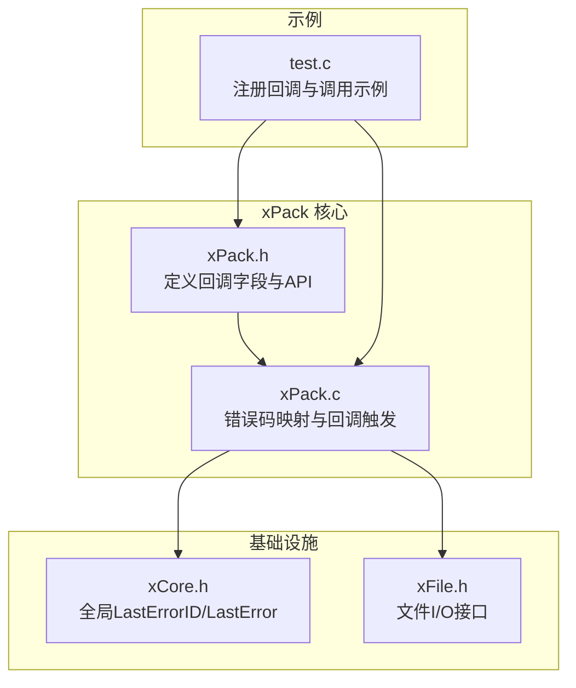
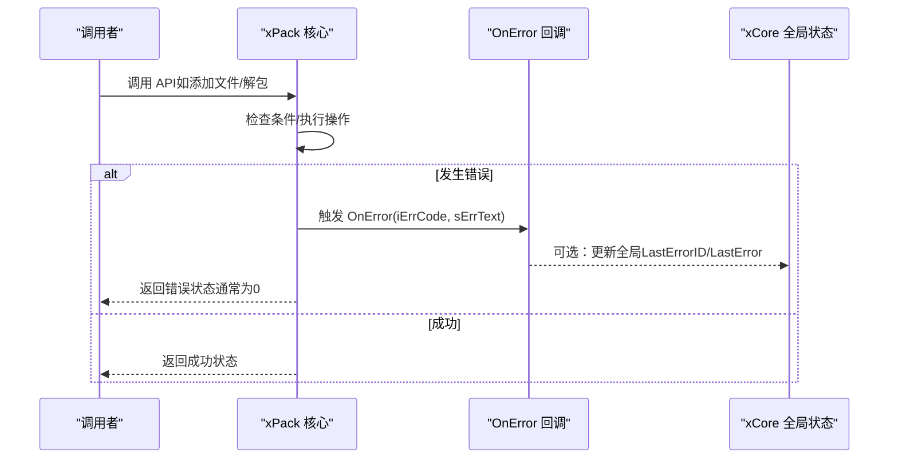
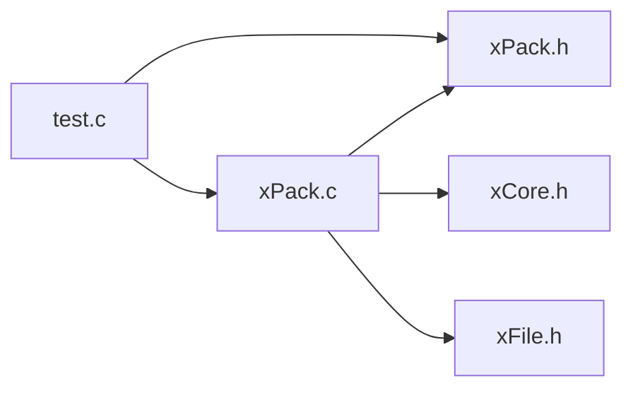

# 错误处理回调

<cite>
**本文引用的文件**
- [xPack.h](file://ver6/xpack/xPack.h)
- [xPack.c](file://ver6/xpack/xPack.c)
- [xPack.h（发布版头文件）](file://ver6/xpack/release/Inc/xPack.h)
- [xCore.h](file://ver6/xCore/xCore.h)
- [xFile.h](file://ver6/xFile/xFile.h)
- [test.c](file://ver6/xpack/test.c)
</cite>

## 目录
1. [简介](#简介)
2. [项目结构](#项目结构)
3. [核心组件](#核心组件)
4. [架构总览](#架构总览)
5. [详细组件分析](#详细组件分析)
6. [依赖关系分析](#依赖关系分析)
7. [性能考量](#性能考量)
8. [故障排查指南](#故障排查指南)
9. [结论](#结论)
10. [附录](#附录)

## 简介
本文聚焦于 xPack 错误处理回调函数 xPack_OnError 的实现与使用方法，系统讲解其函数签名、参数语义、调用时机、错误码分类与含义、错误文本格式规范、不同文件包模式下的行为差异，以及与全局错误状态的关系与传播机制。同时提供可复用的错误处理实现思路与最佳实践，帮助开发者在实际工程中高效地记录日志、呈现用户友好提示、进行异常恢复与故障诊断。

## 项目结构
围绕错误处理回调，本节梳理与之相关的关键文件与职责：
- ver6/xpack/xPack.h：定义 xPack 对象结构、错误回调字段、API 原型等
- ver6/xpack/xPack.c：实现错误码映射、错误回调触发宏、各功能模块的错误分支与返回策略
- ver6/xpack/release/Inc/xPack.h：发布版头文件，包含相同回调定义
- ver6/xCore/xCore.h：提供全局 LastErrorID/LastError 供错误传播
- ver6/xFile/xFile.h：文件 I/O 接口，错误处理常与之结合
- ver6/xpack/test.c：演示如何注册与使用 xPack_OnError 回调

图表来源
- [xPack.h](file://ver6/xpack/xPack.h#L108-L119)
- [xPack.c](file://ver6/xpack/xPack.c#L35-L53)
- [xCore.h](file://ver6/xCore/xCore.h#L412-L443)
- [xFile.h](file://ver6/xFile/xFile.h#L25-L31)
- [test.c](file://ver6/xpack/test.c#L19-L22)

章节来源
- [xPack.h](file://ver6/xpack/xPack.h#L108-L119)
- [xPack.c](file://ver6/xpack/xPack.c#L35-L53)
- [xCore.h](file://ver6/xCore/xCore.h#L412-L443)
- [xFile.h](file://ver6/xFile/xFile.h#L25-L31)
- [test.c](file://ver6/xpack/test.c#L19-L22)

## 核心组件
- 错误回调函数签名
  - 类型：void (*OnError)(int iErrCode, str sErrText)
  - 作用：当 xPack 内部发生错误时，按约定触发回调，向调用方传递错误码与对应文本
- 错误码与文本映射
  - 内置错误码数组与回调触发宏：xPack_Error_Text[] 与 xPack_OnError_Router(...)
  - 宏负责将错误码转换为内置文本并调用 OnError
- 全局错误状态
  - xCore.LastErrorID 与 xCore.LastError 用于记录最近一次错误，便于上层统一处理与诊断

章节来源
- [xPack.h](file://ver6/xpack/xPack.h#L108-L119)
- [xPack.c](file://ver6/xpack/xPack.c#L35-L53)
- [xCore.h](file://ver6/xCore/xCore.h#L426-L427)

## 架构总览
xPack 在关键路径上对错误进行捕获与上报，形成“内部错误码 → 内置文本 → 回调 → 全局状态”的传播链路。

图表来源
- [xPack.c](file://ver6/xpack/xPack.c#L35-L53)
- [xCore.h](file://ver6/xCore/xCore.h#L426-L427)

## 详细组件分析

### 函数签名与参数说明
- 函数签名
  - void (*OnError)(int iErrCode, str sErrText)
- 参数
  - iErrCode：整型错误码，取值范围由 xPack 内部错误码集合决定
  - sErrText：对应错误码的中文描述文本，由 xPack 内置映射提供
- 调用时机
  - 在 xPack 内部检测到错误时触发，常见于文件读写、内存分配、压缩/解压、路径解析等环节
  - 回调触发宏 xPack_OnError_Router(...) 统一封装了触发流程

章节来源
- [xPack.h](file://ver6/xpack/xPack.h#L108-L119)
- [xPack.c](file://ver6/xpack/xPack.c#L35-L53)

### 错误码分类与含义
xPack 内置错误码数组与触发宏定义如下，以下为常见错误码的分类与含义（基于代码注释与调用点推断）：
- 文件访问类
  - 1：文件无法访问（打开文件句柄失败）
  - 8：文件读取失败（读取数据长度不匹配）
  - 9：文件写入失败（写入长度不匹配）
  - 10：文件读写位置移动失败（定位/偏移错误）
- 文件格式与一致性类
  - 2：文件格式不正确（文件头版本不匹配）
  - 4：文件列表读取失败（LDB 段读取失败）
  - 7：文件hash校验失败（数据完整性校验失败）
- 内存与资源类
  - 3：内存申请失败（分配内存返回空）
- 列表与定位类
  - 5：文件列表数据添加失败（添加条目失败）
  - 6：无效的文件位置（索引越界或条目为空）
  - 12：找不到文件（按索引/路径查找失败）
- 路径与配置类
  - 11：包类型不匹配（当前包类型与操作不兼容）
  - 13：文件名超长（路径长度超过限制）

章节来源
- [xPack.c](file://ver6/xpack/xPack.c#L36-L50)

### 错误文本格式与内容规范
- 文本来源
  - xPack_Error_Text[] 提供固定索引的中文错误描述
- 触发机制
  - xPack_OnError_Router(xpk, err) 将 err 映射为 xPack_Error_Text[err - 1] 并调用 xpk->OnError
- 规范建议
  - 回调接收方应直接使用 sErrText 展示给用户，避免二次翻译
  - 若需扩展错误文本，可在回调中拼接上下文信息（如文件名、路径），但保持与内置文本一致的语义风格

章节来源
- [xPack.c](file://ver6/xpack/xPack.c#L36-L50)

### 不同文件包模式下的行为差异
- Core 模式
  - 通过顺序索引访问文件；错误主要集中在文件读写、内存分配、压缩/解压与列表更新
- Index 模式
  - 通过自定义索引访问文件；若包类型不匹配（非 Index）或索引不存在（找不到文件），将触发相应错误码
- Linux/Win32 模式
  - 通过路径访问文件；路径长度超限将触发错误码 13；包类型不匹配触发错误码 11；路径查找失败触发错误码 12
  - Win32 模式路径大小写不敏感，Linux 模式大小写敏感

章节来源
- [xPack.c](file://ver6/xpack/xPack.c#L687-L703)
- [xPack.c](file://ver6/xpack/xPack.c#L794-L795)
- [xPack.c](file://ver6/xpack/xPack.c#L858-L875)

### 错误回调与全局错误状态的关系与传播机制
- 回调触发
  - xPack_OnError_Router(...) 负责调用用户注册的 OnError
- 全局状态更新
  - xProc_OnError_Router(err) 会同步更新 xCore.LastErrorID 与 xCore.LastError，便于上层统一获取最近错误
- 传播路径
  - 内部错误 → 回调 → 全局状态 → 上层业务逻辑

章节来源
- [xPack.c](file://ver6/xpack/xPack.c#L35-L53)
- [xCore.h](file://ver6/xCore/xCore.h#L426-L427)

### 使用示例与最佳实践
- 注册回调
  - 在创建 xPack 对象后，为其 OnError 字段赋值为自定义回调函数
- 日志记录
  - 在回调中记录 iErrCode 与 sErrText，必要时附加上下文（如文件名、路径、操作阶段）
- 用户提示
  - 将 sErrText 直接展示给用户，或根据 iErrCode 显示更友好的提示
- 异常恢复
  - 根据错误码分类采取不同策略：重试（如磁盘空间不足）、降级（切换压缩算法）、回滚（撤销已执行的部分操作）
- 最佳实践
  - 回调函数应尽量轻量，避免阻塞或长时间占用
  - 对于可恢复错误，优先尝试自动恢复；对于致命错误，及时终止流程并清理资源
  - 在多线程环境下，确保回调内的共享资源访问是线程安全的

章节来源
- [test.c](file://ver6/xpack/test.c#L19-L22)
- [test.c](file://ver6/xpack/test.c#L38-L39)
- [test.c](file://ver6/xpack/test.c#L57-L58)
- [test.c](file://ver6/xpack/test.c#L115-L117)

## 依赖关系分析
- xPack.c 依赖
  - xPack.h：对象结构、API 原型
  - xCore.h：全局 LastErrorID/LastError
  - xFile.h：文件 I/O 操作与错误返回
- 回调注册与调用
  - test.c 展示了在不同模式下注册 OnError 并调用 API 的流程

图表来源
- [xPack.c](file://ver6/xpack/xPack.c#L27-L28)
- [xPack.h](file://ver6/xpack/xPack.h#L108-L119)
- [xCore.h](file://ver6/xCore/xCore.h#L412-L443)
- [xFile.h](file://ver6/xFile/xFile.h#L25-L31)
- [test.c](file://ver6/xpack/test.c#L19-L22)

章节来源
- [xPack.c](file://ver6/xpack/xPack.c#L27-L28)
- [xPack.h](file://ver6/xpack/xPack.h#L108-L119)
- [xCore.h](file://ver6/xCore/xCore.h#L412-L443)
- [xFile.h](file://ver6/xFile/xFile.h#L25-L31)
- [test.c](file://ver6/xpack/test.c#L19-L22)

## 性能考量
- 回调成本
  - OnError 是同步回调，建议避免在回调中执行耗时操作（如网络请求、大文件写入）
- 错误路径优化
  - 在调用前尽量预检（如路径长度、文件存在性），减少错误触发频率
- 内存与 I/O
  - 错误码 3（内存申请失败）与 8/9（读写失败）是高频错误，应关注内存池与 I/O 缓冲区的合理使用

## 故障排查指南
- 如何定位错误
  - 通过 xCore.LastErrorID 与 xCore.LastError 获取最近错误，结合回调日志定位具体操作
- 常见问题与对策
  - 文件无法访问（1）：检查文件路径、权限与占用情况
  - 文件读写失败（8/9）：检查磁盘空间、文件句柄状态与并发访问
  - 内存申请失败（3）：检查内存池配置、碎片与泄漏
  - 包类型不匹配（11）：确认当前包类型与操作是否一致
  - 路径超长（13）：缩短路径或采用相对路径
- 调试技巧
  - 在回调中打印 iErrCode、sErrText 与关键上下文（如文件名、索引、路径）
  - 使用断点观察错误触发点，结合调用栈定位问题根因

章节来源
- [xPack.c](file://ver6/xpack/xPack.c#L35-L53)
- [xCore.h](file://ver6/xCore/xCore.h#L426-L427)

## 结论
xPack 的错误处理回调为上层提供了统一、可定制的错误上报通道。通过内置错误码与文本映射、与全局错误状态的联动，开发者可以在不同文件包模式下获得一致的错误体验。遵循本文提供的实现思路与最佳实践，能够有效提升系统的健壮性与可观测性。

## 附录
- 回调注册与调用示例参考
  - [test.c](file://ver6/xpack/test.c#L19-L22)
  - [test.c](file://ver6/xpack/test.c#L38-L39)
  - [test.c](file://ver6/xpack/test.c#L57-L58)
  - [test.c](file://ver6/xpack/test.c#L115-L117)