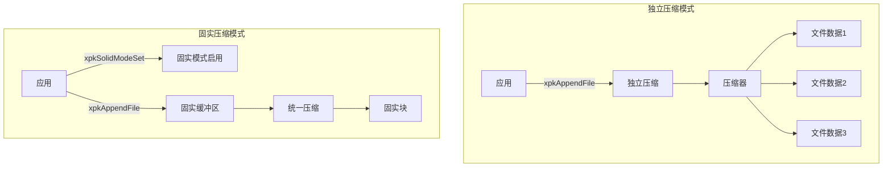
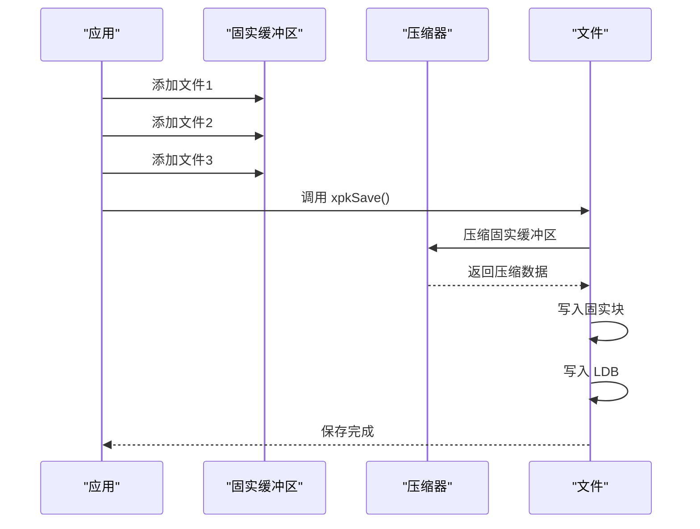
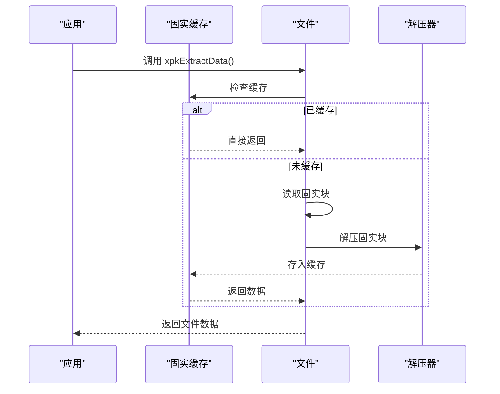

# 固实压缩功能

<cite>
**本文档引用的文件**
- [src/xpack.h](file://src/xpack.h)
- [src/xpack.c](file://src/xpack.c)
- [src/xpack_internal.h](file://src/xpack_internal.h)
- [src/xpack_compress.c](file://src/xpack_compress.c)
</cite>

## 目录
1. [简介](#简介)
2. [核心概念](#核心概念)
3. [架构设计](#架构设计)
4. [API 接口](#api-接口)
5. [实现细节](#实现细节)
6. [使用场景](#使用场景)
7. [性能考量](#性能考量)
8. [限制与注意事项](#限制与注意事项)
9. [故障排查指南](#故障排查指南)
10. [结论](#结论)

## 简介

固实压缩（Solid Compression）是 xPack Ver7 引入的高级压缩特性，通过将多个文件的数据合并成一个大的数据块进行统一压缩，从而获得更高的压缩比。这种技术特别适用于包含大量小文件或相似内容文件的场景，能够显著提升压缩效率。

### 核心优势

- **更高的压缩比**：合并后的数据块可以利用跨文件的相似性，压缩算法可以找到更多重复模式
- **适合小文件**：多个小文件合并后，能够充分利用压缩算法的优势
- **减少压缩开销**：一次性压缩大块数据比多次压缩小块数据效率更高

### 与独立压缩的区别

| 特性 | 独立压缩 | 固实压缩 |
|------|---------|---------|
| 压缩方式 | 每个文件单独压缩 | 所有文件合并后统一压缩 |
| 压缩比 | 较低 | 较高 |
| 随机访问 | 支持，可直接提取单个文件 | 需要解压整个固实块 |
| 内存占用 | 较低 | 较高（需要缓存固实块） |
| 适用场景 | 大文件、需要频繁随机访问 | 小文件集合、批量分发 |

## 核心概念

### 固实块（Solid Block）

固实块是固实压缩的核心概念，它将所有文件的数据按照添加顺序拼接在一起，形成一个大的连续数据块，然后对这个数据块进行一次性压缩。

```
文件布局（独立压缩模式）:
[文件1压缩数据] [文件2压缩数据] [文件3压缩数据] [LDB...]

文件布局（固实压缩模式）:
[固实块（文件1+文件2+文件3的合并数据压缩后）] [LDB...]
```

### 固实偏移（Solid Offset）

在固实模式下，每个文件记录的是其在固实块中的偏移位置，而不是文件中的绝对偏移。提取文件时，通过计算所有前置文件的大小来确定当前文件在固实块中的位置。

### 缓存机制（Caching）

为了提高随机访问效率，xPack 在首次访问固实块时会将整个固实块解压并缓存到内存中，后续的文件提取直接从缓存中读取，避免重复解压。

## 架构设计



### 数据流对比

**独立压缩模式**：
```
文件1 → 压缩 → 写入数据区
文件2 → 压缩 → 写入数据区
文件3 → 压缩 → 写入数据区
LDB → 写入LDB区
```

**固实压缩模式**：
```
文件1 → 添加到缓冲区
文件2 → 添加到缓冲区
文件3 → 添加到缓冲区
缓冲区 → 统一压缩 → 写入固实块
LDB → 写入LDB区
```

## API 接口

### 1. 设置固实模式

```c
XPKAPI int xpkSolidModeSet(xpkObject xpk, int enabled);
```

- **功能**：启用或禁用固实压缩模式
- **参数**：
  - `xpk`：xPack 对象
  - `enabled`：1=启用，0=禁用
- **返回值**：0=成功，-1=失败
- **限制**：只能在空包（文件数为0）时设置，且必须在写入模式下

### 2. 查询固实模式

```c
XPKAPI int xpkSolidMode(xpkObject xpk);
```

- **功能**：查询当前是否为固实压缩模式
- **参数**：`xpk`：xPack 对象
- **返回值**：1=固实模式，0=独立模式，-1=错误

### 3. 获取固实块信息

```c
XPKAPI int xpkSolidBlockInfo(xpkObject xpk, uint32_t* offset, uint32_t* size);
```

- **功能**：获取固实块在文件中的偏移和大小
- **参数**：
  - `xpk`：xPack 对象
  - `offset`：输出参数，固实块偏移位置
  - `size`：输出参数，固实块大小
- **返回值**：0=成功，-1=失败

### 4. 文件操作接口（固实模式兼容）

在固实模式下，以下接口的使用方式保持不变：

- `xpkAppendFile`：添加文件（数据暂存到固实缓冲区）
- `xpkAppendData`：添加数据（数据暂存到固实缓冲区）
- `xpkExtractFile`：提取文件（自动解压固实块并缓存）
- `xpkExtractData`：提取数据（自动解压固实块并缓存）

## 实现细节

### 固实缓冲区管理

在创建固实压缩包时，xPack 使用 xrtBuffer 来暂存所有文件的数据：

```c
typedef struct xpkStruct {
    // ... 其他字段
    
    // 固实压缩相关（仅创建时使用）
    uint8_t             solidMode;      // 固实模式标记
    uint8_t             solidCompLevel; // 固实块压缩级别
    xbuffer             solidBuffer;    // 固实数据缓冲区
    uint32_t            solidBufferSize;// 固实缓冲区大小
    
    // 固实块缓存（读取时使用）
    void*               solidDecompressed;  // 解压后的固实块数据
    uint32_t            solidDecompSize;    // 解压后的固实块大小
    uint8_t             solidCached;        // 固实块是否已缓存
} xpkStruct;
```

### 固实偏移计算

每个文件在固实块中的偏移通过累加前面所有文件的大小来计算：

```c
uint32_t xpkGetSolidOffset(xpkObject xpk, uint32_t pos) {
    // 计算固实偏移（累加前面所有文件的大小）
    uint32_t offset = 0;
    for (uint32_t i = 0; i < pos; i++) {
        xpkFileInfo* info = (xpkFileInfo*)XPK_LDB_GET(xpk, i);
        offset += info->fileSize;
    }
    return offset;
}
```

### 固实块保存流程



### 固实块解压与缓存流程



## 使用场景

### 1. 游戏资源包

游戏通常包含大量的小资源文件（纹理、模型、音效等），使用固实压缩可以：

- 提升整体压缩比，减少包体积
- 一次性加载多个相关资源，减少解压次数
- 适合批量分发和下载

### 2. 软件安装包

安装包包含大量小文件（配置文件、脚本、图标等），固实压缩可以：

- 减小安装包体积
- 提升安装速度（批量解压）
- 适合完整安装场景

### 3. 静态网站打包

包含大量 HTML、CSS、JS 文件的网站，固实压缩可以：

- 提高压缩效率
- 减少网络传输时间
- 适合一次性部署

### 4. 日志归档

多个日志文件合并归档时，固实压缩可以：

- 利用日志中的重复模式（时间戳、格式等）
- 提高压缩比
- 减少存储空间

## 性能考量

### 压缩比提升

固实压缩的压缩比提升程度取决于文件之间的相似性：

| 场景 | 预期压缩比提升 |
|------|--------------|
| 相同类型的文本文件 | 10%-30% |
| 相同格式的二进制文件 | 5%-20% |
| 完全不同的文件 | 0%-5% |

### 内存占用

- **创建时**：需要暂存所有文件数据，内存占用 = 所有文件大小之和
- **读取时**：需要缓存整个解压后的固实块，内存占用 = 固实块解压后大小
- **建议**：单个固实块不超过 100MB

### I/O 性能

- **创建**：减少多次压缩的开销，但需要更多内存
- **读取**：首次访问需要解压整个块，后续访问从缓存读取
- **随机访问**：不适合频繁随机访问单个文件

### 推荐配置

| 场景 | 推荐压缩级别 | 推荐固实块大小 |
|------|------------|--------------|
| 游戏资源 | 6-8 (ZSTD lazy) | 50-100MB |
| 安装包 | 8-10 (ZSTD btlazy2) | 50-200MB |
| 网站打包 | 4-6 (ZSTD lazy) | 20-50MB |
| 日志归档 | 12-15 (ZSTD btultra2) | 100-500MB |

## 限制与注意事项

### 功能限制

1. **仅支持 Core 模式**
   - 固实压缩只能在 Core 模式下使用
   - Index、Linux、Win32 模式不支持固实压缩

2. **只能在空包时设置**
   - 必须在添加任何文件之前调用 `xpkSolidModeSet`
   - 已有文件的包无法切换到固实模式

3. **不支持修改操作**
   - 固实模式下不支持更新、删除文件
   - 修改包需要重新创建

4. **内存占用较高**
   - 创建时需要暂存所有文件数据
   - 读取时需要缓存整个解压后的固实块

### 最佳实践

1. **文件数量适中**
   - 建议单个包包含 10-1000 个文件
   - 文件过多会增加解压缓存的开销

2. **文件大小适中**
   - 单个文件建议在 1KB - 10MB 之间
   - 避免包含超大文件（>100MB）

3. **压缩级别选择**
   - 使用压缩级别 6-10 获得较好的压缩比和速度平衡
   - 超高压缩级别（>12）会显著增加创建时间

4. **批量操作优先**
   - 尽量批量添加文件，减少中间保存操作
   - 避免频繁打开/关闭包

### 代码示例

```c
// 创建固实压缩包
xpkObject xpk = xpkOpen("solid.xpk", 0, 0);
if (!xpk) {
    printf("Failed to open pack: %s\n", xpkLastErrorMsg());
    return -1;
}

// 设置为固实模式（必须在添加文件之前）
if (xpkSolidModeSet(xpk, 1) != 0) {
    printf("Failed to set solid mode: %s\n", xpkLastErrorMsg());
    xpkClose(xpk);
    return -1;
}

// 添加多个文件
xpkAppendFile(xpk, "file1.txt", 7);
xpkAppendFile(xpk, "file2.txt", 7);
xpkAppendFile(xpk, "file3.txt", 7);

// 保存包（此时才会压缩固实块）
if (xpkSave(xpk) != 0) {
    printf("Failed to save pack: %s\n", xpkLastErrorMsg());
    xpkClose(xpk);
    return -1;
}

xpkClose(xpk);

// 读取固实压缩包
xpkObject xpk = xpkOpen("solid.xpk", 0, 1);
if (!xpk) {
    printf("Failed to open pack: %s\n", xpkLastErrorMsg());
    return -1;
}

// 查询固实模式
if (xpkSolidMode(xpk)) {
    printf("Solid mode enabled\n");
    
    // 获取固实块信息
    uint32_t offset, size;
    xpkSolidBlockInfo(xpk, &offset, &size);
    printf("Solid block: offset=%u, size=%u\n", offset, size);
}

// 提取文件（首次会解压并缓存整个固实块）
uint32_t outSize;
void* data = xpkExtractData(xpk, 0, &outSize);
if (data) {
    printf("Extracted file 0, size=%u\n", outSize);
    xpkFree(data);
}

xpkClose(xpk);
```

## 故障排查指南

### 常见错误

| 错误 | 原因 | 解决方案 |
|------|------|---------|
| "Cannot set solid mode on non-empty pack" | 尝试在非空包上设置固实模式 | 在新包或清空后的包上设置 |
| "Cannot set solid mode in readonly" | 尝试在只读模式下设置固实模式 | 在写入模式下打开包 |
| "Failed to allocate solid buffer" | 内存不足 | 减少文件数量或总大小 |
| "Solid compression failed" | 压缩失败 | 降低压缩级别或检查数据完整性 |
| "Solid data offset out of range" | 固实块数据损坏 | 重新创建包或使用修复工具 |

### 调试技巧

1. **检查固实模式状态**
   ```c
   if (xpkSolidMode(xpk)) {
       printf("Current mode: Solid\n");
   } else {
       printf("Current mode: Independent\n");
   }
   ```

2. **监控内存使用**
   ```c
   // 在创建固实包时监控 solidBufferSize
   printf("Solid buffer size: %u bytes\n", xpk->solidBufferSize);
   ```

3. **验证固实块完整性**
   ```c
   uint32_t offset, size;
   xpkSolidBlockInfo(xpk, &offset, &size);
   printf("Solid block at %u, size %u\n", offset, size);
   ```

### 性能分析

1. **测量创建时间**
   ```c
   xtime start = xrtNow();
   xpkSave(xpk);
   xtime end = xrtNow();
   printf("Save time: %.2f seconds\n", (end - start) / 1000.0);
   ```

2. **测量首次提取时间**
   ```c
   xtime start = xrtNow();
   void* data = xpkExtractData(xpk, 0, NULL);
   xtime end = xrtNow();
   printf("First extract time: %.2f seconds\n", (end - start) / 1000.0);
   ```

3. **测量后续提取时间**
   ```c
   xtime start = xrtNow();
   void* data2 = xpkExtractData(xpk, 1, NULL);
   xtime end = xrtNow();
   printf("Cached extract time: %.2f seconds\n", (end - start) / 1000.0);
   ```

## 结论

固实压缩是 xPack Ver7 提供的强大压缩特性，通过合并多个文件数据并统一压缩，能够在特定场景下显著提升压缩比。特别适合包含大量小文件或相似内容文件的场景，如游戏资源包、软件安装包、静态网站打包等。

使用固实压缩时需要权衡压缩比与内存占用、随机访问性能之间的关系。对于需要频繁随机访问单个文件或内存受限的场景，独立压缩可能是更好的选择。

## 附录

### 相关数据结构

```c
// 包标记位域（包含固实模式标记）
typedef union {
    uint32_t value;
    struct {
        uint32_t packType   : 4;    // 包类型 (0-3)
        uint32_t ldbComp    : 4;    // LDB 压缩级别 (0-15)
        uint32_t solidMode  : 1;    // 固实压缩模式 (0=独立,1=固实)
        uint32_t reserved   : 23;   // 保留
    };
} xpkFlag;

// 文件信息头 - Core 模式（固实模式使用）
typedef struct {
    uint32_t        dataOffset;     // 在固实块中的偏移（固实模式）
    uint32_t        dataSize;       // 压缩后大小（固实模式=0）
    uint32_t        fileSize;       // 原始大小
    uint32_t        fileHash;       // 文件哈希值
    xpkFileFlag     flag;           // 文件标记位域
} xpkFileInfo;
```

### 内部函数

| 函数 | 功能 | 文件 |
|------|------|------|
| `xpkSolidAppendData` | 添加数据到固实缓冲区 | xpack.c |
| `xpkSolidSave` | 保存固实块 | xpack.c |
| `xpkSolidExtractData` | 从固实块提取数据 | xpack.c |
| `xpkSolidDecompressBlock` | 解压固实块并缓存 | xpack.c |
| `xpkGetSolidOffset` | 计算文件在固实块中的偏移 | xpack.c |

### 文件引用

- [固实压缩 API 定义](file://src/xpack.h#L325-L329)
- [固实模式设置实现](file://src/xpack.c#L308-L345)
- [固实块保存实现](file://src/xpack.c#L410-L455)
- [固实块解压实现](file://src/xpack.c#L488-L536)
- [固实偏移计算](file://src/xpack.c#L538-L546)
- [内部数据结构](file://src/xpack_internal.h#L40-L52)
