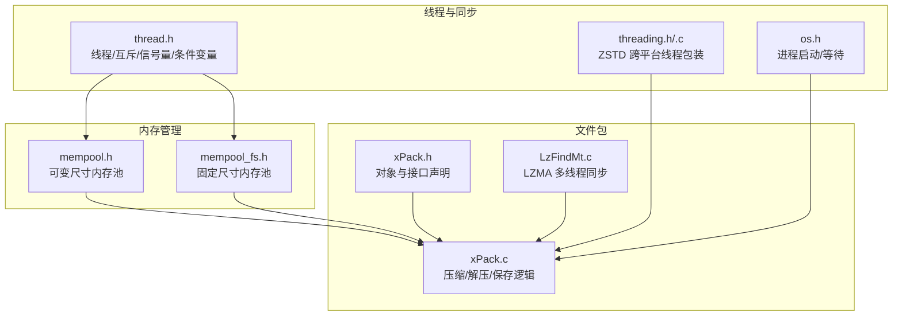
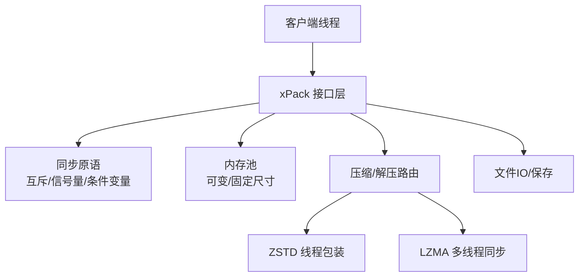
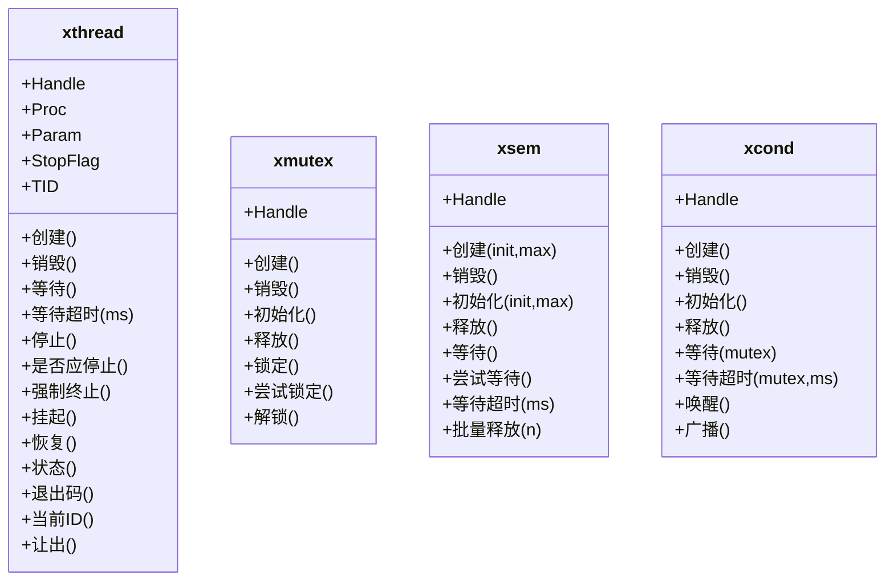
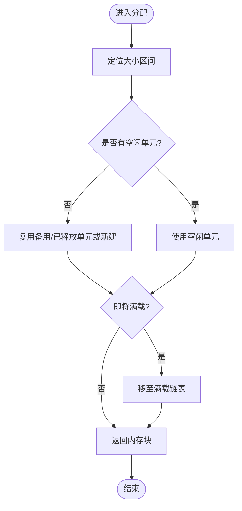
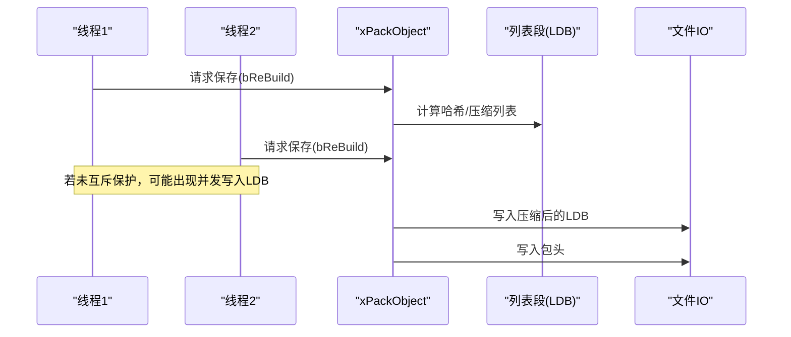
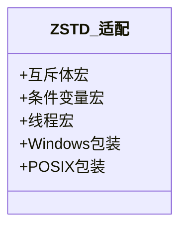
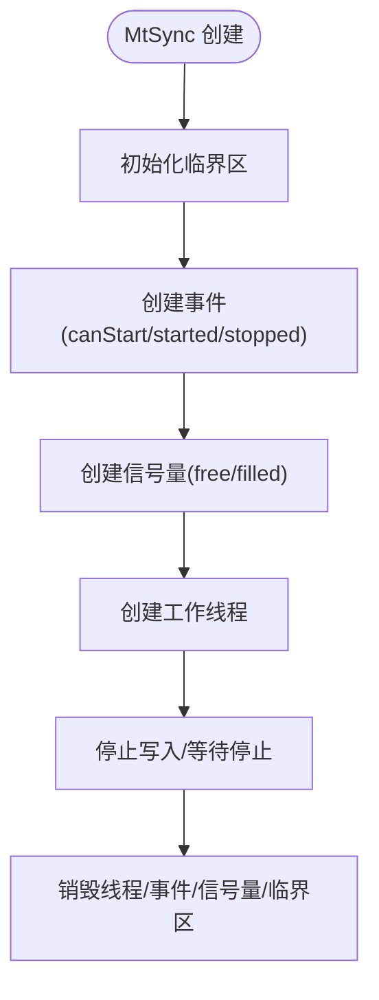
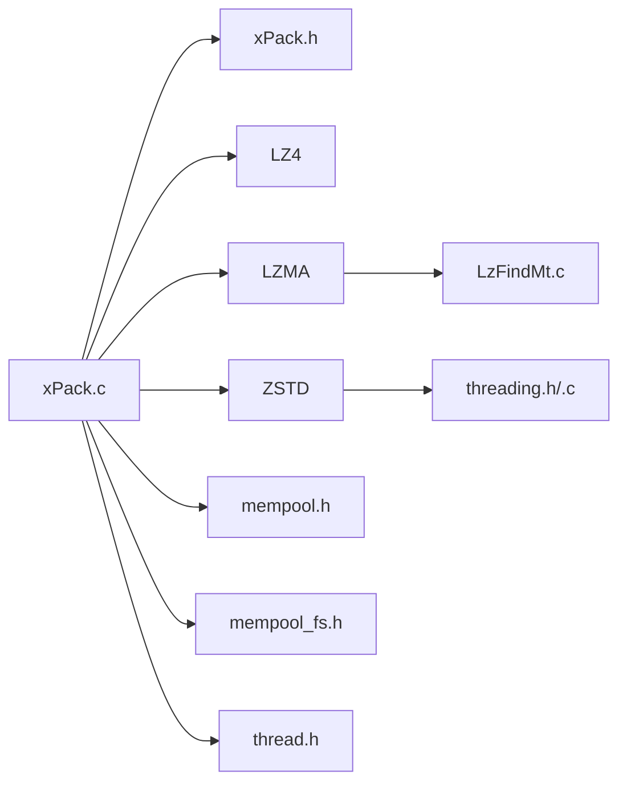

# 多线程支持

<cite>
**本文引用的文件**
- [lib/xrt/lib/thread.h](file://lib/xrt/lib/thread.h)
- [lib/xrt/lib/mempool.h](file://lib/xrt/lib/mempool.h)
- [lib/xrt/lib/mempool_fs.h](file://lib/xrt/lib/mempool_fs.h)
- [lib/zstd/common/threading.h](file://lib/zstd/common/threading.h)
- [lib/zstd/common/threading.c](file://lib/zstd/common/threading.c)
- [ver6/xpack/xPack.h](file://ver6/xpack/xPack.h)
- [ver6/xpack/xPack.c](file://ver6/xpack/xPack.c)
- [ver5/lzma/LzFindMt.c](file://ver5/lzma/LzFindMt.c)
- [lib/xrt/lib/os.h](file://lib/xrt/lib/os.h)
</cite>

## 目录
1. [简介](#简介)
2. [项目结构](#项目结构)
3. [核心组件](#核心组件)
4. [架构总览](#架构总览)
5. [详细组件分析](#详细组件分析)
6. [依赖关系分析](#依赖关系分析)
7. [性能考量](#性能考量)
8. [故障排查指南](#故障排查指南)
9. [结论](#结论)
10. [附录](#附录)

## 简介
本文件围绕 xPack 的多线程支持与并发处理展开，重点覆盖以下主题：
- 文件包对象的线程安全性保证与限制
- 多线程环境下的内存管理注意事项
- 线程安全的文件包操作模式与示例路径
- 锁机制使用与死锁规避策略
- 异步操作与回调机制
- 线程池集成与任务调度最佳实践
- 多线程性能优化建议
- 线程间通信与数据共享的安全方法

## 项目结构
xPack 在不同层级提供了多线程基础设施与并发工具：
- 平台抽象与同步原语：xrt 线程/互斥/信号量/条件变量封装
- 内存池与固定大小内存池：减少锁竞争与分配碎片
- 压缩库线程适配：ZSTD 的跨平台线程包装
- 文件包对象：xPack 对象结构与操作接口
- LZMA 多线程同步：MtSync 同步协调
- 进程与外部命令：跨平台启动与等待

**图表来源**
- [lib/xrt/lib/thread.h](file://lib/xrt/lib/thread.h#L37-L290)
- [lib/zstd/common/threading.h](file://lib/zstd/common/threading.h#L19-L143)
- [lib/zstd/common/threading.c](file://lib/zstd/common/threading.c#L23-L133)
- [lib/xrt/lib/mempool.h](file://lib/xrt/lib/mempool.h#L1-L468)
- [lib/xrt/lib/mempool_fs.h](file://lib/xrt/lib/mempool_fs.h#L1-L257)
- [ver6/xpack/xPack.h](file://ver6/xpack/xPack.h#L98-L127)
- [ver6/xpack/xPack.c](file://ver6/xpack/xPack.c#L54-L200)
- [ver5/lzma/LzFindMt.c](file://ver5/lzma/LzFindMt.c#L52-L145)
- [lib/xrt/lib/os.h](file://lib/xrt/lib/os.h#L5-L90)

**章节来源**
- [lib/xrt/lib/thread.h](file://lib/xrt/lib/thread.h#L37-L290)
- [lib/zstd/common/threading.h](file://lib/zstd/common/threading.h#L19-L143)
- [lib/zstd/common/threading.c](file://lib/zstd/common/threading.c#L23-L133)
- [lib/xrt/lib/mempool.h](file://lib/xrt/lib/mempool.h#L1-L468)
- [lib/xrt/lib/mempool_fs.h](file://lib/xrt/lib/mempool_fs.h#L1-L257)
- [ver6/xpack/xPack.h](file://ver6/xpack/xPack.h#L98-L127)
- [ver6/xpack/xPack.c](file://ver6/xpack/xPack.c#L54-L200)
- [ver5/lzma/LzFindMt.c](file://ver5/lzma/LzFindMt.c#L52-L145)
- [lib/xrt/lib/os.h](file://lib/xrt/lib/os.h#L5-L90)

## 核心组件
- 线程与同步原语
  - 跨平台线程创建/等待/停止/挂起/恢复
  - 互斥体、信号量、条件变量的统一接口
  - 停止标志与超时等待
- 内存池
  - 可变尺寸内存池：按大小区间组织，减少锁粒度
  - 固定尺寸内存池：单尺寸块高效分配/回收
- 压缩库线程适配
  - ZSTD 多线程宏与包装，Windows/POSIX 统一接口
- 文件包对象
  - xPackObject 结构：文件句柄、偏移、只读、变更标记、包头、列表段、回调
  - 提供多种访问模式（Core/Index/Linux/Win32）
- LZMA 多线程同步
  - MtSync：事件/信号量/临界区协调生产者/消费者
- 进程与外部命令
  - 跨平台运行程序与打开文件

**章节来源**
- [lib/xrt/lib/thread.h](file://lib/xrt/lib/thread.h#L37-L290)
- [lib/xrt/lib/mempool.h](file://lib/xrt/lib/mempool.h#L1-L468)
- [lib/xrt/lib/mempool_fs.h](file://lib/xrt/lib/mempool_fs.h#L1-L257)
- [lib/zstd/common/threading.h](file://lib/zstd/common/threading.h#L19-L143)
- [ver6/xpack/xPack.h](file://ver6/xpack/xPack.h#L98-L127)
- [ver5/lzma/LzFindMt.c](file://ver5/lzma/LzFindMt.c#L52-L145)
- [lib/xrt/lib/os.h](file://lib/xrt/lib/os.h#L5-L90)

## 架构总览
xPack 的多线程架构由“同步原语 + 内存池 + 压缩库适配 + 文件包对象”构成，文件包操作在多线程下通过以下方式保障一致性：
- 互斥保护共享状态（包头、列表段、文件句柄）
- 信号量/条件变量协调生产者/消费者
- 内存池减少锁持有时间，降低竞争
- 压缩/解压回调在用户控制下执行，避免阻塞主线程
- LZMA 多线程同步确保编码/解码流水线稳定

**图表来源**
- [ver6/xpack/xPack.c](file://ver6/xpack/xPack.c#L54-L200)
- [lib/xrt/lib/thread.h](file://lib/xrt/lib/thread.h#L308-L749)
- [lib/xrt/lib/mempool.h](file://lib/xrt/lib/mempool.h#L148-L385)
- [lib/xrt/lib/mempool_fs.h](file://lib/xrt/lib/mempool_fs.h#L52-L221)
- [lib/zstd/common/threading.h](file://lib/zstd/common/threading.h#L19-L143)
- [ver5/lzma/LzFindMt.c](file://ver5/lzma/LzFindMt.c#L52-L145)

## 详细组件分析

### 组件A：线程与同步原语
- 线程生命周期管理：创建、等待、超时等待、停止、强制终止、挂起/恢复、状态查询、退出码
- 互斥体：创建/销毁、初始化/释放、锁定/尝试锁定/解锁
- 信号量：创建/销毁、初始化/释放、等待/带超时等待/释放/批量释放
- 条件变量：创建/销毁、初始化/释放、等待/带超时等待、单播/广播

**图表来源**
- [lib/xrt/lib/thread.h](file://lib/xrt/lib/thread.h#L37-L290)
- [lib/xrt/lib/thread.h](file://lib/xrt/lib/thread.h#L308-L749)

**章节来源**
- [lib/xrt/lib/thread.h](file://lib/xrt/lib/thread.h#L37-L290)
- [lib/xrt/lib/thread.h](file://lib/xrt/lib/thread.h#L308-L749)

### 组件B：内存池与固定尺寸内存池
- 可变尺寸内存池（mempool.h）
  - 通过 AVL/二叉搜索树按大小区间组织，减少锁范围
  - 分配/释放/垃圾回收（GC）流程清晰，支持标记回收
- 固定尺寸内存池（mempool_fs.h）
  - 单尺寸块高效分配，空闲/满载/备用/可释放链表管理
  - GC 将清空单元回收或置为备用，避免频繁创建销毁

**图表来源**
- [lib/xrt/lib/mempool.h](file://lib/xrt/lib/mempool.h#L148-L261)
- [lib/xrt/lib/mempool_fs.h](file://lib/xrt/lib/mempool_fs.h#L52-L125)

**章节来源**
- [lib/xrt/lib/mempool.h](file://lib/xrt/lib/mempool.h#L148-L385)
- [lib/xrt/lib/mempool_fs.h](file://lib/xrt/lib/mempool_fs.h#L52-L221)

### 组件C：文件包对象与线程安全
- xPackObject 结构包含：
  - 文件句柄、偏移、只读、变更标记、包头、列表段、错误回调、压缩/解压回调
- 线程安全要点：
  - 列表段（LDB）与包头更新需互斥保护
  - 保存操作涉及 LDB 压缩与写入，需串行化
  - 回调函数（OnCompress/OnUnCompress）可能在用户线程上下文执行，避免长时间阻塞
- 限制与约束：
  - 多线程同时修改同一包对象存在竞态风险，建议每个线程拥有独立 xPackObject 实例或通过队列串行化

**图表来源**
- [ver6/xpack/xPack.h](file://ver6/xpack/xPack.h#L98-L127)
- [ver6/xpack/xPack.c](file://ver6/xpack/xPack.c#L163-L200)

**章节来源**
- [ver6/xpack/xPack.h](file://ver6/xpack/xPack.h#L98-L127)
- [ver6/xpack/xPack.c](file://ver6/xpack/xPack.c#L163-L200)

### 组件D：ZSTD 多线程适配
- threading.h 提供跨平台互斥/条件变量/线程的宏包装
- threading.c 在 Windows 上提供 pthread 风格的 create/join 封装
- 适用于多线程压缩/解压场景，避免平台差异

**图表来源**
- [lib/zstd/common/threading.h](file://lib/zstd/common/threading.h#L19-L143)
- [lib/zstd/common/threading.c](file://lib/zstd/common/threading.c#L23-L133)

**章节来源**
- [lib/zstd/common/threading.h](file://lib/zstd/common/threading.h#L19-L143)
- [lib/zstd/common/threading.c](file://lib/zstd/common/threading.c#L23-L133)

### 组件E：LZMA 多线程同步（MtSync）
- 通过事件/信号量/临界区协调工作线程
- 支持停止写入、等待停止、清理资源
- 适合流水线式多线程编码/解码

**图表来源**
- [ver5/lzma/LzFindMt.c](file://ver5/lzma/LzFindMt.c#L52-L145)

**章节来源**
- [ver5/lzma/LzFindMt.c](file://ver5/lzma/LzFindMt.c#L52-L145)

### 组件F：异步操作与回调机制
- 文件包保存/压缩/解压均通过回调或路由函数实现，避免阻塞
- 建议将耗时操作放入后台线程，完成后通过回调通知
- 进程启动与等待可通过跨平台接口实现外部命令异步执行

**章节来源**
- [ver6/xpack/xPack.c](file://ver6/xpack/xPack.c#L54-L159)
- [lib/xrt/lib/os.h](file://lib/xrt/lib/os.h#L5-L90)

## 依赖关系分析
- xPack.c 依赖：
  - xPack.h（接口与对象）
  - 压缩库（LZ4/LZMA/ZSTD）
  - 内存池（mempool/mempool_fs）
  - 线程原语（thread.h）
- LZMA 多线程同步依赖底层事件/信号量/临界区
- ZSTD 线程包装依赖平台 pthread/Windows CS

**图表来源**
- [ver6/xpack/xPack.c](file://ver6/xpack/xPack.c#L1-L28)
- [ver6/xpack/xPack.h](file://ver6/xpack/xPack.h#L98-L127)
- [lib/xrt/lib/mempool.h](file://lib/xrt/lib/mempool.h#L1-L468)
- [lib/xrt/lib/mempool_fs.h](file://lib/xrt/lib/mempool_fs.h#L1-L257)
- [lib/xrt/lib/thread.h](file://lib/xrt/lib/thread.h#L37-L290)
- [ver5/lzma/LzFindMt.c](file://ver5/lzma/LzFindMt.c#L52-L145)
- [lib/zstd/common/threading.h](file://lib/zstd/common/threading.h#L19-L143)
- [lib/zstd/common/threading.c](file://lib/zstd/common/threading.c#L23-L133)

**章节来源**
- [ver6/xpack/xPack.c](file://ver6/xpack/xPack.c#L1-L28)
- [ver6/xpack/xPack.h](file://ver6/xpack/xPack.h#L98-L127)
- [lib/xrt/lib/mempool.h](file://lib/xrt/lib/mempool.h#L1-L468)
- [lib/xrt/lib/mempool_fs.h](file://lib/xrt/lib/mempool_fs.h#L1-L257)
- [lib/xrt/lib/thread.h](file://lib/xrt/lib/thread.h#L37-L290)
- [ver5/lzma/LzFindMt.c](file://ver5/lzma/LzFindMt.c#L52-L145)
- [lib/zstd/common/threading.h](file://lib/zstd/common/threading.h#L19-L143)
- [lib/zstd/common/threading.c](file://lib/zstd/common/threading.c#L23-L133)

## 性能考量
- 锁粒度与热点分离
  - 使用内存池减少锁持有时间，避免全局锁
  - 将列表段与包头更新分离到独立临界区
- 线程亲和与栈大小
  - 合理设置线程栈大小，避免栈溢出
  - 在支持的平台上考虑线程亲和性
- I/O 与 CPU 负载均衡
  - 将压缩/解压与磁盘写入解耦，使用后台线程
  - 控制并发度，避免过度竞争
- 回收策略
  - 定期执行内存池 GC，将清空单元复用而非销毁

[本节为通用指导，无需特定文件引用]

## 故障排查指南
- 线程等待与超时
  - 使用带超时的等待接口，避免无限阻塞
  - 注意 POSIX 平台的超时实现差异
- 死亡/悬挂线程
  - 避免强制终止线程；使用停止标志优雅退出
  - 挂起/恢复在 POSIX 下不可用，改用条件变量
- 互斥与信号量滥用
  - 成对调用初始化/释放，防止泄漏
  - 条件变量必须与互斥体配合使用
- 文件包并发写入
  - 保存操作需串行化；避免多个线程同时写 LDB
  - 使用回调时注意异常传播与资源释放

**章节来源**
- [lib/xrt/lib/thread.h](file://lib/xrt/lib/thread.h#L113-L157)
- [lib/xrt/lib/thread.h](file://lib/xrt/lib/thread.h#L183-L223)
- [lib/xrt/lib/thread.h](file://lib/xrt/lib/thread.h#L366-L420)
- [ver6/xpack/xPack.c](file://ver6/xpack/xPack.c#L163-L200)

## 结论
xPack 在多线程支持方面提供了完善的基础设施：统一的跨平台同步原语、高效的内存池、压缩库线程适配以及文件包对象的接口设计。通过合理的锁策略、内存池与异步回调，可以在多线程环境下安全地进行文件包的读写与压缩/解压操作。实际应用中应遵循“细粒度锁、后台化耗时操作、串行化关键路径”的原则，以获得稳定的性能与可靠性。

[本节为总结，无需特定文件引用]

## 附录

### 线程安全的文件包操作示例与代码模式（示例路径）
- 保存包（串行化）
  - 示例路径：[保存包实现](file://ver6/xpack/xPack.c#L163-L200)
- 压缩/解压路由（回调）
  - 示例路径：[压缩路由](file://ver6/xpack/xPack.c#L54-L101)、[解压路由](file://ver6/xpack/xPack.c#L103-L159)
- 线程创建/等待/停止
  - 示例路径：[线程创建](file://lib/xrt/lib/thread.h#L37-L74)、[等待](file://lib/xrt/lib/thread.h#L99-L108)、[停止](file://lib/xrt/lib/thread.h#L162-L167)
- 互斥/信号量/条件变量
  - 示例路径：[互斥体](file://lib/xrt/lib/thread.h#L308-L420)、[信号量](file://lib/xrt/lib/thread.h#L427-L590)、[条件变量](file://lib/xrt/lib/thread.h#L597-L746)
- 内存池分配/释放/GC
  - 示例路径：[可变尺寸内存池分配](file://lib/xrt/lib/mempool.h#L148-L261)、[固定尺寸内存池分配](file://lib/xrt/lib/mempool_fs.h#L52-L125)、[GC](file://lib/xrt/lib/mempool.h#L427-L465)
- LZMA 多线程同步
  - 示例路径：[MtSync 停止写入](file://ver5/lzma/LzFindMt.c#L52-L74)、[MtSync 析构](file://ver5/lzma/LzFindMt.c#L76-L100)

**章节来源**
- [ver6/xpack/xPack.c](file://ver6/xpack/xPack.c#L54-L200)
- [lib/xrt/lib/thread.h](file://lib/xrt/lib/thread.h#L37-L749)
- [lib/xrt/lib/mempool.h](file://lib/xrt/lib/mempool.h#L148-L465)
- [lib/xrt/lib/mempool_fs.h](file://lib/xrt/lib/mempool_fs.h#L52-L221)
- [ver5/lzma/LzFindMt.c](file://ver5/lzma/LzFindMt.c#L52-L100)