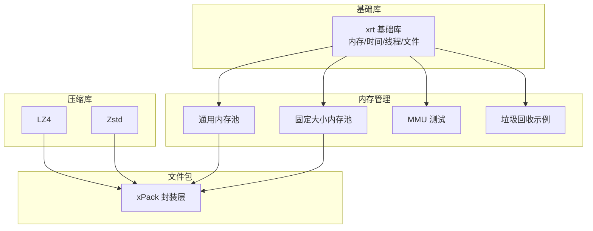
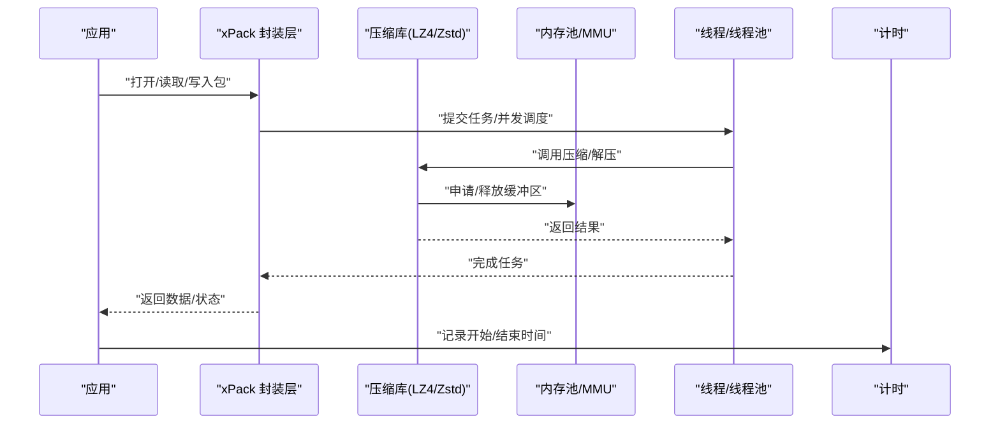
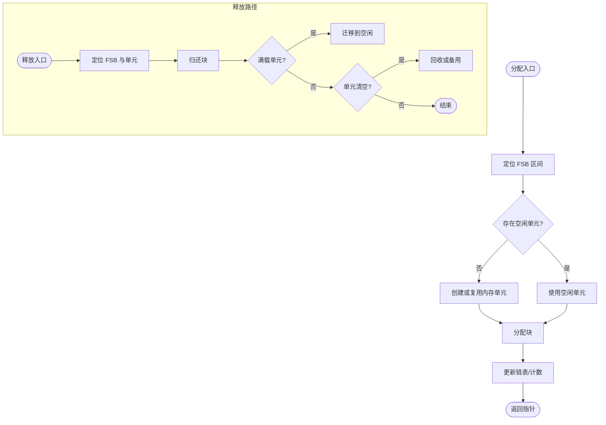
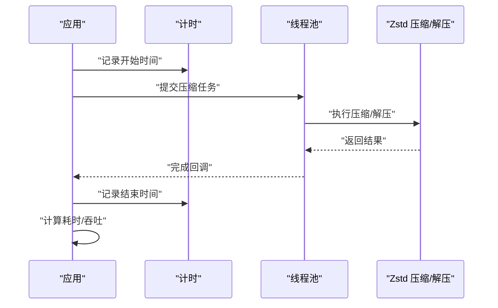
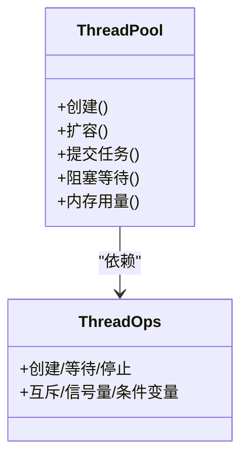
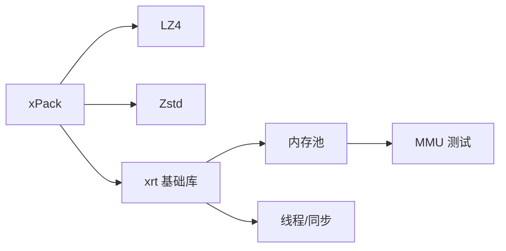

# 性能监控

<cite>
**本文引用的文件**
- [lib/xrt/lib/mempool.h](file://lib/xrt/lib/mempool.h)
- [lib/xrt/lib/mempool_fs.h](file://lib/xrt/lib/mempool_fs.h)
- [lib/zstd/common/pool.h](file://lib/zstd/common/pool.h)
- [lib/zstd/common/pool.c](file://lib/zstd/common/pool.c)
- [lib/lz4/lz4.h](file://lib/lz4/lz4.h)
- [lib/xrt/lib/thread.h](file://lib/xrt/lib/thread.h)
- [lib/xrt/lib/time.h](file://lib/xrt/lib/time.h)
- [lib/xrt/xrt.h](file://lib/xrt/xrt.h)
- [ver6/xpack/xPack.h](file://ver6/xpack/xPack.h)
- [ver6/mmu/test/07_mm256_test.h](file://ver6/mmu/test/07_mm256_test.h)
- [ver6/mmu/test/08_mm64k_test.h](file://ver6/mmu/test/08_mm64k_test.h)
- [ver6/xCore/backup/tgc.h](file://ver6/xCore/backup/tgc.h)
</cite>

## 目录
1. [简介](#简介)
2. [项目结构](#项目结构)
3. [核心组件](#核心组件)
4. [架构总览](#架构总览)
5. [详细组件分析](#详细组件分析)
6. [依赖关系分析](#依赖关系分析)
7. [性能考量](#性能考量)
8. [故障排查指南](#故障排查指南)
9. [结论](#结论)
10. [附录](#附录)

## 简介
本文件聚焦于 xPack 体系的性能监控与分析能力，围绕以下目标展开：
- 内存使用监控与分析：涵盖通用内存池、固定大小内存池、垃圾回收与内存单元管理。
- 压缩与解压性能指标采集：结合 LZ4、Zstd 线程池与内部计时接口，指导如何在实际场景中采集吞吐、延迟与资源占用。
- 文件包操作的性能基准与优化：基于 xPack 文件包结构与 API，给出可落地的基准测试思路与优化策略。
- 内存池使用效率监控与调优：通过内存池内部链表与单元状态，定位碎片、利用率与 GC 行为。
- 多线程环境下的性能分析与瓶颈识别：利用线程、互斥、信号量、条件变量与线程池，构建并发性能观测与定位方法。
- 性能问题诊断工具与调试技巧：结合高精度计时、错误回调与测试用例输出，形成系统化的诊断流程。
- 不同压缩算法的性能特点与选择策略：对比 LZ4 与 Zstd 在速度、压缩比与内存占用上的差异，并给出选择建议。

## 项目结构
xPack 仓库包含多模块协作：
- lib/xrt：跨平台基础库，提供内存、时间、线程与文件等通用能力。
- lib/lz4 与 lib/zstd：压缩/解压算法实现，提供 API 与多线程支持。
- ver6/xpack：文件包封装层，定义包头、文件信息与操作 API。
- ver6/mmu：内存管理单元（MMU）测试与验证，展示内存池内部状态。
- ver6/xCore/backup/tgc.h：简易垃圾回收示例，体现内存生命周期管理思想。

**图表来源**
- [lib/xrt/xrt.h](file://lib/xrt/xrt.h#L1-L120)
- [lib/xrt/lib/mempool.h](file://lib/xrt/lib/mempool.h#L1-L120)
- [lib/xrt/lib/mempool_fs.h](file://lib/xrt/lib/mempool_fs.h#L1-L60)
- [lib/lz4/lz4.h](file://lib/lz4/lz4.h#L1-L120)
- [lib/zstd/common/pool.h](file://lib/zstd/common/pool.h#L1-L82)
- [ver6/xpack/xPack.h](file://ver6/xpack/xPack.h#L1-L120)
- [ver6/mmu/test/07_mm256_test.h](file://ver6/mmu/test/07_mm256_test.h#L272-L310)
- [ver6/mmu/test/08_mm64k_test.h](file://ver6/mmu/test/08_mm64k_test.h#L300-L315)
- [ver6/xCore/backup/tgc.h](file://ver6/xCore/backup/tgc.h#L306-L360)

**章节来源**
- [lib/xrt/xrt.h](file://lib/xrt/xrt.h#L1-L120)
- [ver6/xpack/xPack.h](file://ver6/xpack/xPack.h#L1-L120)

## 核心组件
- 内存池（通用与固定大小）
  - 通用内存池：按区间树组织的小/大块分配，支持空闲/满载/备用链表与 GC。
  - 固定大小内存池：面向固定块尺寸的高效分配与回收。
- 压缩与线程池
  - LZ4：提供内存使用上限与加速参数，适合极致速度场景。
  - Zstd：提供线程池 API，支持多核并行压缩/解压。
- 文件包（xPack）
  - 定义包头、文件信息与多模式（Core/Index/Linux/Win32）操作 API。
- 并发与计时
  - 跨平台线程、互斥、信号量、条件变量。
  - 高精度计时接口，用于性能采样与统计。

**章节来源**
- [lib/xrt/lib/mempool.h](file://lib/xrt/lib/mempool.h#L1-L120)
- [lib/xrt/lib/mempool_fs.h](file://lib/xrt/lib/mempool_fs.h#L1-L60)
- [lib/lz4/lz4.h](file://lib/lz4/lz4.h#L140-L220)
- [lib/zstd/common/pool.h](file://lib/zstd/common/pool.h#L1-L82)
- [ver6/xpack/xPack.h](file://ver6/xpack/xPack.h#L20-L120)
- [lib/xrt/lib/thread.h](file://lib/xrt/lib/thread.h#L35-L120)
- [lib/xrt/lib/time.h](file://lib/xrt/lib/time.h#L4-L36)

## 架构总览
下图展示了 xPack 性能监控的关键交互路径：应用通过 xPack API 触发压缩/解压，底层依赖 LZ4/Zstd；内存由 xrt 内存池与 MMU 提供；并发通过线程与线程池协调；计时贯穿请求生命周期。

**图表来源**
- [ver6/xpack/xPack.h](file://ver6/xpack/xPack.h#L113-L160)
- [lib/lz4/lz4.h](file://lib/lz4/lz4.h#L176-L236)
- [lib/zstd/common/pool.h](file://lib/zstd/common/pool.h#L21-L82)
- [lib/xrt/lib/mempool.h](file://lib/xrt/lib/mempool.h#L147-L261)
- [lib/xrt/lib/time.h](file://lib/xrt/lib/time.h#L4-L22)

## 详细组件分析

### 内存池与内存单元（通用与固定大小）
- 通用内存池（mempool.h）
  - 通过区间树（FSB）选择合适块尺寸，链表维护空闲/满载/备用/自由节点，支持 GC 标记回收。
  - 分配路径：根据请求大小定位 FSB → 选择/创建内存单元 → 分配块 → 标记链表迁移。
  - 释放路径：定位所属 FSB 与内存单元 → 归还块 → 清理空单元或进入备用。
  - GC 路径：遍历空闲/满载链表，按标记回收，再分类回位。
- 固定大小内存池（mempool_fs.h）
  - 面向固定块尺寸，简化分配与回收逻辑，适合高频小对象场景。
- 内存单元状态可视化（MMU 测试）
  - 通过测试输出查看 LL_Idle/LL_Full/LL_Free/LL_Null 链表与单元计数，辅助定位碎片与利用率。

**图表来源**
- [lib/xrt/lib/mempool.h](file://lib/xrt/lib/mempool.h#L147-L261)
- [lib/xrt/lib/mempool_fs.h](file://lib/xrt/lib/mempool_fs.h#L51-L125)
- [ver6/mmu/test/07_mm256_test.h](file://ver6/mmu/test/07_mm256_test.h#L272-L310)
- [ver6/mmu/test/08_mm64k_test.h](file://ver6/mmu/test/08_mm64k_test.h#L300-L315)

**章节来源**
- [lib/xrt/lib/mempool.h](file://lib/xrt/lib/mempool.h#L147-L465)
- [lib/xrt/lib/mempool_fs.h](file://lib/xrt/lib/mempool_fs.h#L51-L254)
- [ver6/mmu/test/07_mm256_test.h](file://ver6/mmu/test/07_mm256_test.h#L272-L310)
- [ver6/mmu/test/08_mm64k_test.h](file://ver6/mmu/test/08_mm64k_test.h#L300-L315)

### 压缩与解压性能指标采集
- LZ4
  - 内存使用上限可通过宏控制，加速参数影响速度与压缩比权衡。
  - 适合对速度敏感且内存受限的场景。
- Zstd
  - 提供线程池 API，支持多核并行；提供线程池内存用量查询接口，便于监控线程池自身内存占用。
  - 可通过高精度计时接口记录压缩/解压开始/结束时间，计算吞吐与延迟。

**图表来源**
- [lib/zstd/common/pool.h](file://lib/zstd/common/pool.h#L21-L82)
- [lib/zstd/common/pool.c](file://lib/zstd/common/pool.c#L206-L211)
- [lib/lz4/lz4.h](file://lib/lz4/lz4.h#L146-L236)
- [lib/xrt/lib/time.h](file://lib/xrt/lib/time.h#L4-L22)

**章节来源**
- [lib/zstd/common/pool.h](file://lib/zstd/common/pool.h#L21-L82)
- [lib/zstd/common/pool.c](file://lib/zstd/common/pool.c#L206-L211)
- [lib/lz4/lz4.h](file://lib/lz4/lz4.h#L146-L236)
- [lib/xrt/lib/time.h](file://lib/xrt/lib/time.h#L4-L22)

### 文件包操作的性能基准与优化
- xPack 结构与 API
  - 包头、文件信息、多模式（Core/Index/Linux/Win32）与压缩路由接口。
  - 通过设置压缩级别与回调，可灵活接入自定义压缩/解压流程。
- 基准测试建议
  - 以不同数据规模与类型（文本/二进制/混合）构造样本集。
  - 对比 LZ4/Fast 与 LZMA/High 的压缩比与速度，记录吞吐、CPU 利用率与内存峰值。
  - 在多线程环境下，逐步增加线程数，观察吞吐饱和点与抖动。
- 优化策略
  - 合理选择压缩算法与级别：大文件/网络传输优先速度（LZ4），存储优先高压缩比（LZMA/Zstd）。
  - 使用内存池减少频繁分配带来的抖动与碎片。
  - 采用线程池并行化压缩/解压，结合队列长度与工作线程数调优。

**章节来源**
- [ver6/xpack/xPack.h](file://ver6/xpack/xPack.h#L22-L160)

### 多线程环境下的性能分析与瓶颈识别
- 线程与同步原语
  - 跨平台线程创建/等待/停止；互斥体、信号量、条件变量统一管理。
- 线程池
  - 提供创建、扩容、阻塞/非阻塞提交与内存用量查询，便于监控线程池负载与内存占用。
- 瓶颈识别方法
  - 通过高精度计时测量关键路径耗时，结合线程状态与同步原语等待时间，定位阻塞点。
  - 使用线程池队列长度与忙碌线程数评估并发度与调度开销。

**图表来源**
- [lib/zstd/common/pool.h](file://lib/zstd/common/pool.h#L21-L82)
- [lib/xrt/lib/thread.h](file://lib/xrt/lib/thread.h#L35-L120)

**章节来源**
- [lib/xrt/lib/thread.h](file://lib/xrt/lib/thread.h#L35-L120)
- [lib/zstd/common/pool.h](file://lib/zstd/common/pool.h#L21-L82)
- [lib/zstd/common/pool.c](file://lib/zstd/common/pool.c#L206-L211)

### 性能问题诊断工具与调试技巧
- 高精度计时
  - 统一的高精度计时接口，跨平台返回秒级时间，适合微基准与长周期观测。
- 错误回调与临时内存
  - 全局错误设置与清理，配合临时内存环形缓冲，便于快速释放与定位异常。
- 测试输出与 GC 示例
  - MMU 测试输出链表状态，辅助定位碎片与回收行为。
  - 垃圾回收示例展示生命周期管理与触发条件。

**章节来源**
- [lib/xrt/lib/time.h](file://lib/xrt/lib/time.h#L4-L22)
- [lib/xrt/lib/base.h](file://lib/xrt/lib/base.h#L88-L132)
- [ver6/mmu/test/07_mm256_test.h](file://ver6/mmu/test/07_mm256_test.h#L272-L310)
- [ver6/xCore/backup/tgc.h](file://ver6/xCore/backup/tgc.h#L306-L360)

### 不同压缩算法的性能特点与选择策略
- LZ4
  - 特点：极高速度、低内存占用、简单上下文。
  - 适用：实时/在线场景、内存受限、对压缩比要求不高。
- Zstd
  - 特点：在速度与压缩比之间可调，多线程并行，内存占用适中。
  - 适用：存储/备份、对压缩比有一定要求的场景。
- 选择策略
  - 以业务 SLA 为准：若延迟敏感优先 LZ4；若空间敏感优先 Zstd。
  - 结合数据特征：重复度高、静态数据更易获益于高压缩比算法。
  - 结合硬件：多核服务器可充分利用 Zstd 并行优势。

**章节来源**
- [lib/lz4/lz4.h](file://lib/lz4/lz4.h#L146-L236)
- [lib/zstd/common/pool.h](file://lib/zstd/common/pool.h#L21-L82)

## 依赖关系分析
- xPack 依赖 LZ4/Zstd 实现压缩/解压，依赖 xrt 内存与线程能力。
- 内存池与 MMU 测试为性能调优提供可视化依据。
- 线程池与同步原语保障并发场景下的稳定性与可观测性。

**图表来源**
- [ver6/xpack/xPack.h](file://ver6/xpack/xPack.h#L113-L160)
- [lib/lz4/lz4.h](file://lib/lz4/lz4.h#L176-L236)
- [lib/zstd/common/pool.h](file://lib/zstd/common/pool.h#L21-L82)
- [lib/xrt/lib/mempool.h](file://lib/xrt/lib/mempool.h#L147-L261)
- [lib/xrt/lib/thread.h](file://lib/xrt/lib/thread.h#L35-L120)

**章节来源**
- [ver6/xpack/xPack.h](file://ver6/xpack/xPack.h#L113-L160)
- [lib/xrt/lib/mempool.h](file://lib/xrt/lib/mempool.h#L147-L261)
- [lib/xrt/lib/thread.h](file://lib/xrt/lib/thread.h#L35-L120)

## 性能考量
- 内存使用
  - 通过内存池区间树与链表状态，关注空闲/满载比例与备用单元数量，避免频繁创建/销毁。
  - 大块内存路径与 GC 标记回收策略，减少碎片与提升复用率。
- 压缩性能
  - LZ4：调整加速参数与内存使用上限，平衡速度与压缩比。
  - Zstd：合理设置线程数与队列长度，避免过载导致排队与抖动。
- 并发与调度
  - 线程池内存用量与忙碌线程数作为并发健康度指标。
  - 同步原语等待时间反映锁竞争与上下文切换成本。
- 基准与优化
  - 基于高精度计时的吞吐/延迟曲线，识别饱和点与异常波动。
  - 通过内存池与固定大小内存池组合，降低分配开销。

[本节为通用指导，不直接分析具体文件]

## 故障排查指南
- 内存相关
  - 使用 MMU 测试输出检查链表状态，定位空闲/满载/备用分布异常。
  - 观察 GC 行为与回收后链表归位，确认碎片与复用效果。
- 压缩相关
  - 记录压缩/解压开始/结束时间，计算平均耗时与 P95/P99。
  - 对比不同算法与级别，定位异常慢的样本与路径。
- 并发相关
  - 监控线程池队列长度与忙碌线程数，识别过载与饥饿。
  - 检查互斥/信号量等待时间，定位热点临界区。
- 错误与日志
  - 使用全局错误设置与清理，结合临时内存环形缓冲，快速释放与定位异常。

**章节来源**
- [ver6/mmu/test/07_mm256_test.h](file://ver6/mmu/test/07_mm256_test.h#L272-L310)
- [ver6/mmu/test/08_mm64k_test.h](file://ver6/mmu/test/08_mm64k_test.h#L300-L315)
- [lib/xrt/lib/base.h](file://lib/xrt/lib/base.h#L88-L132)
- [lib/xrt/lib/time.h](file://lib/xrt/lib/time.h#L4-L22)
- [lib/zstd/common/pool.c](file://lib/zstd/common/pool.c#L206-L211)

## 结论
通过对 xPack 体系的内存池、压缩库、线程与计时组件的系统化梳理，可建立一套完整的性能监控与分析闭环：以高精度计时为度量，以内存池与线程池为观测点，以 MMU 测试与 GC 示例为诊断手段，最终实现对压缩/解压与文件包操作的可观测、可优化与可扩展。

[本节为总结，不直接分析具体文件]

## 附录
- 关键 API 速览
  - 内存池：创建/初始化/分配/释放/GC。
  - 线程池：创建/扩容/提交/等待/内存用量。
  - 计时：高精度计时与延时。
  - xPack：包打开/关闭、文件增删改查、压缩级别与回调。

**章节来源**
- [lib/xrt/lib/mempool.h](file://lib/xrt/lib/mempool.h#L1-L120)
- [lib/xrt/lib/mempool_fs.h](file://lib/xrt/lib/mempool_fs.h#L1-L60)
- [lib/zstd/common/pool.h](file://lib/zstd/common/pool.h#L21-L82)
- [lib/xrt/lib/thread.h](file://lib/xrt/lib/thread.h#L35-L120)
- [lib/xrt/lib/time.h](file://lib/xrt/lib/time.h#L4-L22)
- [ver6/xpack/xPack.h](file://ver6/xpack/xPack.h#L113-L160)