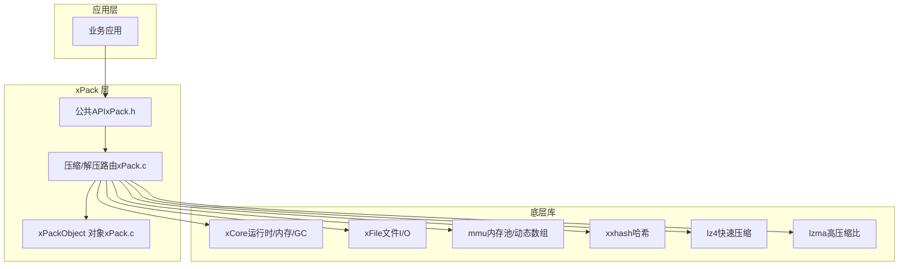
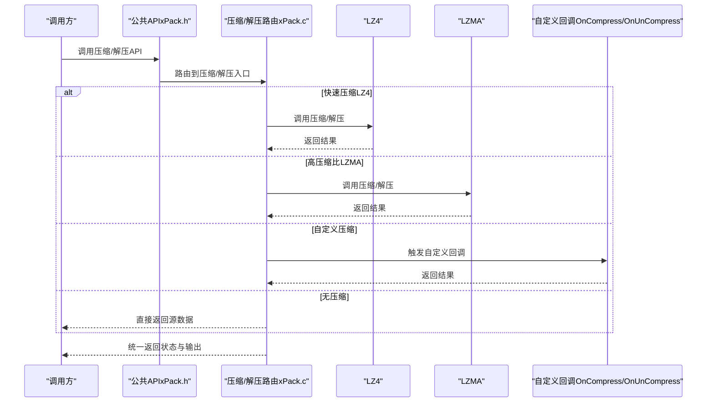
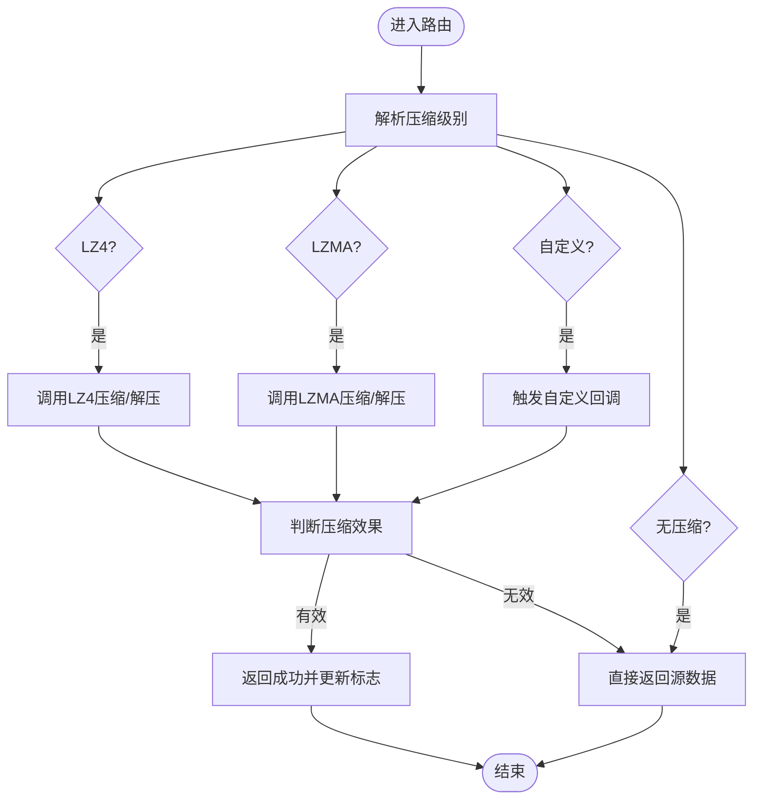
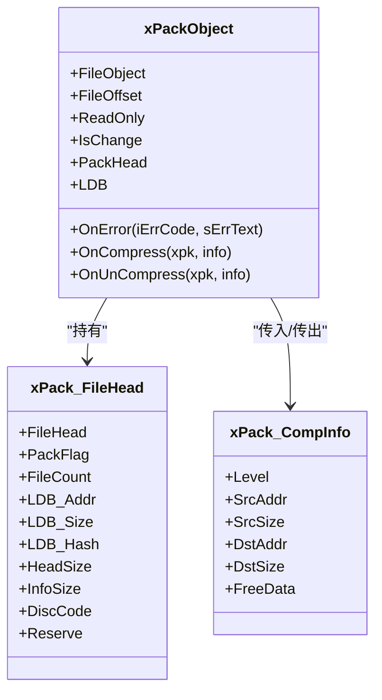
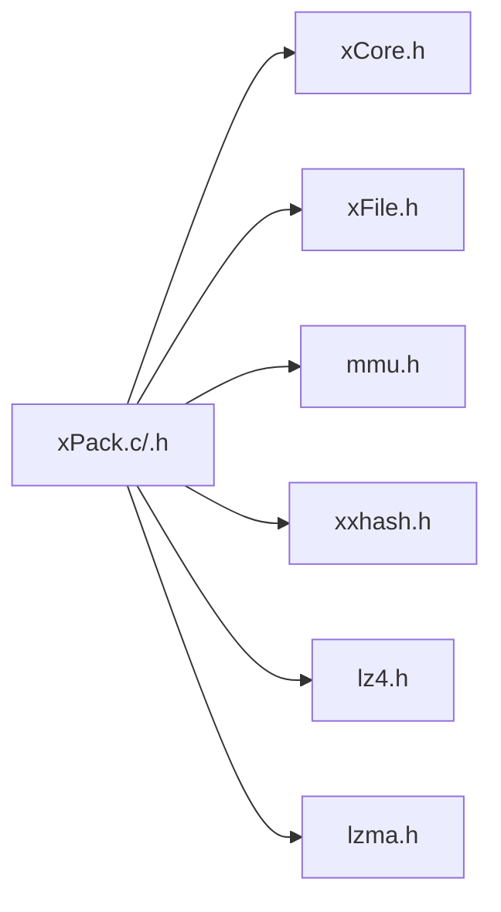

# API扩展

<cite>
**本文引用的文件**
- [xPack.h](file://ver6/xpack/xPack.h)
- [xPack.c](file://ver6/xpack/xPack.c)
- [xPack.dll 构建脚本（x64）](file://ver6/xpack/build_TCC_DLL_x64.bat)
- [xPack.dll 构建脚本（x86）](file://ver6/xpack/build_TCC_DLL_x64.bat)
- [xCore.h（备份版）](file://ver6/xCore/backup/xCore.h)
- [xCore.h（发布版）](file://ver6/xpack/release/inc/xCore.h)
- [mmu.h](file://ver6/mmu/mmu.h)
- [xxhash.h](file://ver6/xxhash32/xxhash.h)
- [lz4.h](file://ver6/lz4/lz4.h)
- [lzma.h](file://ver6/lzma/lzma.h)
- [README（ver5）](file://ver5/README.md)
</cite>

## 目录
1. [简介](#简介)
2. [项目结构](#项目结构)
3. [核心组件](#核心组件)
4. [架构总览](#架构总览)
5. [详细组件分析](#详细组件分析)
6. [依赖关系分析](#依赖关系分析)
7. [性能考量](#性能考量)
8. [故障排查指南](#故障排查指南)
9. [结论](#结论)
10. [附录](#附录)

## 简介
本文件面向希望在 xPack API 基础上进行扩展与二次开发的工程师，系统阐述扩展方法、设计原则、命名与参数设计规范、实现流程、文档与版本管理策略、测试与质量保障、影响评估与迁移建议，以及最佳实践与常见问题。目标是在保持向后兼容的前提下，安全、可演进地引入新能力。

## 项目结构
xPack 是一个跨平台的压缩包文件系统，核心位于 ver6/xpack，围绕统一的包头、文件信息结构与路由式压缩/解压入口组织功能；底层依赖 xCore（运行时）、xFile（文件I/O）、mmu（内存管理）、xxhash（哈希）、lz4/lzma（压缩）等模块。

图示来源
- [xPack.h](file://ver6/xpack/xPack.h#L1-L252)
- [xPack.c](file://ver6/xpack/xPack.c#L1-L120)
- [xCore.h（发布版）](file://ver6/xpack/release/inc/xCore.h#L254-L277)

章节来源
- [xPack.h](file://ver6/xpack/xPack.h#L1-L252)
- [xPack.c](file://ver6/xpack/xPack.c#L1-L120)
- [xCore.h（发布版）](file://ver6/xpack/release/inc/xCore.h#L254-L277)

## 核心组件
- 包头与文件信息结构：统一的包头、文件信息基类及多种扩展模式（索引、Linux、Win32），确保不同场景下的元数据兼容与扩展。
- 路由式压缩/解压：通过统一的压缩/解压入口，按压缩级别选择 LZ4/LZMA 或自定义回调，保证扩展点的集中与可控。
- 对象模型：xPackObject 封装文件句柄、偏移、只读标志、包头、列表段管理器以及错误/自定义压缩回调，作为扩展点载体。
- 扩展能力：支持设置包类型、扩展包/文件信息长度、识别码，以及通过 OnCompress/OnUnCompress 回调注入自定义算法。

章节来源
- [xPack.h](file://ver6/xpack/xPack.h#L22-L110)
- [xPack.c](file://ver6/xpack/xPack.c#L54-L159)

## 架构总览
xPack 的扩展遵循“统一入口 + 结构化扩展 + 回调注入”的设计，既保证了对外 API 的稳定性，又允许在不破坏既有行为的前提下引入新能力。

图示来源
- [xPack.c](file://ver6/xpack/xPack.c#L54-L159)

## 详细组件分析

### 组件A：压缩/解压路由与扩展点
- 设计要点
  - 路由函数集中处理压缩/解压分支，便于新增压缩算法或切换默认策略。
  - 支持自定义回调，扩展点清晰且与默认实现解耦。
  - 输出结构统一，便于上层一致处理。
- 实现要点
  - 成功压缩后更新标志位，失败回退到源数据，保证向后兼容。
  - 自定义回调返回值小于源数据长度才视为有效压缩。
- 扩展建议
  - 新增压缩算法时，在路由中增加条件分支，并在回调中提供等价的解压实现。
  - 严格遵守返回值语义与内存释放约定，避免泄漏。

图示来源
- [xPack.c](file://ver6/xpack/xPack.c#L54-L159)

章节来源
- [xPack.c](file://ver6/xpack/xPack.c#L54-L159)

### 组件B：对象模型与扩展容器
- 设计要点
  - xPackObject 将文件句柄、偏移、只读、包头、列表段管理器与回调封装，作为扩展点的承载者。
  - 通过设置包类型与扩展长度，实现不同模式的文件信息结构，满足索引、Linux、Win32 等差异化需求。
- 扩展建议
  - 新增模式时，先在包类型枚举中预留位，再在设置包类型处扩展结构尺寸与字段。
  - 保持扩展字段与现有字段的兼容性，避免破坏既有哈希与序列化。

图示来源
- [xPack.h](file://ver6/xpack/xPack.h#L22-L110)

章节来源
- [xPack.h](file://ver6/xpack/xPack.h#L22-L110)

### 组件C：包类型与扩展长度控制
- 设计要点
  - 包类型通过掩码控制，扩展长度分别针对包信息与文件信息，仅在未添加文件前可修改。
  - 不同模式下文件信息结构体尺寸不同，直接影响 LDB 段布局与哈希计算。
- 扩展建议
  - 新增模式时，确保在设置包类型阶段同步调整结构尺寸与字段，避免后续读写错位。
  - 保持扩展字段的默认值与校验逻辑，防止误用。

章节来源
- [xPack.c](file://ver6/xpack/xPack.c#L313-L396)
- [xPack.h](file://ver6/xpack/xPack.h#L9-L14)

### 组件D：文件操作族（核心/索引/Linux/Win32）
- 设计要点
  - 核心模式提供最简文件操作；索引/平台模式在核心基础上附加定位键或路径信息。
  - 通过 ToPos 查询函数实现从索引或路径到位置的映射，保证多模式一致性。
- 扩展建议
  - 新模式应提供对应的 ToPos 查询与文件信息结构，保持 API 命名与参数风格一致。
  - 严格校验模式匹配与错误码，避免越界或误判。

章节来源
- [xPack.c](file://ver6/xpack/xPack.c#L450-L944)
- [xPack.h](file://ver6/xpack/xPack.h#L170-L250)

## 依赖关系分析
xPack 的编译与运行依赖如下：

图示来源
- [xPack.c](file://ver6/xpack/xPack.c#L9-L27)
- [xPack.h](file://ver6/xpack/xPack.h#L1-L20)

章节来源
- [xPack.c](file://ver6/xpack/xPack.c#L9-L27)
- [xCore.h（发布版）](file://ver6/xpack/release/inc/xCore.h#L254-L277)

## 性能考量
- 压缩策略
  - 快速压缩（LZ4）适合大体量数据与实时场景；高压缩比（LZMA）适合空间敏感场景。
  - 自定义压缩可按业务特征优化，但需注意回调开销与内存拷贝。
- 内存与I/O
  - 路由与文件操作均涉及内存分配与磁盘读写，应避免重复分配与不必要的拷贝。
  - 使用 xxhash 进行列表与文件数据校验，确保一致性的同时降低额外开销。
- 并发与线程
  - DLL 入口初始化/释放 xCore，注意多线程环境下的生命周期管理。

章节来源
- [xPack.c](file://ver6/xpack/xPack.c#L54-L159)
- [xPack.c](file://ver6/xpack/xPack.c#L948-L967)

## 故障排查指南
- 常见错误与定位
  - 文件无法访问/格式不正确/内存申请失败/列表读取/添加失败/无效文件位置/哈希校验失败/读写失败/移动失败/包类型不匹配/找不到文件/文件名超长。
- 排查步骤
  - 检查包头版本与文件偏移；确认包类型与扩展长度设置时机；核对压缩级别与回调返回值。
  - 使用哈希校验与列表重建（保存）验证一致性。
- 回调与错误传播
  - 路由层统一通过 OnError 回调与全局错误变量传递错误信息，便于上层捕获与记录。

章节来源
- [xPack.c](file://ver6/xpack/xPack.c#L36-L53)
- [xPack.c](file://ver6/xpack/xPack.c#L163-L203)

## 结论
xPack 在结构化扩展点与路由式处理的基础上，提供了稳定且可演进的API框架。通过严格的扩展点设计、统一的错误与返回约定、以及对压缩算法与模式的灵活支持，能够在不破坏向后兼容的前提下持续增强能力。建议在扩展时遵循本文的设计原则与实现技巧，确保质量与可维护性。

## 附录

### API扩展的设计原则与实现技巧
- 向后兼容
  - 新增模式/字段必须可选，旧版本读取时忽略未知扩展。
  - 保持默认行为不变，仅在显式启用时生效。
- 扩展点
  - 优先使用路由式入口与回调，避免分散修改。
  - 扩展字段与校验逻辑（如哈希）要与现有机制协同。
- 命名与参数设计
  - 命名采用“模块_功能_对象/动作”风格，参数明确输入/输出与释放责任。
  - 对于可选参数，提供默认值与开关位，避免破坏默认行为。
- 文档与版本管理
  - 明确版本号与兼容性矩阵；变更记录与升级指引。
  - 扩展API需提供示例与回归测试。
- 测试与质量保证
  - 单测覆盖：路由分支、边界条件、错误路径。
  - 集成测试：多模式组合、大文件、并发场景。
  - 性能回归：对比不同压缩级别与算法的吞吐与延迟。
- 影响评估与迁移
  - 评估对现有包格式与工具链的影响；提供迁移脚本与兼容开关。
  - 逐步灰度发布，收集反馈与修复。
- 最佳实践与常见问题
  - 严格遵循内存释放与返回值约定；避免重复压缩与拷贝。
  - 使用统一错误处理与日志；对关键路径进行性能监控。
  - 常见问题：回调未设置导致降级、扩展长度设置时机错误、模式不匹配引发的异常。

### 具体扩展示例（从接口设计到实现的完整过程）
以下为“新增自定义压缩算法”的示例流程（概念性步骤，非具体代码）：
1. 接口设计
   - 在压缩级别枚举中新增算法标识位。
   - 在 xPackObject 中保留回调指针，签名与现有回调一致。
2. 路由扩展
   - 在压缩/解压路由中增加对该算法的分支，调用对应库函数或回调。
   - 严格检查返回值，确保压缩效果优于阈值。
3. 模式与结构
   - 若需要持久化元数据，扩展文件信息结构并在设置包类型时同步尺寸。
4. 文档与版本
   - 更新API文档与版本说明；提供使用示例与注意事项。
5. 测试
   - 单元测试覆盖算法正确性与边界；集成测试覆盖保存/读取与哈希校验。
6. 迁移与回滚
   - 提供兼容开关与回退策略；准备回滚方案与数据修复工具。

### 命名规范与参数设计原则
- 命名
  - 模块前缀：xPack_（统一归属）
  - 功能前缀：Core/Index/Linux/Win32（区分模式）
  - 动作后缀：Append/Change/Unpack/Delete（描述操作）
- 参数
  - 输入/输出分离：明确标注 [in]/[out] 与 [in/out]
  - 释放责任：FreeData 标识是否需要释放返回数据
  - 错误处理：统一返回布尔/整型状态，配合 OnError 回调

### 版本管理与构建
- 版本号
  - 包头版本常量用于格式识别与兼容性判断。
- 构建
  - 使用提供的构建脚本编译 DLL，确保链接各依赖库。
- 发布
  - 发布头文件与二进制，提供最小依赖清单与示例工程。

章节来源
- [xPack.h](file://ver6/xpack/xPack.h#L31-L34)
- [xPack.dll 构建脚本（x64）](file://ver6/xpack/build_TCC_DLL_x64.bat#L1-L7)
- [xPack.dll 构建脚本（x86）](file://ver6/xpack/build_TCC_DLL_x86.bat#L1-L7)