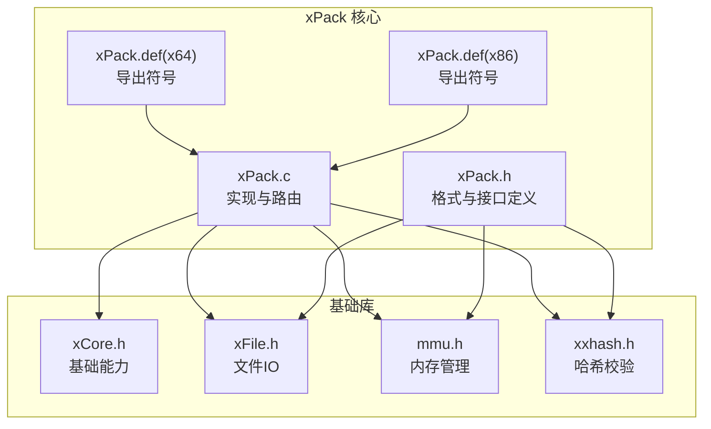
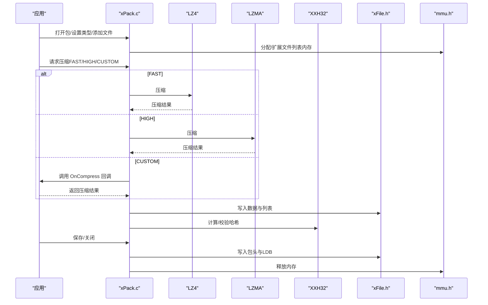
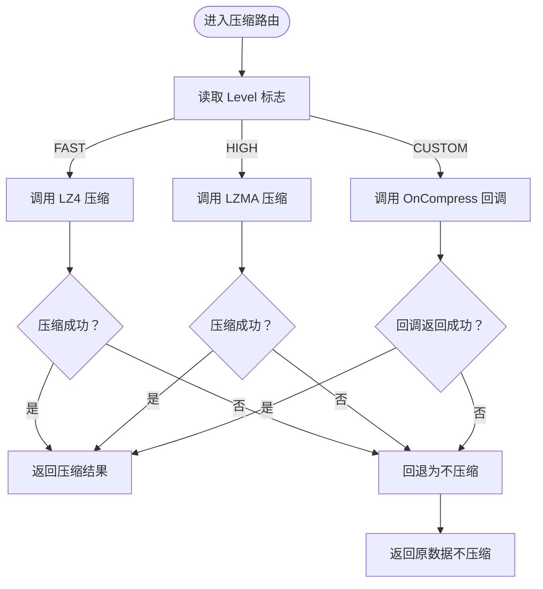
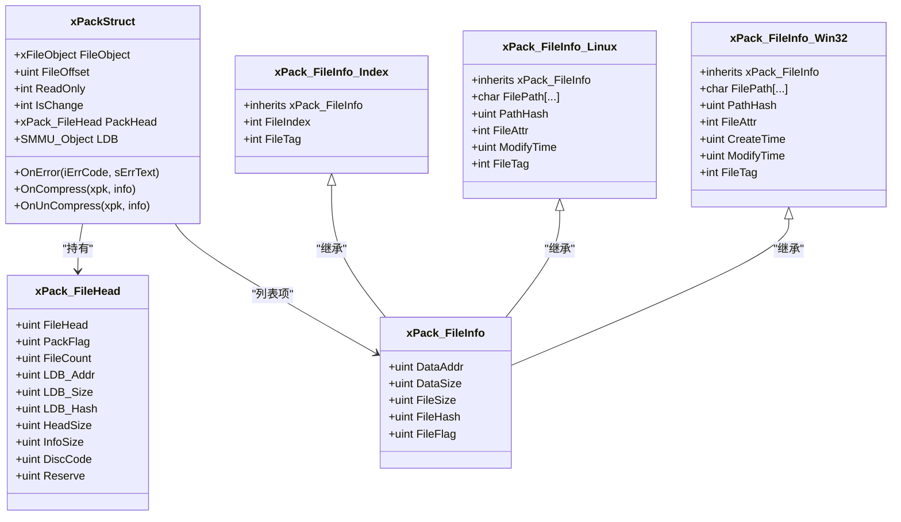
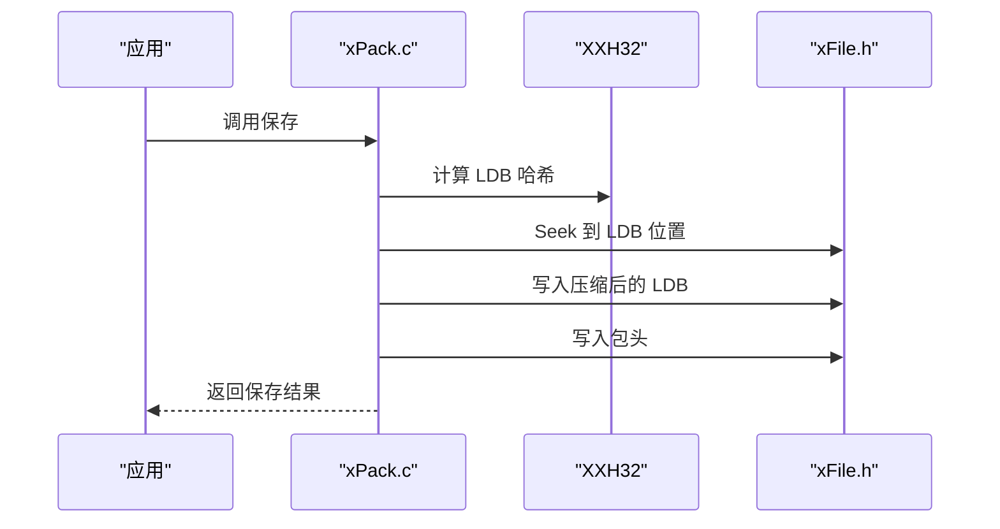
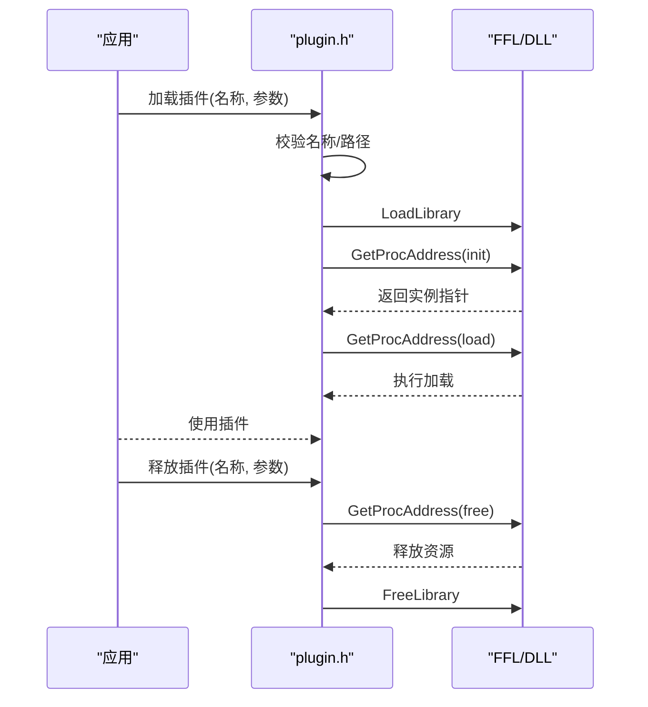
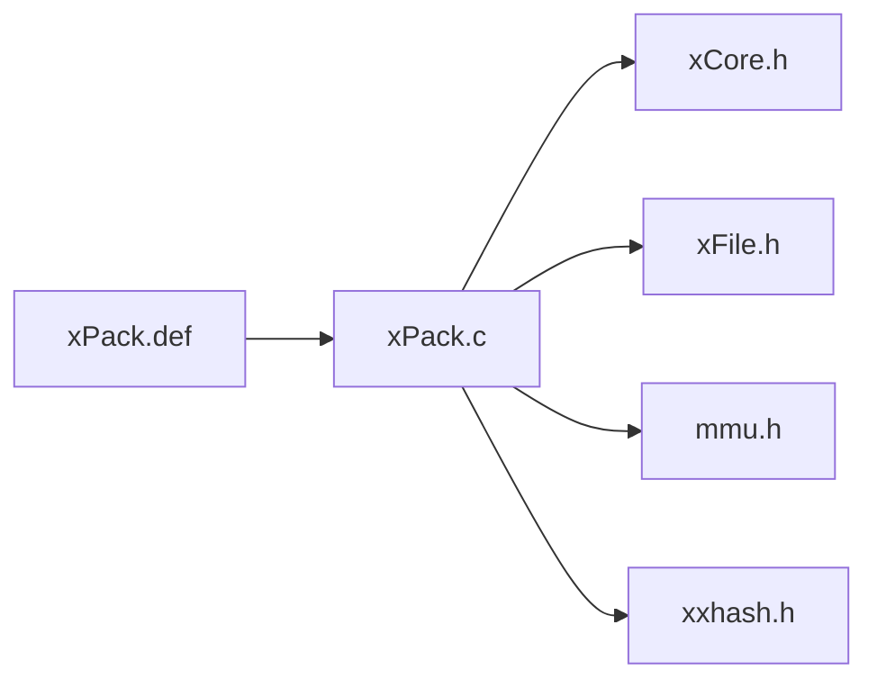

# 扩展开发

<cite>
**本文引用的文件**
- [xPack.h](file://ver6/xpack/xPack.h)
- [xPack.c](file://ver6/xpack/xPack.c)
- [xCore.h](file://ver6/xCore/xCore.h)
- [xFile.h](file://ver6/xFile/xFile.h)
- [mmu.h](file://ver6/mmu/mmu.h)
- [xxhash.h](file://ver6/xxhash32/xxhash.h)
- [xPack.def（x64）](file://ver6/xpack/release/x64/xPack.def)
- [xPack.def（x86）](file://ver6/xpack/release/x86/xPack.def)
- [test.c（xpack）](file://ver6/xpack/test.c)
- [plugin.h](file://ver6/xCore/backup/plugin.h)
- [压缩级别参数.txt](file://压缩级别参数.txt)
</cite>

## 目录
1. [简介](#简介)
2. [项目结构](#项目结构)
3. [核心组件](#核心组件)
4. [架构总览](#架构总览)
5. [详细组件分析](#详细组件分析)
6. [依赖关系分析](#依赖关系分析)
7. [性能考量](#性能考量)
8. [故障排查指南](#故障排查指南)
9. [结论](#结论)
10. [附录](#附录)

## 简介
本文件面向希望基于 xPack 开发扩展与插件的工程师，系统阐述扩展开发方法、插件接口设计原则与实现规范，提供从接口扩展、压缩算法接入、文件包格式扩展到测试与安全权限管理的完整实践指南。读者将了解如何在不破坏向后兼容的前提下，为 xPack 增强功能、集成第三方库并构建稳定可靠的扩展体系。

## 项目结构
xPack 位于 ver6/xpack 子目录，围绕“文件包格式 + 压缩路由 + 文件系统兼容层”组织，核心文件包括：
- xPack.h/xPack.c：文件包格式定义、压缩/解压路由、文件增删改查、保存与关闭等
- xCore.h：跨平台基础能力（内存、路径、字符串、时间等）
- xFile.h：文件读写、编码、路径操作
- mmu.h：内存管理单元（SMMU/BSMM/MMU 等），用于高效管理文件列表与数据块
- xxhash.h：32位哈希，用于文件与列表校验
- xPack.def：导出符号清单（x64/x86）
- test.c：功能演示与用法示例
- plugin.h：插件加载与生命周期管理（历史/参考）

图表来源
- [xPack.h](file://ver6/xpack/xPack.h#L22-L119)
- [xPack.c](file://ver6/xpack/xPack.c#L9-L27)
- [xCore.h](file://ver6/xCore/xCore.h#L405-L447)
- [xFile.h](file://ver6/xFile/xFile.h#L25-L31)
- [mmu.h](file://ver6/mmu/mmu.h#L300-L354)
- [xxhash.h](file://ver6/xxhash32/xxhash.h#L1-L2)
- [xPack.def（x64）](file://ver6/xpack/release/x64/xPack.def#L1-L166)
- [xPack.def（x86）](file://ver6/xpack/release/x86/xPack.def#L1-L166)

章节来源
- [xPack.h](file://ver6/xpack/xPack.h#L22-L119)
- [xPack.c](file://ver6/xpack/xPack.c#L9-L27)
- [xCore.h](file://ver6/xCore/xCore.h#L405-L447)
- [xFile.h](file://ver6/xFile/xFile.h#L25-L31)
- [mmu.h](file://ver6/mmu/mmu.h#L300-L354)
- [xxhash.h](file://ver6/xxhash32/xxhash.h#L1-L2)
- [xPack.def（x64）](file://ver6/xpack/release/x64/xPack.def#L1-L166)
- [xPack.def（x86）](file://ver6/xpack/release/x86/xPack.def#L1-L166)

## 核心组件
- 文件包对象与接口
  - xPackObject：封装文件句柄、偏移、只读标志、变更标记、包头、列表管理器以及错误回调与自定义压缩回调
  - 关键接口：打开/保存/关闭、设置包类型/扩展长度、获取文件信息、按 Core/Index/Linux/Win32 模式增删改查
- 压缩路由
  - 支持 FAST（LZ4）、HIGH（LZMA）、CUSTOM（自定义）三种压缩级别；失败时自动回退为不压缩
  - 提供 OnCompress/OnUnCompress 回调，便于接入第三方压缩库
- 文件系统兼容层
  - Core：顺序索引
  - Index：无序索引（文件编号）
  - Linux/Win32：带路径与属性的文件信息结构，分别区分大小写与不区分大小写
- 内存管理与校验
  - 使用 SMMU/BSMM 等内存管理器管理文件列表
  - 使用 XXH32 对文件与列表进行哈希校验，确保完整性

章节来源
- [xPack.h](file://ver6/xpack/xPack.h#L98-L119)
- [xPack.c](file://ver6/xpack/xPack.c#L54-L101)
- [xPack.c](file://ver6/xpack/xPack.c#L103-L159)
- [xPack.c](file://ver6/xpack/xPack.c#L163-L203)
- [mmu.h](file://ver6/mmu/mmu.h#L300-L354)
- [xxhash.h](file://ver6/xxhash32/xxhash.h#L1-L2)

## 架构总览
xPack 的扩展点主要集中在“压缩路由 + 文件系统兼容层 + 内存管理 + 文件IO”。下图展示了核心交互：

图表来源
- [xPack.c](file://ver6/xpack/xPack.c#L54-L101)
- [xPack.c](file://ver6/xpack/xPack.c#L103-L159)
- [xPack.c](file://ver6/xpack/xPack.c#L163-L203)
- [xFile.h](file://ver6/xFile/xFile.h#L60-L101)
- [mmu.h](file://ver6/mmu/mmu.h#L300-L354)
- [xxhash.h](file://ver6/xxhash32/xxhash.h#L1-L2)

## 详细组件分析

### 组件A：压缩路由与自定义扩展
- 设计要点
  - 通过 xPack_CompInfo 统一传入/传出数据，Level 标识压缩级别
  - FAST/HIGH 路由内置 LZ4/LZMA；CUSTOM 路由通过 OnCompress/OnUnCompress 回调交由上层实现
  - 失败自动降级为不压缩，保证可用性
- 实现规范
  - OnCompress/OnUnCompress 返回值应为压缩后大小；若小于源大小则视为成功
  - 若内部分配失败，需触发错误回调并返回失败
- 扩展建议
  - 在 CUSTOM 模式下接入 ZSTD、Brotli 等第三方压缩库，保持与现有接口一致
  - 为不同文件类型选择合适压缩级别，参考压缩级别参数文档

图表来源
- [xPack.c](file://ver6/xpack/xPack.c#L54-L101)
- [xPack.c](file://ver6/xpack/xPack.c#L103-L159)

章节来源
- [xPack.c](file://ver6/xpack/xPack.c#L54-L101)
- [xPack.c](file://ver6/xpack/xPack.c#L103-L159)
- [压缩级别参数.txt](file://压缩级别参数.txt#L20-L43)

### 组件B：文件系统兼容层（Core/Index/Linux/Win32）
- 设计要点
  - 通过包类型标志切换不同文件信息结构体，扩展 InfoSize 控制自定义字段长度
  - Index 模式使用 FileIndex 定位；Linux/Win32 模式使用 FilePath 与路径哈希定位
- 实现规范
  - 设置包类型需在未添加任何文件前进行
  - 路径长度限制与哈希策略需与实现保持一致
- 扩展建议
  - 新增平台兼容模式时，沿用现有结构体扩展思路，保持 InfoSize 与 ItemLength 一致性

图表来源
- [xPack.h](file://ver6/xpack/xPack.h#L22-L84)
- [xPack.h](file://ver6/xpack/xPack.h#L98-L119)

章节来源
- [xPack.h](file://ver6/xpack/xPack.h#L22-L84)
- [xPack.h](file://ver6/xpack/xPack.h#L98-L119)
- [xPack.c](file://ver6/xpack/xPack.c#L313-L336)

### 组件C：保存流程与向后兼容
- 设计要点
  - 保存前计算 LDB 哈希，按需压缩 LDB 并写入
  - 写入包头与 LDB，更新包头标志位
- 向后兼容
  - 文件头版本号固定，读取时严格校验
  - LDB 压缩标志位与压缩类型位共同决定解压算法
- 扩展建议
  - 新增字段时通过 InfoSize/HeadSize 扩展，保持 FileHead 尺寸不变
  - 保留 DiscCode 用于二次开发识别

图表来源
- [xPack.c](file://ver6/xpack/xPack.c#L163-L203)
- [xPack.c](file://ver6/xpack/xPack.c#L218-L302)

章节来源
- [xPack.c](file://ver6/xpack/xPack.c#L163-L203)
- [xPack.c](file://ver6/xpack/xPack.c#L218-L302)

### 组件D：插件接口设计与实现（参考）
- 设计要点
  - 插件命名规范、路径查找、动态加载、初始化/加载/释放生命周期
  - 通过导出函数名约定（init/load/free/unit）实现插件协议
- 实现规范
  - 严格校验插件名称与路径，失败时返回错误码
  - 引用计数与句柄释放需成对出现
- 扩展建议
  - 将第三方库封装为插件形式，统一通过回调注入到 xPack 的 OnCompress/OnUnCompress

图表来源
- [plugin.h](file://ver6/xCore/backup/plugin.h#L1-L109)

章节来源
- [plugin.h](file://ver6/xCore/backup/plugin.h#L1-L109)

## 依赖关系分析
- 内部依赖
  - xPack.c 依赖 xCore.h（内存/路径/字符串）、xFile.h（文件IO）、mmu.h（内存管理）、xxhash.h（哈希）
- 导出符号
  - xPack.def 明确导出所有公共 API，确保跨平台调用一致性

图表来源
- [xPack.c](file://ver6/xpack/xPack.c#L9-L27)
- [xPack.def（x64）](file://ver6/xpack/release/x64/xPack.def#L120-L166)
- [xPack.def（x86）](file://ver6/xpack/release/x86/xPack.def#L120-L166)

章节来源
- [xPack.c](file://ver6/xpack/xPack.c#L9-L27)
- [xPack.def（x64）](file://ver6/xpack/release/x64/xPack.def#L120-L166)
- [xPack.def（x86）](file://ver6/xpack/release/x86/xPack.def#L120-L166)

## 性能考量
- 压缩策略
  - 实时加载类资源优先 FAST（LZ4），平衡速度与体积
  - 分发包与归档优先 HIGH（LZMA）或更高压缩比方案
  - 已压缩文件（如图片/音频）建议 STORE（不压缩）
- 内存管理
  - 使用 SMMU/BSMM 等内存池减少碎片与分配次数
  - 注意在压缩失败时及时释放中间缓冲区
- IO 优化
  - 批量写入 LDB，避免频繁 Seek
  - 采用一次性写入包头策略

章节来源
- [压缩级别参数.txt](file://压缩级别参数.txt#L20-L43)
- [mmu.h](file://ver6/mmu/mmu.h#L300-L354)
- [xPack.c](file://ver6/xpack/xPack.c#L163-L203)

## 故障排查指南
- 常见错误与定位
  - 文件无法访问/格式不正确/内存申请失败/列表读取失败/文件哈希校验失败/包类型不匹配/找不到文件/文件名超长
- 排查步骤
  - 检查 OnError 回调是否被设置并记录日志
  - 确认包头版本与 LDB 哈希一致性
  - 核对包类型设置时机（未添加文件前）
  - 校验路径长度与大小写差异（Linux/Win32）
- 测试用例
  - 参考 test.c 中 Core/Index/Win32 模式示例，逐项验证增删改查与解包流程

章节来源
- [xPack.c](file://ver6/xpack/xPack.c#L36-L51)
- [xPack.c](file://ver6/xpack/xPack.c#L218-L302)
- [test.c（xpack）](file://ver6/xpack/test.c#L19-L278)

## 结论
xPack 通过清晰的接口抽象与可插拔的压缩路由，提供了强大的扩展空间。开发者可在不破坏向后兼容的前提下，灵活接入第三方压缩库、扩展文件系统兼容层，并通过完善的内存管理与哈希校验保障稳定性。配合测试用例与插件化设计，可快速构建高质量的扩展生态。

## 附录

### 扩展开发最佳实践
- 接口扩展
  - 保持 xPack_CompInfo 与回调签名一致，确保与 FAST/HIGH/CUSTOM 路由无缝对接
  - 通过 InfoSize/HeadSize 扩展结构体字段，避免破坏既有布局
- 第三方库集成
  - 将 ZSTD/Brotli 等库封装为 OnCompress/OnUnCompress 实现
  - 严格控制返回值与内存释放，避免泄漏
- 文件包格式扩展
  - 新增平台兼容模式时，遵循现有结构体继承与哈希策略
  - 通过 DiscCode 与包头版本号实现二次开发识别
- 测试与验证
  - 使用 test.c 示例覆盖 Core/Index/Linux/Win32 场景
  - 验证压缩/解压、哈希校验、保存/关闭全流程
- 安全与权限
  - 严格校验插件名称与路径，防止非法加载
  - 对外部输入路径进行长度与合法性检查，避免溢出与越界

章节来源
- [xPack.h](file://ver6/xpack/xPack.h#L86-L119)
- [xPack.c](file://ver6/xpack/xPack.c#L54-L101)
- [xPack.c](file://ver6/xpack/xPack.c#L103-L159)
- [xPack.c](file://ver6/xpack/xPack.c#L163-L203)
- [test.c（xpack）](file://ver6/xpack/test.c#L19-L278)
- [plugin.h](file://ver6/xCore/backup/plugin.h#L1-L109)