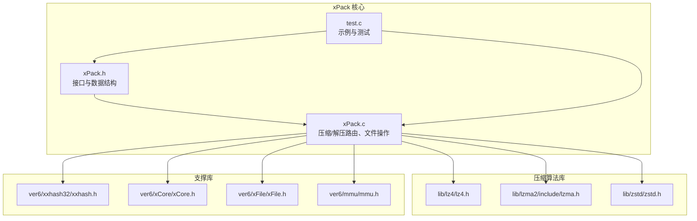
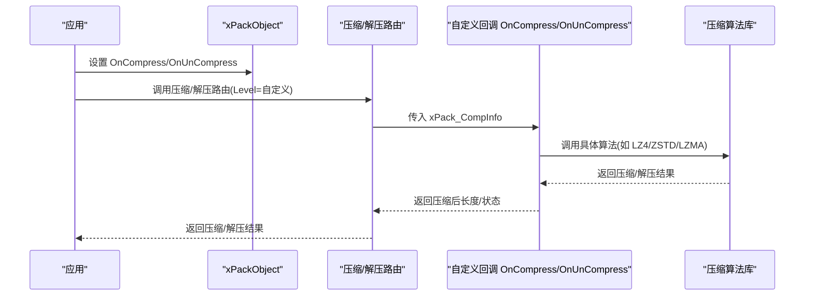
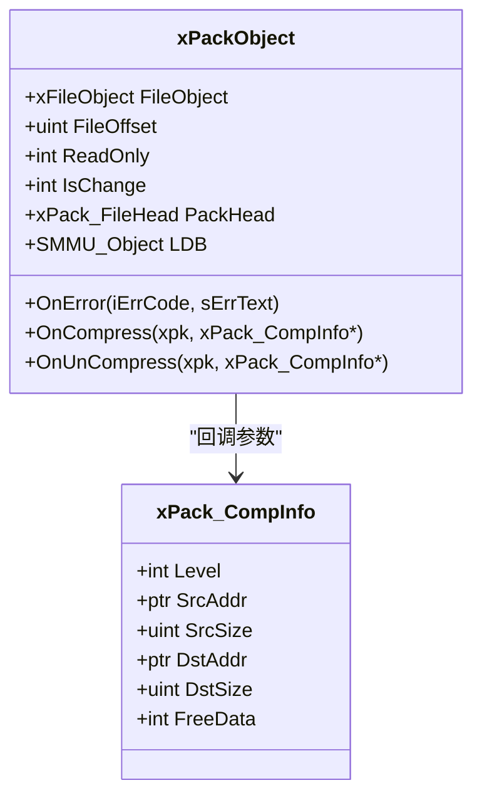
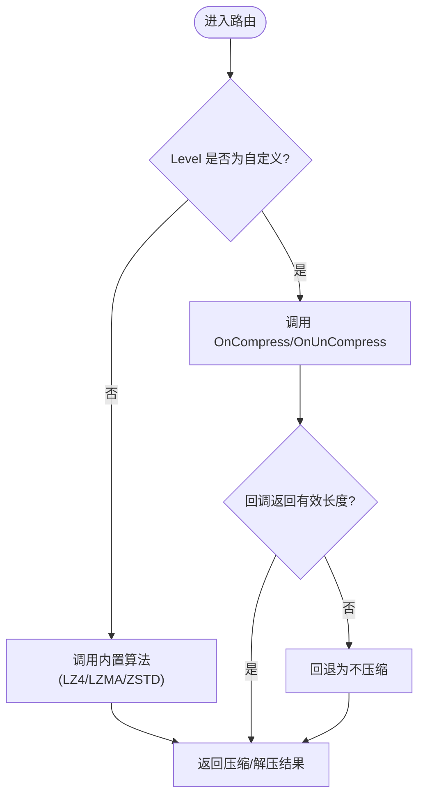
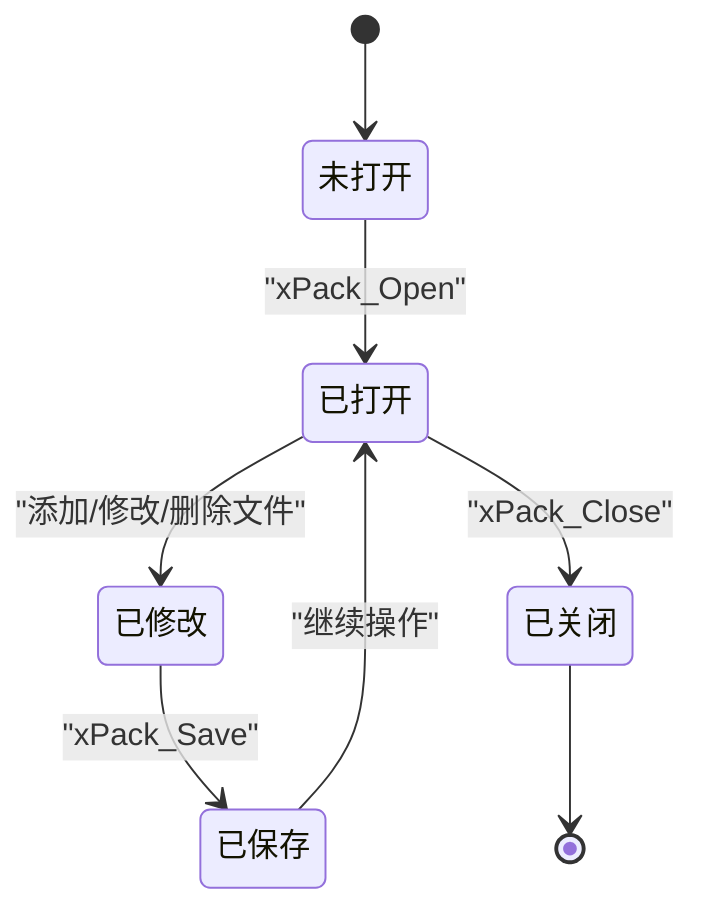
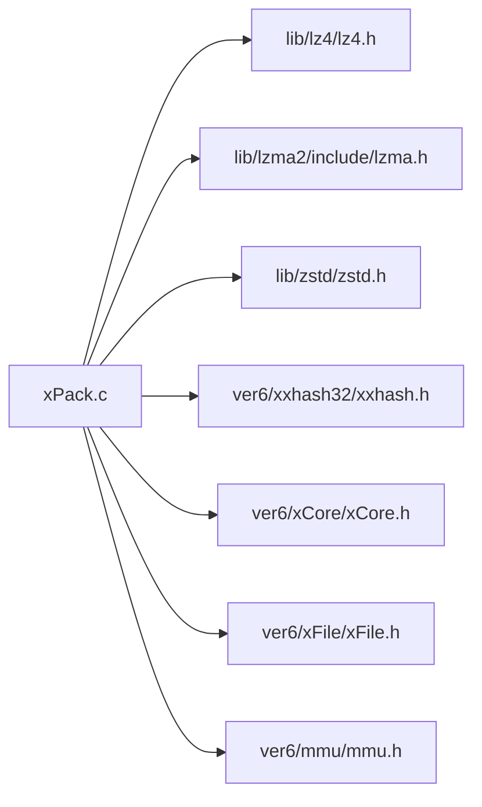

# 插件开发

<cite>
**本文引用的文件**
- [xPack.h](file://ver6/xpack/xPack.h)
- [xPack.c](file://ver6/xpack/xPack.c)
- [test.c](file://ver6/xpack/test.c)
- [压缩级别参数.txt](file://压缩级别参数.txt)
- [lz4.h](file://lib/lz4/lz4.h)
- [lzma.h](file://lib/lzma2/include/lzma.h)
- [zstd.h](file://lib/zstd/zstd.h)
- [xxhash.h](file://ver6/xxhash32/xxhash.h)
- [xCore.h](file://ver6/xCore/xCore.h)
- [xFile.h](file://ver6/xFile/xFile.h)
- [mmu.h](file://ver6/mmu/mmu.h)
</cite>

## 目录
1. [简介](#简介)
2. [项目结构](#项目结构)
3. [核心组件](#核心组件)
4. [架构总览](#架构总览)
5. [详细组件分析](#详细组件分析)
6. [依赖关系分析](#依赖关系分析)
7. [性能考量](#性能考量)
8. [故障排查指南](#故障排查指南)
9. [结论](#结论)
10. [附录](#附录)

## 简介
本文件面向希望基于 xPack 开发“自定义压缩算法插件”的开发者，系统阐述插件接口设计、回调函数实现、注册与生命周期、数据结构约束、完整开发示例、测试与调试方法，以及与主程序的交互协议与错误处理机制。文档同时给出最佳实践与常见陷阱，帮助你高效、稳定地实现自定义压缩方案。

## 项目结构
- 核心模块位于 ver6/xpack，包含 xPack.h/xPack.c，负责包的打开、保存、文件增删改查、压缩/解压路由等。
- 压缩算法库集成于 lib/ 下的 lz4、lzma2、zstd；哈希与内存管理由 ver6/xxhash32、ver6/mmu、ver6/xCore、ver6/xFile 提供。
- 示例与测试位于 ver6/xpack/test.c，演示不同包类型与压缩级别的使用。

图表来源
- [xPack.h](file://ver6/xpack/xPack.h#L1-L252)
- [xPack.c](file://ver6/xpack/xPack.c#L1-L970)
- [test.c](file://ver6/xpack/test.c#L1-L278)

章节来源
- [xPack.h](file://ver6/xpack/xPack.h#L1-L252)
- [xPack.c](file://ver6/xpack/xPack.c#L1-L970)
- [test.c](file://ver6/xpack/test.c#L1-L278)

## 核心组件
- xPackObject：封装文件句柄、包头、列表段、错误回调与自定义压缩/解压回调。
- xPack_CompInfo：压缩/解压的输入输出数据结构，包含 Level、SrcAddr/SrcSize、DstAddr/DstSize、FreeData。
- 压缩/解压路由：根据 Level 选择内置 LZ4/LZMA/ZSTD 或自定义回调 OnCompress/OnUnCompress。
- 文件操作族：Core/Index/Linux/Win32 模式下的增删改查与打包/解包。

章节来源
- [xPack.h](file://ver6/xpack/xPack.h#L86-L119)
- [xPack.c](file://ver6/xpack/xPack.c#L54-L159)

## 架构总览
xPack 的插件化压缩通过回调函数实现：当 Level 标记为自定义压缩时，xPack 将调用 xPackObject 中的 OnCompress/OnUnCompress 回调，由插件自行决定压缩算法与参数，并返回压缩/解压结果。主程序负责文件列表管理、包头维护、错误回调与内存释放策略。

图表来源
- [xPack.c](file://ver6/xpack/xPack.c#L54-L159)
- [xPack.h](file://ver6/xpack/xPack.h#L86-L119)

## 详细组件分析

### 组件一：插件接口与数据结构
- xPackObject：包含 OnError、OnCompress、OnUnCompress 三个关键字段，分别用于错误通知与自定义压缩/解压回调。
- xPack_CompInfo：统一的输入输出数据结构，约定如下语义：
  - Level：输入时为压缩级别；输出时携带实际使用的压缩级别（用于记录到文件信息）。
  - SrcAddr/SrcSize：输入数据地址与长度。
  - DstAddr/DstSize：输出数据地址与长度（输入时可提供预分配缓冲，输出时可由插件分配）。
  - FreeData：指示返回数据是否应由主程序释放，避免重复释放或泄漏。

图表来源
- [xPack.h](file://ver6/xpack/xPack.h#L86-L119)

章节来源
- [xPack.h](file://ver6/xpack/xPack.h#L86-L119)

### 组件二：压缩/解压路由与自定义回调
- 路由逻辑：
  - 若 Level 属于内置压缩（FAST/HIGH），则调用对应算法库进行压缩/解压。
  - 若 Level 属于自定义压缩（CUSTOM），则优先调用 OnCompress/OnUnCompress。
  - 若自定义压缩失败（返回长度非正或大于源长度），路由回退为“不压缩”（返回原数据）。
- 返回约定：
  - 成功：返回值为真，且 DstAddr/DstSize/FreeData 合法。
  - 失败：返回值为假，若为自定义压缩则回退为不压缩。

图表来源
- [xPack.c](file://ver6/xpack/xPack.c#L54-L159)

章节来源
- [xPack.c](file://ver6/xpack/xPack.c#L54-L159)

### 组件三：文件操作与压缩级别映射
- 文件操作族（Core/Index/Linux/Win32）在写入数据前会调用压缩路由，记录文件信息中的压缩级别与哈希。
- 压缩级别参数与算法映射参考压缩级别参数文档，支持 0-15 的细粒度级别，涵盖无压缩、LZ4、LZ4-HC、ZSTD 等。

章节来源
- [xPack.c](file://ver6/xpack/xPack.c#L451-L627)
- [压缩级别参数.txt](file://压缩级别参数.txt#L1-L71)

### 组件四：错误处理与生命周期
- 错误处理：
  - 主程序通过 xPack_OnError_Router 触发 xPackObject.OnError 回调，同时设置 xCore.LastErrorID/LastError。
  - 路由在内存申请失败、压缩/解压失败、文件读写失败等场景触发错误。
- 生命周期：
  - 打开：xPack_Open 创建对象、读取包头、初始化 LDB、必要时解压文件列表。
  - 修改：添加/修改/删除文件会更新 LDB 并标记 IsChange。
  - 保存：xPack_Save 写入包头、压缩并写入 LDB、更新哈希。
  - 关闭：xPack_Close 在读写模式下自动保存，清理文件句柄与内存。

图表来源
- [xPack.c](file://ver6/xpack/xPack.c#L218-L302)
- [xPack.c](file://ver6/xpack/xPack.c#L163-L203)
- [xPack.c](file://ver6/xpack/xPack.c#L205-L216)

章节来源
- [xPack.c](file://ver6/xpack/xPack.c#L218-L302)
- [xPack.c](file://ver6/xpack/xPack.c#L163-L203)
- [xPack.c](file://ver6/xpack/xPack.c#L205-L216)

### 组件五：完整插件开发示例（步骤级）
以下为“从接口定义到实现”的全流程步骤，便于你快速上手：

- 步骤1：确定压缩级别与算法
  - 参考压缩级别参数文档，选择合适的级别（0-15），并明确算法类型（LZ4/LZ4-HC/ZSTD）。
  - 章节来源：[压缩级别参数.txt](file://压缩级别参数.txt#L1-L71)

- 步骤2：准备回调函数原型
  - 定义 OnCompress(xPackObject xpk, xPack_CompInfo* info) -> uint：返回压缩后长度，或 0 表示失败。
  - 定义 OnUnCompress(xPackObject xpk, xPack_CompInfo* info) -> uint：返回解压后长度，或 0 表示失败。
  - 章节来源：[xPack.h](file://ver6/xpack/xPack.h#L86-L119)

- 步骤3：实现压缩回调
  - 输入：info->Level、info->SrcAddr、info->SrcSize。
  - 输出：info->DstAddr、info->DstSize、info->FreeData。
  - 约束：若插件分配内存，需设置 info->FreeData=TRUE；若复用输入缓冲，需确保安全。
  - 章节来源：[xPack.c](file://ver6/xpack/xPack.c#L54-L101)

- 步骤4：实现解压回调
  - 输入：info->Level、info->SrcAddr、info->SrcSize、info->DstSize（期望输出长度）。
  - 输出：info->DstAddr、info->DstSize、info->FreeData。
  - 章节来源：[xPack.c](file://ver6/xpack/xPack.c#L103-L159)

- 步骤5：在主程序中注册回调
  - 打开包后，将 OnCompress/OnUnCompress 赋值给 xPackObject 对应字段。
  - 章节来源：[xPack.c](file://ver6/xpack/xPack.c#L54-L159)

- 步骤6：调用文件操作族
  - 使用 Core/Index/Linux/Win32 模式下的添加/修改/解包接口，Level 传入自定义级别。
  - 章节来源：[xPack.c](file://ver6/xpack/xPack.c#L451-L627)

- 步骤7：验证与回退
  - 若自定义压缩失败，路由会回退为不压缩；请确保回退路径可用。
  - 章节来源：[xPack.c](file://ver6/xpack/xPack.c#L93-L101)

- 步骤8：测试与调试
  - 使用 test.c 中的模式（Core/Index/Win32）作为参考，构造多文件场景，观察压缩比与性能。
  - 章节来源：[test.c](file://ver6/xpack/test.c#L1-L278)

### 组件六：插件注册机制与生命周期管理
- 注册：在打开包后，将自定义回调赋值到 xPackObject 即完成注册。
- 生命周期：随包对象生存期而存在；保存/关闭时由主程序负责资源清理。
- 注意：不要在回调中持有外部生命周期不可控的对象，避免悬挂引用。

章节来源
- [xPack.c](file://ver6/xpack/xPack.c#L54-L159)
- [xPack.c](file://ver6/xpack/xPack.c#L205-L216)

### 组件七：与主程序的交互协议
- 调用链：应用 -> 路由 -> 回调 -> 算法库 -> 回调 -> 路由 -> 应用。
- 数据交换：通过 xPack_CompInfo 完成，主程序负责内存管理与错误传播。
- 章节来源：[xPack.c](file://ver6/xpack/xPack.c#L54-L159)

## 依赖关系分析
- 算法库依赖：LZ4/LZMA/ZSTD 头文件与符号在编译期引入，用于内置压缩路径。
- 支撑库依赖：xxhash 用于 LDB 与文件哈希；xCore/xFile/mmu 提供内存、文件与容器管理。
- 版本控制：xPack.h 中定义包版本与标志位，确保兼容性。

图表来源
- [xPack.c](file://ver6/xpack/xPack.c#L8-L27)
- [xPack.h](file://ver6/xpack/xPack.h#L1-L252)

章节来源
- [xPack.c](file://ver6/xpack/xPack.c#L8-L27)
- [xPack.h](file://ver6/xpack/xPack.h#L1-L252)

## 性能考量
- 压缩级别选择：参考压缩级别参数文档，平衡压缩比与速度，避免对已压缩数据重复压缩。
- 缓冲策略：插件尽量复用输入缓冲或提供合适容量，减少内存拷贝与分配。
- 路由回退：自定义压缩失败会回退为不压缩，确保稳定性优先。
- 章节来源：[压缩级别参数.txt](file://压缩级别参数.txt#L1-L71)
- 章节来源：[xPack.c](file://ver6/xpack/xPack.c#L93-L101)

## 故障排查指南
- 常见错误码与含义：
  - 文件无法访问、格式不正确、内存申请失败、文件列表读取/写入失败、文件哈希校验失败、包类型不匹配、找不到文件、文件名超长等。
- 排查步骤：
  - 检查 OnError 回调是否被触发，定位具体错误码。
  - 确认 Level 与算法映射是否一致。
  - 检查 DstAddr/DstSize/FreeData 是否符合约定。
  - 使用 test.c 的多模式示例进行对比测试。
- 章节来源：[xPack.c](file://ver6/xpack/xPack.c#L36-L51)
- 章节来源：[test.c](file://ver6/xpack/test.c#L1-L278)

## 结论
xPack 的插件化压缩通过清晰的回调接口与严格的路由协议，实现了灵活的自定义压缩能力。遵循本文的数据结构约定、实现要点与最佳实践，即可在保证稳定性的同时获得更高的压缩比或更快的解压速度。建议在开发过程中充分利用内置压缩路径作为对照，结合压缩级别参数文档进行参数调优，并通过 test.c 的多模式示例进行端到端验证。

## 附录
- 快速参考
  - 回调函数签名：OnCompress(xPackObject, xPack_CompInfo*) -> uint；OnUnCompress(xPackObject, xPack_CompInfo*) -> uint
  - 数据结构：xPack_CompInfo.Level/SrcAddr/SrcSize/DstAddr/DstSize/FreeData
  - 路由行为：自定义失败回退为不压缩
  - 测试样例：参考 test.c 的 Core/Index/Win32 模式用法