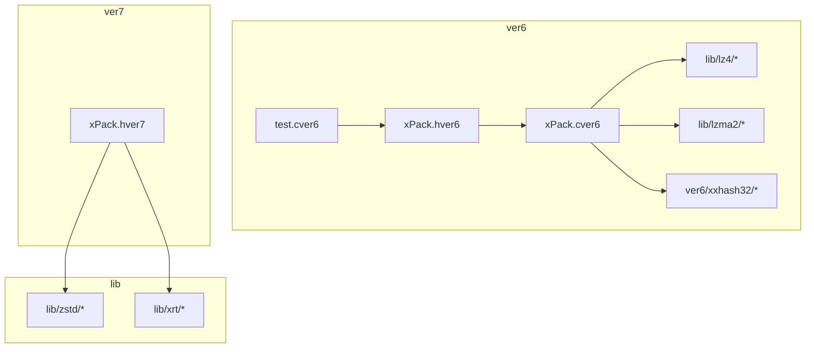
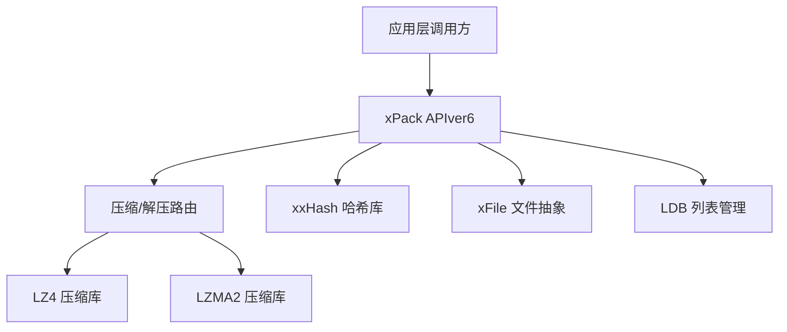
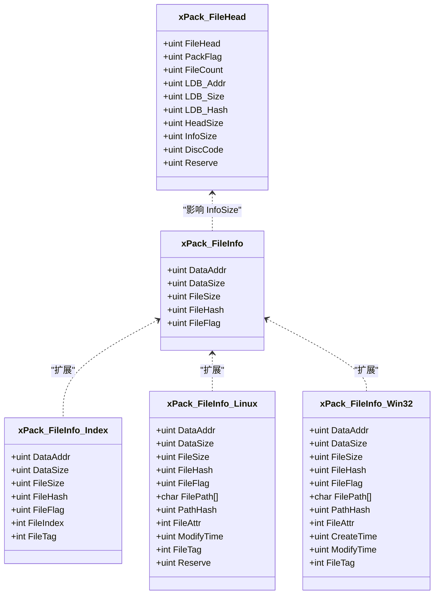
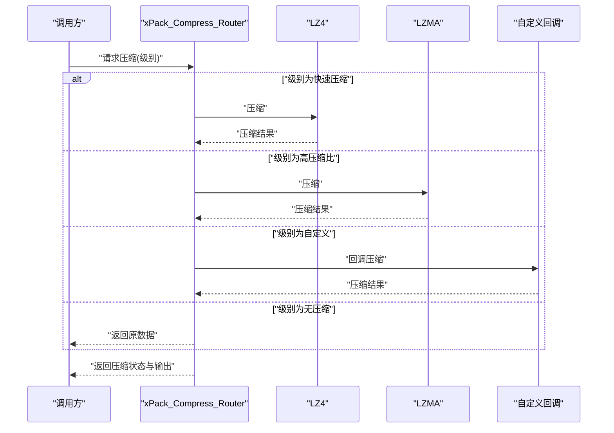
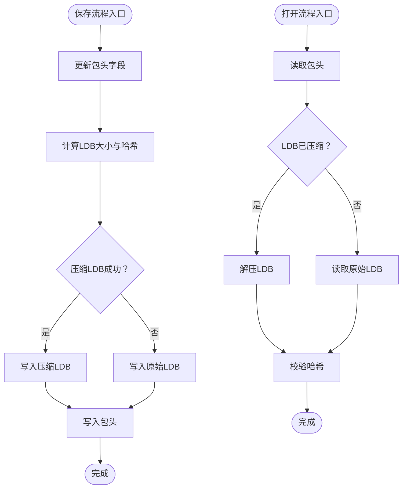
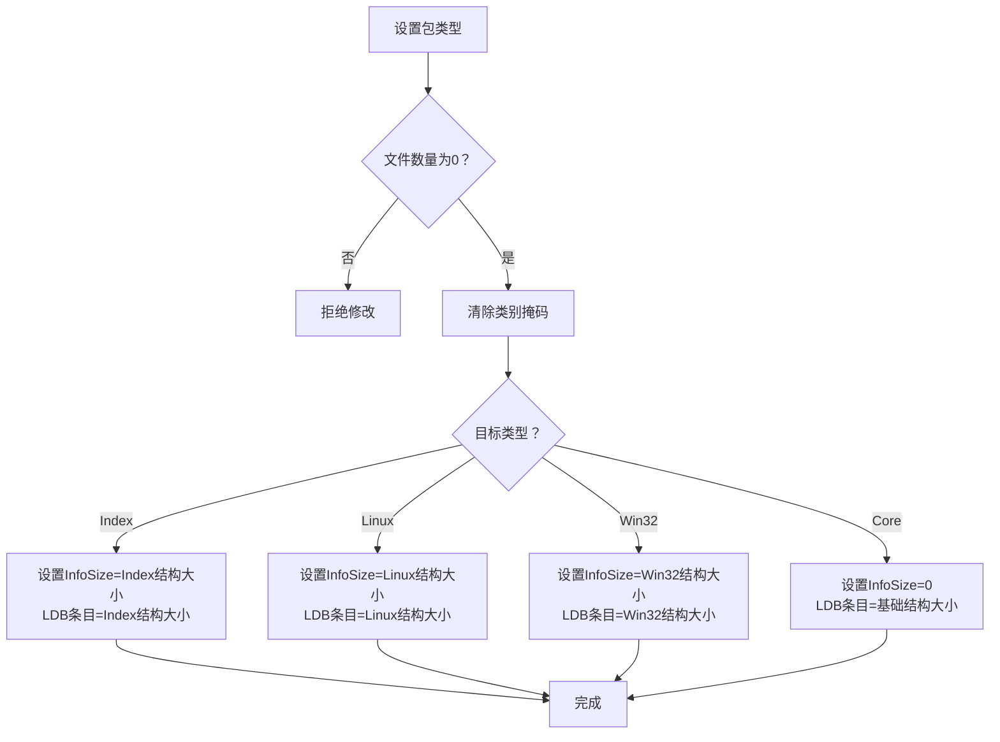
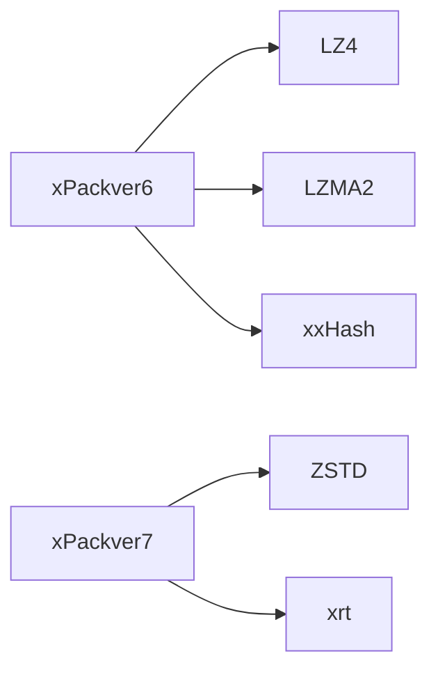

# 格式扩展

<cite>
**本文引用的文件**
- [xPack.h（ver6）](file://ver6/xpack/xPack.h)
- [xPack.c（ver6）](file://ver6/xpack/xPack.c)
- [test.c（ver6）](file://ver6/xpack/test.c)
- [xPack.h（ver7）](file://ver7/xpack/xpack.h)
- [压缩级别参数.txt](file://压缩级别参数.txt)
- [lz4frame.c](file://lib/lz4/lz4frame.c)
- [zstd_compress.c](file://lib/zstd/compress/zstd_compress.c)
- [xxhash.c](file://ver6/xxhash32/xxhash.c)
- [xxhash.h](file://ver6/xxhash32/xxhash.h)
</cite>

## 目录
1. [简介](#简介)
2. [项目结构](#项目结构)
3. [核心组件](#核心组件)
4. [架构总览](#架构总览)
5. [详细组件分析](#详细组件分析)
6. [依赖关系分析](#依赖关系分析)
7. [性能考量](#性能考量)
8. [故障排查指南](#故障排查指南)
9. [结论](#结论)
10. [附录](#附录)

## 简介
本文件围绕 xPack 文件格式的扩展机制与实现方法进行系统化阐述，重点覆盖以下主题：
- 如何设计与实现新的文件包格式变体（包类型、文件信息结构、压缩级别映射）
- 数据结构扩展与协议升级的策略与兼容性保障
- 向后兼容与版本演进的实践路径
- 从需求分析到实现部署的完整示例流程
- 对现有功能的影响与迁移方案
- 测试验证与性能评估方法
- 安全考虑与风险控制
- 文档编写与发布指南

## 项目结构
仓库包含多版本的 xPack 实现与第三方压缩库集成：
- ver6：当前稳定实现，包含 xPack 核心、压缩库（LZ4、LZMA）、哈希库（xxHash）与测试样例
- ver7：下一代设计，统一了包头结构、压缩级别映射与接口风格
- lib：第三方压缩库源码（LZ4、ZSTD、LZMA2）与工具库（xrt）

图表来源
- [xPack.h（ver6）](file://ver6/xpack/xPack.h#L1-L252)
- [xPack.c（ver6）](file://ver6/xpack/xPack.c#L1-L970)
- [xPack.h（ver7）](file://ver7/xpack/xpack.h#L1-L372)

章节来源
- [xPack.h（ver6）](file://ver6/xpack/xPack.h#L1-L252)
- [xPack.c（ver6）](file://ver6/xpack/xPack.c#L1-L970)
- [xPack.h（ver7）](file://ver7/xpack/xpack.h#L1-L372)

## 核心组件
- 包头与文件信息结构：定义包头、文件信息与扩展字段布局，决定格式兼容性与扩展点
- 压缩路由与解压路由：根据压缩级别选择具体算法，支持快速压缩、高压缩比与自定义压缩
- 文件列表（LDB）管理：维护文件元数据列表，支持压缩存储与哈希校验
- 包类型与模式：Core/Index/Linux/Win32 四种模式，分别对应不同的访问与存储策略
- 错误处理与回调：统一的错误码与回调机制，便于扩展与调试

章节来源
- [xPack.h（ver6）](file://ver6/xpack/xPack.h#L22-L109)
- [xPack.c（ver6）](file://ver6/xpack/xPack.c#L54-L159)
- [xPack.c（ver6）](file://ver6/xpack/xPack.c#L163-L302)

## 架构总览
下图展示了 ver6 的核心模块交互：上层通过 API 调用，底层由压缩库与哈希库提供能力，文件系统通过 xFile 抽象访问。

图表来源
- [xPack.c（ver6）](file://ver6/xpack/xPack.c#L54-L159)
- [xxhash.c](file://ver6/xxhash32/xxhash.c#L1-L44)

章节来源
- [xPack.c（ver6）](file://ver6/xpack/xPack.c#L54-L159)
- [xxhash.c](file://ver6/xxhash32/xxhash.c#L1-L44)

## 详细组件分析

### 组件A：包头与文件信息结构（ver6）
- 包头字段：文件标识、包标志、文件数量、LDB 偏移/大小/哈希、扩展长度、识别代码等
- 文件信息：数据偏移、压缩后大小、原始大小、哈希、文件标志（压缩级别、类型等）
- 模式扩展：通过包标志中的类别掩码区分 Core/Index/Linux/Win32 模式；不同模式下文件信息结构体长度不同

图表来源
- [xPack.h（ver6）](file://ver6/xpack/xPack.h#L22-L84)

章节来源
- [xPack.h（ver6）](file://ver6/xpack/xPack.h#L22-L84)

### 组件B：压缩/解压路由（ver6）
- 路由逻辑：根据压缩级别选择 LZ4、LZMA 或自定义压缩；失败时回退为无压缩
- 输出策略：成功压缩返回压缩数据与新大小，失败保持原数据不变
- 解压流程：根据标志位选择对应算法，必要时进行字符串截断以适配文本读取

图表来源
- [xPack.c（ver6）](file://ver6/xpack/xPack.c#L54-L101)

章节来源
- [xPack.c（ver6）](file://ver6/xpack/xPack.c#L54-L101)

### 组件C：文件列表（LDB）与保存流程（ver6）
- LDB 压缩：默认使用 LZMA 压缩文件列表，失败则回退为未压缩
- 校验与写入：计算哈希，写入 LDB 数据与包头，更新文件计数与哈希
- 打开流程：读取包头，按标志位判断是否压缩 LDB，解压后校验哈希

图表来源
- [xPack.c（ver6）](file://ver6/xpack/xPack.c#L163-L203)
- [xPack.c（ver6）](file://ver6/xpack/xPack.c#L218-L302)

章节来源
- [xPack.c（ver6）](file://ver6/xpack/xPack.c#L163-L203)
- [xPack.c（ver6）](file://ver6/xpack/xPack.c#L218-L302)

### 组件D：包类型与模式切换（ver6）
- 类型切换：仅在未添加文件前可修改包类型，同时调整文件信息扩展长度与 LDB 条目长度
- 模式差异：Index 模式增加索引号与用户数据；Linux/Win32 模式增加路径与属性字段

图表来源
- [xPack.c（ver6）](file://ver6/xpack/xPack.c#L313-L336)

章节来源
- [xPack.c（ver6）](file://ver6/xpack/xPack.c#L313-L336)

### 组件E：测试与验证（ver6）
- Core/Index/Linux/Win32 三种模式的添加与解包测试
- 错误回调与状态输出，便于定位问题

章节来源
- [test.c（ver6）](file://ver6/xpack/test.c#L24-L278)

### 组件F：ver7 设计与扩展点（ver7）
- 统一包头结构：固定签名、版本号、扩展字段与时间戳
- 压缩级别映射：16 级别映射到 LZ4/LZ4-HC/ZSTD，支持默认级别与 LDB 默认级别
- 文件类型标识：预留文件类型枚举，便于上层语义识别
- 接口风格统一：API 名称与参数风格一致，便于跨语言绑定

章节来源
- [xPack.h（ver7）](file://ver7/xpack/xpack.h#L22-L124)
- [xPack.h（ver7）](file://ver7/xpack/xpack.h#L226-L243)
- [压缩级别参数.txt](file://压缩级别参数.txt#L1-L20)

## 依赖关系分析
- ver6 依赖 LZ4、LZMA 与 xxHash；压缩算法通过路由选择
- ver7 依赖 ZSTD 与 xrt 工具库；压缩级别映射集中于表驱动
- 第三方库提供格式规范与实现细节（如 LZ4 帧格式、ZSTD 序列编码）

图表来源
- [xPack.c（ver6）](file://ver6/xpack/xPack.c#L16-L27)
- [xPack.h（ver7）](file://ver7/xpack/xpack.h#L1-L20)

章节来源
- [xPack.c（ver6）](file://ver6/xpack/xPack.c#L16-L27)
- [xPack.h（ver7）](file://ver7/xpack/xpack.h#L1-L20)

## 性能考量
- 压缩级别与算法选择：ver7 提供 16 级别映射，建议结合数据特征与场景选择默认级别
- LDB 压缩：ver6 默认使用 LZMA 压缩 LDB，ver7 可配置 LDB 压缩级别
- 哈希与校验：文件与 LDB 均采用哈希校验，确保完整性但带来额外 CPU 开销
- I/O 顺序：文件数据按追加顺序写入，有利于顺序读取场景

章节来源
- [xPack.c（ver6）](file://ver6/xpack/xPack.c#L163-L203)
- [xPack.h（ver7）](file://ver7/xpack/xpack.h#L226-L243)

## 故障排查指南
- 常见错误码：文件访问失败、格式不正确、内存申请失败、列表读取/写入失败、哈希校验失败、包类型不匹配、文件名超长等
- 排查步骤：启用错误回调，核对包头版本与标志位，确认 LDB 压缩状态与哈希一致性，检查路径与文件名长度限制
- 日志与诊断：测试样例中提供错误码与描述输出，便于快速定位问题

章节来源
- [xPack.c（ver6）](file://ver6/xpack/xPack.c#L36-L51)
- [test.c（ver6）](file://ver6/xpack/test.c#L19-L22)

## 结论
xPack 在 ver6 中提供了成熟的包结构与扩展点，在 ver7 中进一步统一了接口与压缩级别映射。通过严格的包头版本控制、LDB 哈希校验与多模式支持，系统具备良好的兼容性与可扩展性。建议在新增格式变体时遵循“向后兼容优先、最小改动范围、明确升级路径”的原则，并配套完善的测试与性能评估。

## 附录

### 附录A：格式扩展设计与实现步骤
- 需求分析：确定扩展目标（新包类型/字段/压缩算法），评估对现有功能的影响
- 数据结构扩展：在包头/文件信息结构中新增字段，定义默认值与对齐规则
- 协议升级：通过版本号与标志位区分新旧格式，确保解析兼容
- 压缩与校验：更新压缩路由与哈希策略，保证 LDB 与文件数据一致性
- 接口适配：扩展 API 以支持新功能，保持向后兼容
- 测试与验证：编写单元测试与集成测试，覆盖边界条件与性能指标
- 发布与文档：更新版本号、发布说明与用户文档，提供迁移指南

### 附录B：兼容性与迁移策略
- 版本演进：ver6 → ver7 的主要变化包括包头结构、压缩级别映射与接口风格统一
- 迁移路径：提供转换工具或双栈支持，逐步替换旧格式；保留读取旧格式的能力
- 向后兼容：新版本应能读取旧版本包，但写入时采用新格式

### 附录C：测试验证与性能评估方法
- 功能测试：覆盖 Core/Index/Linux/Win32 模式，验证增删改查与解包流程
- 兼容性测试：跨版本读写、错误场景与边界条件
- 性能测试：不同压缩级别下的压缩比、压缩/解压速度与内存占用
- 压力测试：大批量文件与超大文件场景下的稳定性

### 附录D：安全考虑与风险控制
- 输入校验：严格校验路径长度、文件名合法性与哈希一致性
- 权限控制：Linux/Win32 模式下注意文件属性与权限的处理
- 安全更新：提供补丁与回滚机制，避免升级过程中的数据损坏

### 附录E：文档编写与发布指南
- 文档结构：包含概述、架构、API 参考、扩展指南、测试与性能报告
- 示例代码：提供从创建包到读取文件的完整示例
- 发布流程：版本标签、变更日志、下载链接与安装说明