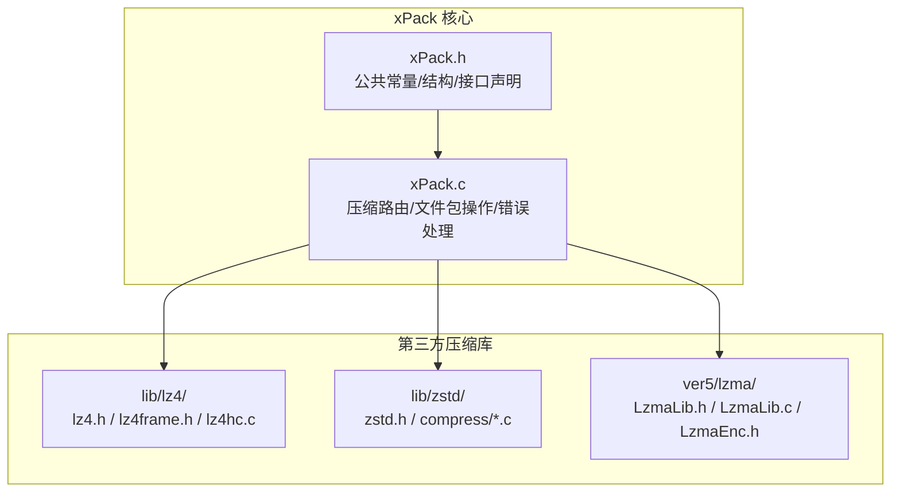
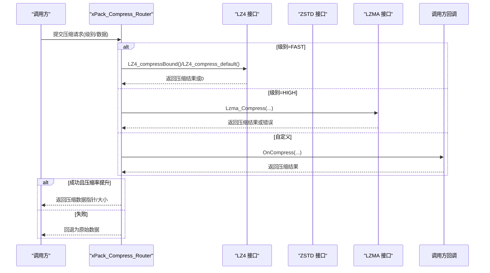
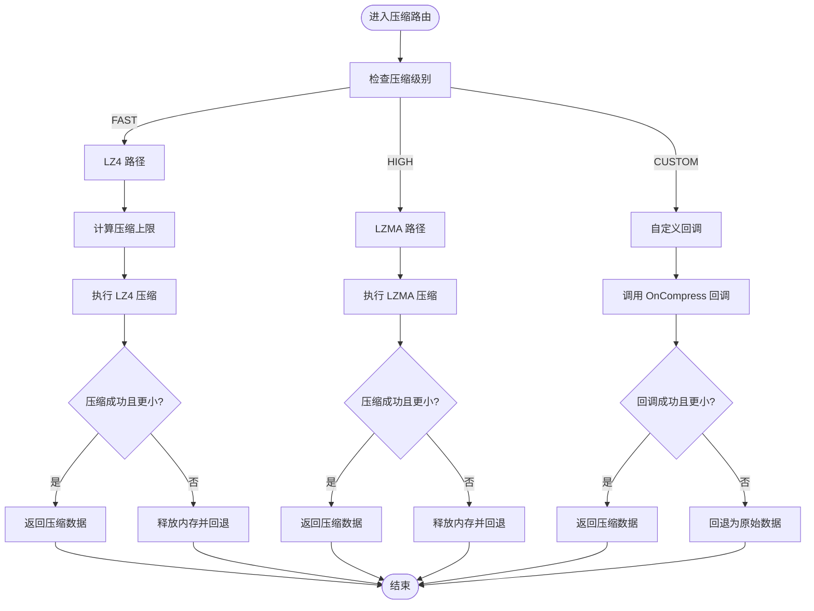
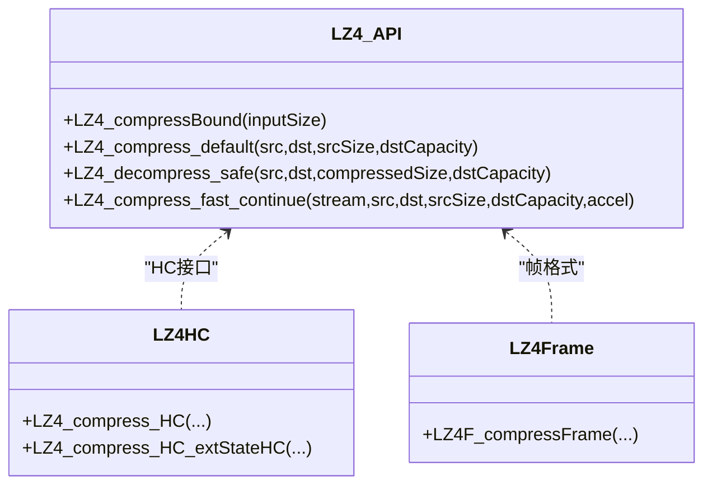
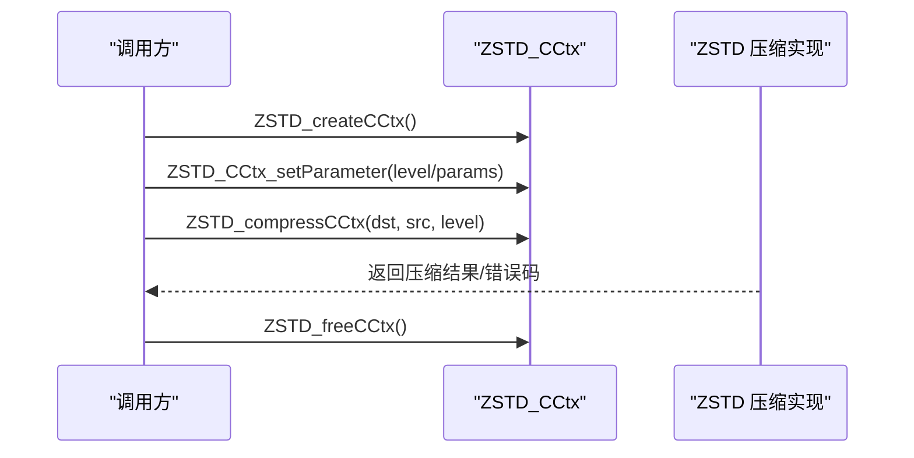
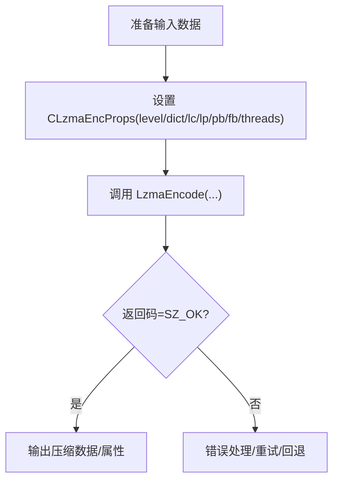
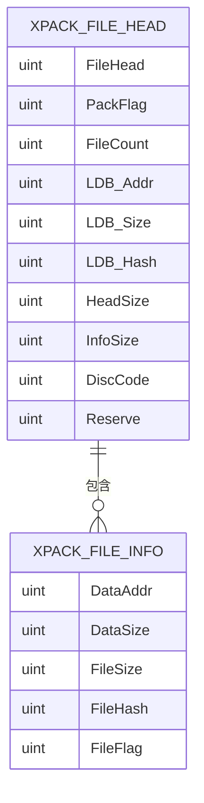
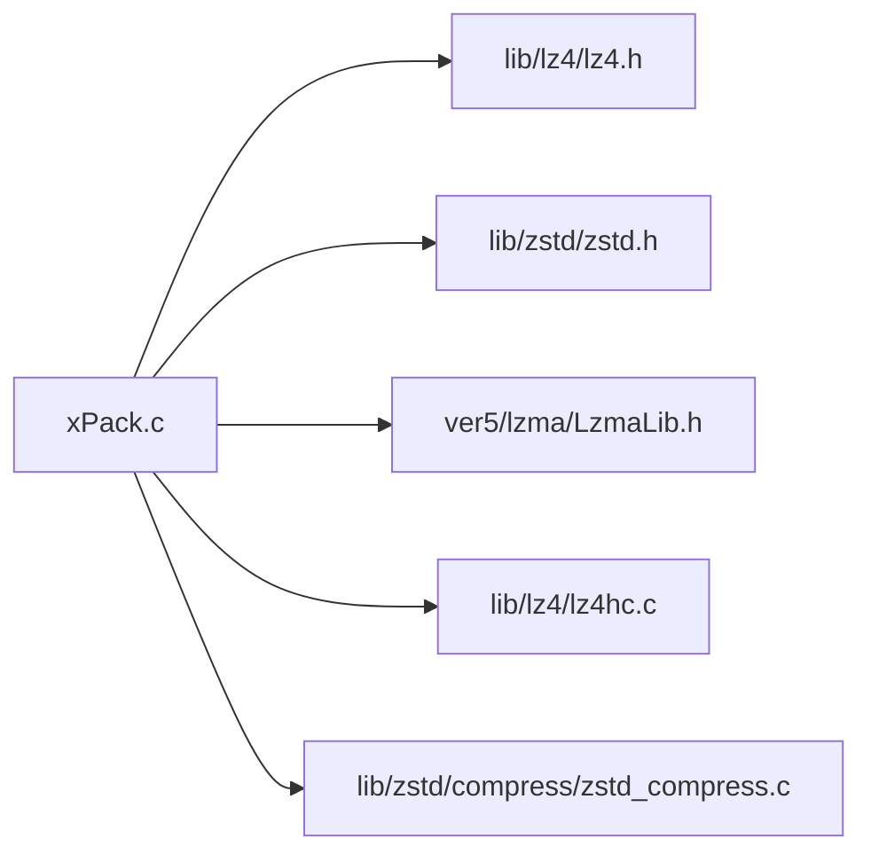

# 第三方库集成

<cite>
**本文引用的文件**
- [xPack.h](file://ver6/xpack/xPack.h)
- [xPack.c](file://ver6/xpack/xPack.c)
- [lz4.h](file://lib/lz4/lz4.h)
- [lz4frame.h](file://lib/lz4/lz4frame.h)
- [lz4hc.c](file://lib/lz4/lz4hc.c)
- [zstd.h](file://lib/zstd/zstd.h)
- [zstd_compress.c](file://lib/zstd/compress/zstd_compress.c)
- [README.md（Zstd）](file://lib/zstd/README.md)
- [LzmaLib.h](file://ver5/lzma/LzmaLib.h)
- [LzmaLib.c](file://ver5/lzma/LzmaLib.c)
- [LzmaEnc.h](file://ver5/lzma/LzmaEnc.h)
- [压缩级别参数.txt](file://压缩级别参数.txt)
</cite>

## 目录
1. [简介](#简介)
2. [项目结构](#项目结构)
3. [核心组件](#核心组件)
4. [架构总览](#架构总览)
5. [详细组件分析](#详细组件分析)
6. [依赖关系分析](#依赖关系分析)
7. [性能考虑](#性能考虑)
8. [故障排查指南](#故障排查指南)
9. [结论](#结论)
10. [附录](#附录)

## 简介
本文件系统性阐述 xPack 对第三方压缩库的集成方案与最佳实践，覆盖 LZ4、LZMA、ZSTD 的接口适配与封装流程，给出从源码编译到接口调用的完整步骤、版本兼容与依赖管理策略、性能对比与选型建议、常见问题与解决方案，以及集成测试与验证方法。目标是帮助开发者在保持 xPack 核心架构稳定的同时，安全、可维护地引入新的压缩算法库。

## 项目结构
- ver6/xpack：xPack 主体实现，包含压缩路由、文件包读写、错误处理与对外 API。
- lib/lz4：LZ4 压缩库头文件与相关实现，提供块压缩与流式压缩能力。
- lib/zstd：Zstandard 压缩库头文件与压缩实现，提供单次与流式压缩、上下文管理等高级功能。
- ver5/lzma：LZMA 库包装层，提供单次压缩/解压接口及编码器参数配置。
- 压缩级别参数.txt：压缩等级与策略参考，便于在不同场景下进行权衡。

**图表来源**
- [xPack.h](file://ver6/xpack/xPack.h#L1-L252)
- [xPack.c](file://ver6/xpack/xPack.c#L1-L160)
- [lz4.h](file://lib/lz4/lz4.h#L1-L120)
- [zstd.h](file://lib/zstd/zstd.h#L1-L120)
- [LzmaLib.h](file://ver5/lzma/LzmaLib.h#L1-L60)

**章节来源**
- [xPack.h](file://ver6/xpack/xPack.h#L1-L252)
- [xPack.c](file://ver6/xpack/xPack.c#L1-L160)

## 核心组件
- 压缩路由与接口封装：xPack 将压缩算法抽象为统一的压缩/解压入口，根据压缩级别选择 LZ4、LZMA 或自定义回调。
- 文件包结构与元数据：通过文件头、文件信息段（含压缩标志、数据地址、大小、哈希等）组织压缩包。
- 错误处理与内存管理：集中错误码映射与内存分配/释放，确保异常路径可控。
- 平台与构建差异：通过条件编译区分只读/读写版本，按需包含第三方库头文件。

**章节来源**
- [xPack.c](file://ver6/xpack/xPack.c#L54-L159)
- [xPack.h](file://ver6/xpack/xPack.h#L15-L120)

## 架构总览
xPack 在运行时根据压缩级别选择具体压缩算法，调用第三方库提供的 API 完成压缩/解压，并将结果写入/读取到文件包中。压缩路由负责：
- 计算输出缓冲区大小（如 LZ4_compressBound、ZSTD_compressBound）。
- 分配/释放内存，处理压缩失败回退为未压缩。
- 维护文件列表（LDB）的压缩状态与哈希校验。

**图表来源**
- [xPack.c](file://ver6/xpack/xPack.c#L54-L101)
- [lz4.h](file://lib/lz4/lz4.h#L176-L226)
- [LzmaLib.h](file://ver5/lzma/LzmaLib.h#L96-L105)

## 详细组件分析

### 压缩路由与接口适配
- FAST（LZ4）：使用 LZ4_compressBound 计算上限，LZ4_compress_default 进行压缩；若压缩失败或未提升，回退为未压缩。
- HIGH（LZMA）：调用 Lzma_Compress(...) 进行压缩；失败则回退。
- 自定义：通过 xPackObject.OnCompress 回调注入任意压缩算法。
- 解压路由同理，分别调用 LZ4_decompress_safe、LZMA 解压接口或自定义回调。

**图表来源**
- [xPack.c](file://ver6/xpack/xPack.c#L54-L101)
- [lz4.h](file://lib/lz4/lz4.h#L176-L226)
- [LzmaLib.h](file://ver5/lzma/LzmaLib.h#L96-L105)

**章节来源**
- [xPack.c](file://ver6/xpack/xPack.c#L54-L159)

### LZ4 集成要点
- 头文件与导出宏：通过 lz4.h 暴露压缩/解压 API、版本号、可见性控制等。
- 压缩上限与内存使用：LZ4_compressBound 提供最坏情况下的输出上限；LZ4_MEMORY_USAGE 控制内部哈希表大小，影响压缩比与速度。
- 流式压缩：LZ4_stream_t 与 LZ4_compress_fast_continue 支持多块连续压缩，配合字典可提升小数据压缩比。
- 高级 HC 压缩：lz4hc.c 提供更高压缩比的接口，适合对压缩比敏感的场景。

**图表来源**
- [lz4.h](file://lib/lz4/lz4.h#L176-L226)
- [lz4frame.h](file://lib/lz4/lz4frame.h#L204-L227)
- [lz4hc.c](file://lib/lz4/lz4hc.c#L2195-L2203)

**章节来源**
- [lz4.h](file://lib/lz4/lz4.h#L130-L226)
- [lz4frame.h](file://lib/lz4/lz4frame.h#L204-L227)
- [lz4hc.c](file://lib/lz4/lz4hc.c#L2195-L2203)

### ZSTD 集成要点
- API 层级：提供简单 API（ZSTD_compress/ZSTD_decompress）、显式上下文（ZSTD_CCtx/ZSTD_DCtx）、流式 API（ZSTD_CStream/ZSTD_DStream）。
- 上下文与参数：通过 ZSTD_CCtx_setParameter/ZSTD_DCtx_setParameter 设置压缩等级、窗口大小、线程数等；ZSTD_compressBound 提供最坏情况上限。
- 多线程：README 指明启用多线程需定义 ZSTD_MULTITHREAD 并在 POSIX 下使用 -pthread；可通过目标 make lib-mt 生成多线程动态库。
- 字典：支持字典压缩以提升小数据压缩比，适用于频繁出现的重复模式。

**图表来源**
- [zstd.h](file://lib/zstd/zstd.h#L270-L315)
- [zstd.h](file://lib/zstd/zstd.h#L829-L850)
- [zstd_compress.c](file://lib/zstd/compress/zstd_compress.c#L5503-L5530)
- [README.md（Zstd）](file://lib/zstd/README.md#L35-L56)

**章节来源**
- [zstd.h](file://lib/zstd/zstd.h#L154-L250)
- [zstd.h](file://lib/zstd/zstd.h#L270-L315)
- [zstd_compress.c](file://lib/zstd/compress/zstd_compress.c#L5503-L5530)
- [README.md（Zstd）](file://lib/zstd/README.md#L35-L56)

### LZMA 集成要点
- 单次压缩接口：LzmaCompress/LzmaUncompress 提供一次性压缩/解压，适合小到中等数据。
- 参数与内存：LZMA 属性（LZMA_PROPS_SIZE=5）包含 lc/lp/pb/dictSize；内存需求约为 (dictSize * 11.5 + 6MB) + 状态空间。
- 编码器参数：LzmaEnc.h 提供 CLzmaEncProps 结构与设置接口，支持多线程（Mt）版本。

**图表来源**
- [LzmaLib.h](file://ver5/lzma/LzmaLib.h#L96-L105)
- [LzmaLib.c](file://ver5/lzma/LzmaLib.c#L9-L40)
- [LzmaEnc.h](file://ver5/lzma/LzmaEnc.h#L32-L76)

**章节来源**
- [LzmaLib.h](file://ver5/lzma/LzmaLib.h#L1-L132)
- [LzmaLib.c](file://ver5/lzma/LzmaLib.c#L1-L40)
- [LzmaEnc.h](file://ver5/lzma/LzmaEnc.h#L32-L76)

### 文件包结构与 LDB 管理
- 文件头：包含版本、标志位（压缩 LDB、压缩方式）、文件数量、LDB 地址/大小/哈希等。
- 文件信息：记录每个条目的数据地址、压缩后/原大小、哈希、压缩标志等。
- LDB 压缩：默认使用 LZMA 压缩 LDB 列表，保存时更新头部字段与哈希。

**图表来源**
- [xPack.h](file://ver6/xpack/xPack.h#L22-L84)

**章节来源**
- [xPack.h](file://ver6/xpack/xPack.h#L22-L84)
- [xPack.c](file://ver6/xpack/xPack.c#L163-L203)

## 依赖关系分析
- 头文件依赖：xPack.c 条件包含 LZ4/LZMA 头文件，依据只读/读写构建区分。
- 运行时依赖：LZ4 与 ZSTD 提供静态/动态库两种形态；LZMA 提供单次压缩接口。
- 版本与兼容：LZ4 与 Zstd 的 API 兼容性较好，但 Zstd 的实验性 API 仅允许静态链接；LZMA 属性与内存模型需严格遵循。

**图表来源**
- [xPack.c](file://ver6/xpack/xPack.c#L16-L27)
- [lz4.h](file://lib/lz4/lz4.h#L1-L120)
- [zstd.h](file://lib/zstd/zstd.h#L1-L120)
- [LzmaLib.h](file://ver5/lzma/LzmaLib.h#L1-L60)
- [lz4hc.c](file://lib/lz4/lz4hc.c#L2195-L2203)
- [zstd_compress.c](file://lib/zstd/compress/zstd_compress.c#L5503-L5530)

**章节来源**
- [xPack.c](file://ver6/xpack/xPack.c#L16-L27)

## 性能考虑
- 压缩比与速度权衡：LZ4 以极高速度见长，适合实时/低延迟场景；Zstd 在中高压缩等级下提供更好压缩比与较优速度；LZMA 在高压缩比场景表现突出，但速度较慢。
- 上下文与参数：Zstd 的压缩等级、窗口大小、线程数直接影响性能；LZ4 的 MEMORY_USAGE 与流式字典可提升小数据压缩比；LZMA 的 dictSize 与算法选择影响内存与速度。
- I/O 与内存：优先使用压缩上限 API（LZ4_compressBound、ZSTD_compressBound）预估输出缓冲区，减少二次分配；流式 API 可降低峰值内存占用。
- 多线程：Zstd 支持多线程压缩，需在构建时开启并链接 pthread；LZMA 的多线程版本需注意平台与编译选项。

[本节为通用指导，不直接分析具体文件]

## 故障排查指南
- 压缩失败回退：当第三方库返回失败或压缩未提升时，xPack 会回退为未压缩数据，确保文件包可用。
- 内存不足：检查输出缓冲区大小是否满足压缩上限；必要时释放中间缓存并重试。
- 文件列表校验失败：LDB 哈希不一致通常意味着压缩/解压过程中数据被篡改或损坏，需重新生成 LDB。
- LZMA 属性不匹配：确保压缩与解压使用相同的属性（lc/lp/pb/dictSize），否则解压会失败。
- Zstd 实验性 API：仅静态链接可用，动态库使用会触发符号不可用或行为异常。

**章节来源**
- [xPack.c](file://ver6/xpack/xPack.c#L69-L71)
- [xPack.c](file://ver6/xpack/xPack.c#L122-L124)
- [xPack.c](file://ver6/xpack/xPack.c#L295-L298)
- [LzmaLib.h](file://ver5/lzma/LzmaLib.h#L126-L127)
- [README.md（Zstd）](file://lib/zstd/README.md#L64-L78)

## 结论
xPack 通过统一的压缩路由与清晰的接口适配，实现了对 LZ4、LZMA、Zstd 的无缝集成。在实际工程中，应结合业务场景选择合适的压缩算法与参数，充分利用流式与上下文能力优化性能与资源占用，并建立完善的测试与验证流程，确保在不同平台与版本下的稳定性与一致性。

[本节为总结，不直接分析具体文件]

## 附录

### 集成新压缩算法的步骤
- 定义压缩级别与标志位：在 xPack.h 中新增压缩类型常量与掩码。
- 实现压缩/解压适配：在 xPack.c 的压缩/解压路由中增加分支，调用新库的 API。
- 处理内存与错误：使用压缩上限 API 预估输出大小，捕获并处理错误码。
- 更新文件包元数据：在保存 LDB 时更新压缩标志位与哈希。
- 编译与链接：根据第三方库提供静态/动态库或源码，配置编译宏与链接选项。

**章节来源**
- [xPack.h](file://ver6/xpack/xPack.h#L15-L20)
- [xPack.c](file://ver6/xpack/xPack.c#L54-L159)

### 版本兼容与依赖管理策略
- LZ4：遵循头文件可见性与导出宏约定，注意 MEMORY_USAGE 与流式接口的兼容性。
- Zstd：区分稳定 API 与实验性 API，实验性 API 仅静态链接；多线程需在构建阶段启用。
- LZMA：严格遵循属性格式与内存模型，避免跨版本属性不兼容。

**章节来源**
- [lz4.h](file://lib/lz4/lz4.h#L79-L128)
- [zstd.h](file://lib/zstd/zstd.h#L27-L75)
- [README.md（Zstd）](file://lib/zstd/README.md#L64-L78)
- [LzmaLib.h](file://ver5/lzma/LzmaLib.h#L16-L26)

### 性能对比与选择指南
- 实时/低延迟：优先 LZ4，注意 MEMORY_USAGE 与流式字典。
- 平衡压缩比与速度：Zstd 中低/中压缩等级，关注线程数与窗口大小。
- 高压缩比：LZMA 或 Zstd 高等级，注意内存与时间成本。
- 小数据/重复模式：启用字典（Zstd/LZ4 HC/LZMA）显著提升压缩比。

**章节来源**
- [lz4.h](file://lib/lz4/lz4.h#L130-L226)
- [zstd.h](file://lib/zstd/zstd.h#L86-L108)
- [LzmaLib.h](file://ver5/lzma/LzmaLib.h#L42-L51)

### 集成测试与验证方法
- 单元测试：针对压缩/解压路由与 LDB 读写进行断言测试，覆盖成功、失败与边界场景。
- 回归测试：在不同压缩等级与数据集上验证压缩率、速度与内存占用。
- 平台验证：在 Windows/Linux/macOS 上验证动态/静态库链接与多线程行为。
- 压缩级别参数：参考压缩级别参数.txt，结合业务数据分布选择最优等级。

**章节来源**
- [压缩级别参数.txt](file://压缩级别参数.txt)