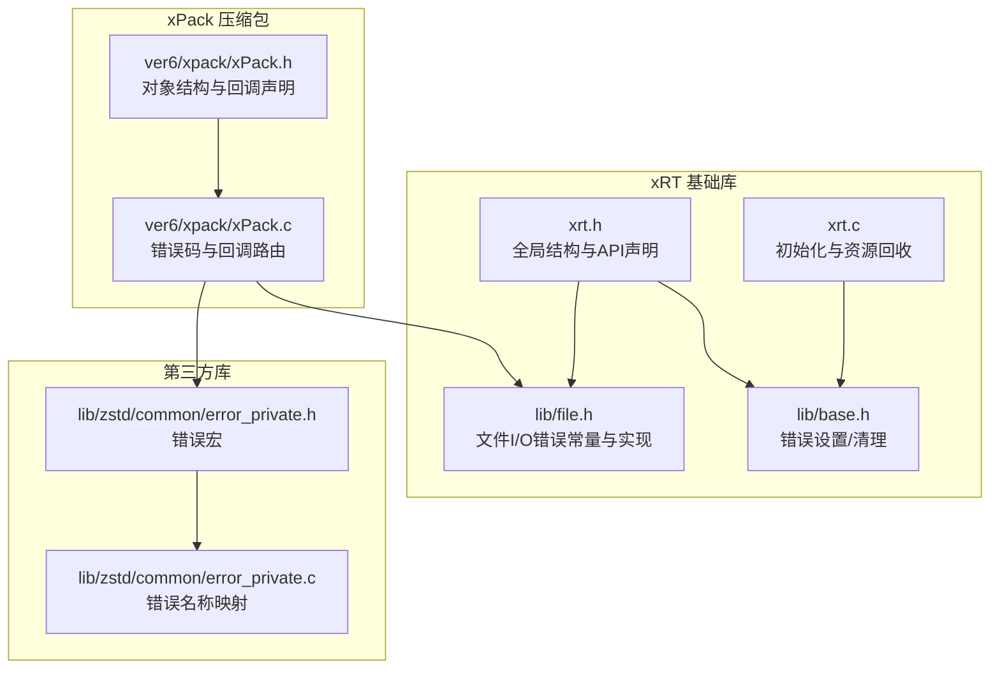
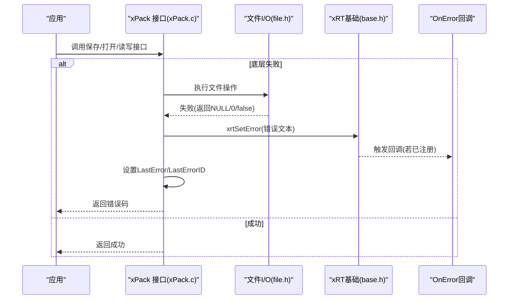
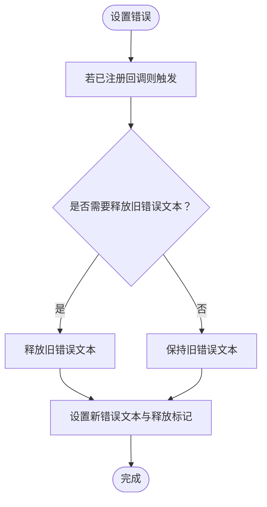
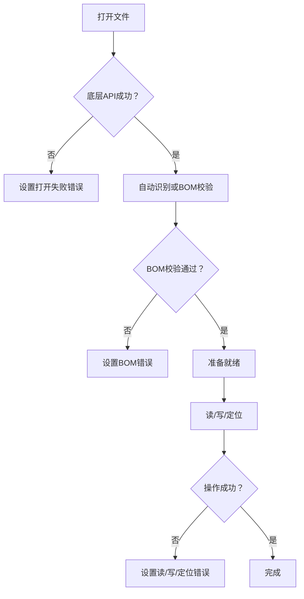
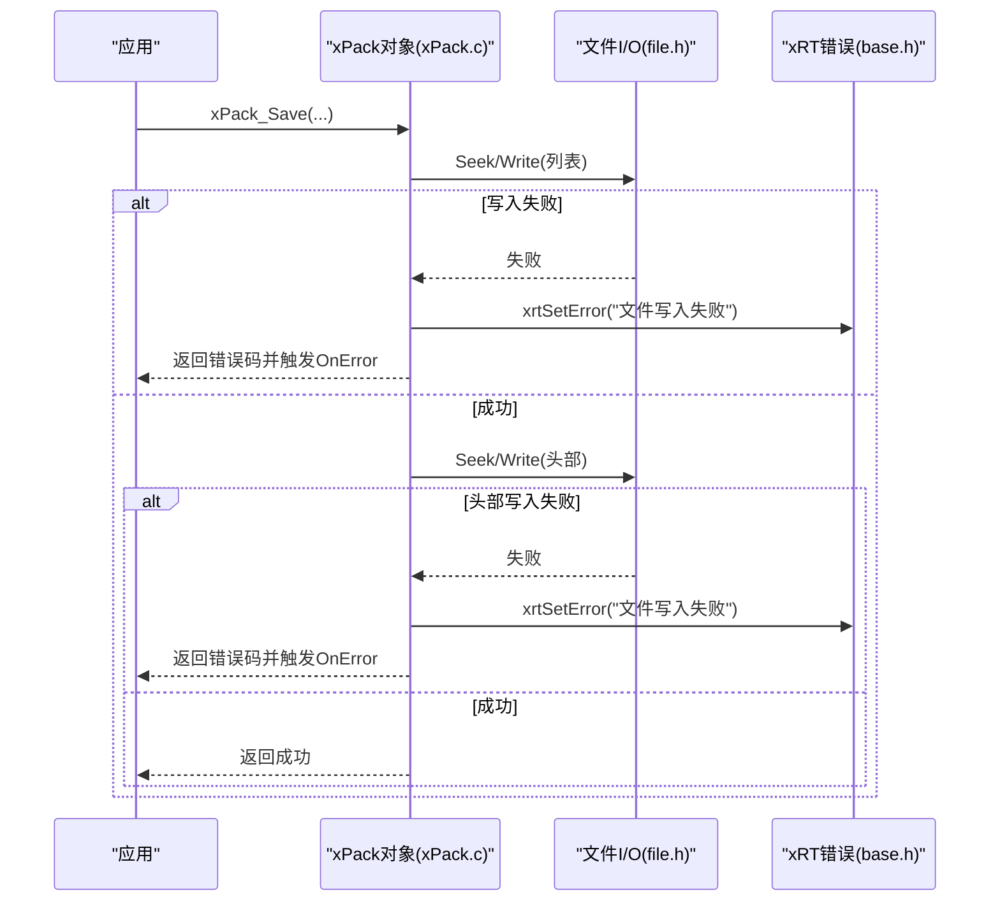
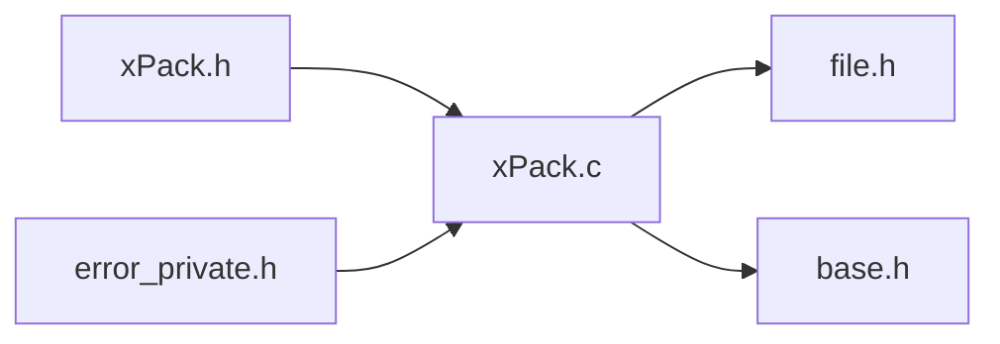

# 错误处理策略

<cite>
**本文引用的文件**
- [xrt.h](file://lib/xrt/xrt.h)
- [xrt.c](file://lib/xrt/xrt.c)
- [base.h](file://lib/xrt/lib/base.h)
- [file.h](file://lib/xrt/lib/file.h)
- [xPack.h](file://ver6/xpack/xPack.h)
- [xPack.c](file://ver6/xpack/xPack.c)
- [error_private.h](file://lib/zstd/common/error_private.h)
- [error_private.c](file://lib/zstd/common/error_private.c)
</cite>

## 目录
1. [简介](#简介)
2. [项目结构](#项目结构)
3. [核心组件](#核心组件)
4. [架构总览](#架构总览)
5. [详细组件分析](#详细组件分析)
6. [依赖关系分析](#依赖关系分析)
7. [性能考量](#性能考量)
8. [故障排查指南](#故障排查指南)
9. [结论](#结论)
10. [附录](#附录)

## 简介
本文件系统性梳理 xPack 的错误处理策略与异常恢复机制，涵盖：
- 内置错误码与语义
- 错误回调函数的使用与最佳实践
- 常见错误场景的诊断与修复
- 错误状态检查与恢复流程
- 错误日志记录与调试信息获取
- 只读与读写模式下的差异
- 实际应用场景与代码示例路径

## 项目结构
围绕错误处理的关键模块包括：
- xRT 基础库：统一的错误设置、清理与回调机制
- 文件 I/O 层：针对文件打开、读写、定位等操作的错误封装
- xPack 压缩包：包头校验、列表读取、压缩/解压、保存等流程中的错误码与回调
- Zstandard 错误宏：通用错误返回与转发机制（用于参考）

**图表来源**
- [xrt.h](file://lib/xrt/xrt.h#L120-L185)
- [xrt.c](file://lib/xrt/xrt.c#L86-L182)
- [base.h](file://lib/xrt/lib/base.h#L88-L131)
- [file.h](file://lib/xrt/lib/file.h#L1-L200)
- [xPack.h](file://ver6/xpack/xPack.h#L98-L110)
- [xPack.c](file://ver6/xpack/xPack.c#L35-L53)
- [error_private.h](file://lib/zstd/common/error_private.h#L104-L158)
- [error_private.c](file://lib/zstd/common/error_private.c#L1-L64)

**章节来源**
- [xrt.h](file://lib/xrt/xrt.h#L120-L185)
- [xrt.c](file://lib/xrt/xrt.c#L86-L182)
- [base.h](file://lib/xrt/lib/base.h#L88-L131)
- [file.h](file://lib/xrt/lib/file.h#L1-L200)
- [xPack.h](file://ver6/xpack/xPack.h#L98-L110)
- [xPack.c](file://ver6/xpack/xPack.c#L35-L53)
- [error_private.h](file://lib/zstd/common/error_private.h#L104-L158)
- [error_private.c](file://lib/zstd/common/error_private.c#L1-L64)

## 核心组件
- 全局错误状态与回调
  - 全局结构包含最近一次错误文本与回调函数指针，支持设置/清理错误，并在设置时触发回调
  - 初始化时清空错误状态；释放时可选择性释放历史错误文本
- 文件 I/O 错误封装
  - 统一的错误常量（打开失败、句柄错误、BOM 错误、读写失败、定位失败等）
  - 在各平台下对底层 API 失败进行捕获并设置对应错误
- xPack 错误码与回调
  - 内置错误码数组与错误文本映射
  - 提供两套错误路由：对象级 OnError 回调与进程级 LastError/LastErrorID 设置
  - 保存、打开、读写、压缩/解压等关键路径均进行错误码设置与回调

**章节来源**
- [xrt.h](file://lib/xrt/xrt.h#L120-L185)
- [xrt.c](file://lib/xrt/xrt.c#L86-L182)
- [base.h](file://lib/xrt/lib/base.h#L88-L131)
- [file.h](file://lib/xrt/lib/file.h#L1-L200)
- [xPack.h](file://ver6/xpack/xPack.h#L98-L110)
- [xPack.c](file://ver6/xpack/xPack.c#L35-L53)

## 架构总览
xPack 的错误处理采用“分层路由”设计：
- 底层：xRT 文件 I/O 与内存分配失败
- 中层：xPack 对底层错误进行归并与语义化，设置内置错误码
- 上层：对象级 OnError 回调与进程级 LastError/LastErrorID，供上层业务消费

**图表来源**
- [xPack.c](file://ver6/xpack/xPack.c#L163-L203)
- [file.h](file://lib/xrt/lib/file.h#L17-L200)
- [base.h](file://lib/xrt/lib/base.h#L88-L131)
- [xPack.h](file://ver6/xpack/xPack.h#L98-L110)

## 详细组件分析

### 1) xRT 错误状态与回调机制
- 全局结构字段
  - LastError：最近一次错误文本
  - OnError：错误回调函数指针
  - __pri_FreeError：指示LastError是否需要释放
- 关键行为
  - 设置错误：触发 OnError 回调；必要时释放旧错误文本；更新LastError与释放标记
  - 清除错误：释放LastError（若需要）并复位
  - 初始化：清空错误状态；释放：在释放逻辑中可选择释放LastError

**图表来源**
- [base.h](file://lib/xrt/lib/base.h#L88-L131)
- [xrt.h](file://lib/xrt/xrt.h#L130-L185)
- [xrt.c](file://lib/xrt/xrt.c#L86-L182)

**章节来源**
- [xrt.h](file://lib/xrt/xrt.h#L130-L185)
- [xrt.c](file://lib/xrt/xrt.c#L86-L182)
- [base.h](file://lib/xrt/lib/base.h#L88-L131)

### 2) 文件 I/O 错误封装
- 错误常量
  - 打开失败、目录打开失败、句柄错误、BOM 错误、定位方法错误、读取失败、写入失败
- 关键路径
  - 打开文件：底层 API 失败即设置对应错误
  - 读取/写入：返回值不符合预期时设置错误
  - BOM 校验：与期望不一致时报 BOM 错误
- 平台差异
  - Windows 使用 CreateFileW/ReadFile/WriteFile 等
  - 其他平台使用 open/read/write/fstat 等

**图表来源**
- [file.h](file://lib/xrt/lib/file.h#L1-L200)

**章节来源**
- [file.h](file://lib/xrt/lib/file.h#L1-L200)

### 3) xPack 内置错误码与回调路由
- 内置错误码与文本
  - 文件无法访问、文件格式不正确、内存申请失败、文件列表读取失败、文件列表数据添加失败、无效的文件位置、文件hash校验失败、文件读取失败、文件写入失败、文件读写位置移动失败、包类型不匹配、找不到文件、文件名超长
- 错误路由
  - 对象级：xpk->OnError(err, text)
  - 进程级：xCore.LastErrorID = err；xCore.LastError = text
- 关键流程
  - 保存：写入列表、写入头部、定位失败、写入失败均触发错误
  - 打开：创建新包、打开文件、读取头部、读取列表、哈希校验失败均触发错误
  - 添加/修改/解包：内存不足、读取失败、定位失败、写入失败、无效位置均触发错误

**图表来源**
- [xPack.c](file://ver6/xpack/xPack.c#L163-L203)
- [file.h](file://lib/xrt/lib/file.h#L1-L200)
- [base.h](file://lib/xrt/lib/base.h#L88-L131)
- [xPack.h](file://ver6/xpack/xPack.h#L98-L110)

**章节来源**
- [xPack.c](file://ver6/xpack/xPack.c#L35-L53)
- [xPack.c](file://ver6/xpack/xPack.c#L163-L203)
- [xPack.c](file://ver6/xpack/xPack.c#L218-L302)
- [xPack.c](file://ver6/xpack/xPack.c#L451-L515)
- [xPack.c](file://ver6/xpack/xPack.c#L517-L580)
- [xPack.c](file://ver6/xpack/xPack.c#L582-L600)
- [xPack.h](file://ver6/xpack/xPack.h#L98-L110)

### 4) Zstandard 错误宏（参考）
- 提供 RETURN_ERROR_IF、RETURN_ERROR、FORWARD_IF_ERROR 等宏，用于条件判断与错误转发，并在调试模式打印上下文
- 适用于需要统一错误返回与传播的场景

**章节来源**
- [error_private.h](file://lib/zstd/common/error_private.h#L104-L158)
- [error_private.c](file://lib/zstd/common/error_private.c#L1-L64)

## 依赖关系分析
- xPack.c 依赖 xRT 文件 I/O 与内存分配；在关键路径上设置 xRT 错误并在需要时触发 xPack 对象级 OnError
- xPack.h 声明了 OnError 回调与自定义压缩/解压回调，形成“上层业务接管”的扩展点
- Zstandard 错误宏为通用错误处理模式提供参考

**图表来源**
- [xPack.c](file://ver6/xpack/xPack.c#L1-L30)
- [xPack.h](file://ver6/xpack/xPack.h#L98-L110)
- [file.h](file://lib/xrt/lib/file.h#L1-L200)
- [base.h](file://lib/xrt/lib/base.h#L88-L131)
- [error_private.h](file://lib/zstd/common/error_private.h#L104-L158)

**章节来源**
- [xPack.c](file://ver6/xpack/xPack.c#L1-L30)
- [xPack.h](file://ver6/xpack/xPack.h#L98-L110)

## 性能考量
- 错误设置与回调可能引入额外的字符串复制与回调开销，建议：
  - 在高频路径中尽量减少错误文本长度与回调次数
  - 仅在必要时注册 OnError 回调
  - 对于只读模式，避免不必要的写入尝试，从而减少错误分支

## 故障排查指南
- 常见错误场景与定位
  - 文件无法访问：检查路径、权限、只读/读写模式是否匹配
  - 文件格式不正确：确认包头版本与格式一致性
  - 内存申请失败：检查可用内存与分配策略
  - 文件列表读取/写入失败：检查文件句柄、定位与磁盘空间
  - 无效的文件位置/找不到文件：核对索引与包内文件数量
  - 文件hash校验失败：确认数据完整性与压缩/解压流程
  - 文件读写位置移动失败：检查定位方法与文件大小
  - 包类型不匹配：确认包类型设置与后续操作一致性
  - 文件名超长：检查路径长度限制
- 检查与恢复
  - 读取 xCore.LastError 与 LastErrorID 获取最近错误
  - 注册 OnError 回调以实时接收错误事件
  - 在只读模式下避免写入操作，优先使用只读接口
  - 对于保存失败，先回滚到上次成功状态，再重试或降级处理

**章节来源**
- [xPack.c](file://ver6/xpack/xPack.c#L35-L53)
- [xPack.c](file://ver6/xpack/xPack.c#L163-L203)
- [xPack.c](file://ver6/xpack/xPack.c#L218-L302)
- [xPack.c](file://ver6/xpack/xPack.c#L451-L515)
- [xPack.c](file://ver6/xpack/xPack.c#L517-L580)
- [xPack.c](file://ver6/xpack/xPack.c#L582-L600)
- [xrt.h](file://lib/xrt/xrt.h#L130-L185)
- [base.h](file://lib/xrt/lib/base.h#L88-L131)

## 结论
xPack 的错误处理体系以 xRT 为基础，结合 xPack 的语义化错误码与回调路由，实现了从底层 I/O 到高层业务的完整错误链路。通过对象级 OnError 与进程级 LastError/LastErrorID 的双通道设计，既能满足实时监控，也能满足事后诊断。在只读与读写模式下，应遵循相应的约束，避免不必要的错误发生。

## 附录

### A. 内置错误码与含义（xPack）
- 1：文件无法访问
- 2：文件格式不正确
- 3：内存申请失败
- 4：文件列表读取失败
- 5：文件列表数据添加失败
- 6：无效的文件位置
- 7：文件hash校验失败
- 8：文件读取失败
- 9：文件写入失败
- 10：文件读写位置移动失败
- 11：包类型不匹配
- 12：找不到文件
- 13：文件名超长

**章节来源**
- [xPack.c](file://ver6/xpack/xPack.c#L35-L50)

### B. 错误回调函数使用与最佳实践
- 注册 OnError 回调：在 xPack 对象创建后设置 xpk->OnError
- 回调签名：接收错误码与错误文本，用于日志记录与UI提示
- 最佳实践：
  - 在关键流程（保存、打开、读写、压缩/解压）后检查返回值与错误状态
  - 对于可恢复错误（如磁盘空间不足），引导用户清理空间后重试
  - 对于不可恢复错误（如格式不正确），建议回退到备份或重建流程

**章节来源**
- [xPack.h](file://ver6/xpack/xPack.h#L98-L110)
- [xPack.c](file://ver6/xpack/xPack.c#L35-L53)

### C. 错误状态检查与恢复机制
- 检查最近错误：读取 xCore.LastError 与 LastErrorID
- 清理错误：调用 xrtClearError 以清除历史错误
- 恢复策略：
  - 对于 I/O 错误：重试、切换路径、检查权限
  - 对于内存错误：释放缓存、降低并发、调整压缩级别
  - 对于包损坏：重建包或回滚到备份

**章节来源**
- [xrt.h](file://lib/xrt/xrt.h#L130-L185)
- [base.h](file://lib/xrt/lib/base.h#L121-L131)

### D. 只读与读写模式下的错误处理差异
- 只读模式：
  - 禁止写入操作，避免触发“文件写入失败”
  - 优先使用只读接口（如打开、读取、解包）
- 读写模式：
  - 允许写入与保存，注意保存失败时的回滚与重试
  - 注意文件句柄与定位的正确性，避免“位置移动失败”

**章节来源**
- [xPack.c](file://ver6/xpack/xPack.c#L218-L302)
- [xPack.c](file://ver6/xpack/xPack.c#L163-L203)

### E. 错误日志记录与调试信息获取
- 使用 xrtSetError 设置错误文本，触发 OnError 回调
- 通过 xCore.LastError 与 LastErrorID 获取最近错误
- 在调试构建中，Zstandard 错误宏会输出文件与行号信息，便于定位

**章节来源**
- [base.h](file://lib/xrt/lib/base.h#L88-L131)
- [xrt.h](file://lib/xrt/xrt.h#L130-L185)
- [error_private.h](file://lib/zstd/common/error_private.h#L104-L158)

### F. 实际应用场景与代码示例路径
- 保存包并处理错误
  - 示例路径：[保存流程](file://ver6/xpack/xPack.c#L163-L203)
- 打开包并处理错误
  - 示例路径：[打开流程](file://ver6/xpack/xPack.c#L218-L302)
- 添加/修改/解包数据并处理错误
  - 示例路径：[添加数据](file://ver6/xpack/xPack.c#L451-L515)、[修改数据](file://ver6/xpack/xPack.c#L517-L580)、[解包数据](file://ver6/xpack/xPack.c#L582-L600)
- 文件 I/O 错误处理
  - 示例路径：[文件打开/读写/BOM](file://lib/xrt/lib/file.h#L1-L200)
- 错误回调注册与使用
  - 示例路径：[回调声明与路由](file://ver6/xpack/xPack.h#L98-L110)、[错误路由](file://ver6/xpack/xPack.c#L35-L53)