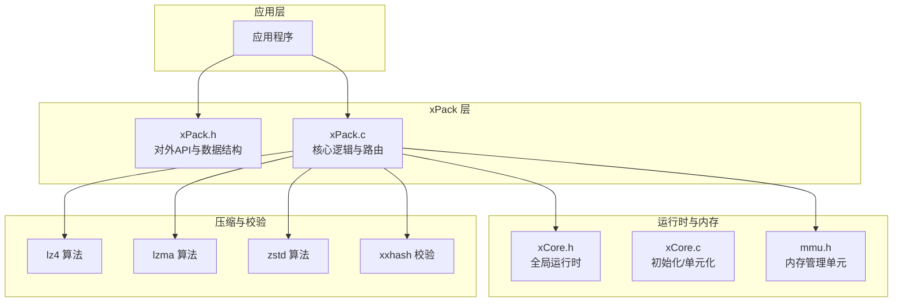
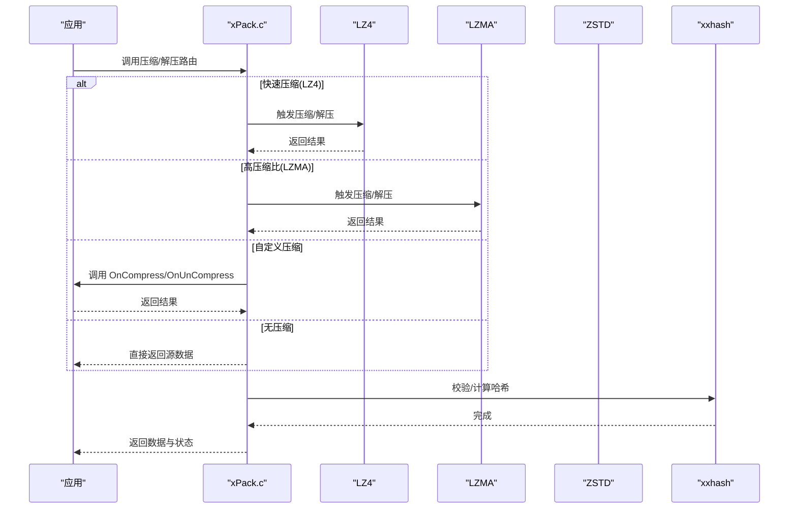
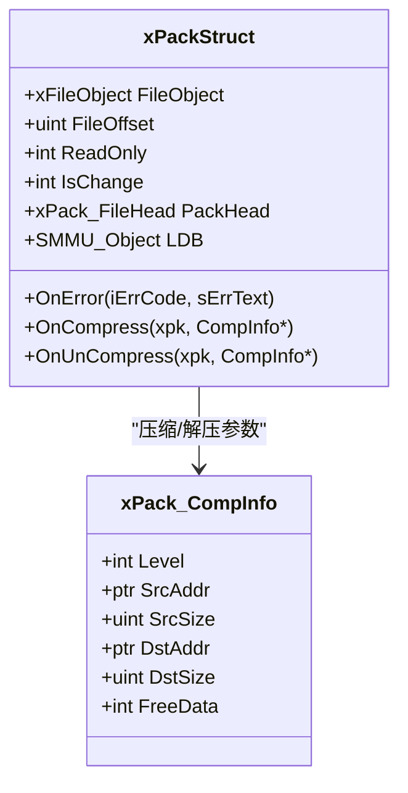
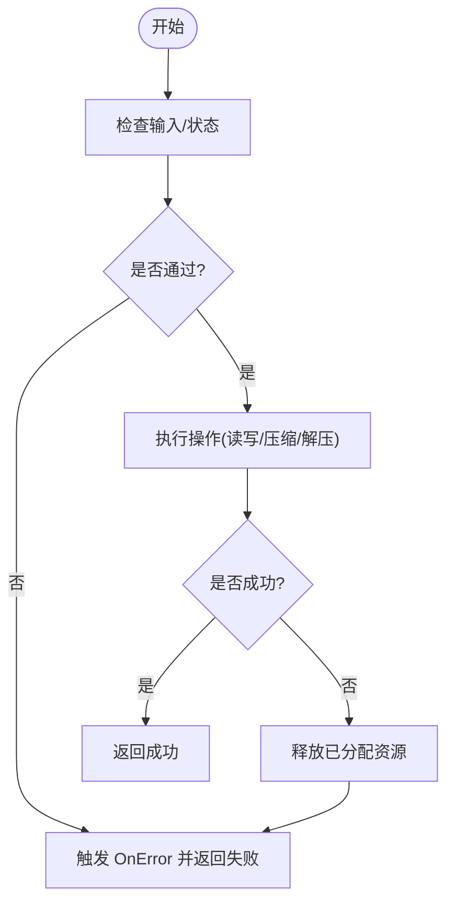
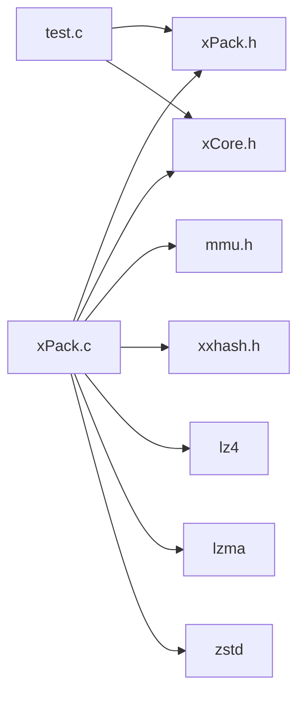

# 高级功能特性

<cite>
**本文引用的文件**
- [xPack.h](file://ver6/xpack/xPack.h)
- [xPack.c](file://ver6/xpack/xPack.c)
- [xCore.h](file://ver6/xCore/xCore.h)
- [xCore.c](file://ver6/xCore/xCore.c)
- [mmu.h](file://ver6/mmu/mmu.h)
- [xxhash.h](file://ver6/xxhash32/xxhash.h)
- [test.c](file://ver6/xpack/test.c)
- [xPack.h（发布版头文件）](file://ver6/xpack/release/inc/xPack.h)
</cite>

## 目录
1. [简介](#简介)
2. [项目结构](#项目结构)
3. [核心组件](#核心组件)
4. [架构总览](#架构总览)
5. [详细组件分析](#详细组件分析)
6. [依赖关系分析](#依赖关系分析)
7. [性能考量](#性能考量)
8. [故障排查指南](#故障排查指南)
9. [结论](#结论)
10. [附录](#附录)

## 简介
本文件面向高级用户，系统阐述 xPack 的高级功能与扩展能力，重点覆盖以下主题：
- 自定义回调机制：压缩回调、解压回调与错误处理回调的实现与使用
- 错误处理策略与异常恢复机制
- 性能监控与分析工具的使用指南
- 扩展开发与插件系统设计思路
- 多线程支持与并发处理最佳实践
- 高级配置选项与定制化开发指导
- 与其他系统的集成方法与 API 扩展技巧

## 项目结构
xPack 位于 ver6/xpack 子目录，核心对外接口集中在头文件与实现文件中；底层运行时与内存管理由 xCore 与 mmu 提供；压缩算法封装于 lz4、lzma、zstd 等子模块；哈希校验使用 xxhash。

图示来源
- [xPack.h](file://ver6/xpack/xPack.h#L1-L262)
- [xPack.c](file://ver6/xpack/xPack.c#L1-L120)
- [xCore.h](file://ver6/xCore/xCore.h#L1-L120)
- [xCore.c](file://ver6/xCore/xCore.c#L1-L87)
- [mmu.h](file://ver6/mmu/mmu.h#L1-L120)
- [xxhash.h](file://ver6/xxhash32/xxhash.h#L1-L2)

章节来源
- [xPack.h](file://ver6/xpack/xPack.h#L1-L262)
- [xPack.c](file://ver6/xpack/xPack.c#L1-L120)
- [xCore.h](file://ver6/xCore/xCore.h#L1-L120)
- [xCore.c](file://ver6/xCore/xCore.c#L1-L87)
- [mmu.h](file://ver6/mmu/mmu.h#L1-L120)
- [xxhash.h](file://ver6/xxhash32/xxhash.h#L1-L2)

## 核心组件
- 对外 API 与数据结构：集中于 xPack.h，定义包头、文件信息、压缩回调结构与对外函数原型
- 核心逻辑与路由：xPack.c 实现压缩/解压路由、文件读写、保存关闭、错误处理回调触发等
- 运行时与内存：xCore 提供全局运行时、错误码与内存分配；mmu 提供多种内存管理器
- 压缩与校验：内置 lz4、lzma、zstd 等压缩算法，xxhash 用于哈希校验
- 示例与测试：test.c 展示回调注册与基本流程

章节来源
- [xPack.h](file://ver6/xpack/xPack.h#L32-L120)
- [xPack.c](file://ver6/xpack/xPack.c#L35-L160)
- [xCore.h](file://ver6/xCore/xCore.h#L412-L450)
- [mmu.h](file://ver6/mmu/mmu.h#L107-L190)
- [xxhash.h](file://ver6/xxhash32/xxhash.h#L1-L2)
- [test.c](file://ver6/xpack/test.c#L19-L27)

## 架构总览
xPack 采用“回调 + 路由 + 多压缩后端”的架构设计：
- 回调：OnError、OnCompress、OnUnCompress
- 路由：xPack_Compress_Router 与 xPack_DeCompress_Router 统一调度
- 后端：LZ4、LZMA、ZSTD 等压缩库；xxhash 用于完整性校验
- 内存：SMMU/BSMM/MMU 等内存管理器降低碎片与提升吞吐

图示来源
- [xPack.c](file://ver6/xpack/xPack.c#L54-L159)
- [xPack.h](file://ver6/xpack/xPack.h#L86-L119)
- [xxhash.h](file://ver6/xxhash32/xxhash.h#L1-L2)

章节来源
- [xPack.c](file://ver6/xpack/xPack.c#L54-L159)
- [xPack.h](file://ver6/xpack/xPack.h#L86-L119)

## 详细组件分析

### 自定义回调机制
- OnError：统一错误上报，支持业务侧自定义日志/告警
- OnCompress：自定义压缩回调，可接入第三方压缩算法或加密
- OnUnCompress：自定义解压回调，可对接解密/校验流程

图示来源
- [xPack.h](file://ver6/xpack/xPack.h#L98-L119)
- [xPack.h](file://ver6/xpack/xPack.h#L86-L104)

使用步骤
- 注册回调：在 xPackObject 上设置 OnError/OnCompress/OnUnCompress
- 压缩流程：调用压缩路由，若选择自定义压缩则进入 OnCompress
- 解压流程：调用解压路由，若选择自定义压缩则进入 OnUnCompress
- 错误处理：任何环节失败均触发 OnError，并设置全局错误码

章节来源
- [xPack.h](file://ver6/xpack/xPack.h#L98-L119)
- [xPack.c](file://ver6/xpack/xPack.c#L54-L159)
- [xCore.h](file://ver6/xCore/xCore.h#L412-L450)

### 错误处理策略与异常恢复
- 错误码与文本：集中定义于 xPack.c 的错误文本数组，统一映射
- 异常恢复：在关键路径（文件读写、内存分配、压缩/解压）失败时，清理已分配资源并触发 OnError
- 全局错误：xCore.LastErrorID 与 xCore.LastError 保存最近错误，便于上层诊断

图示来源
- [xPack.c](file://ver6/xpack/xPack.c#L35-L53)
- [xPack.c](file://ver6/xpack/xPack.c#L163-L203)
- [xCore.h](file://ver6/xCore/xCore.h#L412-L450)

章节来源
- [xPack.c](file://ver6/xpack/xPack.c#L35-L53)
- [xPack.c](file://ver6/xpack/xPack.c#L163-L203)
- [xCore.h](file://ver6/xCore/xCore.h#L412-L450)

### 性能监控与分析
- 哈希校验：使用 xxhash 校验数据完整性，避免解压后二次校验成本
- 压缩路由：根据压缩级别选择 LZ4/LZMA/ZSTD，必要时回退至无压缩
- 内存管理：SMMU/BSMM/MMU 等内存管理器减少频繁分配带来的开销
- 时间基准：xCore 提供计时接口，可用于统计压缩/解压耗时

章节来源
- [xPack.c](file://ver6/xpack/xPack.c#L163-L203)
- [xxhash.h](file://ver6/xxhash32/xxhash.h#L1-L2)
- [mmu.h](file://ver6/mmu/mmu.h#L107-L190)
- [xCore.h](file://ver6/xCore/xCore.h#L144-L164)

### 扩展开发与插件系统
- 插件加载：参考备份中的插件加载机制，约定导出符号（初始化/加载/释放/单元化），实现动态加载与生命周期管理
- 扩展点：通过 OnCompress/OnUnCompress 注入自定义算法或协议；通过 OnError 输出统一日志
- 接口契约：遵循 xPack 对外 API，保持数据结构与调用语义一致

章节来源
- [xPack.h](file://ver6/xpack/xPack.h#L123-L260)
- [xPack.h（发布版头文件）](file://ver6/xpack/release/inc/xPack.h#L123-L262)
- [插件加载示例（备份）](file://ver6/xCore/backup/plugin.h#L29-L109)

### 多线程支持与并发处理
- 线程安全：xCore 提供全局运行时对象，注意在多线程场景下避免共享状态竞争
- 并发模型：建议每个线程持有独立的 xPackObject；若跨线程共享，需自行加锁保护
- 内存管理：mmu.h 提供多种内存管理器，按需选择适合并发场景的分配策略

章节来源
- [xCore.h](file://ver6/xCore/xCore.h#L412-L450)
- [mmu.h](file://ver6/mmu/mmu.h#L107-L190)

### 高级配置与定制化
- 包类型：支持 Core/Index/Linux/Win32 模式，通过 SetPackType/GetPackType 配置
- 扩展字段：可通过设置包/文件信息扩展长度实现自定义元数据
- 识别代码：DiscCode 用于二次开发包识别与版本控制
- 压缩级别：支持 NO/Fast/High/Custom，Custom 模式完全由回调接管

章节来源
- [xPack.h](file://ver6/xpack/xPack.h#L14-L28)
- [xPack.c](file://ver6/xpack/xPack.c#L313-L396)

### 与其他系统集成与 API 扩展
- 文件系统：通过 xFile 封装实现跨平台文件读写
- 运行时：xCore 提供系统路径、时间、随机数等通用能力
- API 扩展：在现有 API 基础上新增自定义回调与扩展字段，保持向后兼容

章节来源
- [xPack.h](file://ver6/xpack/xPack.h#L1-L20)
- [xCore.h](file://ver6/xCore/xCore.h#L233-L278)

## 依赖关系分析
xPack 的主要依赖如下：

图示来源
- [xPack.c](file://ver6/xpack/xPack.c#L1-L30)
- [xPack.h](file://ver6/xpack/xPack.h#L1-L20)
- [xCore.h](file://ver6/xCore/xCore.h#L1-L20)
- [mmu.h](file://ver6/mmu/mmu.h#L1-L20)
- [xxhash.h](file://ver6/xxhash32/xxhash.h#L1-L2)
- [test.c](file://ver6/xpack/test.c#L1-L16)

章节来源
- [xPack.c](file://ver6/xpack/xPack.c#L1-L30)
- [xPack.h](file://ver6/xpack/xPack.h#L1-L20)
- [xCore.h](file://ver6/xCore/xCore.h#L1-L20)
- [mmu.h](file://ver6/mmu/mmu.h#L1-L20)
- [xxhash.h](file://ver6/xxhash32/xxhash.h#L1-L2)
- [test.c](file://ver6/xpack/test.c#L1-L16)

## 性能考量
- 压缩选择：小文件/低延迟场景优先 LZ4；高压缩比场景优先 LZMA/ZSTD
- 内存策略：使用 SMMU/BSMM/MP 等内存管理器减少分配次数
- 校验成本：xxhash 速度快且冲突概率低，适合大文件完整性校验
- I/O 模式：顺序读写优于随机访问，避免多次 seek 带来的性能损耗

## 故障排查指南
- 常见错误码：文件无法访问、格式不正确、内存申请失败、列表读取/写入失败、哈希校验失败、包类型不匹配、找不到文件、文件名超长等
- 定位手段：结合 OnError 文本与 xCore.LastErrorID 快速定位问题阶段
- 恢复建议：在失败路径及时释放资源，必要时回退至无压缩模式

章节来源
- [xPack.c](file://ver6/xpack/xPack.c#L35-L53)
- [xPack.c](file://ver6/xpack/xPack.c#L163-L203)
- [xCore.h](file://ver6/xCore/xCore.h#L412-L450)

## 结论
xPack 在保持简洁易用的同时，提供了强大的扩展能力与灵活的回调机制。通过 OnError/OnCompress/OnUnCompress 三类回调，开发者可在不破坏核心架构的前提下，无缝接入自定义算法、协议与监控体系。配合完善的错误处理与内存管理，xPack 能够满足从桌面应用到服务器部署的多样化性能与可靠性需求。

## 附录
- 示例程序展示了回调注册与多模式打包/解包流程，可作为二次开发的起点
- 发布版头文件与内部头文件在 API 与数据结构上保持一致，便于外部集成

章节来源
- [test.c](file://ver6/xpack/test.c#L19-L278)
- [xPack.h（发布版头文件）](file://ver6/xpack/release/inc/xPack.h#L1-L262)