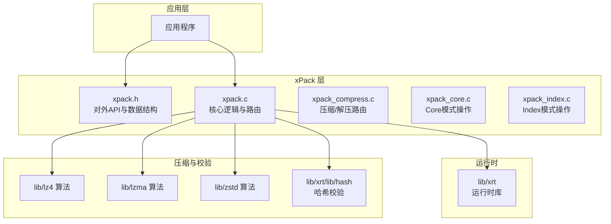
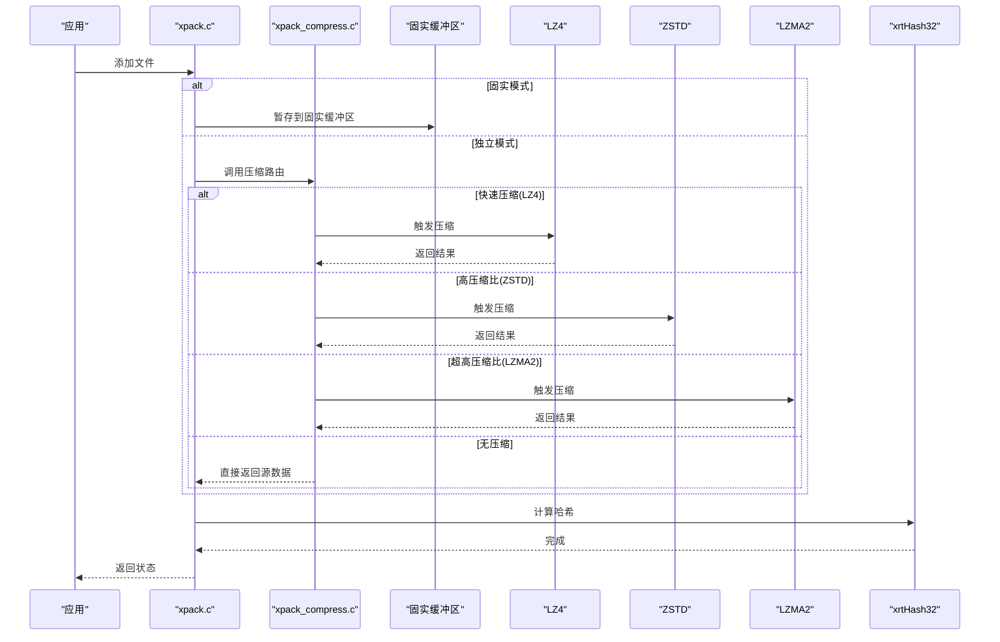
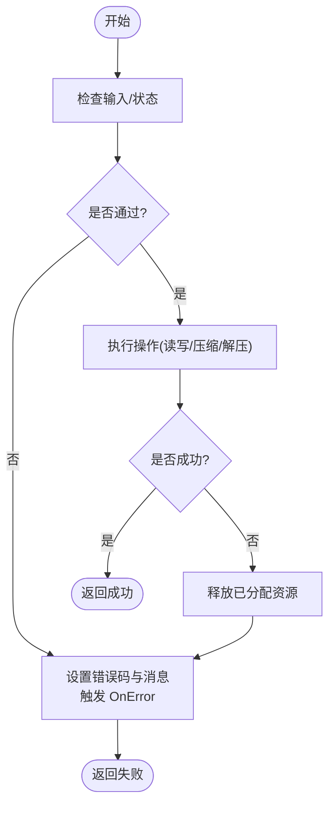
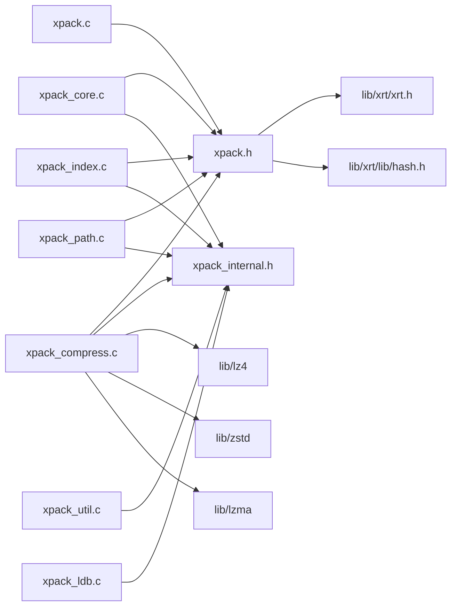

# 高级功能特性

<cite>
**本文引用的文件**
- [src/xpack.h](file://src/xpack.h)
- [src/xpack.c](file://src/xpack.c)
- [src/xpack_internal.h](file://src/xpack_internal.h)
- [src/xpack_compress.c](file://src/xpack_compress.c)
- [lib/xrt/xrt.h](file://lib/xrt/xrt.h)
- [lib/xrt/lib/hash.h](file://lib/xrt/lib/hash.h)
- [lib/lz4/lz4.h](file://lib/lz4/lz4.h)
- [lib/zstd/zstd.h](file://lib/zstd/zstd.h)
</cite>

## 目录
1. [简介](#简介)
2. [项目结构](#项目结构)
3. [核心组件](#核心组件)
4. [架构总览](#架构总览)
5. [详细组件分析](#详细组件分析)
6. [依赖关系分析](#依赖关系分析)
7. [性能考量](#性能考量)
8. [故障排查指南](#故障排查指南)
9. [结论](#结论)
10. [附录](#附录)

## 简介
本文件面向高级用户，系统阐述 xPack Ver7 的高级功能与扩展能力，重点覆盖以下主题：
- **固实压缩功能**：通过合并多个文件数据提升压缩比的固实压缩技术
- 自定义回调机制：压缩回调、解压回调与错误处理回调的实现与使用
- 错误处理策略与异常恢复机制
- 性能监控与分析工具的使用指南
- 扩展开发与插件系统设计思路
- 多线程支持与并发处理最佳实践
- 高级配置选项与定制化开发指导
- 与其他系统的集成方法与 API 扩展技巧

**固实压缩功能文档**：详见 [固实压缩功能](./固实压缩功能.md)

## 项目结构
xPack Ver7 位于 src 子目录，核心对外接口集中在头文件与实现文件中；底层运行时由 xrt 库提供；压缩算法封装于 lib/lz4、lib/lzma、lib/zstd 等子模块；哈希校验使用 lib/xrt 中的哈希工具。

图示来源
- [xpack.h](file://src/xpack.h#L1-L409)
- [xpack.c](file://src/xpack.c#L1-L570)
- [xpack_compress.c](file://src/xpack_compress.c#L1-L250)
- [xrt/xrt.h](file://lib/xrt/xrt.h#L1-L200)

章节来源
- [xpack.h](file://src/xpack.h#L1-L409)
- [xpack.c](file://src/xpack.c#L1-L570)
- [xpack_compress.c](file://src/xpack_compress.c#L1-L250)
- [xrt/xrt.h](file://lib/xrt/xrt.h#L1-L200)

## 核心组件
- **对外 API 与数据结构**：集中于 xpack.h，定义包头、文件信息、固实压缩控制、压缩回调结构与对外函数原型
- **核心逻辑与路由**：xpack.c 实现生命周期管理、包属性操作、固实压缩控制、错误处理回调触发等
- **压缩/解压路由**：xpack_compress.c 实现统一的压缩/解压路由，支持 LZ4、LZ4-HC、ZSTD、LZMA2 等算法
- **运行时支持**：xrt 库提供文件操作、内存管理、哈希计算等基础功能
- **压缩与校验**：内置 lz4、lzma、zstd 等压缩算法，xrtHash32 用于哈希校验

章节来源
- [xpack.h](file://src/xpack.h#L98-L330)
- [xpack.c](file://src/xpack.c#L46-L344)
- [xpack_compress.c](file://src/xpack_compress.c#L20-L250)
- [xrt/xrt.h](file://lib/xrt/xrt.h#L1-L200)
- [xrt/lib/hash.h](file://lib/xrt/lib/hash.h#L595-L1231)

## 架构总览
xPack Ver7 采用"固实压缩 + 路由 + 多压缩后端"的架构设计：
- **固实压缩**：通过 `xpkSolidModeSet` 启用，将多个文件合并后统一压缩
- **错误回调**：OnError 统一错误上报，支持业务侧自定义日志/告警
- **路由**：xpkCompressRouter 与 xpkDecompressRouter 统一调度
- **后端**：LZ4、LZ4-HC、ZSTD、LZMA2 等压缩库；xrtHash32 用于完整性校验
- **运行时**：xrt 库提供文件操作、内存管理、哈希计算等基础功能

图示来源
- [xpack.c](file://src/xpack.c#L46-L546)
- [xpack.h](file://src/xpack.h#L325-L329)
- [xpack_compress.c](file://src/xpack_compress.c#L20-L220)
- [xrt/lib/hash.h](file://lib/xrt/lib/hash.h#L595-L1231)

章节来源
- [xpack.c](file://src/xpack.c#L46-L546)
- [xpack.h](file://src/xpack.h#L325-L329)
- [xpack_compress.c](file://src/xpack_compress.c#L20-L220)

## 详细组件分析

### 固实压缩功能
- **固实模式控制**：通过 `xpkSolidModeSet` 启用/禁用固实压缩
- **数据暂存**：所有文件数据暂存到固实缓冲区
- **统一压缩**：保存时将整个缓冲区统一压缩
- **缓存机制**：读取时解压整个固实块并缓存

详见 [固实压缩功能](./固实压缩功能.md)

### 错误处理机制
- **错误回调**：通过 `xpkOnError` 注册自定义错误处理函数
- **错误码与文本**：集中定义于 xpack.c 的错误文本数组，统一映射
- **异常恢复**：在关键路径（文件读写、内存分配、压缩/解压）失败时，清理已分配资源
- **全局错误**：`xpkLastError` 与 `xpkLastErrorMsg` 保存最近错误，便于上层诊断

图示来源
- [xpack.c](file://src/xpack.c#L552-L570)
- [xpack.h](file://src/xpack.h#L279-L322)

章节来源
- [xpack.c](file://src/xpack.c#L552-L570)
- [xpack.h](file://src/xpack.h#L279-L322)

### 性能监控与分析
- **哈希校验**：使用 xrtHash32 校验数据完整性，避免解压后二次校验成本
- **压缩路由**：根据压缩级别选择 LZ4/LZ4-HC/ZSTD/LZMA2，必要时回退至无压缩
- **内存管理**：xrt 库提供高效的内存分配与缓冲区管理
- **时间基准**：xrtNow 提供计时接口，可用于统计压缩/解压耗时

章节来源
- [xpack_compress.c](file://src/xpack_compress.c#L20-L250)
- [xrt/lib/hash.h](file://lib/xrt/lib/hash.h#L595-L1231)
- [xrt/xrt.h](file://lib/xrt/xrt.h#L1-L200)

### 高级配置与定制化
- **包类型**：支持 Core/Index/Linux/Win32 模式，通过 `xpkTypeSet` 配置
- **固实压缩**：通过 `xpkSolidModeSet` 启用固实压缩，提升小文件压缩比
- **识别代码**：DiscCode 用于二次开发包识别与版本控制
- **压缩级别**：支持 0-15 级别，映射到不同的压缩算法和参数

章节来源
- [xpack.h](file://src/xpack.h#L36-L41)
- [xpack.h](file://src/xpack.h#L325-L329)
- [xpack.c](file://src/xpack.c#L240-L287)

## 依赖关系分析
xPack Ver7 的主要依赖如下：

图示来源
- [xpack.h](file://src/xpack.h#L1-L409)
- [xpack_internal.h](file://src/xpack_internal.h#L1-L102)
- [xpack_compress.c](file://src/xpack_compress.c#L1-L250)
- [xrt/xrt.h](file://lib/xrt/xrt.h#L1-L200)

章节来源
- [xpack.h](file://src/xpack.h#L1-L409)
- [xpack_internal.h](file://src/xpack_internal.h#L1-L102)
- [xpack_compress.c](file://src/xpack_compress.c#L1-L250)
- [xrt/xrt.h](file://lib/xrt/xrt.h#L1-L200)

## 故障排查指南
- **常见错误码**：文件无法访问、格式不正确、内存申请失败、列表读取/写入失败、哈希校验失败、包类型不匹配、固实模式设置错误等
- **定位手段**：结合 `xpkLastErrorMsg` 文本与错误码快速定位问题阶段
- **恢复建议**：在失败路径及时释放资源，必要时回退至无压缩模式

章节来源
- [xpack.c](file://src/xpack.c#L552-L570)
- [xpack.h](file://src/xpack.h#L402-L404)

## 结论
xPack Ver7 在保持简洁易用的同时，提供了强大的压缩能力与灵活的错误处理机制。通过固实压缩技术，能够显著提升小文件集合的压缩比；通过统一的压缩路由，支持多种压缩算法；配合完善的错误处理与内存管理，xPack 能够满足从游戏资源包到软件安装包的多样化性能与可靠性需求。

## 附录
- **固实压缩详细文档**：详见 [固实压缩功能](./固实压缩功能.md)
- **压缩算法文档**：详见 [压缩算法集成](../压缩算法集成/压缩算法集成.md)
- **API 参考手册**：详见 [API参考手册](../API参考手册/API参考手册.md)