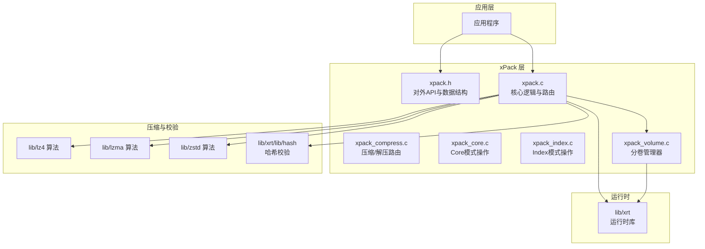
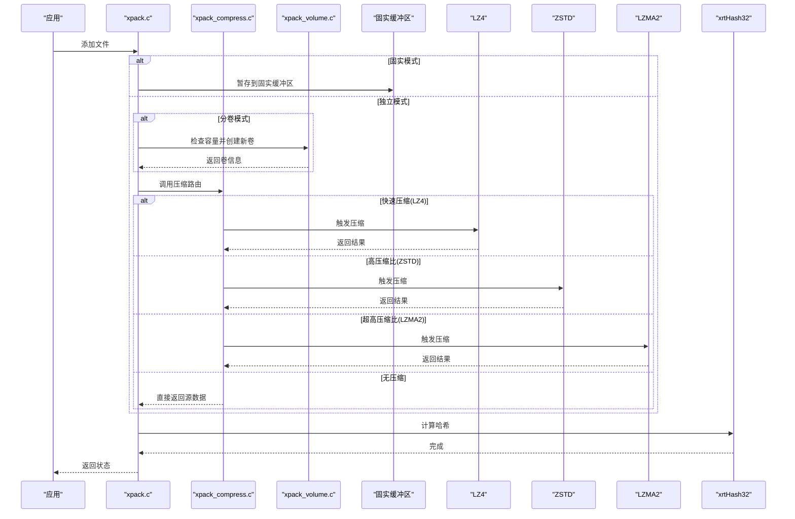
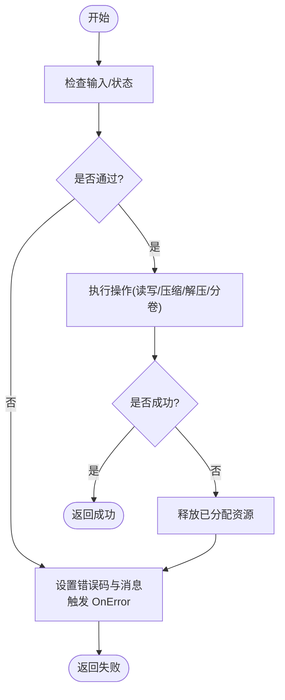
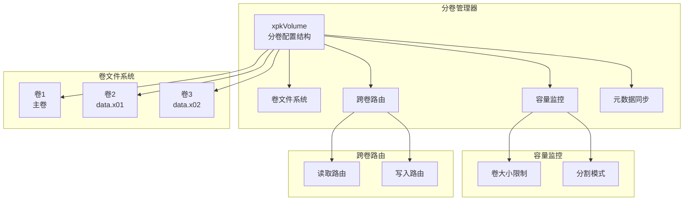
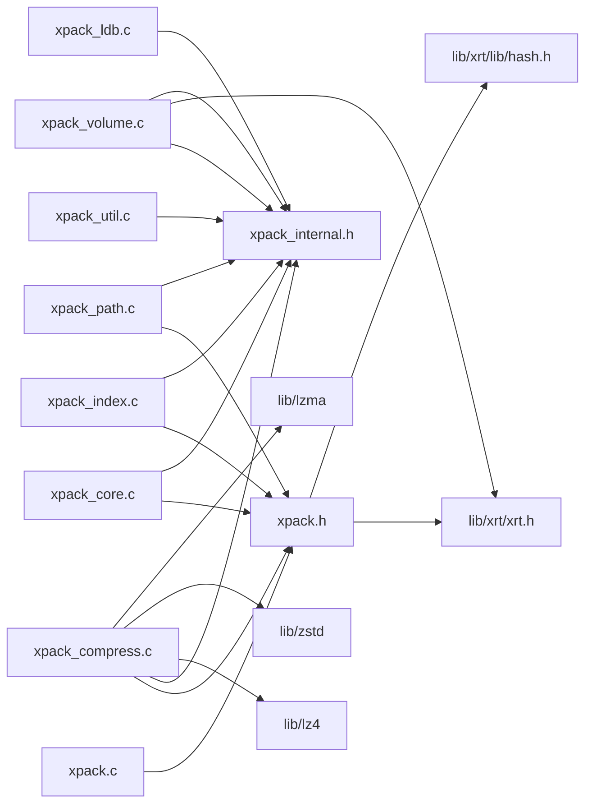

# 高级功能特性

<cite>
**本文引用的文件**
- [src/xpack.h](file://src/xpack.h)
- [src/xpack.c](file://src/xpack.c)
- [src/xpack_internal.h](file://src/xpack_internal.h)
- [src/xpack_compress.c](file://src/xpack_compress.c)
- [src/xpack_volume.c](file://src/xpack_volume.c)
- [lib/xrt/xrt.h](file://lib/xrt/xrt.h)
- [lib/xrt/lib/hash.h](file://lib/xrt/lib/hash.h)
- [lib/lz4/lz4.h](file://lib/lz4/lz4.h)
- [lib/zstd/zstd.h](file://lib/zstd/zstd.h)
- [docs/volume_spec.md](file://docs/volume_spec.md)
- [test/31_volume_basic.h](file://test/31_volume_basic.h)
- [test/32_volume_single_file.h](file://test/32_volume_single_file.h)
- [test/33_volume_cross.h](file://test/33_volume_cross.h)
</cite>

## 更新摘要
**变更内容**
- 新增体积压缩功能章节，详细介绍xPack库的完整体积压缩能力
- 添加分卷管理器架构和实现细节
- 更新固实压缩功能文档，增加与分卷功能的协同说明
- 完善错误处理机制，包含分卷特有的错误码和处理策略
- 增强性能监控与分析工具，涵盖分卷模式的性能考量

## 目录
1. [简介](#简介)
2. [项目结构](#项目结构)
3. [核心组件](#核心组件)
4. [架构总览](#架构总览)
5. [详细组件分析](#详细组件分析)
6. [体积压缩功能](#体积压缩功能)
7. [依赖关系分析](#依赖关系分析)
8. [性能考量](#性能考量)
9. [故障排查指南](#故障排查指南)
10. [结论](#结论)
11. [附录](#附录)

## 简介
本文件面向高级用户，系统阐述 xPack Ver7 的高级功能与扩展能力，重点覆盖以下主题：
- **固实压缩功能**：通过合并多个文件数据提升压缩比的固实压缩技术
- **体积压缩功能**：支持多文件分割模式、字节级和文件级分割、自动卷创建机制
- 自定义回调机制：压缩回调、解压回调与错误处理回调的实现与使用
- 错误处理策略与异常恢复机制
- 性能监控与分析工具的使用指南
- 扩展开发与插件系统设计思路
- 多线程支持与并发处理最佳实践
- 高级配置选项与定制化开发指导
- 与其他系统的集成方法与 API 扩展技巧

**固实压缩功能文档**：详见 [固实压缩功能](./固实压缩功能.md)

## 项目结构
xPack Ver7 位于 src 子目录，核心对外接口集中在头文件与实现文件中；底层运行时由 xrt 库提供；压缩算法封装于 lib/lz4、lib/lzma、lib/zstd 等子模块；哈希校验使用 lib/xrt 中的哈希工具；新增的体积压缩功能通过专门的分卷管理器实现。

**图示来源**
- [xpack.h](file://src/xpack.h#L1-L447)
- [xpack.c](file://src/xpack.c#L1-L570)
- [xpack_compress.c](file://src/xpack_compress.c#L1-L250)
- [xpack_volume.c](file://src/xpack_volume.c#L1-L353)
- [xrt/xrt.h](file://lib/xrt/xrt.h#L1-L200)

**章节来源**
- [xpack.h](file://src/xpack.h#L1-L447)
- [xpack.c](file://src/xpack.c#L1-L570)
- [xpack_compress.c](file://src/xpack_compress.c#L1-L250)
- [xpack_volume.c](file://src/xpack_volume.c#L1-L353)
- [xrt/xrt.h](file://lib/xrt/xrt.h#L1-L200)

## 核心组件
- **对外 API 与数据结构**：集中于 xpack.h，定义包头、文件信息、固实压缩控制、分卷控制、压缩回调结构与对外函数原型
- **核心逻辑与路由**：xpack.c 实现生命周期管理、包属性操作、固实压缩控制、分卷控制、错误处理回调触发等
- **压缩/解压路由**：xpack_compress.c 实现统一的压缩/解压路由，支持 LZ4、LZ4-HC、ZSTD、LZMA2 等算法
- **分卷管理器**：xpack_volume.c 实现分卷文件管理、跨卷读写路由、容量检查与自动创建新卷
- **运行时支持**：xrt 库提供文件操作、内存管理、哈希计算等基础功能
- **压缩与校验**：内置 lz4、lzma、zstd 等压缩算法，xrtHash32 用于哈希校验

**章节来源**
- [xpack.h](file://src/xpack.h#L98-L366)
- [xpack.c](file://src/xpack.c#L46-L344)
- [xpack_compress.c](file://src/xpack_compress.c#L20-L250)
- [xpack_volume.c](file://src/xpack_volume.c#L1-L353)
- [xrt/xrt.h](file://lib/xrt/xrt.h#L1-L200)
- [xrt/lib/hash.h](file://lib/xrt/lib/hash.h#L595-L1231)

## 架构总览
xPack Ver7 采用"固实压缩 + 分卷管理 + 路由 + 多压缩后端"的架构设计：
- **固实压缩**：通过 `xpkSolidModeSet` 启用，将多个文件合并后统一压缩
- **分卷管理**：通过 `xpkVolumeModeSet` 启用，支持多文件分割模式、字节级和文件级分割
- **错误回调**：通过 `xpkOnError` 注册自定义错误处理函数
- **路由**：xpkCompressRouter 与 xpkDecompressRouter 统一调度
- **后端**：LZ4、LZ4-HC、ZSTD、LZMA2 等压缩库；xrtHash32 用于完整性校验
- **运行时**：xrt 库提供文件操作、内存管理、哈希计算等基础功能

**图示来源**
- [xpack.c](file://src/xpack.c#L46-L546)
- [xpack.h](file://src/xpack.h#L357-L366)
- [xpack_compress.c](file://src/xpack_compress.c#L20-L220)
- [xpack_volume.c](file://src/xpack_volume.c#L113-L160)
- [xrt/lib/hash.h](file://lib/xrt/lib/hash.h#L595-L1231)

**章节来源**
- [xpack.c](file://src/xpack.c#L46-L546)
- [xpack.h](file://src/xpack.h#L357-L366)
- [xpack_compress.c](file://src/xpack_compress.c#L20-L220)
- [xpack_volume.c](file://src/xpack_volume.c#L113-L160)

## 详细组件分析

### 固实压缩功能
- **固实模式控制**：通过 `xpkSolidModeSet` 启用/禁用固实压缩
- **数据暂存**：所有文件数据暂存到固实缓冲区
- **统一压缩**：保存时将整个缓冲区统一压缩
- **缓存机制**：读取时解压整个固实块并缓存

**章节来源**
- [xpack.c](file://src/xpack.c#L46-L344)
- [xpack.h](file://src/xpack.h#L348-L353)

### 错误处理机制
- **错误回调**：通过 `xpkOnError` 注册自定义错误处理函数
- **错误码与文本**：集中定义于 xpack.c 的错误文本数组，统一映射
- **异常恢复**：在关键路径（文件读写、内存分配、压缩/解压、分卷操作）失败时，清理已分配资源
- **全局错误**：`xpkLastError` 与 `xpkLastErrorMsg` 保存最近错误，便于上层诊断

**图示来源**
- [xpack.c](file://src/xpack.c#L552-L570)
- [xpack.h](file://src/xpack.h#L289-L291)

**章节来源**
- [xpack.c](file://src/xpack.c#L552-L570)
- [xpack.h](file://src/xpack.h#L289-L291)

### 性能监控与分析
- **哈希校验**：使用 xrtHash32 校验数据完整性，避免解压后二次校验成本
- **压缩路由**：根据压缩级别选择 LZ4/LZ4-HC/ZSTD/LZMA2，必要时回退至无压缩
- **内存管理**：xrt 库提供高效的内存分配与缓冲区管理
- **时间基准**：xrtNow 提供计时接口，可用于统计压缩/解压耗时

**章节来源**
- [xpack_compress.c](file://src/xpack_compress.c#L20-L250)
- [xrt/lib/hash.h](file://lib/xrt/lib/hash.h#L595-L1231)
- [xrt/xrt.h](file://lib/xrt/xrt.h#L1-L200)

### 高级配置与定制化
- **包类型**：支持 Core/Index/Linux/Win32 模式，通过 `xpkTypeSet` 配置
- **固实压缩**：通过 `xpkSolidModeSet` 启用固实压缩，提升小文件压缩比
- **分卷控制**：通过 `xpkVolumeModeSet`、`xpkVolumeSizeSet`、`xpkVolumeSplitModeSet` 配置分卷功能
- **识别代码**：DiscCode 用于二次开发包识别与版本控制
- **压缩级别**：支持 0-15 级别，映射到不同的压缩算法和参数

**章节来源**
- [xpack.h](file://src/xpack.h#L36-L41)
- [xpack.h](file://src/xpack.h#L348-L366)
- [xpack.c](file://src/xpack.c#L240-L287)

## 体积压缩功能

### 分卷管理器架构
xPack 的分卷功能通过专门的分卷管理器实现，支持透明的多卷操作。分卷管理器负责卷文件的生命周期管理、容量监控、跨卷读写路由以及元数据同步。

**图示来源**
- [xpack_internal.h](file://src/xpack_internal.h#L23-L42)
- [xpack_volume.c](file://src/xpack_volume.c#L44-L60)

### 分卷控制接口
分卷功能提供完整的 API 控制接口，支持动态启用/禁用分卷模式、设置卷大小、配置分割模式等。

**分卷控制接口**
- `xpkVolumeMode(xpk)` - 检查是否为分卷模式
- `xpkVolumeModeSet(xpk, enabled)` - 启用或禁用分卷模式
- `xpkVolumeSize(xpk)` - 获取单卷最大大小
- `xpkVolumeSizeSet(xpk, size)` - 设置单卷最大大小
- `xpkVolumeCount(xpk)` - 获取分卷总数
- `xpkVolumeCurrent(xpk)` - 获取当前卷索引
- `xpkVolumeSplitMode(xpk)` - 获取分割模式
- `xpkVolumeSplitModeSet(xpk, mode)` - 设置分割模式
- `xpkVolumePath(xpk, index)` - 获取指定卷的文件路径
- `xpkVolumeStatGet(xpk, stat)` - 获取分卷统计信息

**章节来源**
- [xpack.h](file://src/xpack.h#L357-L366)
- [xpack_volume.c](file://src/xpack_volume.c#L113-L160)

### 分割模式详解
分卷系统支持两种分割模式，满足不同场景的需求：

**字节级分割模式 (splitMode = 0)**
- 数据按字节边界进行分割
- 适合需要精确控制卷大小的场景
- 支持任意大小的卷创建
- 跨卷读取时可能需要额外的边界处理

**文件级分割模式 (splitMode = 1)**
- 每个文件被完整地放入一个卷
- 适合需要保持文件完整性的场景
- 单个文件超过卷大小时会自动创建新卷
- 简化了文件级别的备份和恢复

**章节来源**
- [xpack.h](file://src/xpack.h#L105-L115)
- [docs/volume_spec.md](file://docs/volume_spec.md#L134-L139)

### 自动卷创建机制
分卷系统实现了智能的自动卷创建机制，当当前卷容量达到限制时自动创建新卷并更新元数据。

**自动卷创建流程**
1. 检查当前卷容量是否足够
2. 如果不足，计算剩余容量
3. 写入当前卷剩余部分
4. 创建新卷文件
5. 写入新卷头部信息
6. 更新文件信息的 dataOffset（可能是跨卷偏移）

**章节来源**
- [xpack_volume.c](file://src/xpack_volume.c#L221-L229)
- [xpack_volume.c](file://src/xpack_volume.c#L473-L503)

### 文件指针管理
分卷系统通过全局偏移量和卷内偏移量的组合，实现了透明的文件指针管理。

**文件指针管理机制**
- `xpkVolumeFromOffset()` - 根据全局偏移计算所在卷
- `xpkVolumeReadData()` - 跨卷读取数据
- `xpkVolumeWriteData()` - 跨卷写入数据
- `volumeOffsets[]` - 各卷的基础偏移数组

**章节来源**
- [xpack_volume.c](file://src/xpack_volume.c#L325-L338)
- [xpack_volume.c](file://src/xpack_volume.c#L235-L319)

### 全面的错误处理系统
分卷功能提供了专门的错误处理系统，包含分卷特有的错误码和处理策略。

**分卷错误码**
- 错误码 12：最大卷数超出 (尝试创建超过 256 个卷)
- 错误码 13：卷文件丢失 (无法打开某个卷文件)
- 错误码 14：卷数据不完整 (跨卷读取时卷缺失)
- 错误码 15：卷头验证失败 (某个卷的头部信息无效)

**错误处理策略**
- 创建新卷失败：回滚当前操作，保持原卷状态
- 读取时卷缺失：返回错误，不尝试部分读取
- 卷头验证失败：返回错误，关闭所有卷
- 磁盘空间不足：返回错误，已写入数据保留

**章节来源**
- [docs/volume_spec.md](file://docs/volume_spec.md#L702-L717)
- [xpack_volume.c](file://src/xpack_volume.c#L117-L120)
- [xpack_volume.c](file://src/xpack_volume.c#L196-L198)

### 分卷统计信息
分卷系统提供了详细的统计信息获取功能，帮助用户了解分卷包的结构和大小分布。

**统计信息结构**
- `volumeCount` - 分卷总数
- `volumeSizes` - 各卷大小数组
- `totalSize` - 总大小（所有卷）
- `totalDataSize` - 数据总大小
- `avgSize` - 平均卷大小

**章节来源**
- [xpack.h](file://src/xpack.h#L311-L317)
- [xpack_volume.c](file://src/xpack_volume.c#L344-L352)

### 分卷文件格式
分卷系统采用透明的文件格式设计，确保用户无需关心分卷细节即可使用。

**文件命名规则**
- 主卷：使用原始文件名 (data.xpk)
- 后续卷：使用基础名 + "." + 扩展名首字母 + "01" (data.x01)
- 数字从 01 开始，最大支持 99 个卷

**文件结构布局**
- 主卷包含完整的包元数据和 LDB
- 后续卷只包含数据区域，不包含 LDB
- 每个卷都有完整的头部信息用于独立验证

**章节来源**
- [docs/volume_spec.md](file://docs/volume_spec.md#L202-L258)

### 分卷性能考量
分卷功能在设计时充分考虑了性能影响，提供了相应的优化建议。

**性能开销**
- 顺序读取：1x (与单卷模式相同)
- 跨卷读取：~1.05x (+5%)
- 随机读取：~1.1x (+10%)
- 顺序写入：~1.02x (+2%)
- 跨卷写入：~1.05x (+5%)

**性能优化建议**
1. 延迟打开卷 - 按需打开非主卷
2. 卷缓存 - 缓存最近使用的卷文件句柄
3. 批量读取 - 尽量减少跨卷边界读取
4. 并行写入 - 多卷写入时可考虑并行（未来版本）

**章节来源**
- [docs/volume_spec.md](file://docs/volume_spec.md#L739-L748)

## 依赖关系分析
xPack Ver7 的主要依赖关系如下：

**图示来源**
- [xpack.h](file://src/xpack.h#L1-L447)
- [xpack_internal.h](file://src/xpack_internal.h#L1-L145)
- [xpack_compress.c](file://src/xpack_compress.c#L1-L250)
- [xpack_volume.c](file://src/xpack_volume.c#L1-L353)
- [xrt/xrt.h](file://lib/xrt/xrt.h#L1-L200)

**章节来源**
- [xpack.h](file://src/xpack.h#L1-L447)
- [xpack_internal.h](file://src/xpack_internal.h#L1-L145)
- [xpack_compress.c](file://src/xpack_compress.c#L1-L250)
- [xpack_volume.c](file://src/xpack_volume.c#L1-L353)
- [xrt/xrt.h](file://lib/xrt/xrt.h#L1-L200)

## 故障排查指南
- **常见错误码**：文件无法访问、格式不正确、内存申请失败、列表读取/写入失败、哈希校验失败、包类型不匹配、固实模式设置错误、分卷相关错误（最大卷数超出、卷文件丢失、卷数据不完整、卷头验证失败）
- **定位手段**：结合 `xpkLastErrorMsg` 文本与错误码快速定位问题阶段
- **恢复建议**：在失败路径及时释放资源，必要时回退至无压缩模式，检查分卷文件的完整性和可用性

**章节来源**
- [xpack.c](file://src/xpack.c#L552-L570)
- [xpack.h](file://src/xpack.h#L439-L440)
- [docs/volume_spec.md](file://docs/volume_spec.md#L702-L717)

## 结论
xPack Ver7 在保持简洁易用的同时，提供了强大的压缩能力与灵活的错误处理机制。通过固实压缩技术，能够显著提升小文件集合的压缩比；通过分卷功能，实现了透明的多卷操作，支持字节级和文件级分割；通过统一的压缩路由，支持多种压缩算法；配合完善的错误处理与内存管理，xPack 能够满足从游戏资源包到软件安装包的多样化性能与可靠性需求。

## 附录
- **固实压缩详细文档**：详见 [固实压缩功能](./固实压缩功能.md)
- **分卷系统规范**：详见 [分卷系统规范](../docs/volume_spec.md)
- **压缩算法文档**：详见 [压缩算法集成](../压缩算法集成/压缩算法集成.md)
- **API 参考手册**：详见 [API参考手册](../API参考手册/API参考手册.md)
- **分卷功能测试**：详见 [分卷功能测试](../test/31_volume_basic.h)、[分卷功能测试](../test/32_volume_single_file.h)、[分卷功能测试](../test/33_volume_cross.h)